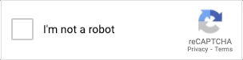
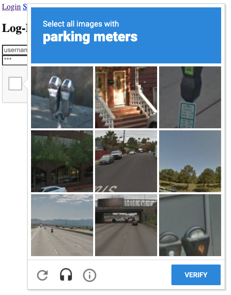
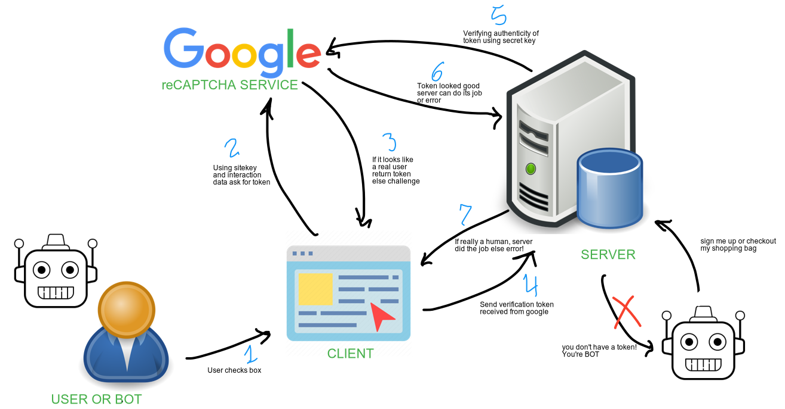
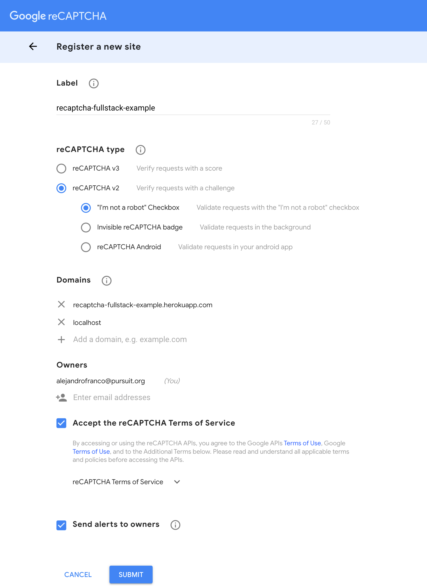
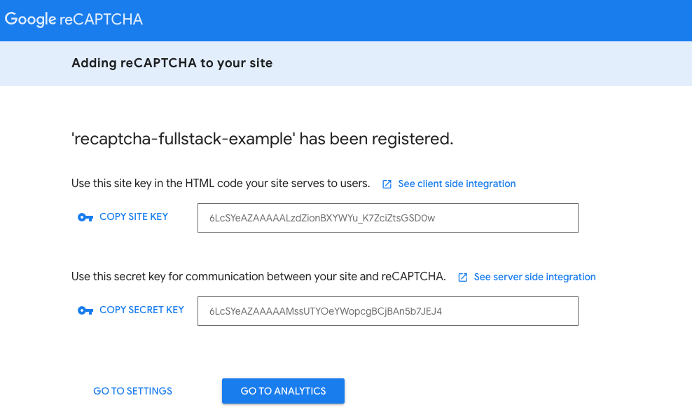

# reCAPTCHA: Protect your sites against bots and abuse

Today we will learn how to add a simple [reCAPTCHA](https://developers.google.com/recaptcha) checkbox as a defense strategy to mitigate bots that might want to spam or overload our app and tell them apart from human users. 

We will use [reCAPTCHA v2](https://developers.google.com/recaptcha/docs/display) for the purposes of this lesson but there are is a [new version v3](https://developers.google.com/recaptcha/docs/v3) that doesn't require a checkbox at all that you might want to learn about later.

## Intro
reCAPTCHA is a free service that protects your site from spam and abuse. It uses advanced risk analysis techniques to tell humans and bots apart. 

How does this work? Well, we will import some scripts and a checkbox widget that Google provides us and add them to our React App, in turn the reCAPTCHA checkbox/widget will be placed in the DOM. The reCAPTCHA checkbox uses Google's algorithms to monitor our page and tell apart actions that come from users from actions that might be from bots, for example if clicks are happening too fast or the user doesn't pass over other elements as they are moving their mouse it is likely a bot and it should be prevented from proceeding further.



If Google is not sure if your user is a bot just by their interactions with the page it will present a reCAPTCHA challenge where the user will get asked to select images that match a certain description. Like "Select all images that contain Bicycles". Upon the user completing the challenge, checking the checkbox or selecting all correct images we are gain confidence that the user is a human and we can let them keep interacting with our page.



Read [How does the “I’m not a robot” checkbox work?](https://medium.com/a-dose-of-curiosity/how-does-the-i-am-not-a-robot-checkbox-work-c24d426a82a1).

## Use Cases
When do you want to verify that whomever is interacting with your site is a human? In general whenever you want to make sure the information you are receiving is coming from a person and not a bot. Or whenever you don't want some automated script that can run thousands of times in short periods of time to perform a certain action on your site.

Some examples are:
* When a someone is signing up or logging in for your app
* When someone is checking out an order in your site
* When someone is booking plane or concert tickets. Someone could program a bot to buy them all and resell them or cause shortages.

Most examples involve some kind of form a user submits.

## Flow
The reCAPTCHA verification flow that we will implement goes something like this:



## Steps

### 1. Clone Starter Full-Stack App or use your own

You can clone this [recaptcha-fullstack-example](https://github.com/joinpursuit/recaptcha-fullstack-example) or follow the following steps using your own Full-Stack Express.js and React App

### 2. Register site for reCAPTCHA

To use reCAPTCHA we first need to register a new site with Google's reCAPTCHA service.

Go to the [reCAPTCHA console](https://www.google.com/recaptcha/admin/create) and be sure to be logged in with your Pursuit Gmail Account. Any Google Account will do really.

Fill out the registration form as follows:
* **reCAPTCHA type** → reCAPTCHA v2 → "I'm not a robot" Checkbox"
* **Domains** → Add the domain where you have your app deployed for example `my-fullstack.herokuapp.com` and `localhost`
* **Accept the reCAPTCHA Terms of Service** → checked
* **Send alerts to owners** → checked
* Hit Submit

<details>
<summary> Example Form Screenshot 📸</summary>


</details>

Once you submit the form you will be given two keys:
* **site key**: Is public facing and used in the Client for the reCAPTCHA widget. 
* **secret key**: Is secret and will be used in the Server to verify the reCAPTCHA token an environment variable.

Copy you keys somewhere, we will use them in a bit.

<details>
<summary> Example Keys 📸 </summary>


</details>

**Notes**:

* ⚠️ Once you have fully integrated reCAPTCHA and deployed remember to remove `localhost` from your domains settings, otherwise an bad user running on localhost will be able to abuse your site.


### 3. Install and set up `react-google-recaptcha` in the Client

The package we will use to integrate reCAPTCHA in our react apps is [`react-google-recaptcha` 📘](https://github.com/dozoisch/react-google-recaptcha). 

Install it in your Client with: 

```
npm install --save react-google-recaptcha
```

### 4. Client setup

Think about what is the action in your app a user can do that you want to protect from bots, in our case that will be the login and sign up forms for our site. Then it is in those components that we will use reCAPTCHA.

Import the `ReCAPTCHA` component from `react-google-recaptcha` in the component you want to protect, in our case that is `AuthContainer.jsx` which renders both the signup and login form.

```jsx
import ReCAPTCHA from 'react-google-recaptcha'
```

Add `notBot` and `recaptchaToken` properties to your state so that we know when the bot challenge has been passed and for us to hold onto the verification token.

```jsx
// ...skipped code

 state = {
    username: '',
    password: '',
    notBot: false,
    recaptchaToken: ''
  }

```

Render the `ReCAPTCHA` component passing the `sitekey`, `onChange`, `onErrored` props.

```jsx
// ...skipped code
  handleCaptcha = (token) => {
    if (token) {
      this.setState({
        notBot: true,
        recaptchaToken: token
      })
    } else {
      // reCAPTCHA verification expired
      this.setState({
        notBot: false,
        recaptchaToken: '',
      })
      window.alert('Human verification expired, please indicate you are not a robot again.')
    }
  }

  handleCaptchaError = (err) => {
    this.setState({
      notBot: false,
      recaptchaToken: '',
    })

    window.alert('There was an error. Please check your network and try again later.')
  }

  render() {
    const { isUserLoggedIn } = this.props;
    return (
      <div>
        <h2>AuthContainer</h2>
        {
          isUserLoggedIn
            ? <Redirect to="/profile" />
            : (
              <Switch>
                <Route path="/login" render={this.renderLoginForm} />
                <Route path="/signup" render={this.renderSignupForm} />
              </Switch>
            )
        }
        <ReCAPTCHA
          sitekey="YOUR_SITE_KEY"
          onChange={this.handleCaptcha}
          onErrored={this.handleCaptchaError}
        />
      </div>
    )
  }
```

Update your submit functions to avoid being fired without verifying that the user is not a bot with a simple if statement. Make sure that you submit your `recaptchaToken` along side with your requests, in this scenario we are sending the entire state in our POST request which will contain our `recaptchaToken` 

```js
//...skipped code
  signupUser = async () => {
    if (this.state.notBot) {
      try {
        const { data } = await axios.post(`/api/auth/signup`, this.state)
        this.props.setUser(data.payload.user)

      } catch (err) {
        console.log('ERROR', err)
      }
    } else {
      window.alert('Please verify you are not a bot.')
    }
  }

  loginUser = async () => {
    if (this.state.notBot) {
      try {
        const { data } = await axios.post(`/api/auth/login`, this.state)
        this.props.setUser(data.payload.user)

      } catch (err) {
        console.log('ERROR', err)
      }
    } else {
      window.alert('Please verify you are not a bot.')
    }
  }
//...skipped code
```
You can just replicate this for any action someone can make in your app, for which you want an extra check to make sure your that someone is a human and not a bot. 

At a high level the steps were
* Display the reCAPTCHA checkbox widget with the `ReCAPTCHA` component
* Handle when the user indicates that they are not a bot with the `onChange` prop.
  * Save the verification token provided by the reCAPTCHA widget to the state
* Handle when there's an error with the `onErrored` prop
* When submitting your form/performing the action, check that the user verified they were not a bot and send the `recaptchaToken` with your request to the Server.

### 5. Server Setup

We need to setup our Server to keep our **secret key** and use it to verify the reCAPTCHA token we get from our Client. 

Store your secret key in an environment variable using a `.env` file with the following content. 
```
RECAPTCHA_SECRET_KEY=6LcSYeAZAAAAAMssUTYOeYWopcgBCjBAn5b7JEJ4
```

We will be using [`dotenv`](https://www.npmjs.com/package/dotenv). Install it if you haven't already.

To load variables from our file and make them available to your our app in `server/app.js` make sure you have at the **top** 

```js
require('dotenv').config()
```

Write a middleware function `verifyReCaptchaToken` that will send the token we got from the Client for verification to Google's reCAPTCHA service. If the token is valid continue with the request to the `next` middleware but if is not reject the request.

This function needs to send the token in a `POST` request to Google and we will use `axios` for that. We could use [`https.request`](https://nodejs.org/dist/latest-v14.x/docs/api/http.html#http_http_request_options_callback) instead if we didn't want to install axios.

```
npm install axios
```

We will implement `verifyReCaptchaToken` in `server/auth/helpers.js`

```js
//...skipped code above
const axios = require('axios');

const verifyReCaptchaToken = async (req, res, next) => {
  const token = req.body.recaptchaToken
  const secret = process.env.RECAPTCHA_SECRET_KEY // read secret key from environment
  if (token) {
    try {
      const URL = `https://www.google.com/recaptcha/api/siteverify?secret=${secret}&response=${token}`
      const { data } = await axios.post(URL)
      if (data.success) {
        next()
      } else {
        console.log(data)
        next(new Error('reCAPTCHA token validation failed'))
      }
    } catch (err) {
      next(err)
    }
  } else {
    next(new Error("recaptchaToken missing"))
  }
}

//...skipped code

module.exports = {
  hashPassword,
  comparePasswords,
  loginRequired,
  verifyReCaptchaToken // Export our function
}
```

From `authHelpers` import and use `verifyReCaptchaToken` as route middleware in the routes you want to protect.

For example in `server/routes/auth.js` for the `POST /signup` and `POST /login` routes

```js
const authHelpers = require('../auth/helpers')
//...skipped code

router.post("/signup", authHelpers.verifyReCaptchaToken, async (req, res, next) => {
  //...our code to sign up a new user and store it in the database
})

router.post("/login", authHelpers.verifyReCaptchaToken, passport.authenticate('local'), (req, res, next) => {
  //...code
})
```

### 6. Deployment Considerations

This App is deployed as indicated by [Deploying a Full-Stack App using Heroku](https://github.com/joinpursuit/Pursuit-Core-Web/blob/master/react_2/deployment/README.old.md).

Two important considerations for this app are:

1. Set your **secret key** as an environment variable in Heroku a.k.a as Heroku config vars. Via the dashboard or via the terminal [Learn more](https://devcenter.heroku.com/articles/config-vars)
    ```sh
    heroku config:set RECAPTCHA_SECRET_KEY="YOUR-SECRET-KEY" -a "YOUR-HEROKU-APP-NAME"
    ```
2. Remove `localhost` from your list of domains in the reCAPTCHA Console 

## Resources
* [reCAPTCHA with a Firebase App](https://firebase.googleblog.com/2017/08/guard-your-web-content-from-abuse-with.html)
* [How does the “I’m not a robot” checkbox work?](https://medium.com/a-dose-of-curiosity/how-does-the-i-am-not-a-robot-checkbox-work-c24d426a82a1).
