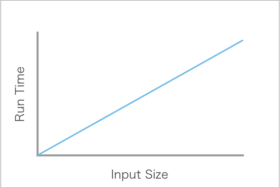
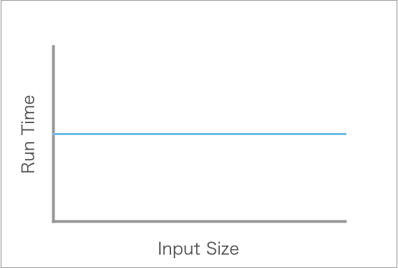
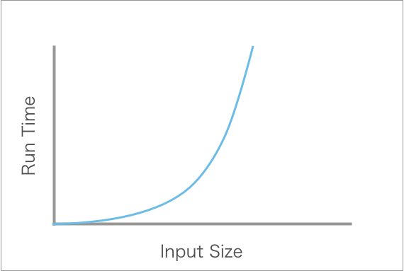
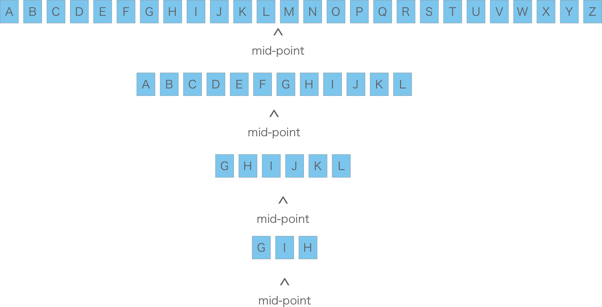
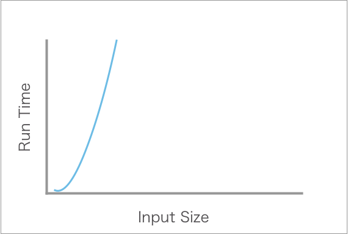
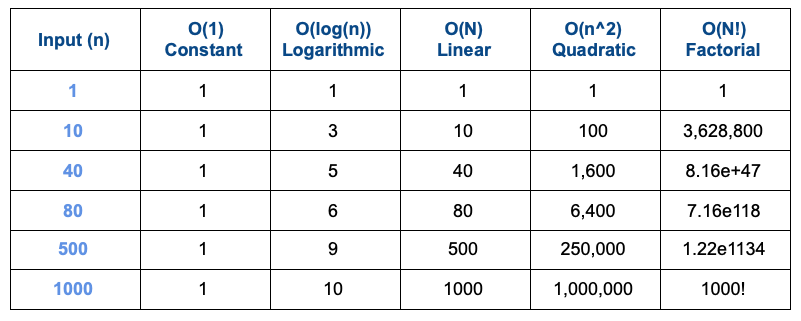

# Big O

## Learning Objectives

- Introduction to Big O
- Why do developers analyze Big O?
- How to identify the Big O of a function

# Big O Notation


image from: https://www.bigocheatsheet.com

We are going to be introducing computer science concepts. These will suit you the best for interviews and further into your career. A number of these concepts are rather complicated and will take time to come together for you. Don't worry if you don't get it right away. With time and practice, the pieces will come together.

Our focus has been projects and skills first, rather than focusing on theory. We believe building things is one of the best way to learn to code and become a developer. However, it's important to set aside some time to learn core computer science concepts so that you can continue to grow as a developer.

What may be a little confusing is that we are going to start talking about optimization. But as you likely remember, one of the biggest pieces of advice we likely have been giving is: Don't optimize too early! This is still true for your work. Focus on building first and then optimization.

Still: what does optimization mean? We're going to look at what it means through the lens of Big O this lesson.

One of the things computer scientists are trained to do is to find ways to make things faster, smaller, cheaper and more precise. One way to approach such problems is to consider the worst case scenario.

The worst case scenario is that whatever algorithm, it will take the most amount of time possible. For example if we are searching through an array, we are assuming that the item will always be found last and that the array size is very large.

Big O Notation is a way to denote the worst case scenario. There are similar notations to denote average and best case scenarios, but we will not cover those today.

The name Big O comes from the discipline of math and is used to describe the relationship between functions and their growth rates.

Big O of Algorithms is measured by:

- **Time complexity** - the amount of time it takes to execute. It is measured in the number of steps an algorithm takes rather than measures of time like seconds or minutes.
- **Space complexity** - the amount of memory (RAM) required an algorithm needs to run.

Each complexity can be described with notation like O(n): Where n represents the number of elements.

Additionally, Big O can be represented visually with the execution time/memory on the y-axis and input size on the x-axis.



As the input size increases the execution time can change, based on the algorithm being used.

For our introduction, we'll only consider time complexity and worst case scenarios. In your studies, as you continue to learn, you should learn and consider space complexity and other scenarios as well.

We will look at 5 classes of complexity.

### Set Up

We'll be using the same example throughout - a cloud music service.

If our service is small - 100 artists, 100 users, we don't have to worry about optimization. Computers are pretty fast.

However, as our cloud music service grows with more music and more users, we want to improve optimization

- Better user experience if someone says 'Hey Siri/Alexa play Silicone on Sapphire' and there are over 20 million songs to search through, this could take a minute. But we don't want to wait a minute! We will think our assistant did not hear us, or is broken if we have to wait a whole minute. We need our results as fast as possible
- Better resource usage, storing and delivering millions of songs to millions of users takes a lot of computing power. If there are more efficient ways, it will save on resources

Let's think that we have an array of artists. Each artist is made up of an object. Each artist has an array of objects that are albums. Each album is an array of song names.

```js
const artists = [
  {
    name: "Miles Davis",
    albums: [
      {
        title: "In a Silent Way",
        songs: ["Shhh/Peaceful", "In a Silent Way/It's About That Time"],
      },
      {
        title: "Milestones",
        songs: [
          "Dr. Jekyl",
          "Sid's Ahead",
          ///...
        ],
      },
    ],
  },
  {
    name: "Dolly Parton",
    albums: [
      {
        title: "Jolene",
        songs: [
          //...
        ],
      },
      {
        title: "9 to 5 and Other Odd Jobs",
        songs: [
          // ...
        ],
      },
    ],
  },
];
```

### Constant `O(1)`

"Play the first song from The Star Wars Soundtrack"

```js
const getFirstSongFromPlaylist = (album) => {
  console.log(album[0]);
};
```

This algorithm has a Big O complexity of `constant`. No matter the size of the array 1 or 1 million, this always takes the same amount of time and memory to execute.

This type of complexity is considered highly efficient.



### Linear `O(n)`

"What songs are on the a playlist of eponymous debuts?`

```js
const printSongs = (album) => {
  for (let i = 0; i < album.length; i++) {
    console.log(album[i]);
  }
};
```

This algorithm has a Big O complexity of `linear`. For each added song to the array, the amount of time it takes to complete this is increased by 1 step.

If the array (or playlist) has 1 item, it will take 1 step to complete. If the array has a million items it will take a million steps to complete.

This type of complexity is considered pretty good efficiency.


### Quadratic Complexity `O(n^2)` or `O(n*m)`

"List every song on all albums"

```js
const PrintSongsWithinAlbums = (artist) => {
  for (let i = 0; i < artist.albums.length; i++) {
    for (let j = 0; j < artist.album.songs.length; j++) {
      console.log(artist.album[i].songs[j]);
    }
  }
};
```

This algorithm has a Big O complexity of `quadratic`. For each added item to the array, the amount of time it takes to complete this is increased by n to the n power!

Imagine you wanted to print every song by an artist. The above function would loop through each album and then within each album, loop through each song. For each album the complexity doesn't increase just by 1 step, but by each album times each song on the album.

If every album has ten songs, if we have 10 albums, we go through the steps 10 times for the albums and then times for each song so for a collection of 10 albums we go through the algorithm 100 times. If we had 100 albums and still 10 songs, we'd go through this algorithm 1000 times...

If we were to also have to go through artists, and now every artist has 10 albums and each album has 10 songs the amount of steps we have to take increases quite quickly!

More complexity:

```js
const PrintSongsWithinAlbumsByArtist = () => {
  for (let i = 0; i < artists.length; i++) {
    for (let j = 0; j < artists[i].albums.length; j++) {
      for (let k = 0; k < artists[i].album[j].songs.length; k++) {
        console.log(artists[i].albums[j].songs[k]);
      }
    }
  }
};

// Alternative syntax
  for (let artist of artists) {
    for (let albums of artist.albums) {
      for (let songs of album.songs) {
        console.log(songs);
      }
    }
  }
```

Now we have a collection of artists, as we gain each artist with 10 albums and then 10 songs per album. Each time we add an artist we get 10 songs and 10 albums. With 10 artists we get 10 x 10 x 10 = 1000 steps.

This type of complexity is considered inefficient. It is also important to note, that for this particular ask, there isn't a more efficient way. We want every single song! That's ok.



### Logarithmic Complexity `O(log(n))`

"Play I Can't Get No Satisfaction"

How is our assistant finding our song?

Is it going randomly through every single song in the database?

Is it looking by artist then by song (again without any organization)?

In either scenario, you'd have to consider the worst-case scenario which is that the song you ask for is always the absolute last song found.

What if the songs were organized alphabetically?

Then we could perform a `binary search`.

We would start at the middle and then check if there is a match. If it matches we're done!

But with Big O we're always thinking about the worst case scenario and that our song will be the last song found.

So we start in the middle, let's say that this middle is songs that start with the letter `M`, if our song starts with the letter `I` we can eliminate all the songs that start with M or further in the alphabet. Now we've cut down the number of items we must search by half.

Let's set our next midpoint to be the middle of the remaining songs, and we get songs that start with the letter `F`. Since our song starts with the letter `I`, we can stop searching through songs starting with A - F, and have again, cut our search down by half.

We would keep repeating, removing half of the songs we are looking through until we found our song. This more complicated process is more efficient than looking through every single song and can be represented as this image



And as this code:

```js
function artistSearch(artists, artist, first = 0, last = null) {
  if (!last) last = artists.length;
  let midpoint = Math.floor((last - first) / 2) + first;
  if (artists[midpoint] === artist) return midpoint;
  if (artists[midpoint] > artist)
    return artistSearch(artists, artist, first, midpoint);
  if (artists[midpoint] < artist)
    return artistSearch(artists, artist, midpoint, last);
}
```

In this way, if we have 16 songs, the number of steps would be 4 Log(2) of 16 = 4.

If we have about 1.126 million songs, the number of steps would be just 50!

This type of complexity is considered highly efficient. But notice, it is not very efficient at first, it only becomes efficient as the number of items increases. Therefore, this may not be the best solution for smaller data sets.


Now that we found the artist, we can do something similar to find the song.

### Factorial Complexity `O(n!)`

"Play the album Hamilton over and over again, until I've heard every song in every order possible"

Factorial means the product of all positive integers less than or equal to n.

Examples

- 3 factorial is 3 x 2 x 1
- 7 factorial is 7 x 6 x 5 x 4 x 3 x 2 x 1

The complexity of an algorithm that is factorial increases faster than any other example. While there are real world examples of these types of algorithms, due to their complexity, they are not typically asked in coding interviews for jr positions and thus we won't include an example.

This type of complexity is considered inefficient.



You can [read about an inefficient sorting algorithm, called Bogosort that has a factorial run time](https://en.wikipedia.org/wiki/Bogosort)

## Summary

We can look at this chart to look at how efficiency changes as input increases across the different types of classes of complexity.



Again, we can see that in most cases, when we are looking at 500 or less items, our computers can work through them quickly and our primary concern in this course should not be efficiency or optimization.

Early optimization is problematic because it can be overwhelming to think about as you start to solve a problem or build an app and can prevent you from building a prototype in a reasonable amount of time.

Additionally, as you build your app with optimization in mind you will inevitably try to solve problems you won't really have, which is bad for things like deadlines. And also since you don't yet know what all your problems will be, you must build in order to learn what you'll need to solve.

The approach that will serve you best in this course, and likely well into your career is by a quote from Addy Osmani

```
First do it,
then do it right,
then do it better
```

Again focusing on just solving your problem first and foremost. Then going and finding the right way to do it and finally, finding ways to do it better.

## Next

Feeling like you need to hear it all again?

Here is a compilation of videos and resources [Code Chef](https://www.codechef.com/certification/data-structures-and-algorithms/prepare)

## More Considerations

### Drop Constants

When calculating Big O, describes the rate of increase - therefore it is typical to drop the constants.

Let's take a look

Imagine we have an array of random positive integers between 1 and a million and our array size is larger than 100,000 numbers.

We want to find both the largest number and the smallest number.

We can take two approaches, using for loops

```js
let min = 0;
let max = 0;
for (let n of numbersArray) {
  if (x < min) min = x;
  if (x > max) max = x;
}
```

Calculate Big O for yourself, and then check

<details><summary>
Big O</summary>

- for loop = N
- two steps inside of for loop  = 2

O(2N)

2 is constant, so we can just write O(N)

</details>

```js
let min = 0;
let max = 0;
for (let n of numbersArray) {
  if (x < min) min = x;
}
for (let n of numbersArray) {
  if (x > max) max = x;
}
```

Calculate Big O for yourself, and then check

<details><summary>
Big O</summary>


- first for loop = N
- one step  inside of for loop  = 1
- second for loop = N
- one  inside of for loop  = 1

O(2N)

</details>

The rate always increases by the number of elements: `N`, the 2 is a constant. We don't need constants - therefore for both of these examples Big O is O(N)

### Drop Non-Dominant Terms

Consider an algorithm that has a complexity of

- O(N^2 + N)

| input |         runtime         |
| :---: | :---------------------: |
|   1   |        2 + 1 = 3        |
|  10   |     100 + 20 = 110      |
|  100  |   10000 + 100 = 10100   |
| 1000  | 1000000+ 1000 = 1001000 |

As N grows, the impact of `N` decreases, while `N^2` dominates the runtime in a worst case scenario. Therefore we would change this Big O to be O(N^2)

### Adding vs Multiplying

Consider the two following examples:

Here are two loops - we added the steps previously for O(2N), then dropped the constant for O(N)

```js
let min = 0;
let max = 0;
for (let n of numbersArray) {
  if (x < min) min = x;
}
for (let n of numbersArray) {
  if (x > max) max = x;
}
```

Here is a nested with two steps:

```js
const someNestedArray = []
let sum = 0
for (let row of someNestedArray) {
  for (let item of row) {
    console.log(item, row)
    sum += item
  }
  }
}

```

We will multiply when the loops are nested

- **N** first loop
- **M** for second loop
- For every time the outside loop runs, the inside loop runs again
- **IMPORTANT** in this example it is ambiguous if N and M are the same, therefore it is NOT `N^2` it is `N*M`
- You do not have to use `N` or `M`, you can use `P` for prime numbers, `W` for letters, or any more descriptive variable name

O(N\*M)

## Further Reading

[Gayle Laakman McDowell Big O Crash Course for Uber](https://s3.amazonaws.com/ubercandidateprep/videos/05_Big_O_Crash_Course.mp4)

[Wikipedia](https://en.wikipedia.org/wiki/Big_O_notation)

## Bonus

<details><summary>A possible solution for the game/automatic guesser that follows a binary search</summary>

```js
const game = () => {
  let start = 1;
  let limit = 1000;
  let midpoint = 0;
  let number = Math.ceil(Math.random() * limit);
  let values = {
    start,
    limit,
    midpoint,
  };

  //   let guess = prompt(`Guess a number between 1 and 1000`);
  let counter = 1;
  while (values.midpoint !== number && counter <= 10) {
    if (values.midpoint > number) {
      values = myAutomaticGuesser(values, true);
    } else if (values.midpoint < number) {
      values = myAutomaticGuesser(values, false);
    }
    counter++;
  }

  if (counter <= 11) {
    console.log(
      `That's right! The number was ${number} and the number of guesses was ${
        counter - 1
      }`
    );
  } else {
    console.log(
      `Sorry, out of guesses! The number was ${number}
        `
    );
  }
};

const myAutomaticGuesser = ({ start, midpoint, limit }, tooHigh) => {
  if (tooHigh) {
    if (midpoint === 2) midpoint = 1;
    limit = midpoint;
    midpoint = limit - Math.floor((limit - start) / 2);
  } else {
    start = midpoint;
    midpoint = limit - Math.floor((limit - start) / 2);
  }
  return { midpoint, start, limit };
};

game();
```

- What is the Big O for this game?
- With the possible values between 1 - 1000, how often will the automatic guesser run out of guesses and lose?

</details>
