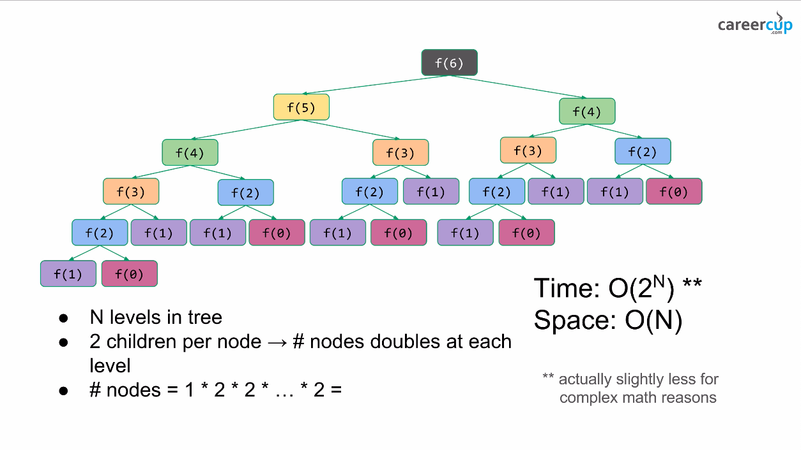

# Fibonacci and Recursion

## Learning Objectives

- Define recursion
- Set up a recursive function
- Define and understand Fibonacci sequence
- Use recursion to solve Fibonacci sequence

## Recursion

A function that calls itself is called recursive.

A recursive function calls itself to reduce a larger problem into a smaller one, until it can be solved.

A recursive function must have two properties:

- A simple base case (or cases) - which is a terminating scenario that does not use recursion to produce an answer
- A set of rules that reduce all other cases towards the base case

Recursion is not yet in our coding tool kit. Solving things recursively takes practice and may feel quite odd at first.

## Recursive Example 1

Let's think about adding the following numbers:

- 1, 2, 3, 4, 5, 6, 7, 8, 9, 10

### Solving it by hand

Average humans, do not add all the numbers all at once. We add two numbers together, store that number, and then add the next number, until we are left with one number. When we have one number, that is our answer.

```
1  + 2   = 3
3  + 3   = 6
6  + 4   = 10
10 + 5   = 15
15 + 6   = 21
21 + 7   = 28
28 + 8   = 36
36 + 9   = 45
45 + 10  = 55
55 + no numbers left means our answer is 55
```

### Solving it in JavaScript, using Recursion

We're going to follow the above problem the same way using recursion.

1. First, since we have a list of numbers (our test case), let's express them as an array
2. Let's define our function:

```js
const numsToSum = [1, 2, 3, 4, 5, 6, 7, 8, 9, 10];

const sumNumbers = (numsArr) => {
  return numsArr;
};

console.log(sumNumbers(numsToSum));
```

3. We need a base case. When did we finish our calculation when we did it by hand? When there were no numbers left to be added.

```js
const sumNumbers = (numsArr) => {
  if (numsArr.length === 0) {
    return numsArr;
  }
};

console.log(sumNumbers(numsToSum));
```

4. Holding our intermediate sum value

We have to hold on to the sum as we work our way through the problem.

We will add `sum` as a parameter. We will also set a default value.

There are two ways to set a default value in JavaScript.

Short circuiting:

- `sum = sum || 0;` This will set the value of sum to be 0 if the value of sum is falsey

Default argument:

- `const sumNumbers = (numsArr, sum = 0)` This will set the value of sum to 0, if sum is undefined

Default argument is a newer syntax. Let's try it. The first time we call `sumNumbers`, we are only passing one argument, so the sum will be set to the default value of 0

```js
const sumNumbers = (numsArr, sum = 0) => {
  if (numsArr.length === 0) {
    return sum;
  }
  console.log(sum);
};

console.log(sumNumbers(numsToSum));
```

5. Now we have to define a way (or rules) to decrease our complex problem (adding 10 numbers), down to the base case, having no more numbers to add.

Each time we add a number, we have to remove it from the array, thus decreasing the array length and bringing us closer to the base case. We'll use `.shift()` to take off the number at the start of the array.

Thought question: could we use `.pop()` instead?

```js
const sumNumbers = (numsArr, sum = 0) => {
  if (numsArr.length === 0) {
    return sum;
  }
  sum += numsArr.shift();

  console.log(sum);
};

console.log(sumNumbers(numsToSum));
```

6. Now that we have set up our base case, and a set of rules to get to our base case, we can call our function

```js
const sumNumbers = (numsArr, sum = 0) => {
  if (numsArr.length === 0) {
    return sum;
  }
  sum += numsArr.shift();

  return sumNumbers(numsArr, sum);
};

console.log(sumNumbers(numsToSum));
```

## Recursion Example 2

We can figure out if a positive integer is even or odd, if we keep subtracting 2 from the number. If the value 0 is reached, the number is even. If the value 1 is reached, the number is odd.

There is a more efficient way to do this, but for the purposes of learning about recursion, we are going to stick with this simple example.

```
6
6 - 2 = 4
4 - 2 = 2
2 - 2 = 0
0 means the number is even
```

```
5
5 - 2 = 3
3 - 2 = 1
1 means the number is odd

```

Let's follow our steps above to write this recursive function

Define number/test case(s) Let's go with 10, which is even, and then 9, which is odd

```js
const testCase1 = 10;
const testCase2 = 9;

const isEven = (num) => {
  return num;
};

console.log(isEven(testCase1));
console.log(isEven(testCase2));
```

Our base cases are that if the number is reduced to 0, it is even, if the number is reduced to 1, then the number is odd.

```js
const testCase1 = 10;
const testCase2 = 9;

const isEven = (num) => {
  if (num === 0) {
    return "the number is even";
  }
  if (num === 1) {
    return "the number is odd";
  }
  return num;
};

console.log(isEven(testCase1));
console.log(isEven(testCase2));
```

We need to 'hold on' to our progress a little differently this time. We are just going to keep calling the function with `num - 2` over and over again, rather than passing in a value to our function

```js
const testCase1 = 10;
const testCase2 = 9;

const isEven = (num) => {
  if (num === 0) {
    return "the number is even";
  }
  if (num === 1) {
    return "the number is odd";
  }
  return isEven(num - 2);
};

console.log(isEven(testCase1));
console.log(isEven(testCase2));
```

If this is difficult to follow, please feel free to add console logs anywhere it would be helpful to see how this works.

# Fibonacci Sequence

Fibonacci is a classic problem that shows up as examples in coding or as a problem to solve in a class or possibly on an interview. Since sequence shows up often, it is worthwhile to take the time to gain a solid understanding what the Fibonacci Sequence is and how to calculate it.

Write a function that prints the nth number in the Fibonacci sequence:

- `fibonacci(5)`
  - 1, 1, 2, 3, **5**
- `fibonacci(8)`
  - 1, 1, 2, 3, 5, 8, 13, **21**

1. Do we understand al the words used in stating the problem?

   - What is the Fibonacci Sequence?(google if needed)
   - How do we figure out the numbers in the sequence?

2. What are we asked to show?
   - the nth number in the sequence. The nth number is passed in as an argument.
3. Restate the problem in your own words
4. Is there enough information for you to find a solution?
5. What is our plan?

- What is our base case?
  - Let's work backwards to figure it out
    - 5 is equal to the current value of 3 plus the previous value 2
    - 3 is equal to the current value of 2 plus the previous value of 1
    - 2 is equal to the current value of 1 plus the previous value of 1
    - 1 the base case - return the value of 1
    - 0 is the base case - return the value of 1

```js
const fibonacci = (num) => {
  if (num <= 1) {
    return 1;
  }
};

console.log(fibonacci(5));
```

How do we get to the base case? We'll do it by adding the current number to the previous number:

```js
const fibonacci = (num) => {
  if (num <= 1) {
    return 1;
  }
  return fibonacci(num - 1) + fibonacci(num - 2);
};

console.log(fibonacci(5));
```

This may be hard to follow. Let's talk through it.

Let's call `fibonacci()` `f()` for short

| The value of |     is      |
| :----------: | :---------: |
|     f(5)     | f(4) + f(3) |
|     f(4)     | f(3) + f(2) |
|     f(3)     | f(2) + f(1) |
|     f(2)     | f(1) + f(0) |
|     f(1)     |      1      |
|     f(0)     |      1      |

Once we have figured out what f(1) and f(0) is, we can solve for (f2)

- `f(2)` is equal to 2

Now we can look at `f(3)`

- `f(3)` is equal to 2 + 1 = 3

Next `f(4)` is the value of `f(3)`, which we know is 3, and `f(2)` which we know is 2, so `f(4)` is equal to 5

Finally, `f(5)` is `f(4)` + `f(3)` which is 5 + 3 = 8

As simple as the code we wrote looks, it actually takes a lot of steps to solve this problem. This is not an efficient solution.

Another way to visualize this is with a tree:



## Fibonacci Big O

If we calculated Big O for our fibonacci recursive function, we'd end up  complexity in terms of time O(2^N), which is `exponential`.

Note, for our introductory course, just determining a general category for our function: `constant`, `linear`,`exponential`, `quadratic`, `logarithmic`, and `factorial` is a good place to start, especially so that you can describe your thoughts and solutions properly. As you build your skill set, work on refining the value.

## Bonus

How much memory do we use at any one time? Can you determine the space complexity? Hint: see above image.

It likely makes sense to just learn how to do time complexity and then in your later studies take the time to learn about space complexity. Time complexity is almost always asked, whereas space complexity is asked less often.

### Can We Do Better?

Let's solve this problem with a loop instead of a recursive function.

- We need to go through the sequence `i` number of times
- We need to add the current number to the previous number
- Then we need to make the current number the sum of the previous number plus the current number
- The previous number equal to the current number

We can use [array destructuring](https://developer.mozilla.org/en-US/docs/Web/JavaScript/Reference/Operators/Destructuring_assignment#array_destructuring) to make our code clear and easy to read:

```js
const fibonacciLoop = (limit) => {
  let previous = 0;
  let current = 1;
  for (let i = 0; i < limit; i++) {
    [current, previous] = [current + previous, current];
  }
  return current;
};

console.log(fibonacciLoop(5));
```

Which category of Big O does this version fit into best?

## Which Fibonacci is "The Best Solution"?

Discuss as a class

## Super BONUS

Memoization. This is an advanced version and it is recommended you only study it once you have built confidence and understanding with the basics.

Let's look at our tree


We are making a lot of the same calls over and over again: Qe call `f(1)` 8 times. What if we we could `cache` (store values for later use) the value rather than having to recalculate it every time?

We could create an array to store the values. Once the value is calculated we can use it again and again.

```js
const fib = (n, memo = []) => {
  // console.log(n, memo);
  if (n <= 1) {
    return 1;
  } else if (!memo[n]) {
    memo[n] = fib(n - 1, memo) + fib(n - 2, memo);
  }
  return memo[n];
};

console.log(fib(5));
```

Remember, you can console log any value. Using console log to help understand the order of steps, the values that are being iterated on can be very helpful.

Our time complexity is now O(N)

## Further Reading

[Eloquent JavaScript Functions - recursion](https://eloquentjavascript.net/03_functions.html)

[Math is Fun: Fibonacci Sequence](https://www.mathsisfun.com/numbers/fibonacci-sequence.html)

[Wikipedia: Fibonacci Sequence](https://en.wikipedia.org/wiki/Fibonacci_number)
