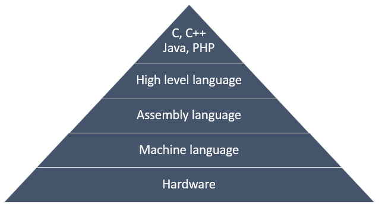
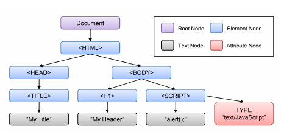

# Linked Lists

### Setting intent

> Be curious, not judgemental - Walt Whitman

Everyone who codes for a while ends up with some favorite languages, tools, and ways to do things. Always try to keep an open mind, and take an opportunity to learn from someone else. You can learn a lot of useful things along the way.

## Trivia Questions

There are no trivia questions today, rather some pre-reading to do instead.

### Introduction

Now that we are diving deeper into computer science topics, we are going to talk about things that we have not had to worry about when building our web applications. Our goal is to dig deeper and go even wider with our knowledge.

### Coding Languages

There are hundreds, possibly thousands of coding languages. People invent and maintain different coding languages to accomplish different tasks. For example, you have learned several languages, all with their own purpose: HTML (content of a web page), CSS (style of a web page), JavaScript (actions on a web page, building a web server), SQL (utilizing of a database).

Some languages stack on top of each other to build a fully functioning computer/application:



[Resource](https://codeforwin.org/2017/05/programming-languages-classification.html)

### Abstraction

When we write JavaScript we can write `array.length` and JavaScript will solve how to give us the length for us. This is called `abstraction` - we don't worry about how to solve for the minimum, rather we just call the function.

We can see abstraction in our day to day life: When we order a dish with 'diced cucumbers' this is an abstraction, and it is useful because we can just order what we want. The chef, on the other hand, must know what dicing means, what tools are needed for dicing, and the technique to dice. The chef is likely relying on even more people so they can focus on their job - someone to order the cucumbers, maintain the restaurant space, balance the books, schedule the staff and more.

JavaScript abstracts a lot more than helpful functions, it deals with memory management: we don't have to figure out how to allocate space on the hard drive(s) in order to add, remove or change data: JavaScript does it for us.

JavaScript is also a dynamic language. When we declare an array, we don't have to determine how big it will be beforehand. We can just add and subtract as needed. In other programming languages, the array size is fixed and it is not possible to tack on extra elements: Therefore other approaches and considerations must be applied.

JavaScript also lets us declare variables of one datatype (like a number), and change to to an array. This is unusual for a lot of other languages. In fact, JavaScript has a lot of peculiar quirks that make it great for web development, but can raise some eyebrows of people who work in other languages.

## Data Structures

In JavaScript, we have worked with two data structures: arrays and objects.

Both serve different functions and have allowed us to build quite complex applications.

We're going to learn about a few other data structures that can be very useful in some circumstances that we have likely not seen yet.

- Nodes
- Linked Lists
- Stacks
- Queues
- Binary Trees

Our learning goals are to

- Be able to describe what the data structure is, and at least one example where using one would be a good choice
- Be able to code a basic version in pseudo-code/JavaScript
- Be strong enough with these fundamentals to learn more and be able to build on top of this knowledge

## Nodes

A node is a basic unit of a data structure, the way a character makes up a string, or a list item is inside an array.

It has some basic properties:

- data of some sort (numbers, strings, arrays, objects etc. )
- at least one pointer

We may remember hearing about `nodes` when we learned about the DOM `tree` with HTML/JavaScript.



[reference](https://medium.com/@ralph1786/accessing-dom-elements-with-javascript-7962f73c59be)

If we look at the `body` - it has pointers (sometimes called branches) to other `nodes`, in this diagram it is an `h1` and a `script` element nodes.

These nodes make a `tree` structure.

## Linked List

A linked list is made up of nodes. It is a linear structure that shares a lot of similarities with an array, but there are some differences.

Linked lists are usually represented like this:


[Reference](https://commons.wikimedia.org/wiki/File:C_language_linked_list_adding_a_link_step_1.png)

Each pair of grey boxes make up one node.

The first node in the list has a pointer called `head`, then it has some data and then it has a property `next` that points to the next `node`.

Unlike an array, a linked list starts with a `head`, rather than position 0. There are no indexes: in the above image, if you would want to access the data `1` you would have to do `list.next.next.next.data`, not `list[3].data`

## Use Case

Let's imagine you are implementing your own text editing program. A commonly desirable feature is to be able to `undo` and `redo` what we just did.

We could store the work in an array:

```js
[
  "type some words",
  "press enter",
  "press tab",
  "delete",
  "copy",
  "enter",
  "paste",
  "delete",
];
```

When we press undo, we would remove the first `type some words`. However, that means that every item after this would need to be shifted over one. `Press enter` would now be in position `0` and everything else would move up. We would also need a way to implement `redo` with ... a second array to store what we undid - this seems rather cumbersome.

If we were to use a linked list, if someone were to undo `type some words` the head would just move to `press enter`, none of the other elements have to move around. We could also hold on to `type some words` for the moment, in case we want to do `redo`, which would just move the `head` pointer back to where it was. (We would also write additional logic to clear out some of the steps - but that is beyond these basics)

Linked lists can be used as building blocks for stacks, queues and other data structures.

With your remaining time

Hopefully, this has been a useful introduction. However, one question remains: how do we code it?

## Lab: Accumulate Codewars points
