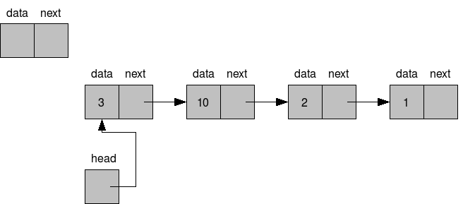
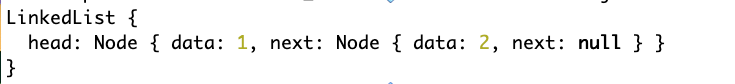

# Linked Lists

## Learning Objectives

- Be able to describe what is a node
- Be able to describe what is a linked list
- Be able to compare and contrast a linked list to an array
- Be able to build a simple linked list using JavaScript
- Be able to describe one real world example of a linked list
- Be able to build some basic general methods for linked lists like insertion, deletion, counting the size, and getting the value of a particular node

## Linked List

A linked list is a linear data structure made up of nodes that point to the next node in a singly-linked list.



It is similar to an array, but there are a few differences. One is chosen over the other depending on the functionality/speed of certain operations for certain tasks. For example, the forward and back buttons on a browser typically have data stored in a [linked list](https://www.geeksforgeeks.org/applications-of-linked-list-data-structure/).

Based on your reading, what are the main differences?

JavaScript has built-in arrays, but there is no linked list. Let's build one.

**NOTE**: There are several approaches to building methods for linked lists. These approaches were predominantly from [Introduction to Algorithms](https://mitpress.mit.edu/books/introduction-algorithms-third-edition). There are also a few other methods that were chosen to show some other approaches to working with linked-lists that would hopefully be helpful in developing your understanding. The most important thing is to find a solution, and then improve upon it.

### Node

First, let's build a node. A node must, at minimum, have some data and a pointer to the next node.

```js
class Node {
  constructor(data) {
    this.data = data;
    this.next = null;
  }
}
```

We can create a pair of nodes and link them

```js
const firstNode = new Node(1);
const secondNode = new Node(2);
firstNode.next = secondNode;

console.log(firstNode);
```

### Linked List

Much like our `DeckOfCards`, which was a class that interacted with our `Cards` objects and had methods on it for utilizing the cards, our list will follow a similar pattern.

```js
class LinkedList {
  constructor(head = null) {
    this.head = head;
  }
}
```

So now we can create a new linked list with our `firstNode`

```js
const firstList = new LinkedList(firstNode);
console.log(firstList);
```

Depending on our terminal settings, the output should look more or less like so



### Linked List Methods

There are some common methods that come in handy with linked lists to build out

- search
- size
- clear
- get last
- insert
- delete

Let's quickly create a linked list that has the months in order so we can use it to test our methods

```js
const months = [
  "Feb",
  "March",
  "April",
  "May",
  "June",
  "July",
  "Aug",
  "Sept",
  "Oct",
  "Nov",
  "Dec",
];

let previousNode = new Node("Jan");
let list = new LinkedList(previousNode);
for (let i = 0; i < months.length; i++) {
  let currentNode = new Node(months[i]);
  previousNode.next = currentNode;
  previousNode = currentNode;
}
```

### Size

This will tell us how long our linked list is.

Let's write some pseudo code. How would we go about writing a size method for the linked list?

```js
class LinkedList {
  constructor(head = null) {
    this.head = head;
  }

  size() {
    let count = 0;
    let node = this.head;
    while (node) {
      count++;
      node = node.next;
    }
    return count;
  }
}
```

How do we test this method?

#### Search

This will allow us to search for a matching piece of data.

Let's write some pseudo code. How would we go about writing a search method for the linked list?

<details><summary>Search</summary>

```js
class LinkedList {
  constructor(head = null) {
    this.head = head;
  }

  search(key) {
    let node = this.head;
    while (node !== null && node.data !== key) {
      node = node.next;
    }
    return node;
  }
}
```

How do we test this method?

</details>

#### Clear

This will clear our linked list of all the nodes.

Let's write some pseudo code. How would we go about writing a clear method for the linked list?

<details><summary>Clear</summary>

```js
class LinkedList {
  constructor(head = null) {
    this.head = head;
  }

  clear() {
    this.head = null;
  }
}
```

How do we test this method?

</details>

#### Get Last

This will get the last node of our linked list.

Let's write some pseudo code. How would we go about writing a getLast method for the linked list?

<details><summary>Get Last</summary>

```js
class LinkedList {
  constructor(head = null) {
    this.head = head;
  }

  getLast() {
    let node = this.head;
    if (!this.head) return null;
    while (node.next) {
      node = node.next;
    }
    return node;
  }
```

How do we test this method?

</details>

#### Insert

This insert will insert at the head.

Let's write some pseudo code. How would we go about writing an insert method for the linked list?

<details><summary>Insert</summary>

```js
class LinkedList {
  constructor(head = null) {
    this.head = head;
  }
  
  insert(data) {
    let newNode = new Node(data);
    if (!this.head) {
      this.head = newNode;
    } else {
      newNode.next = this.head;
      this.head = newNode;
    }
  }
}
```

How do we test this method?

</details>

How would you approach inserting in the middle of the linked list?

#### Delete

Let's delete a node with a specific key.

First, let's write some pseudo code. How would we go about writing a delete method for the linked list?

- use similar logic to search for the matching key, keep count how many nodes we go through
- store the found node
- loop through up to the previous node of the found node
- set the previous node's next property to be found node's next property

<details><summary>Delete</summary>

```js
class LinkedList {
  constructor(head = null) {
    this.head = head;
  }

  delete(data) {
    let node = this.head;
    let counter = 0;
    while (node.data !== data && node.next) {
      counter++;
      node = node.next;
    }
    let foundNode = node;
    node = this.head;
    for (let i = 1; i < counter; i++) {
      node = node.next;
    }
    node.next = foundNode.next;
  }
}
```

How do we test this method?

It may be hard to see our linked list, we can bring in a `node.js` utility to help us and use its `inspect` method, so we can expand what we see in our `console.log`

```js
const { inspect } = require("util");

list.delete("June");
console.log(inspect(list, { showHidden: true, colors: true, depth: 12 }));
```

</details>

### Get first

By now, you should be pretty comfortable creating methods for linked lists. Be sure to think of your strategy before coding. If you don't understand what you are supposed to code, you will not be able to succeed. Sometimes it feels like there is no time to stop and think or look something up, but much more time can easily be sunk into the state of 'fuzzy thinking/fuzzy coding'.

<details><summary>Get first</summary>

```js
class LinkedList {
  constructor(head = null) {
    this.head = head;
  }

  getFirst() {
    return this.head;
  }
}
```

</details>

## Bonus

[Doubly-linked list](./README2.md)

## Further Reading

JavaScript `class` syntax is syntactic sugar - that means it is a newer easier to read/write syntax that does the same thing as an older syntax.

When training on Codewars or Leetcode you are likely to encounter the older syntax in example code or as some starter code for a problem.

When you are ready to learn the alternative syntax to help you solve those problems check out this readme:

[JavaScript Prototypal Inheritance](./README3.md)
