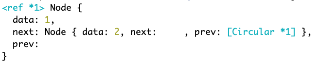

# Doubly Linked List

This is bonus material, please only begin to study this when you have built a good understanding of singly linked lists.

[Visualization](Then try a [doubly linked list](https://csvistool.com/DoublyLinkedList))

## Learning Objectives

- build a doubly linked list
- compare and contrast to a singly linked list
- be able to determine whether a method needs to be updated for a doubly linked list

## Node

The node is very similar to the node found in a singly linked list. It has an additional pointer to point to the previous (`prev`) node.

```js
class Node {
  constructor(data) {
    this.data = data;
    this.next = null;
    this.prev = null;
  }
}
```

We can create a pair of nodes and link them

```js
const firstNode = new Node(1);
const secondNode = new Node(2);
firstNode.next = secondNode;
secondNode.prev = firstNode;

console.log(firstNode);
```

Our console should look similar to this



Since the first node points to the second node and the second node points back to the first one; this is a circular reference. Node uses `<ref *1>` and `[Circular *1]`

We can create a simpler circular reference for demonstration purposes

```js
const circularRef = {};
circularRef.circularRef = circularRef;

console.log(circularRef);
```

### Linked List

Our Doubly Linked List has the same foundation

```js
class LinkedList {
  constructor(head = null) {
    this.head = head;
  }
}
```

Let's use an insert method to insert our months.

```js
class LinkedList {
  constructor(head = null) {
    this.head = head;
  }
  insert(data) {
    // need to point to previous one somehow
    let newNode = new Node(data);
    newNode.next = this.head;
    this.head = newNode;
  }
}
```
