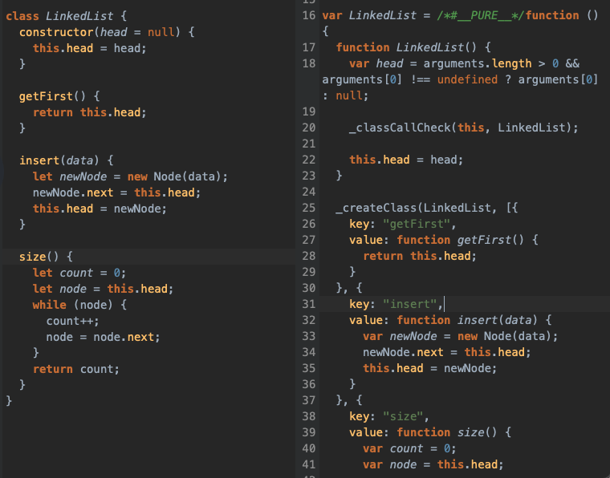

# JavaScript Prototypal Inheritance

## Intro

We've already discussed the need to be able to create similar objects in applications with classes.

Many languages, especially popular and well-established ones like Java and Ruby, use classes and are Object Oriented Programming Languages.

There are certain under the hood mechanics that optimize a language to be Object Oriented.

JavaScript is different. JavaScript is a both a functional programming language and object oriented. It uses prototypes and prototypal inheritance; which is unusual.

There is often a debate of whether functional or object oriented programming is better. Both have pros, both have cons. Early in your programming journey it is best to be open minded and explore both. You may find one coming a little easier to you than the other. You may find that one style suits a project or portion of a project better than the other - or it may be all the same to you. Allow yourself the time to grow an informed opinion.

The under the hood mechanics of prototypal inheritance are quite different from object oriented inheritance. These mechanics are both interesting and unnecessary to explore in this introduction. You can explore this topic on your own, but it goes quite deep, gets rather esoteric and while it will help you gain a better appreciation for JavaScript and other programming languages, it will be of no immediate use in being able to solve problems on Codewars/Leetcode.

## Very Modern JavaScript: A Brief History

JavaScript has gone through a few versions. For nearly a decade version 5 was the main one. [ECMA](https://en.wikipedia.org/wiki/Ecma_International) is an organization who oversees the standardization of JavaScript. Therefore you may see references to JavaScript as ECMAScript or ES.

Major updates to JavaScript were approved in 2015. These changes were referred to as ES6 (ECMA Script 6). After that update, annual smaller updates are approved and added to the language. These changes are usually referred to as ESNext.

How do changes happen? JavaScript is meant to run in the browser. Each browser has its own implementation of JavaScript. While different browsers may do different things, ECMA determines the standard all browser should meet.

A while back, updates only happened when a new computer, floppy disk or CD could be shipped. This usually meant that big changes happened with new versions that were shipped at specific dates.

Developers, however, were charged with making sure their new code was still compatible with old browsers - because many people did not keep up with the latest browsers. This kept progress of JavaScript slow and difficult.

As the internet gained popularity, updates could be sent over the internet, eliminating the need to put it on disks and send it out.

This allowed for smaller updates and bug fixes to be released. Which started to change the way devs thought about updating the language.

However, the need to write and maintain code for old browsers or for browsers that still had not updated to the latest features was an ongoing issue.

Two things happened that changed things for JavaScript rather quickly. The end of the browser Internet Explorer (a major browser used by a large percentage of computers that could not/would not keep up with latest updates) and [BabelJS](https://babeljs.io).

Babeljs is a JavaScript compiler. It can convert new JavaScript into old JavaScript. It is often bundled into many new projects (e.g. create-react-app).

This allowed JavaScript developers to use very modern and new features immediately and babel would transform (compile) the new features into an older version that could work in older browsers/ older browser versions. JavaScript developers could finally focus on writing code in a clean and maintainable way and not have to worry about browser compatibility as much.

The trade off is that it could make setting up a new JavaScript project more challenging - since you would need to set up babel to compile the code. If you use webpack, parcel, create-react-app, vue-cli, angular-cli etc. these tend to have babel (and a few other features) set up for you.

As JavaScript grew in popularity, many people who knew other coding languages started learning JavaScript. One thing many of them wanted was a more familiar `class` syntax.

JavaScript added a `class` syntax for its object prototypes. This allowed people to write a cleaner (and possibly more familiar syntax).

However, the `class` syntax in JavaScript is just syntactic sugar: it looks cleaner and easier to read, but under the hood it still performs like JavaScript's prototypes.

Here is a view of what a `class` compiles into

You can go to [babel](https://babeljs.io) and try it out



## JavaScript Prototypes

We're just going to focus on the syntax

Let's look at a `Node` class

```js
class Node {
  constructor(data) {
    this.data = data;
    this.next = null;
  }
}
```

Let's write it in JavaScript's original syntax. It is written as a function. It is important to note that properties of the object must have the keyword `this`

```js
function Node(data) {
  this.data = data;
  this.next = null;
}
```

With either syntax, you instantiate the same way:

```js
const newNode = new Node(1);
```

Let's do a linked list:

```js
class LinkedList {
  constructor(head = null) {
    this.head = head;
  }
}
```

Old syntax:

```js
function LinkedList(head) {
  this.head = head || null;
}
```

Instantiates the same, uses the methods in the same way:

```js
const list = new LinkedList();
```

Adding methods looks different, but the logic is the same

New

```js
class LinkedList {
  constructor(head = null) {
    this.head = head;
  }

  getFirst() {
    return this.head;
  }
}
```

Old - we must use `.prototype` after the instantiated object and then we add the function name after it:

```js
function LinkedList() {
  this.head = null;
}

LinkedList.prototype.getFirst = function () {
  return this.head;
};
```

Let's add one more method to compare and contrast

New

```js
class LinkedList {
  constructor(head = null) {
    this.head = head;
  }
  getFirst() {
    return this.head;
  }
  insert(data) {
    let newNode = new Node(data);
    if (!this.head) {
      this.head = newNode;
    } else {
      newNode.next = this.head;
      this.head = newNode;
    }
  }
}
```

Old - Here we add new blocks of code, rather than encompassing it all in one `class` block

```js
function LinkedList() {
  this.head = null;
}

LinkedList.prototype.insert = function (data) {
  let newNode = new Node(data);
  if (!this.head) {
    this.head = newNode;
  } else {
    newNode.next = this.head;
    this.head = newNode;
  }
};

LinkedList.prototype.getFirst = function () {
  return this.head;
};
```

The usage is the same:

```js
const months = [
  "Jan",
  "Feb",
  "March",
  "April",
  "May",
  "June",
  "July",
  "Aug",
  "Sept",
  "Oct",
  "Nov",
  "Dec",
];

const list = new LinkedList();

for (let month of months) {
  list.insert(month);
}
```

## Linked List with Methods From Class

Do you find this code easier or harder to read/maintain?

```js
function LinkedList() {
  this.head = null;
}

LinkedList.prototype.clear = function () {
  this.head = null;
};

LinkedList.prototype.delete = function (data) {
  let node = this.head;
  let counter = 0;
  while (node.data !== data && node.next) {
    counter++;
    node = node.next;
  }
  let foundNode = node;
  node = this.head;
  for (let i = 1; i < counter; i++) {
    node = node.next;
  }
  node.next = foundNode.next;
};

LinkedList.prototype.insert = function (data) {
  let newNode = new Node(data);
  if (!this.head) {
    this.head = newNode;
  } else {
    newNode.next = this.head;
    this.head = newNode;
  }
};

LinkedList.prototype.getFirst = function () {
  return this.head;
};
LinkedList.prototype.getLast = function () {};

LinkedList.prototype.search = function (key) {
  let node = this.head;
  while (node !== null && node.data !== key) {
    node = node.next;
  }
  return node;
};

LinkedList.prototype.size = function () {
  let count = 0;
  let node = this.head;
  while (node) {
    count++;
    node = node.next;
  }
  return count;
};

console.log(list.size());

list.delete("June");

console.log(inspect(list, { showHidden: true, colors: true, depth: 12 }));
```

## Further Reading

[MDN Object Prototypes](https://developer.mozilla.org/en-US/docs/Learn/JavaScript/Objects/Object_prototypes)

[MDN Object Prototypal Inheritance](https://developer.mozilla.org/en-US/docs/Learn/JavaScript/Objects/Inheritance)
