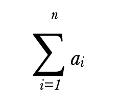

# Math Basics

## Learning Objectives

- Review math concepts that developers are expected to know
- Review what is NaN
- Learn to use built in math methods in order to build solutions to problems containing math
- Roman numerals


## Basic Definitions

- Integer: a whole number that is not a fraction
- Float/Floating point: approximate value for a decimal/fraction, as calculated by a computer
- Positive number: greater than zero
- Negative: less than zero
- Non-negative: greater than or equal to zero

## NaN

`NaN` - **N**ot **a** **N**umber

`NaN` is the value you get when you try to do a mathematical operation on things that are not a number.

Remember, you can add strings together with the `+` operator. that is how we [`concatenate`](https://developer.mozilla.org/en-US/docs/Learn/JavaScript/First_steps/Strings) strings. So this operator has a dual function, adding numbers and concatenating strings.

```js
let start = "Hello, ";
let introduce = "my name is ";
let name = "E.T.";
let expression = start + introduce + name;

console.log(expression);
```

Or

```js
let expression = "";
expression += "Hello, ";
expression += "my name is ";
expression += "E.T.";

console.log(expression);
```

However, subtraction, multiplication and division do not have multiple uses:

```js
let manyCats = "cat " * 5;
console.log(manyCats);
```

Gives us NaN in JavaScript and not `cat cat cat cat cat` (Other programming languages may use `*` this way. See Ruby or Python).

If you try to compare `NaN` to `NaN` it will always be false.

Because, JavaScript cannot calculate whether two invalid math operations are equal to each other. In our case is 5 `*` cats and 5 `*` dogs are both invalid, therefore the value will always be false:

```js
let manyCats = "cat " * 5;
let manyDogs = "dog " * 5;
console.log(manyCats == manyDogs);
```

## Purchase Multiples (multiply)

Let's imagine we are working on the website for an online store.

In our online store, we have a shopping cart. We want to change the cart to instead of showing:

- duct tape : $5
- duct tape : $5
- duct tape : $5
- duct tape : $5

To rather show:

- 4 duct tape: $20

```js
let ductTapePrice = 5;
let amountOfDuctTape = 4;
let total = ductTapePrice * amountOfDuctTape;

console.log(total);
```

Let's add some more information:

```js
console.log(`${amountOfDuctTape} duct tape : $${total}`);
```

## Apply Discount (divide, PEMDAS, percentage)

In our online store, if you buy 3 or more of the same item, you get a 10% discount.

Before coding, let's think through what we expect:

10% of 20 is 2. Therefore the total would be $18

Remember percentage is converted to a decimal by dividing by 100.

```js
// The new total is equal to the old total, minus the total times the percentage to subtract
```

Is this ok?

```js
total = total - total * 10 / 100;
```

What will this equal?

Will it be 0? Or 18?

Should add parenthesis be sure we get 18?

```js
total = total - (total * 10) / 100;
```

We can review the [order of operations](https://en.wikipedia.org/wiki/Order_of_operations)

We can use the mnemonic PEMDAS as a quick way to to remember, without having to look up:

- Parenthesis
- Exponents
- Multiplication/Division
- Addition/Subtraction

Therefore, we don't need to add parenthesis (but it does not hurt to have them).

Now, let's add some logic, that if we have more than 3 rolls of duct tape, we should apply the discount:

```js
let ductTapePrice = 5;
let amountOfDuctTape = 4;
let total = ductTapePrice * amountOfDuctTape;
if (amountOfDuctTape >= 3) {
  total = total - (total * 10) / 100;
}

console.log(total);
```

We can make our expression shorter:

- use a decimal to start
- subtract our percentage from 1 and store it in a variable

```js
let ductTapePrice = 5;
let amountOfDuctTape = 4;
let percentage = 0.1;
let getDiscountedTotal = 1 - percentage;

let total = ductTapePrice * amountOfDuctTape;
if (amountOfDuctTape >= 3) {
  total *= getDiscountedTotal;
}

console.log(total);
```

What is `*=`? You likely have seen `+=` [These are assignment operators](https://developer.mozilla.org/en-US/docs/Web/JavaScript/Guide/Expressions_and_Operators)

## Find the Difference in Price (abs, min/max)

Let's say we want to comparison shop

We find prices for our duct tape as:

```js
const pricesPerRoll = [2, 3, 4, 6, 7, 8];
```

It should be really easy to spot the min and max price. But what if we had:

```js
const pricesPerRoll = [4, 3, 2, 5, 3, 7, 4, 6, 3, 11, 4, 8, 3, 4, 5];
```

and these prices change daily.

We should write a function that will find the minimum price, find the maximum price and then console log the difference between the values

```js
let ourPrice = 5;
let competitorPrices = [2, 3, 4, 6, 7, 8];

const comparePriceRange = (prices) => {
  let min = 0;
  let max = 0;
  let priceRange = max - min;
  return priceRange;
};

console.log(comparePriceRange(competitorPrices));
```

We have a method `Math.min` that can find the minimum of any number of arguments.

ie

```js
Math.min(2, 3, 4, 5, 6, 7, 8);
```

However, our values are in an array. If we try to pass the array, we get `NaN`

```js
Math.min([2, 3, 4, 5, 6, 7, 8]);
```

We could write a loop to iterate over each value and write some logic. But we have another option the [spread operator](https://developer.mozilla.org/en-US/docs/Web/JavaScript/Reference/Operators/Spread_syntax)

```js
Math.min(...[2, 3, 4, 5, 6, 7, 8]);
```

```js
let ourPrice = 5;
let competitorPrices = [2, 3, 4, 6, 7, 8];

const comparePriceRange = (prices) => {
  let min = Math.min(...prices);
  let max = Math.max(...prices);
  let priceRange = max - min;

  return priceRange;
};

console.log(comparePriceRange(competitorPrices));
```

We might also be interested in the difference between our price and the lowest price:

```js
const bestPrice = (competitorPrices, ourPrice) => {
  let competitorMin = Math.min(...competitorPrices);
  return competitorMin - ourPrice;
};

console.log(bestPrice(competitorPrices, ourPrice));
```

The value isn't the most informative. Let's add some more logic:

```js
const bestPrice = (competitorPrices, ourPrice) => {
  let competitorMin = Math.min(...competitorPrices);
  let difference = competitorMin - ourPrice;
  console.log(difference);
  if (difference < 0) {
    console.log("The competitor has a better price");
  } else {
    console.log("We have the better price");
  }
  return difference;
};

console.log(bestPrice(competitorPrices, ourPrice));
```

Let's make the return more informative:

```js
const bestPrice = (competitorPrices, ourPrice) => {
  let competitorMin = Math.min(...competitorPrices);
  let difference = competitorMin - ourPrice;
  if (difference < 0) {
    console.log("The competitor has a better price");
  } else {
    console.log("We have the better price");
  }
  return `The price difference is ${difference}`;
};

console.log(bestPrice(competitorPrices, ourPrice));
```

Sometimes the difference will be a positive number, sometimes it will be negative. What if we just want the difference between the values, and not be negative or positive? Then we are looking for the [absolute value](https://en.wikipedia.org/wiki/Absolute_value)

We can use a built-in JavaScript method to determine this value easily:

```js
const bestPrice = (competitorPrices, ourPrice) => {
  let competitorMin = Math.min(...competitorPrices);
  let difference = competitorMin - ourPrice;
  if (difference < 0) {
    console.log("The competitor has a better price");
  } else {
    console.log("We have the better price");
  }
  return `The price difference is ${Math.abs(difference)}`;
};

console.log(bestPrice(competitorPrices, ourPrice));
```

## Round Up Donation (subtract and round)

Let's say we are designing a web site and we are incorporating a way to donate to charity. Whatever the purchase price, you can give consumers the option to round up their bill to the nearest dollar and take those extra cents and put them towards a worthy cause.

```js
let cartTotal = 26.41;
```

How can we round up?

Let's take a quick look at [the docs](https://developer.mozilla.org/en-US/docs/Web/JavaScript/Reference/Global_Objects/Math) and see if we can find a method that suits us.

Let's start with:

- `Math.round()`

```js
let cartTotal = 26.41;
let roundedUpCart = Math.round(cartTotal);
console.log(roundedUpCart);
```

Hmmm... that gave us `26`. Let's keep looking.

There is a `Math.ceil` method that will always round up.

Let's try it:

```js
let cartTotal = 26.41;
let roundedUpCart = Math.ceil(cartTotal);
console.log(roundedUpCart);
```

Great! We now have a total of $27 to charge our customers.

Now, we want to subtract the difference from the original total from the new total and store that value.

```js
let cartTotal = 26.41;
let roundedUpCart = Math.ceil(cartTotal);
let donation = roundedUpCart - cartTotal;
console.log(donation);
```

Uh oh. We get an unexpected value. Turns out JS is not great with floating point numbers! We'll have to be mindful of this. We can fix this now by using another method [`.toFixed`](https://developer.mozilla.org/en-US/docs/Web/JavaScript/Reference/Global_Objects/Number/toFixed).

```js
let cartTotal = 26.41;
let roundedUpCart = Math.ceil(cartTotal);
let donation = (roundedUpCart - cartTotal).toFixed(2);
console.log(donation);
```

## Find the Median (math round/ceil/floor)

Now that we've reviewed some basics, let's go through how to solve the Find the Median problem.

Using the following numbers array, find the median:

```js
const nums = [
  14, 11, 16, 15, 13, 16, 15, 17, 19, 11, 12, 14, 19, 11, 15, 17, 11, 18, 12,
  17, 12, 71, 18, 15, 12,
];
```

1. Do we understand all the words in stating the problem

   - What is the median?
   - How can we determine the median?

2. What are we asked to show?

- The value of the median (middle number)
  - What if there is an even number of values?
    - [Then we take the average of the two numbers in the middle](https://ltcconline.net/greenl/courses/CAHSEE/StatisticsProb/CAHSEEMeanMedianMode.htm)

3. Restate the problem in your own words

4. Is there enough information for you to find a solution?

5. What is our plan

## Part 1: Sort the numbers

The above array's numbers were carefully chosen to allow us to use the default sorting in the [.sort](https://developer.mozilla.org/en-US/docs/Web/JavaScript/Reference/Global_Objects/Array/sort) array method.

The default sort method, sorts by the first number only. In a later lesson, we'll learn how to use a callback in order to sort in a different way.

Let's take a look:

```js
const arrayOfNums = [70, 111, 450, 3];

console.log(arrayOfNums.sort());
// [ 111, 3, 450, 70 ]
```

We are going to dedicate time later to work with `.sort` and other sorting algorithms. For today, let's just use the basic version

```js
const nums = [
  14, 11, 16, 15, 13, 16, 15, 17, 19, 11, 12, 14, 19, 11, 15, 17, 11, 18, 12,
  17, 12, 71, 18, 15, 12,
];

const findTheMedian = (numArray) => {
  return numArray.sort;
};

console.log(findTheMedian(nums));
```

Oops, we didn't get what we expected. What did we forget to do?

We did not invoke the function!

```js
const nums = [
  14, 11, 16, 15, 13, 16, 15, 17, 19, 11, 12, 14, 19, 11, 15, 17, 11, 18, 12,
  17, 12, 71, 18, 15, 12,
];

const findTheMedian = (numArray) => {
  return numArray.sort();
};

console.log(findTheMedian(nums));
```

Question: does `numArray.sort()` - change `numArray`? or would we need to use `numArray = numArray.sort()` in order to update the order of values in `numArray?`

## Part 2: Finding the middle value:

How do we get the middle value? Sometimes it is easier to work through a simpler example and then apply what you have figured out to the bigger problem:

```js
const shortArray = ["first", "middle", "last"];
```

Our array has a length of 3, 3/2 = 1.5

We can't have an element at a position of 1.5! Only integers are allowed.

How can we round up or round down?

We'll have to reach for some built in JavaScript methods!

We have 3 `Math` methods that could be helpful to us.

`Math.ceil()` - this method will always round up (ceil is short for ceiling)

```js
shortArray[Math.ceil(shortArray.length / 2)];
```

That gave us the last element. Let's try another method

`Math.round()` - this will round up or down to the nearest integer

Let's try it

```js
shortArray[Math.round(shortArray.length / 2)];
```

Ok! That rounded it up! We really need to be able to round down

Let's try one more method:

`Math.floor()` - this one always rounds down

```js
shortArray[Math.floor(shortArray.length / 2)];
```

Excellent! We did it!

What if we have an even number of array items?

```js
const shortArray2 = [1, 2, 4, 5];
```

[We should take the middle two numbers and take the average.](https://ltcconline.net/greenl/courses/CAHSEE/StatisticsProb/CAHSEEMeanMedianMode.htm)

```js
const firstNum = shortArray2[Math.floor(shortArray2.length / 2)];
const secondNum = shortArray2[Math.ceil(shortArray2.length / 2)];
console.log(firstNum, secondNum);
```

Hmmm, both give the value `4`. Let's subtract 1

```js
const firstNum = shortArray2[Math.floor(shortArray2.length / 2) - 1];
const secondNum = shortArray2[Math.ceil(shortArray2.length / 2)];
console.log(firstNum, secondNum);
```

Now, let's get the [average or also known as 'mean'](https://www.mathsisfun.com/mean.html)

Before we dive in, what is the expected value of the average?

```js
const firstNum = shortArray2[Math.floor(shortArray2.length / 2) - 1];
const secondNum = shortArray2[Math.ceil(shortArray2.length / 2)];
const average = firstNum + secondNum / 2;
console.log(firstNum, secondNum, average);
```

We get `2 4 4` - is that the expected for the average? We were expecting 3

What went wrong?

We need to add parentheses in order to first add the numbers together and then divide

```js
const firstNum = shortArray2[Math.floor(shortArray2.length / 2) - 1];
const secondNum = shortArray2[Math.ceil(shortArray2.length / 2)];
const average = (firstNum + secondNum) / 2;
console.log(firstNum, secondNum, average);
```

## Part 3: Putting it All Together

```js
const nums = [
  14, 11, 16, 15, 13, 16, 15, 17, 19, 11, 12, 14, 19, 11, 15, 17, 11, 18, 12,
  17, 12, 71, 18, 15, 12,
];

const findTheMedian = (numArray) => {
  numArray.sort();
  if (numArray.length % 2 !== 0) {
    return numArray[Math.round(numArray.length / 2)];
  } else {
    const firstNum = numArray[Math.round(numArray.length / 2) - 1];
    const secondNum = numArray[Math.round(numArray.length / 2)];
    const average = (firstNum + secondNum) / 2;
    return average;
  }
};

console.log(findTheMedian(nums));
```

## Other Math References

[A list of all the math methods](https://developer.mozilla.org/en-US/docs/Web/JavaScript/Reference/Global_Objects/Math)

Here are some other math methods and concepts you may see on an interview/on Code Wars/ at work

- [Comparison Operators](https://developer.mozilla.org/en-US/docs/Web/JavaScript/Reference/Operators)

- `Math.pi` - the value of [pi](https://www.scientificamerican.com/article/what-is-pi-and-how-did-it-originate/)

- `Math.pow` or `**` - raise any number to any power

- `Math.random` - generate a random number between 0 and 1

- `Math.sqrt` - get the square root of a number

Unary negation - convert a positive number to a negative one, or a negative one into a positive one:

```js
let x = 3;
console.log(-x);
// -3
```

Coercion into a number from a string

```js
let y = "3";
console.log(typeof +y);
```

## Roman Numerals

Roman numerals are a way of expressing numbers using letters. Though their popularity has waned, there are a few times they still appear:

- The Superbowl number
- The year a movie was copywrited
- Code challenges

[Roman Numerals on Wikipedia](https://en.wikipedia.org/wiki/Roman_numerals)

Take the time to learn how to write out 1 to 5000, in Roman numerals. That way, if you get a problem that uses them, you will only have to jog your memory, rather than learn it on the spot. 

## Bonus Reading Math Notation

As you continue your studies, you may run into some mathmatical notation. Let's look at a basic example and translate it into code



This is just like a for loop. Let's break it down

- Sigma `∑` is a greek character that means `the sum of`. We'll set that value to `a`

```js
let a = 0;
```

- At the bottom is `i=1` - this is the starting point

```js
for (let i = 1)
```

- At the top is the end point `n`.
- `n` will be defined somewhere - in our case it is all natural numbers (natural numbers are positive integers, which may or may not include 0) up to `n`. This means we will increment by 1, so we can have `1, 2, 3, ... `

```js
for (let i = 0; i <= n; i++) {}
```

Putting it all together, let's set `n` to 10 as an example, but `n` can be any positive integer.

```js
let a = 0;
const n = 10;
for (let i = 0; i <= n; i++) {
  a += i;
}

console.log(a); // 55
```

The subscript `i` next to the `a` in the mathematical notation just means each instance, in this particular case:

`a1, a2, a3, ... a10` => `1, 2, 3, ...10`

Again, since we have sigma (`∑`), which means `the sum of`, which is why we know to add the numbers in the range of `i` to `n` together.

## Further Reading

Ignore the grade level, check the topic(s) with which you need to review and review them

[Khan Academy Math](https://www.khanacademy.org/math)

Use this as a master list to review

[MDN Math](https://developer.mozilla.org/en-US/docs/Web/JavaScript/Reference/Global_Objects/Math)
