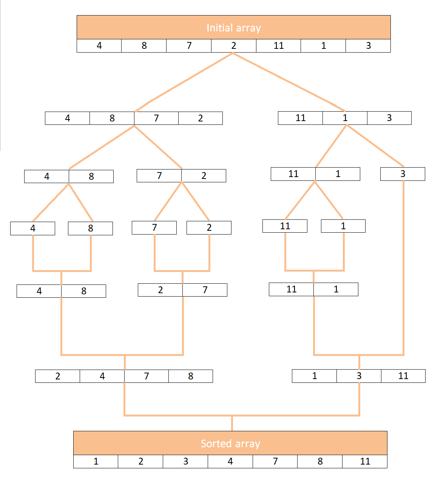

# Sorting Algorithms Part 2

## Learning Objectives

- Merge sort
- Sorting an array of objects, using `.sort()`

## Divide and Conquer

Certain types of problems appear again and again. There are numerous brilliant people who have spent their lives dedicated to finding optimal solutions. When we study algorithms, we have an opportunity to use what they have learned, which makes our problem solving skills sharper and better. This approach makes us stronger problem solvers.

We do this all the time in our own lives. Perhaps you have a pickle jar that is stuck. Your initial approach may be to smash the jar with a hammer and carefully pick the pickles out. While you did achieve the goal of accessing the pickles, this method is not ideal. Perhaps then, you google "cannot open pickle jar" and you find numerous solutions like: heating the lid under hot water, using a rubber grip, using a can opener to break the seal on the side of the lid etc.

In taking the time to google and learn other approaches, you are now better at opening pickle jars and can approach other jars for jam, milk, kefier, pickled beets and more better as well.

The same can be applied to the study of algorithms. Usually our initial approach is along the lines of `brute force` - which is usually checking every single possibility until the right one is found. Using `brute force` to solve a problem is better than not solving the problem. However, taking the time to learn better approaches will make you a better problem solver and coder.

Brute force example:

```js
const square = (n) => {
  let k = 0;
  while (true) {
    if (k === n * n) {
      return k;
    }
    k++;
  }
};
```

Divide and conquer is a technique where one breaks the problem down (divides) into the smallest pieces possible. Then, one solves the problem by conquering each small problem and then finally, combining the solutions.

Have we seen any divide and conquer strategies with the algorithms we have been practicing so far?

## Merge Sort

Merge sort follows the divide and conquer paradigm closely.

### Conquer

If we have two arrays

```js
const left = [1, 4, 8];
const right = [3, 6];
```

We can sort them into one new array

```js
const sortedArray = [];
```

By comparing the first values in the array

- if `left[0] > right[0]`
  - remove `[left][0]` from the array and put it into the sorted array
- if `left[0] < right[0]` OR `left[0]===right[0]`
  - remove `[right][0]` from the array and put it into the sorted array

After one round we would expect

- `sortedArray = [1]`
- `left = [4, 8]`
- `right = [3,6]`

We can do another round, this time we are comparing `left[0]` - which is now `4` because we removed `1` and `right[0]`'s value of `3

- `sortedArray = [1,3]`
- `left = [4, 8]`
- `right = [6]`

We can do another round, this time we are comparing `left[0]` - which is still `4` and `right[0]`'s value of `6`

- `sortedArray = [1,3]`
- `left = [4, 8]`
- `right = [6]`

We can do another round, this time we are comparing `left[0]` - which is `8` and `right[0]`'s value of `6`

- `sortedArray = [1,3,4]`
- `left = [8]`
- `right = [6]`

This is working out quite nicely! Let's write the code

```js
const merge = (left, right) => {
  let sortedArray = [];
  while (left.length && right.length) {
    if (left[0] < right[0]) {
      sortedArr.push(left.shift());
    } else {
      sortedArr.push(right.shift());
    }
  }
  return sortedArray;
};

console.log(merge([1, 4, 8], [3, 6]));
// [  1, 3, 4, 6  ]
```

Not bad! We still have a few bugs to work out. We lost 8, because our `while` loop ended when the length of either `right` or `left` went to 0, so let's include those last values

```js
const merge = (left, right) => {
  let sortedArray = [];
  while (left.length && right.length) {
    if (left[0] < right[0]) {
      sortedArr.push(left.shift());
    } else {
      sortedArr.push(right.shift());
    }
  }
  return [sortedArray, left, right];
};

console.log(merge([1, 4, 8], [3, 6]));
//[ [ 1, 3, 4, 6 ], [ 8 ], [] ]
```

Now we just want a 1 dimensional array

```js
const merge = (left, right) => {
  let sortedArray = [];
  while (left.length && right.length) {
    if (left[0] < right[0]) {
      sortedArr.push(left.shift());
    } else {
      sortedArr.push(right.shift());
    }
  }
  return [...sortedArray, ...left, ...right];
};

console.log(merge([1, 4, 8], [3, 6]));
// [ 1, 3, 4, 6, 8 ]
```

### The Unsolved Issue

In or example, our arrays were already sorted

const left = [1, 4, 8];
const right = [3, 6];

if we tried

```js
const left = [4, 8, 1];
const right = [6, 3];
```

We would get

```js
[4, 6, 3, 8, 1];
```

We need a way to sort the bigger arrays first. The way to do it would be to take two arrays of one element each then put them in a sorted array, and continue merging them together.

The way we can be sure an array is sorted is if there is only one item in it. Then we can combine two arrays with one item in a sorted way. Let's look at a visualization:



[reference](https://stackabuse.com/merge-sort-in-javascript/)

### Divide

Now our goal is to keep splitting our arrays into `left` and `right` until they have just one item in them. Let's look at a small array of numbers so we can step through the divide process and be able to follow it

```js
[9, 1, 5];
```

We need to be able to split this down into three single arrays. So let's first break this array into two arrays, we'll refer to the left side as `left` and the right side as `right`

- Left: `[9, 1]`
- Right `[5]`

The right is ok, but the left is still too big, let's look at the left side, we can split this array again

- Left: `[9]`
- Right `[1]`

Now we have three arrays with one value.

Let's code this:

```js
const mergeSort = (arr) => {
  return arr;
};

const nums = [9, 1, 5];

console.log(mergeSort(nums));
```

```js
const mergeSort = (arr) => {
  const half = arr.length / 2;
  const left = arr.splice(0, half); // make a new array with the first half of the original array
  const right = arr; // we don't need to rename arr, but it should be helpful for visualizing our code
  return [left, right];
};

// result [ [ 9 ], [ 1, 5 ] ]
```

We have confirmed that we can split the array into two parts, even if the number of elements is odd. We can test another set with an even number just to be sure this works as expected

```js
const testEven = [4, 8, 6, 2];
console.log(mergeSort(testEVen));
```

Let's return our attention to our original `nums` array.

We need the result to be one array. Let's use the `spread` operator to make it one array

```js
const mergeSort = (arr) => {
  const half = arr.length / 2;
  const left = arr.splice(0, half); // make a new array with the first half of the original array
  const right = arr; // we don't need to rename arr, but it should be helpful for visualizing our code
  return [...left, ...right];
};

// result [  9 , 1, 5  ]
```

Now, we have only been able to divide our arrays once, we need to keep diving them until they are all down to the size of 1. We can use recursion to accomplish this.

Recursion requires a way to break the problem down into smaller steps and a base case - when recursion is done/can solve the problem.

Our base case will be when the array length is less than or equal to 1. Let's add the logic for the base case:

```js
const mergeSort = (arr) => {
  const half = arr.length / 2;
  if (arr.length <= 1) {
    return arr;
  }
  const left = arr.splice(0, half); // make a new array with the first half of the original array
  const right = arr; // we don't need to rename arr, but it should be helpful for visualizing our code
  return [left, right];
};
// [ [9], [1,  5 ]]
```

We have `9` as an array with a length of 1, but our `1` and `5` are not split up.

Let's set up recursion to accomplish breaking those two numbers down into their own arrays:

```js
const mergeSort = (arr) => {
  console.log(arr);
  const half = arr.length / 2;
  if (arr.length <= 1) {
    return arr;
  }
  const left = arr.splice(0, half); // make a new array with the first half of the original array
  const right = arr; // we don't need to rename arr, but it should be helpful for visualizing our code
  return [mergeSort(left), mergeSort(right)];
};
/* 
[ 9, 1, 5 ]
[ 9 ]
[ 1, 5 ]
[ 1 ]
[ 5 ]
[ [ 9 ], [ [ 1 ], [ 5 ] ] ]
*/
```

We can make them back into one array easily:

```js
const mergeSort = (arr) => {
  console.log(arr);
  const half = arr.length / 2;
  if (arr.length <= 1) {
    return arr;
  }
  const left = arr.splice(0, half); // make a new array with the first half of the original array
  const right = arr; // we don't need to rename arr, but it should be helpful for visualizing our code
  return [...mergeSort(left), ...mergeSort(right)];
};
```

Nothing interesting seems to happening with our code yet. But we are making progress. We are using small, testable steps to build out this challenging problem. Always try to find small testable steps.

Now that we have built the `divide` portion of our divide and conquer strategy, let's combine it with the `conquer` portion.

```js
const mergeSort = (arr) => {
  console.log(arr);
  const half = arr.length / 2;
  if (arr.length <= 1) {
    return arr;
  }
  const left = arr.splice(0, half); // make a new array with the first half of the original array
  const right = arr; // we don't need to rename arr, but it should be helpful for visualizing our code
  return merge(mergeSort(left), mergeSort(right));
};
```

Since this is working recursively, it can take some time for your mind to understand how it all goes together. Adding console.logs and testing other data sets can help you understand how this code is running and matching the visual presented above.

## Using JavaScript's `.sort()` to sort the cards

We will use
[MDN](https://developer.mozilla.org/en-US/docs/Web/JavaScript/Reference/Global_Objects/Array/sort) as our reference.

Let's look at a sample of our cards:

```js
const cards = [
  { face: 8, value: 8, suit: "Hearts" },
  { face: "Jack", value: 10, suit: "Diamonds" },
  { face: "Queen", value: 10, suit: "Clubs" },
  { face: 5, value: 5, suit: "Spades" },
  { face: "Jack", value: 10, suit: "Spades" },
  { face: "Queen", value: 10, suit: "Diamonds" },
  { face: 9, value: 9, suit: "Clubs" },
  { face: "King", value: 10, suit: "Diamonds" },
  { face: 2, value: 2, suit: "Diamonds" },
  { face: 5, value: 5, suit: "Clubs" },
  { face: "Ace", value: 11, suit: "Diamonds" },
];
```

We need to sort them by

- suit
- by value
- by face

Getting started:

```js
const cardSort = (arr) => {
  return arr;
};

console.log(cardSort(cards));
```

We'll sort the suits alphabetically: Clubs, Diamonds, Hearts, Spades

```js
const cardSort = (arr) => {
  return arr.sort((a, b) => {
    if (a.suit < b.suit) return -1;
    if (a.suit > b.suit) return 1;
    return 0;
  });
};
```

The sort is comparing the first letters. `a` is 'the left' item in the array `b` is 'the
right' item next to it. If a is less than b, swap the order. if a is greater than b, sort a before b. if a is equal to b - keep the order.

Sort again, now we want to expand what happens when the suits match

```js
const cardSort = (arr) => {
  return arr.sort((a, b) => {
    if (a.suit < b.suit) return -1;
    if (a.suit > b.suit) return 1;
    if (a.value < b.value) return -1;
    if (a.value < b.value) return 1;
    return 0;
  });
};
```

The only time that the values will be the same/still not sorted correctly, now that we've sorted by suit, is when they are a Jack, Queen or King. Let's add the logic there

```js
const cardSort = (arr) => {
  return arr.sort((a, b) => {
    if (a.suit < b.suit) return -1;
    if (a.suit > b.suit) return 1;
    if (a.value < b.value) return -1;
    if (a.value < b.value) return 1;
    if (a.face === 10 && isNaN(b.face)) return -1;
    if (a.face === "Jack" && b.face === "Queen") return -1;
    if (a.face === "Jack" && b.face === "King") return -1;
    if (a.face === "Queen" && b.face === "King") return -1;
    return 0;
  });
};
```

## Further Reading

- [Merge sort visualization](https://imgur.com/gallery/GD5gi)
- [Merge sort wikipedia](https://en.wikipedia.org/wiki/Merge_sort)
