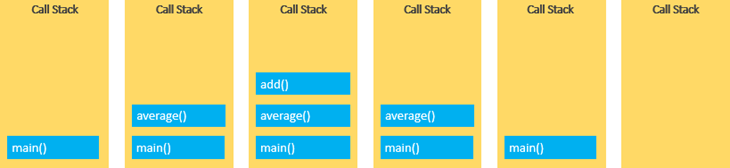
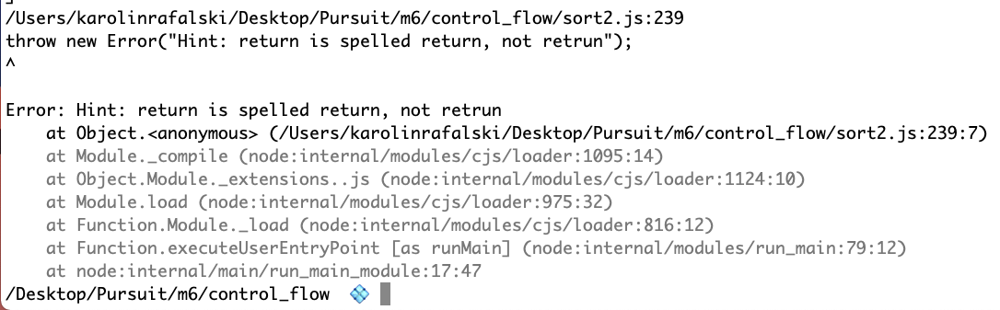
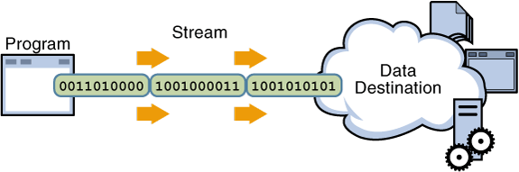

# Stacks & Queues

### Setting intent

> It can be hard to distinguish whether something is truly hard when it is new. Have patience.

## Trivia Questions

None today, just pre-reading for lecture

## Background

Stacks and queues can be built either with linked lists or arrays. Stacks and queues usually are put together as topics to learn because they are quite similar.

They are a linear data structure (like an array or linked list). What makes them different are some key rules about how to use them

### Stacks

- Last-in, first-out: LIFO policy

This is easily visualized by thinking of a stack of pancakes. The last pancake that is put on the plate goes on top, and it will be the first one removed.

In terms of computing, an example is the `call stack`. A call stack stores information in the active subroutines of a computer program

[reference](https://www.seas.upenn.edu/~cis1xx/resources/java/fileIO/introToFileIO.html)

Surely, by now you have received an error message in `node.js`

This is a stack trace- it shows where the error happened (in this case in the file `sort2.js` on line 239). Below, is a trace of the other functions that were called to execute this line of code.

Perhaps, you have also accidentally created an infinite loop while working on a recursive solution, then you likely would have seen a message like `Maximum call stack size exceeded` or `stack overflow`.

There tends to be a certain terminology for certain actions with a stack

- insert : push
- delete : pop

### Queues

- First-in, first-out: FIFO policy

This is also easily visualized by thinking of a line of people at a checkout register. The first person who stood in line will be the first one to leave the line to be rung up.

In terms of computing, a common use is for asynchronous data transfers. You may have heard of `io buffers` (`io` - input/output), `pipes`, `streams` or `file io`. Our applications that we've been building have handled this kind of logic for us.

[Reference](https://www.seas.upenn.edu/~cis1xx/resources/java/fileIO/introToFileIO.html)

There tends to be a certain terminology for certain actions with a stack

- insert : enqueue
- delete : dequeue

### Next

Now that we understand the general principles of these two data structures, the next task is to code examples of them.

## Lab

[Stacks and Queues Lab](https://github.com/joinpursuit/m6-stacks-queues-practice)

### Bonus

There are several problems you should work through to gain a thorough understanding of Stacks and Queues. You can find the Codewars problems linked here on the [Fellow Tracker](https://pursuit.codetrack.dev) under you name card.

From Codewars:

- [Valid Parenthesis](https://www.codewars.com/kata/valid-parentheses)

- [Implementing a Queue](https://www.codewars.com/kata/implementing-a-queue)
- [Implementing a Queue - Performance Version](https://www.codewars.com/kata/implementing-a-queue-performance-version)

Additional problems to practice working with Stacks:

Hacker Rank:

- [Equal Stacks](https://www.hackerrank.com/challenges/equal-stacks/problem)
- [Maximum Element](https://www.hackerrank.com/challenges/maximum-element/problem)

Codesignal:

- [Gift Stacking](https://app.codesignal.com/challenge/ZQMreaCmFzshtoETf)
