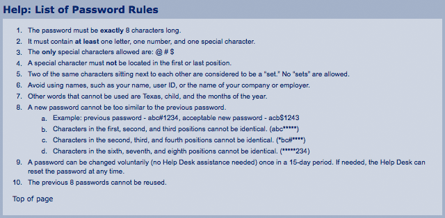

# Regular Expressions

## Learning Objectives

- Define regular expressions
- Use simple regular expressions to help solve problems

## An Introduction to Regular Expressions

Regular Expressions is a fancy term that essentially means "patterns of strings". We can create patterns for strings that can be searched for, matched and replaced.

Regular Expressions are very useful, therefore they are included in many coding languages including, JavaScript, Ruby, Python, js, Java, HTML (yes!) and even to a limited extent CSS!

## Revisit Remove Vowels

Searching for `a`, `e`, `i`, `o`, or `u` - is pattern matching. We are looking for vowels

```js
const patternMatch = (word) => {
  for (let i = 0; i < word.length; i++) {
    if (
      word[i].toLowerCase() === "a" ||
      word[i].toLowerCase() === "e" ||
      word[i].toLowerCase() === "i" ||
      word[i].toLowerCase() === "o" ||
      word[i].toLowerCase() === "u"
    ) {
      console.log("it is a vowel!");
    }
  }
  return word;
};
console.log(patternMatch("hello."));
console.log(patternMatch(".hi"));
console.log(patternMatch("?howdy"));
console.log(patternMatch("aloha"));
console.log(patternMatch("pfft"));
```

Let's use a regular expression (often abbreviated regex) and the method `.match`, match will return either an array of the matched values or null, depending on if there is a match.

First, let's just try the letter a.

A regular expression always starts with a forward slash `/` (not a backslash `\`) and ends with another (forward) slash. When coders use just the word `slash`
it is implied that it is a forward slash that they are referring to.

```js
const patternMatch = (word) => {
  const regex = /a/;
  for (let i = 0; i < word.length; i++) {
    if (word[i].match(regex)) {
      console.log("it is a vowel!", word[i]);
    }
  }
  //   return word;
};

console.log(patternMatch("hello."));
console.log(patternMatch(".hi"));
console.log(patternMatch("?howdy"));
console.log(patternMatch("aloha"));
console.log(patternMatch("pfft"));
```

Super! Let's try the rest of the vowels

```js
const patternMatch = (word) => {
  const regex = /aeiou/;
  for (let i = 0; i < word.length; i++) {
    if (word.match(regex)) {
      console.log("it is a vowel!", word[i]);
    }
  }
  //   return word;
};
```

It does not work as expected. `/aeiou/` is looking for the exact pattern `aeiou` which none of our test words have.

To write an expression that test for `a` or `e` or `i` or `o` or `u`, we need to add brackets.

We don't need to loop over each letter any more. `.match` will handle that for us

```js
const patternMatch = (word) => {
  const regex = /[aeiou]/;
  if (word.match(regex)) {
    return `${word} has a vowel in it`;
  } else {
    return `${word} does not have a vowel in it`;
  }
};
```

```js
// Test cases
console.log(patternMatch("ha"));
console.log(patternMatch("pffft"));
console.log(patternMatch("eh"));
console.log(patternMatch("hi"));
console.log(patternMatch("Oh"));
console.log(patternMatch("huh"));
console.log(patternMatch("seen"));
console.log(
  patternMatch("My girl wove six dozen plaid jackets before she quit.")
);
```

We look at our test cases, and `Oh` does not have a vowel in it based on our function. We want to make our search case insensitive. You can apply extra properties to our search (called flags). One of these flags is `i` for case **i**nsensitive. Flags go after the last `/`

```js
const patternMatch = (word) => {
  const regex = /[aeiou]/i;
  if (word.match(regex)) {
    return `${word} has a vowel in it`;
  } else {
    return `${word} does not have a vowel in it`;
  }
};
```

We can swap the `.match` method for the `.replace` method. `.replace` takes 2 arguments, the first is what we want to match, and the second is what we want to replace it with. In our case, we want to replace it with an empty string (remove the letter)

```js
const patternMatch = (word) => {
  const regex = /[aeiou]/i;
  return word.replace(regex, "");
};
```

Almost! We see we have a problem with words/sentences that have more than one vowel. our regular expression will stop matching patterns once it encounters its first match. We want to to match all of them. We have another flag we can use `g` (for global).

```js
const patternMatch = (word) => {
  const regex = /[aeiou]/gi;
  return word.replace(regex, "");
};
```

Great! We could make it one line, but sometimes it is better to leave it as two, especially for readability. If you enjoy making your code as short as possible (and likely quite unreadable), you can, as a hobby, play [code golf](https://codegolf.stackexchange.com). For professional code, the goal is to make it readable and reusable.

## Other Uses of Regular Expressions

- finding valid phone numbers in a document

  - 867-5309
  - 555 - 867 -5309
  - 5558675309
  - +1 (555)-867-5309

- Validating a password



[Courtesy of Kottke.org](https://kottke.org/12/06/the-worlds-worst-password-requirements-list)

- Validating an email address
  - if you google this you may find something like

```js
/\A([\w+\-].?)+@[a-z\d\-]+(\.[a-z]+)*\.[a-z]+\z/i;
```

[reference for email validation](http://emailregex.com)

The above expression is quite complex and would require more study to learn what each part means. Below we can look at how to build a more complex expression. There is also nothing wrong with writing multiple expressions and checking for different parts separately, especially if it makes the code more readable/maintainable. 

## Simple Date Validator

Let's check for a valid date in the form of `mm-dd-yyyy`, where the date is represented with `digits` (numbers 0-9)

### Special Characters and How to Use or Escape Them

We have special characters that help us build regular expressions, sometimes we want to use the actual character and sometimes we want to use the functionality they represent. Let's look at some examples:

- `.` is any character
- `?` is an optional character
- `\d` is any digit
- `\D` is any NON digit

```js
const validDate = (date) => {
  const dateRegEx = /\d\d-\d\d-\d\d\d\d/;
  if (date.match(dateRegEx)) {
    return true;
  }
  return false;
};

console.log(validDate("12-12-2112"));
console.log(validDate("12122112"));
console.log(validDate("12/12/2112"));
```

it would be nice, if the `-` were optional

```js
const validDate = (date) => {
  const dateRegEx = /\d\d-?\d\d-?\d\d\d\d/;
  if (date.match(dateRegEx)) {
    return true;
  }
  return false;
};

console.log(validDate("12-12-2112"));
console.log(validDate("12122112"));
console.log(validDate("12/12/2112"));
```

And it would be nice to be able to use `/` as an alternative

```js
const validDate = (date) => {
  const dateRegEx = /\d\d(-?|\/)\d\d(-?|\/)\d\d\d\d/;
  if (date.match(dateRegEx)) {
    return true;
  }
  return false;
};

console.log(validDate("12-12-2112"));
console.log(validDate("12122112"));
console.log(validDate("12/12/2112"));
```

And it would be nice if the month could be (sort of) limited to 01-12. Note how preventing people from putting 13-19 would add even more complexity to our regular expression. If you feel up to it, think of a way to truly limit it to 01-12. Remember, you can write a second regular expression instead of trying to do all testing in one line. Otherwise, the take away is that it's easy for these expressions to get complex quickly.

```js
const validDate = (date) => {
  const dateRegEx = /[01]\d(-?|\/)\d\d(-?|\/)\d\d\d\d/;
  if (date.match(dateRegEx)) {
    return true;
  }
  return false;
};

console.log(validDate("12-12-2112"));
console.log(validDate("12122112"));
console.log(validDate("12/12/2112"));
```

Lastly, let's clean up that last bit to be 2-4 digits

```js
const validDate = (date) => {
  const dateRegEx = /[01]\d(-?|\/)\d\d(-?|\/)\d{2,4}/;
  if (date.match(dateRegEx)) {
    return true;
  }
  return false;
};

console.log(validDate("12-12-2112"));
console.log(validDate("12122112"));
console.log(validDate("12/12/2112"));
console.log(validDate("12/12/20"));
```

Whoa! We just wrote:

```js
/[01]\d(-?|\/)\d\d(-?|\/)\d{2,4}/;
```

And we know what it means!

Let's break it down one more time:

- `/` start regular expression
- `[01]` can be `0` or `1`
- `\d` can be 0-9
- `(-?|\/)` either a `-` or nothing or a `/`
- `\d\d` two more digits
- `(-?|\/)` either a `-` or nothing or a `/`
- `\d{2,4}`
- `/` end regular expression

Wow! So fun! We could keep going all day with this, but this is just an introduction!

The next important step is to memorize all the special characters and flags for each language you'll be coding in. Kidding! Once you have a basic understanding, all you need is a good reference to look things up as you need them.

Writing Regular Expressions can get challenging. There are a number of free online tools that can help you visualize and write your expressions

If you will be doing some reg ex in JavaScript, check out [RegExr](https://regexr.com/)

The site allows you to write and test regular expressions and has nice references.

There are some nuanced/esoteric differences with regular expressions across languages and there are often more optimal ways to write regular expressions (look into greedy, nongreedy).

The best way to learn is to practice, start small and work your way up to more complexity and don't worry if you can't learn it all in a day, or a week or a month. Coding as a career makes you a lifelong learner. 

You are near the end of your time in a classroom and soon you'll be tasked with learning things on your own. Hopefully, by now you feel confident in knowing how _you_ learn to code. So feel free to work on any of the following, according to how you learn best.

- Here is a good code-along tutorial, that'll start you learning regular expressions from the beginning:
  - [regexone](https://regexone.com/)
- Try your hand at some code golf on these simple examples

  - [Eloquent JavaScript Regular Expressions](http://eloquentjavascript.net/09_regexp.html)
    - You can use your `patternMatch` function or you can try either regex site to try to match the following
    - car and cat
    - pop and prop
    - ferret, ferry and ferrari
    - Any word ending in ious
    - A whitespace character followed by a dot, comma, colon or semicolon
    - A word longer than six letters
    - A word without the letter e

- You can check out JavaScript's method `.search` method that will return the position of the first match or -1 if none found.

```js
text = "Hi! Hello. Howdy? Aloha...pffft";

console.log(text.search(/Hello/i));
console.log(text.search(/Howdy/i));
console.log(text.search(/Aloha/i));
```

- Another method is `.replace`  which will match a pattern and then replace it with something.
  The Oxford Dictonary states that these are the most commonly misspelled words and how they are misspelled:

| Correct spelling | Common misspelling |
| :--------------: | :----------------: |
|    disappear     |     dissapear      |
|    disappoint    |     dissapoint     |

- Write a method that would correct these two words
