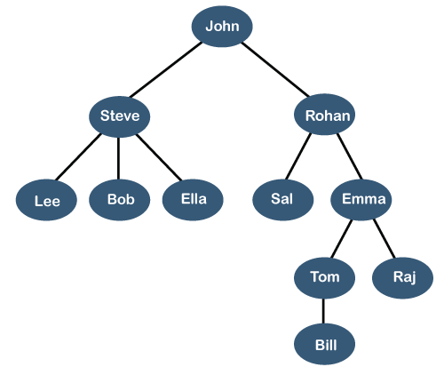
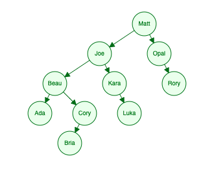
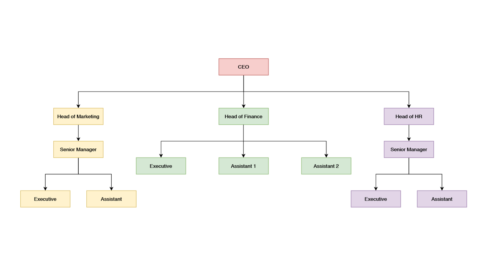
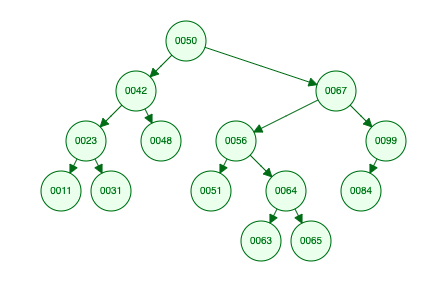

# Trees

## Learning Objectives

By the end of this lesson, you should be able to:

- Differentiate between a generic tree and binary search trees.
- Identify why trees are valuable data structures for searching.
- Represent a tree structure in JavaScript.
- Describe code that determines the height of a tree.

---

## What are trees?

Many of the data structures you have seen so far have all been _linear data structures._ Generally, this means that the data may be related to each other in terms of order _but not_ in terms of hierarchy. For example, take the following representation of a linked list:

```
6 -> 5 -> 3 -> 9 -> 8 -> 14 -> 11 -> 13
```

Each node of the above linked list could be described in relation to the data before or after it. For example, you can say that the node with the value of 11 comes after the node with the value of 9. However, outside of position, this data structure doesn't add any additional properties.

Trees add a new aspect: hierarchy. In a tree, some data can be said to be on a higher "level" than other pieces of data.



In the image above, each node contains a name and is related to one or more other nodes through position _and hierarchy._ For example, the name "Rohan" comes after "John", but is also at higher level than "Sal" and "Emma".

The ability to structure relationships between data in this way provides some pretty powerful benefits, both in terms of representing data as well as accessing data.

### Important terms

Trees have a lot of specific language used to describe them. The following list describes many of the most important terms.

| Term          | Description                                                                                                                                     |
| ------------- | ----------------------------------------------------------------------------------------------------------------------------------------------- |
| Node          | The building blocks of a tree.                                                                                                                  |
| Link          | A connection from a node to another node. Links in trees are _unidirectional_, meaning that they connect two nodes with a particular direction. |
| Edge          | Another term another for a Link.                                                                                                                |
| Root          | The node at the "top" of the tree. The root node is the only node without parents.                                                              |
| Parent        | Any node that is "above" other nodes. Parent nodes must have at least one or more children.                                                     |
| Child         | Any node that is "below" other nodes. A child node has a single parent.                                                                         |
| Sibling       | Nodes that share the same parent node are called siblings.                                                                                      |
| Leaf Node     | A node that does not have any children.                                                                                                         |
| Internal Node | Any node that has a child.                                                                                                                      |
| Height        | Taking the longest path, the number of edges from the root to the node farthest from it.                                                        |
| Depth         | The length of the path from root to a particular node.                                                                                          |

For an example of these terms, take a look at the image below.



In this tree, the following statements are true.

- All of the circles with names inside of them are _nodes._
- "Matt" is the _root node_ and contains _links, or edges,_ to "Joe" and "Opal". "Joe" and "Opal" are _children nodes_ of "Matt".
- "Joe" is the _parent node_ to "Beau" and "Kara".
- "Ada" and "Cory" are _sibling_ nodes, as are "Beau" and "Kara", as well as "Joe" and "Opal".
- "Ada", "Bria", "Luka", and "Rory" are all _leaf nodes._ All other nodes are _internal nodes._
- The _height_ of the tree is four; that is because there are four edges from the _root node_ to the most distant _leaf node._
- "Kara" is at a depth of two; that is because there are two edges from the _root node_ to the node with "Kara".

<details>
  <summary>❗️ Practice</summary>

Here is another tree, that shows a hierarchy at a company.



Answer the following questions for these trees:

- Which nodes are _leaf nodes?_

- How many _children nodes_ does the "Head of Finance" node have?

- What are the _sibling nodes_ of the "Assistant 1" node?

- What is the _height_ of this tree?
</details>

### Trees in software development

The tree data structure is used often in software development. For example, your file system is based off of a tree data structure.

```

my-app/
├─ node_modules/
├─ public/
│  ├─ favicon.ico
│  ├─ index.html
│  ├─ robots.txt
├─ src/
│  ├─ index.css
│  ├─ index.js
├─ .gitignore
├─ package.json
├─ README.md
```

In the case below, the `my-app/` directory is the root node. Directories are all parent nodes and files are all leaf nodes.

HTML is also structured as a tree.

```html
<html lang="en">
  <head>
    <meta charset="UTF-8" />
    <meta http-equiv="X-UA-Compatible" content="IE=edge" />
    <meta name="viewport" content="width=device-width, initial-scale=1.0" />
    <title>Document</title>
  </head>
  <body>
    <p>Hello, trees!</p>
  </body>
</html>
```

In the HTML above, the `html` element is the root node. `head` and `body` are both children of `html`.

Trees are valuable in part because they allow for representing hierarchy. Both the file system and HTML make use of this hierarchy for different features. However, trees can also be valuable when constructed in certain ways as they can improve the searching of particular data.

### Binary search trees

In general, trees need only have a root node to be classified as a tree. Each node in the tree can have as many children as you like. However, there are many different types of trees which confer some powerful benefits although they can be more difficult to construct.

One of the most popular is the binary search tree. A binary tree is a tree where each node can have at most two children. A binary search tree is specifically optimized for searching, by following a specific pattern when organizing how and where nodes appear in the tree.

Take a look at the following tree. The node at the top, with the value `50`, was inserted first.



The tree above fits the following constraints:

- Every value to the left of the root node is smaller than the value of the root node.
- Every value to the right of the root node is larger than the value of the root node.
- The subtree created by the left and right nodes are also binary search trees.

By fitting this constraint, searching for a specific value becomes much easier. For example, compare the tree above with the array below.

```js
[50, 42, 67, 56, 64, 51, 63, 65, 99, 84, 23, 48, 11, 31];
```

Visually, the array gives you no clues as to how to find a specific number. However, programmatically, there is also a benefit. When searching for specific data, the binary search tree allows you to much more quickly find that data. For example, compare finding the number `99` in the array above as opposed to the tree above.

If you were to use Linear Search on this array, it would take at least 9 operations to reach the number `99` if you started from the beginning of the array. Starting at the beginning, you would check each number and then move on to the next element, slowly making your way to the number. At best, if you generally knew where the number was, you could start from the end of the array and use 6 operations.

In the tree, you only need three operations. You would check to see if the root node stores the value, which it does not. Then you could compare the value you're looking for (i.e. `99`) to the value of the root node (i.e. `50`). Because `99` is greater than `50` you _can be certain_ that the value is to the right of the root node. At the next node, which is `67`, you would do the same check and comparison.

Binary search trees are in part powerful because each of those decisions cuts off an entire section of the tree. Accessing and searching data in a binary search tree has an average time complexity of `O(log(n))`, the same as binary search.

<details>
  <summary>❗️ Question</summary>

In the worst case scenario, binary search trees are actually no better than linear search. Both have a worst case time complexity of `O(n)`. What would a binary search tree have to look like for it to fit the worst case scenario?

</details>

## Creating a tree in JavaScript

Recall that in order to create a tree we must have a root node that connects to multiple other nodes.

### Tree via object literal

In some ways, the easiest way to model a tree in JavaScript is through an object.

```js
const tree = {
  data: "Matt",
  children: [
    {
      data: "Joe",
      children: [
        {
          data: "Beau",
          children: [
            { data: "Ada", children: [] },
            { data: "Cory", children: [{ data: "Bria", children: [] }] },
          ],
        },
        {
          data: "Kara",
          children: [{ data: "Luka", children: [] }],
        },
      ],
    },
    {
      data: "Opal",
      children: [{ data: "Rory", children: [] }],
    },
  ],
};
```

The object above contains a root data point (i.e. "Matt") and has a variety of children. Each level has a similar structure, which allows this object to function as a tree. While this works to represent data, it isn't the easiest to add methods to. For this reason, you may want to build a tree through classes.

### Trees with classes

With the following two classes and code, you can loosely represent a tree.

```js
class TreeNode {
  constructor(data) {
    this.data = data;
    this.children = [];
  }
}

class Tree {
  constructor(root = null) {
    this.root = root;
  }
}

const matt = new TreeNode("Matt");
const joe = new TreeNode("Joe");
const opal = new TreeNode("Opal");
matt.children.push(joe, opal);

const tree = new Tree(matt);
```

The above code creates a small tree with two children. Of course, the code above is also relying on the array data structure as part of its implementation. As you continue to learn more about trees, you will want to spend time developing methods and properties on your tree to turn it into a fully formed data structure.

<details>
  <summary>❗️ Question</summary>

The code above is setup to create a general tree. What would need to change in the classes to help enforce a binary tree?

</details>

<details>
  <summary>❗️ Practice</summary>

Update the code above to add more nodes to the tree. You may use the image below or add your own names to the tree. Add at least enough nodes so that the tree has a height of 3 or more.


</details>

### Tree methods

Trees have a few methods which are common among them, despite the kind of tree:

- Insert
- Delete
- Search

All of these methods generally rely upon recursion to work. That's because each node of a tree is its own tree.

Thankfully, many of these methods have already been figured out. Often the best way to approach learning these new methods is to slowly look through the solution to one of these methods to better understand how it works.

As an example, take a look at the following code in the Repl.it link below which will determine the height of a tree. A description of what is happening is included below as well. However, before looking, take time to try and understand how the code is working on your own.

- [Trees: Get Height](https://replit.com/@Pursuit/Trees-Get-Height#index.js)

<details>
  <summary>❗️ Explanation</summary>

Take a look at the `getDepth()` method in the `Tree` class. The `console.log()` statements are not necessary for the code to work, although they may help you understand what is occurring. The code works as follows:

```js
if (!node || !node.children.length) {
  return 0;
}
```

First, the method checks whether or not there is a node. If there is not one, the method finishes with a value of `0`. In the same `if` statement, the code checks if the node has any children. If it does not, the method finishes with a value of `0`. This is the method's "escape clause."

```js
const results = node.children.map((child) => this.getDepth(child) + 1);
```

Next, a new variable is set, `results`. This variable is set to the return value of using `.map()` on all of the children and calling `.getDepth()` on each child node. For each iteration, `1` is added to the return value of `getMethod()` to represent the new edge that was created.

```js
return Math.max(...results);
```

Finally, the largest number among that array that is returned is returned.

To track this as it happens, run the code with the `console.log()` statements. You should see output that looks like this:

```
Entering Node A
Entering Node B
Entering Node E
No children of Node E. Return 0.
Depths below Node B [ 1 ]
Entering Node C
No children of Node C. Return 0.
Entering Node D
Entering Node F
Entering Node H
No children of Node H. Return 0.
Depths below Node F [ 1 ]
Entering Node G
No children of Node G. Return 0.
Depths below Node D [ 2, 1 ]
Depths below Node A [ 2, 1, 3 ]
Result: 3
```

As you can see, this code travels down from the root node (i.e. `A`) to the furthest "left" child (i.e. `E`). Once it is there, it returns the value `0`.

For example, `Depths below Node B [ 1 ]` represents all of the results below the `B` node. `B` only has one child, `E`. Therefore it stores a value of `0` + `1`, resulting in an array of `[ 1 ]`.

The last line before the result, `Depths below Node A [ 2, 1, 3 ]`, shows the largest depths of each of Node `A`'s children. As you can see, it matches up to the structure of the tree.

</details>

---

## Further Reading

- [Adrian Mejia: Tree Data Structures in JavaScript for Beginners](https://adrianmejia.com/data-structures-for-beginners-trees-binary-search-tree-tutorial/)
