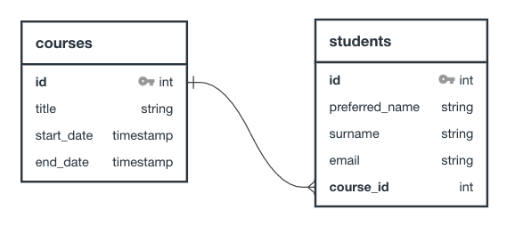
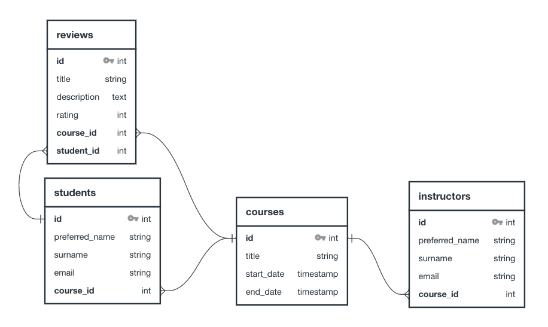
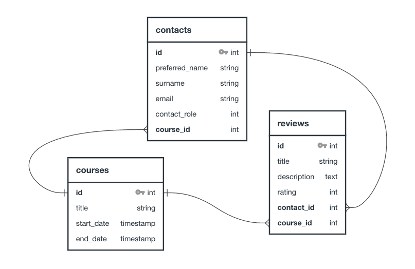

## ERD (Entity Relationship Diagram)

So far, you've been mostly working one or two data models, also known as entities. For example, bookmarks and users. However, when building a production level app there are tens, possibly hundreds of data models and their relationships can be very complex.

In order to design and debug, the ability to draw out the entities and how they relate to one and other becomes a crucial tool.

**Note:** When designing a business case, the data required is often referred to as an entity (for example, users, products etc.) - this tends to be less technical and more big picture-focused. This is in contrast to a data model, which gives the specifics required for the database, this will give exact column names, data types and other details for developers to build out the actual code. In our case of learning the basics, you may see entity and data model used interchangeably.

### Entity relationships

An ERD, as the name suggests, highlights the relationship between multiple entities. This means diagramming how different tables are related in your application.

Each entity is typically represented as a visual table with a header and two columns. The header has the name of the table and each row is made up of a key-value pair where the key is the field name and the value is the data type.

For example, in the image above the following is true:

- The `courses` table has four fields: `id`, `course_name`, `start_date`, and `end_date`.
- The `students` table has five fields: `id`, `preferred_name`, `surname`, `email`, and `course_id`.
- The `courses` table and `students` table have a primary key of `id`.
- The `students` table references the `courses` table through the foreign key, `course_id`.

You will also notice that a line goes from `courses.id` to `students.course_id`. This line represents the relationship between these two entities. The three lines attaching to the `students` table are often called "crows feet" and represent a "many" relationship, whereas the single line near the `courses` table represents "one."

Put simply, this diagram shows that in this database structure it is possible for a course to have many students whereas each student can only be associated with one course.

### Complex applications

Let's keep following this example and imagine we are building an application that will track which class a student is taking and allow those students to make reviews. This application will also keep track of which instructor is assigned to which class. In order to make this application work, we'll need to make the following changes:

- We will need some way to keep track of instructors.
- We will need some way to keep track of reviews. Reviews will be associated with both a student and a course.

In order to make this application's database work, you may come up with the following ERD.

This ERD showcases the following:

- Courses have many students.
- Courses have many instructors.
- Courses have many reviews.
- A student can have many reviews.
- A student has only one course.
- An instructor has only one course.

In looking at these tables, did you notice some duplication? The `students` and `instructors` table is exactly the same. Creating ERDs can make it much easier to see potential duplication like this in advance, as opposed to halfway through building an application.

A refactor of this ERD could produce the following diagram.

In this ERD, students and instructors have been merged into a single table. However, that table now has a new field: `contact_role`. With this role, you could assign a number to represent students and another to represent instructors.

There are other ways you could make changes to this ERD. Ultimately, the right way depends upon the kind of queries you're making in your application as well as the general purpose of your application.

### Other relationships

There are many types of relationships besides a "one-to-many" relationship. Below is a non-exhaustive list of the kinds of relationships between tables.

- No relationship. For example, if a new table was added of `admin_users`, that table may not have any relationship to the existing tables.
- Many-to-many. For example, if you wanted `contacts` to be able to be associated with multiple courses as opposed to just one at a time.
- One and only one. For example, if you wanted a separate `addresses` table to be associated with the `contacts` table, you could set up a relationship where each contact can only have one address and each address can only have one contact.

You will notice if you research ERDs or look at different online tools that the way to mark relationships can vary across apps. You should choose one style when planning an app.

## API Planning

ERD diagrams and low fidelity wireframes are useful on their own but can also be useful for planning an API. By understanding what tables you are planning to have, you can make more thoughtful decision about your API's routes.

For example, in the most recent ERD above, there were three tables: `contacts`, `courses`, and `reviews`. You _could_ immediately plan to make CRUD routes for all of those tables. However, it would make more sense to do the following:

- First, you could look to your wireframes and see what views you are planning to create. You may find out that you actually don't need every CRUD route for every resource. For example, after a review is created, you may actually not want to allow it to be updated.
- Next, you might come up with unique routes depending on the functionality of your application. For example, you may want the ability to create multiple courses at once.

The above steps will reduce the work you have to do in the long run. While it is normal for plans to change while you're in the middle of building an application, planning in advance can save you a lot of time.
