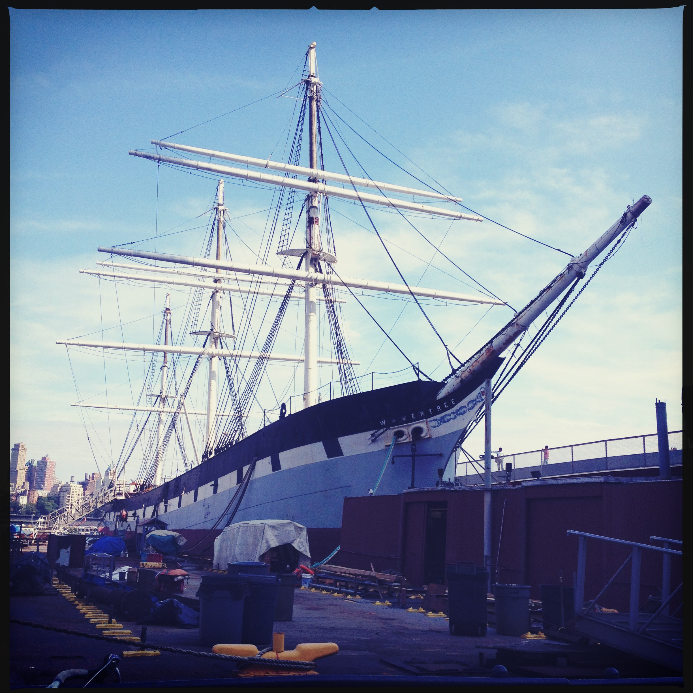

# Wavetree.io

## Where io means indoors/outdoors!

### API Planning Lab - Set Sail on a Code-Free Lab Activity

You'll submit your ERDs to Canvas, so make sure you create them in a way that can be submitted as a web URL (link to a photo of drawings or using a drawing app or an ERD app).

##### DATA-MODELING AND DESIGNING AN API

In this course, we stay indoors, we don't interact with the outside world much, and we jump into stuff without much planning.

Let's try to change one of those things today.

We'll create an ERD (Entity Relationship Diagram) for an outdoor equipment rental business idea.

This activity is recommended to be done in the following way:

- 30 minutes: pairs
  - design your initial ERD
- 20 minutes pair + pair for groups of four
  - compare and contrast with your new partners
  - choose one ERD to build and change
- 10 minutes fours + fours for groups of eight
  - compare and contrast with your new partners
  - choose one ERD to build and change
    etc.

Then when the whole class is together, spend another 10 - 15 minutes talking through each of the different ERDs,

- What are the challenges of building ERDs?

Here is an example of an ERD

[source](https://www.researchgate.net/figure/EERD-of-Telemedicine-Web-Service_fig1_283635381)

Each table is represented as a rectangle, there a multiple lines connecting the tables, which represent relationships

Here is a really nice key (but note, there are a lot of different flavors to these symbols)

[ER Diagrams vs EER Diagrams, what is the difference?](https://cacoo.com/blog/er-diagrams-vs-eer-diagrams-whats-the-difference/)

You can draw one (Your instructor will guide you on which is the best one to do for your class, whether it is online or in person etc.):

- on paper
- on a whiteboard
- with an app

Considerations:

[Enhanced Entity Relationship Diagram](https://www.lucidchart.com/pages/enhanced-entity-relationship-diagram#discovery__top)

Is your data

- Stable? Will it support business needs?
- Has breadth? Can all the data be stored in an organized way?
- Is the model as simple as possible?
- Can it be reorganized (relatively) easily?
- Can both creators and users understand what is going on?

### The Business

#### Outdoor Equipment Rentals

We want to create the api for an outdoor rental business.

Let's think about some the data we may need just to get you started.

As you build out your ERD, you may want to add, remove and change what is here, depending on how you end up visualizing this business

- customers

  - name
  - address
  - membership (trial, single, family, corporate discount)

- store locations

  - address
  - staff
  - equipment on hand

- staff info

  - you've got this!

- rental

  - staffer who made the transaction
  - customer
  - inventory
  - rental start
  - rental end

- equipment
  - type (water, winter etc.)
  - store location
  - is rented?
  - condition (new, excellent, fair - maybe a photo for insurance purposes?)
  - level of insurance required to rent
  - recommended additional equipment (ie if kayak, then life vest, oars, first aid kit, roof rack....)
  - cost to rent
  - how many people to use it (single, pair, group...)
  - experience level (novice, expert)
  - cost to replace
  - brand

Further resources:

- [What is an entity relationship digram?](https://www.visual-paradigm.com/guide/data-modeling/what-is-entity-relationship-diagram/)
