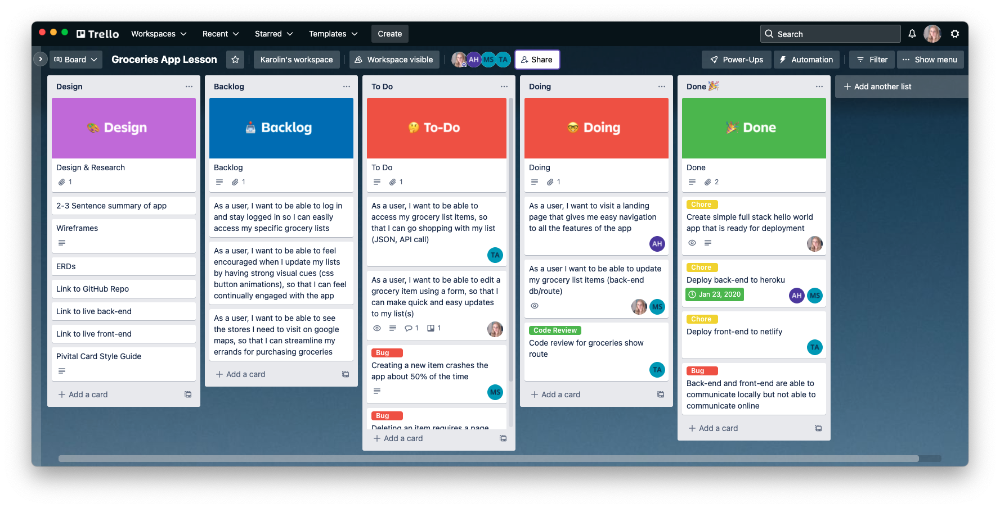
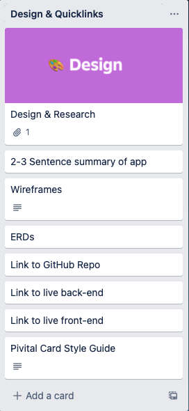
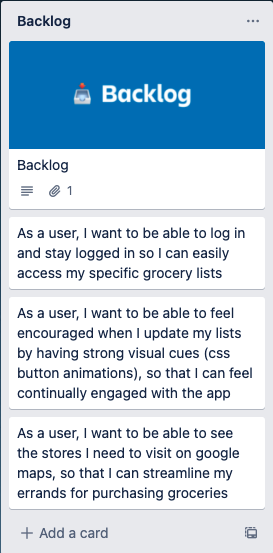
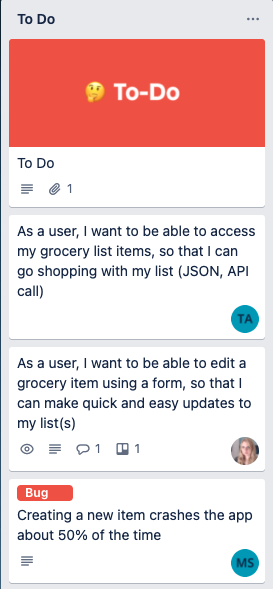
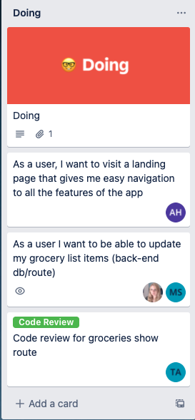
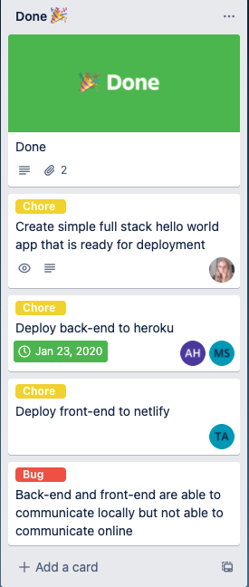
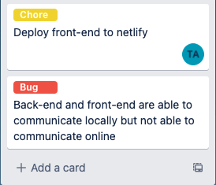
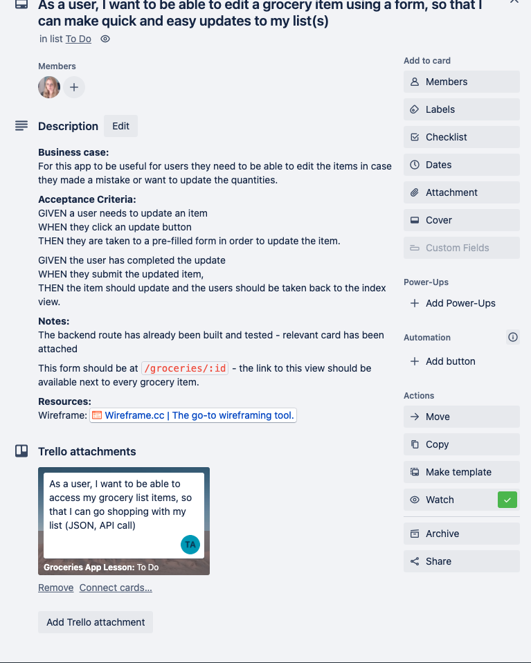
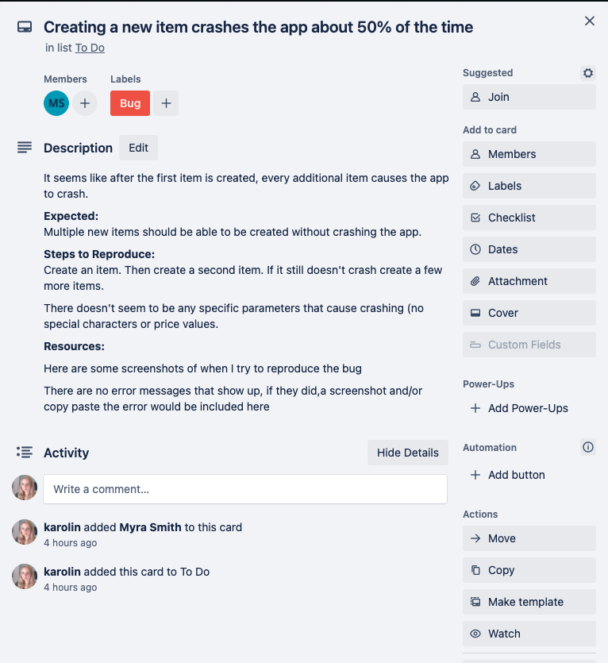
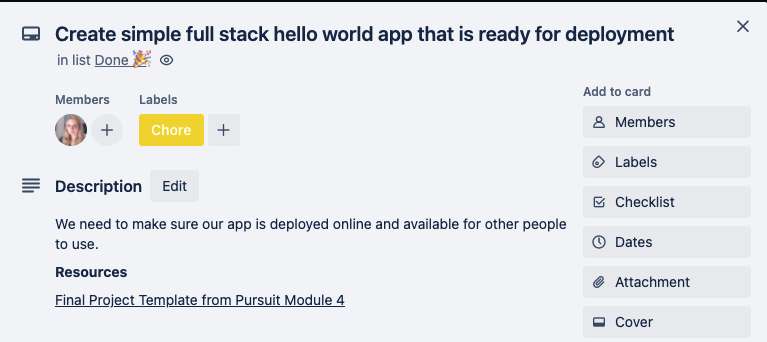

## Building a User-First App

### User Stories

One of the first things you can do to build a great app that people will enjoy using is to write user stories.

User stories are a way to write about one or more features of an app in plain English. They also help non-developer teams understand the features that are being created and can help clarify the purpose behind a feature.

User stories are typically written in the following format:

```
As a <type of user>, I want to <some goal>, so that <some reason>.
```

You can add detail by making the user stories smaller or more specific.

Let's look at a few examples:

- As a customer, I want to see my account balance, so that I know how much money I am able to withdraw.
- As a school administrator, I want to be able to add new students to a school, so that I can start enrolling them into classes.
- As a premium member, I want to be able to see articles without an overwhelming number of advertisements, so that I can focus on reading.

From the lens of the user, it is clear what you can do. From a developer's perspective, it is clear what kind of features need to be built, from a business perspective it is clear what this feature solves. User stories end up being a really clear and easy tool for cross-team discussions.

User stories can also be a way to generate some meaningful conversations. For example, take a look at that first example again.

> - As a customer, I want to see my account balance, so that I know how much money I am able to withdraw.

When first thinking of how to address this user concern, you may just imagine needing to build a view in the application where a user can see their remaining balance. However, read that last part again: "_so that I know how much money I am able to withdraw."_ Instead of a simple balance, perhaps what the user really wants is the ability to know how much they can withdraw in a day.

Conversations like this can help you build more creative, interesting, and helpful features for your users.

### Trello

One tool that can be used for organizing these user stories is [Trello](https://trello.com/). Trello is an app that helps organize the work of big projects. Trello is made up of lists and cards. Cards should primarily be used to put individual user stories.

Putting time into your Trello board (writing the user stories, adding details, frequent updates) helps you communicate with your team and improves your ability to work together. Time invested in Trello may feel like a lot of work up front, but over time it will help your time excel at collaborating.

You will work with 5 lists:

- Design/Quicklinks
  - This is where you should attach links to your Wireframes, ERDs and your brief description of your app - that way everyone can easily find these assets. Later, you'll put these details/assets in the README.md of your app
- Backlog
  - Start by putting all your user stories here. This is a great way to help organize what features are part of MVP (Minimum Viable Product) and what are bonus/stretch features.
- To-Do
  - As a team, discuss which user stories (features) meet MVP and narrow down which user stories will be built during this sprint.\*
- Doing
  - These are the user stories you/your team is currently (actively working on).
- Done

  - These are the completed user stories.

Here is an example Trello Board:



[Getting Started with Trello Docs](https://trello.com/guide)

[How to get started with Trello Video](https://www.youtube.com/watch?v=xky48zyL9iA)

\* A sprint is a short amount of time (1-2 weeks) where the team chooses some features to build, then checks in at the end and then sets up a new sprint with new goals. You will learn more about sprints in an upcoming lesson.

## User Stories => Trello Cards

Convert your user stories into Trello cards. You'll likely need to revise and refine your user stories. This is a normal part of the process.

**Acceptable User Stories/Cards**

- As a user I want to visit a landing page, so that I have access to easy navigation to the site
- As a user, I want to get a list of grocery items (JSON, API call), so I can see my grocery list
- As a user, I want to be able to edit a grocery item through a form, so I can keep my list accurate and up to date

These are specific features that should be easy to check whether the functionality is there or not. They are also small features that are possible to build within a short period of time.

**User Stories/Cards that Need Improvement**

- Users
- Full CRUD on grocery items
- Submit button for Edit one grocery item

The first one is too vague. What does users mean? What kind of functionality? What does a successful implementation look like?

The second one is also vague - is that the front-end? Back-end? Both? How many user stories are in this one card? If this is front and back-end is this a reasonable amount of work for a short period of time?

The final one is too small a task and the feature functionality is unclear. Creating a button is very small and simple. Also, does it imply the ability to edit an item? How is the user interacting with this button?

## Trello Board in More Depth

### Lists

#### Design & Quicklinks

This is a centralized list that should contain links to all the relevant assets of your project. Eventually, most of these assets should be added to a well-written README.md in the GitHub repository of your app.



#### Backlog

This is where all your user stories should be placed at first. These are user stories you'd like to add to your project, but no one is currently working on them/there are no plans to work on them during this sprint.



#### To-Do

As a team, you will agree what everyone will work on during this sprint (short time period, where work will be reviewed and then a new batch of work will be planned).



#### Doing

These are the items your team members are actively working on right now. This should be an accurate reflection of what members are working on. If someone is working on 5 features at once it is likely they are unfocused and trying to juggle too much or not being realistic about what they are getting done.

It is possible that a user story is a collaboration of two or more members and something may be in `to-do` but only one person is working on it at at time. Make sure to talk with your team to clarify how things are progressing.



#### Done

Success! Victory! This list shows tasks that are complete by your team. It's a great way to keep track of all the things you've accomplished.



## Cards in More Depth

Not everything task you'll have to work on is a user story. There are two other common tasks that you can (and should) include in your trello board. You can also use `labels` to denote that they are not user stories:



### User Stories Details

More details should be added to a user story to provide better clarification of the user stories.

Some common categories are

- Business case - clarifying the user story (if needed/not fully clear from user story)
- Acceptance criteria - clarifying the steps the user will take and what should happen
- Notes - anything useful for your teammates to know
- Resources - the associated wireframe or anything else useful to know. In the following example a trello card attachment that has completed the work of the back-end could be useful.



#### Bugs

Bugs are a defect in an existing feature. Bugs should only be fixed. If new features are required, they should be included as new features.

##### Example:

**Bug:**

When purchasing items, the amount purchased adds to the total stock in the warehouse, rather than subtracting it.

**Not a bug, this is a new feature request:**

A user can't see a list of items already purchased

##### Completing the Trello Card for a Bug

When other teammates will look into the issue, they need more information. Bug cards should also include

- A brief description of what is happening
- What is expected to happen
- The steps it takes to reproduce the bug
- Any resources (screenshots, error messages, stack overflow links, documentation links) used so far



#### Chores

These are features that are necessary, but provide no direct and obvious value to the user. For example: Passwords should be encrypted.

##### Completing the Trello Card for a Chore

A further description and any resources available should be provided for chore cards


