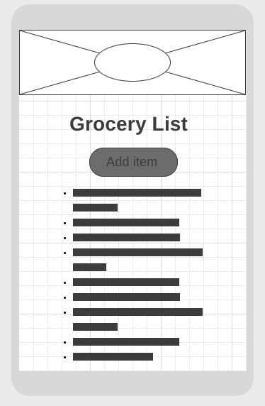

## Wireframes

Wireframes are a simple sketch of your app, usually done on paper or with an app. The wireframe lays out the different components and gives their approximate size and location. Wireframes let all stakeholders agree on where information and visuals will be placed before developers begin building the interface.

Typically a designer or product owner would create these wireframes as opposed to a software developer. However, when building your own applications you will need to do this on your own.

Each page of your app should have a wireframe. You can plan your app a little further by also associating a route with each view.

### Types of Wireframes

There are roughly three levels of wireframe:

- Low fidelity: these are just a black and white sketch with almost no details (see below)
- Medium fidelity: these have more details, including styling and colors
- Mockup: this is a full-fledged design with many specific details

For applications you are building, you are only expected to create low fidelity wireframes.

#### Low fidelity wireframe example

This wireframe has the following elements:

- A heading that has a background image (i.e. box with an x through it)
- A logo on top of the box (i.e the circle on top of the image)
- A header that identifies what the user is looking at
- A button to add an item
- A bulleted list that represents a list

This wireframe is a good start to a single page. However, consider what happens when the user presses the add item button:

- Does a pop up appear?
- Does it take the user to a new page?
- Does the form replace the title and button and on submit revert back?
- Where does the new item appear? At the top of the list or the bottom? Or are things always sorted in a specific way?

You have a lot of design decisions like this to make. Again, it is best to figure them out before coding is started.

### Templates

One thing to also consider when making your designs is if you would like to follow a template. That would mean that you create the 'outer' elements that will be reused on every page. Design elements like the header, footer and navigation are things you often want to appear on every page.

When building your wireframes, think about building views that follow a similar pattern and reuse components from one page to the next.

## Further Your Understanding

Watch an expert draw and refine some wireframes in order to get a better understanding of the process [here](https://youtu.be/qpH7-KFWZRI).
