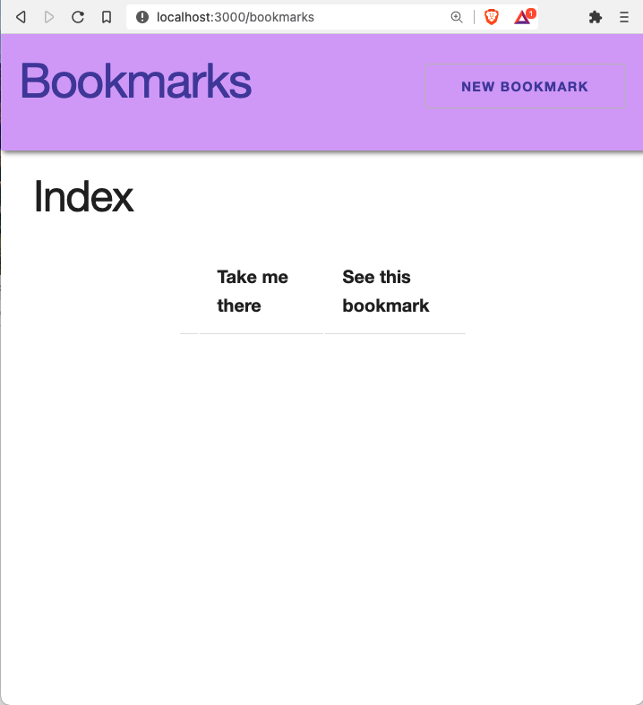

# Express Connect React

## Learning Outcomes

- Be able to connect a create-react-app to an express backend
- Be able to describe all 7 RESTful Routes
- Be able to set a base URL, that can be easily updated, depending on environment
- Be able to describe why an easily updated URL is useful
- Be able to view an index route with data from the express API
- Be able to describe what is CORS and why the default is to block cross-origin requests

## Intro

By now we have a nicely working back-end with full CRUD using express. Unfortunately, it isn't the best user experience for non-developers. We need to build a front-end.

## The Seven RESTful Routes

The seven RESTful routes are often the classic example of a RESTful pattern. Every `GET` request must have a view. Therefore, we have some new views we must make for our users. For example: Users must be able to see a form in order to make a new bookmark/access the `update` route.

While this pattern is classic and we will follow it exactly for learning fundamentals, you will see many variations in the wild. These variations are to meet specific needs of functionality and/or to improve user experience.

We have built the first 5 routes in Express:

|  #  | Action  |      URL       | HTTP Verb |    CRUD    |              Description               |
| :-: | :-----: | :------------: | :-------: | :--------: | :------------------------------------: |
|  1  |  Index  |   /bookmarks   |    GET    |  **R**ead  | Get a list (or index) of all bookmarks |
|  2  |  Show   | /bookmarks/:id |    GET    |  **R**ead  | Get an individual view (show one log)  |
|  3  | Create  |   /bookmarks   |   POST    | **C**reate |            Create a new log            |
|  4  | Destroy | /bookmarks/:id |  DELETE   | **D**elete |              Delete a log              |
|  5  | Update  | /bookmarks/:id |    PUT    | **U**pdate |              Update a log              |

<br />

The next four are ones that we will build in our front-end:

|  #  | Action |         URL         | HTTP Verb |   CRUD   |              Description               |
| :-: | :----: | :-----------------: | :-------: | :------: | :------------------------------------: |
|  1  | Index  |     /bookmarks      |    GET    | **R**ead | Get a list (or index) of all bookmarks |
|  2  |  Show  |   /bookmarks/:id    |    GET    | **R**ead | Get an individual view (show one log)  |
|  3  |  New   |   /bookmarks/new    |    GET    | **R**ead |  Get a form to create a new bookmark   |
|  4  |  Edit  | /bookmarks/:id/edit |    GET    | **R**ead |    Get a form to update a bookmark     |

Which two are new and which ones have we built with express?

## Getting Started

- Go to your bookmarks app and get it started with `nodemon`
- Open a new tab in terminal <kbd>command</kbd> <kbd>t</kbd>, do not shut down your bookmarks app
- Note: if you end up having a lot of extra data from testing, just restart your express API (restart nodemon)
- Fork this [Starter code](https://github.com/joinpursuit/bookmarks-react-starter)
- `git clone` the forked repository
- `cd` to the directory where you cloned it
- `npm install` to install dependencies that are already included in the `package.json`
- `touch .env`

**.env** (Details below)

```
REACT_APP_API_URL=http://localhost:3003
```

(or whatever port your bookmarks api is on)

- `npm start`

### Landing Page/Index

<details><summary>Landing Page</summary>


</details>

Let's click on `Bookmarks` in the navigation to go to `/bookmarks`

<details><summary>Index Page Empty</summary>



</details>

We can see that we have a view for our index page. But, we need to connect this app to our back-end.

We can also go to:

- http://localhost:3000/bookmarks/1 to see an empty show page
- http://localhost:3000/bookmarks/1/edit to see an empty edit page

We can do so using `axios` much like we did when we were using third party APIs.

## Setting Up the App to Make Requests

### The Base URL

Before we get started, we have to think about a problem we are going to have. If we hard code `http://localhost:3003` into our react app, when we change it to be hosted online, we would have to go in to our app and change every single instance of `http://localhost:3003`. Further, if we decide to host our app on another service, we would have to go in and change it again. If we are working on our app locally (usually described as a development environment) and having it available online (usually described as a production environment), we would spend a lot of time switching the URLS back and forth.

We would rather have the right URL depending on our situation set and we would like to include it just in one place, so we only have to update it one place if it changes.

There are a few ways to do this, and depending on the goals (amount of safety, other app features). As you build different apps, you may see different approaches.

We are going to use create-react-app's way of setting up these variables.

- Create a `.env` on the same level as `package.json`
- Start all variable names with `REACT_APP_`
  - `REACT_APP_API_URL` or `REACT_APP_MY_VAR` are acceptable names
  - `React_App_My_Var` is NOT going to work

We should have done this as part of our set up, earlier.

**src/Components/Bookmarks.js**

At the top:

```js
const API = process.env.REACT_APP_API_URL;
```

Confirm it is working

```js
console.log(API);
```

Remove this console log, once you have confirmed the value.

## Getting Data from the API

### Adding Axios

- open another tab in terminal for your create-react-app so you can keep your react app running.
- `npm install axios`

**src/Components/Bookmarks.js**

At the top :

```js
import axios from "axios";
```

Inside the `Bookmarks` function, add `setBookmarks` so we can update the state when `bookmarks` changes.

```js
const [bookmarks, setBookmarks] = useState([]);
```

### Loading the Bookmarks Index on Page Load

With React, we sometimes have to think about _when_ things happen. For us, we want to make an API call to get our data AFTER the component has been fully loaded (mounted in the DOM) and then update state.

If we made the API call first and the DOM was not fully loaded and state was updated first, we would risk not seeing our data, even though the API call was successful.

Throughout the rest of this module, we'll be using React Hooks for state management, instead of react classes.

React has a built-in function called `useEffect` that is going to control _when_ the functions inside are called.

This is where we are going to add our initial API call in order to get all the bookmarks.

- Make a `get` request using axios. `then` when there is a `response`, do something. In our case, we want to update state using hooks by using the `setBookmarks` that was declared at the beginning of the `App` component. The state will be updated to be our array of bookmark objects.

**BONUS:** Promises or async/await? Which one should we use? It is this author's preference to [Use what the docs recommend](https://axios-http.com/docs/api_intro), in this case, axios uses promises. You will likely find different style guides based on where you are employed. Also, best practices change over time. Learning and practicing the syntax of promises and async/await is as good idea.

**src/Components/Bookmarks.js**

Note: Make sure this code is before the `return` statement

`useEffect` takes two arguments, the first is a callback, the second is an array. The callback takes in the code to execute, the array is the dependency array: this is where you store variables that `useEffect` should watch, when there are changes to these variables, the component should be rerendered.

Let's add `useEffect` to the component. Update the line that imports `useState`

```js
import { useState, useEffect } from "react";
```

```js
useEffect(() => {}, []);
```

Let's make a get request

```js
useEffect(() => {
  axios.get(`${API}/bookmarks`);
}, []);
```

Once the request is complete, `then`, what should happen?

`.then()` takes two arguments. Both callback functions

```js
.then(()=> {}, ()=>{})
```

The first is executed when the promise is fulfilled (in our case, a successful response from the server).

The second is executed if the promise is rejected (in our case some error with our fetch request).

We can, instead, add a `.catch()` - this will be the final error handling of our fetch request.

**BONUS** [Take the time to compare and contrast](https://developer.mozilla.org/en-US/docs/Web/JavaScript/Guide/Using_promises)

While we don't need error handling for our app to work, it is very helpful for debugging and also writing some code that would notify users that something has gone wrong.

```js
.then((response)=> {})
.catch((error)=> {})
```

Let's put it together with `useEffect` and `axios`

Try to build from the outside in, instead of left to right. Add the callback.

```js
useEffect(() => {
  axios.get(`${API}/bookmarks`).then(() => {});
}, []);
```

The thing we are waiting on is the response. The response has a lot of extra information, we only need the bookmarks data. Compare and contrast the info given in the two console logs:

```js
useEffect(() => {
  axios.get(`${API}/bookmarks`).then((response) => {
    console.log(response);
    console.log(response.data);
  });
}, []);
```

We want to set the `bookmarks` in or component to be our response data

```js
useEffect(() => {
  axios.get(`${API}/bookmarks`).then((response) => {
    setBookmarks(response.data);
  });
}, []);
```

Add error handling:

```js
useEffect(() => {
  axios
    .get(`${API}/bookmarks`)
    .then((response) => setBookmarks(response.data))
    .catch((e) => console.error("catch", e));
}, []);
```

**Uh Oh!** We found a ~~bug~~ feature!


Our React app is making a request from a different origin than where our API is running. This is a great security feature! By default, requests coming from other origins are not allowed.

However, we want to allow our React app to make requests to our API.

We will have to go to our express api in order to set up this allowance.

#### Express API

**terminal**

- `npm install cors`

**app.js**
Near the top

```js
const cors = require("cors");
```

**near `app.use(express.json())`**

```js
app.use(cors());
```

This will allow ANY app to make requests to your API. Since we are just building a sample app and not hosting it online, we don't have to worry about restricting it right now. Later, when you have your app deployed in the cloud, you would want to be more thoughtful about how to properly allow/restrict access.

**Success:**

<details><summary>Index Page Loaded</summary>


</details>

<br />

### One More Thing

Our app is going to show more data than what we have in our mock database.

In our express app let's update to these values:

**models/bookmarksArray.js**

```js
module.exports = [
  {
    name: "MDN",
    url: "https://developer.mozilla.org/en-US/",
    isFavorite: true,
    category: "educational",
    description: "",
  },
  {
    name: "Apartment Therapy",
    url: "https://www.apartmenttherapy.com",
    isFavorite: true,
    category: "inspirational",
    description: "",
  },
  {
    name: "DMV",
    url: "https://dmv.ny.gov",
    isFavorite: false,
    category: "adulting",
    description: "",
  },
];
```


## NEXT:

[The Rest of the Routes](./README2.md)
