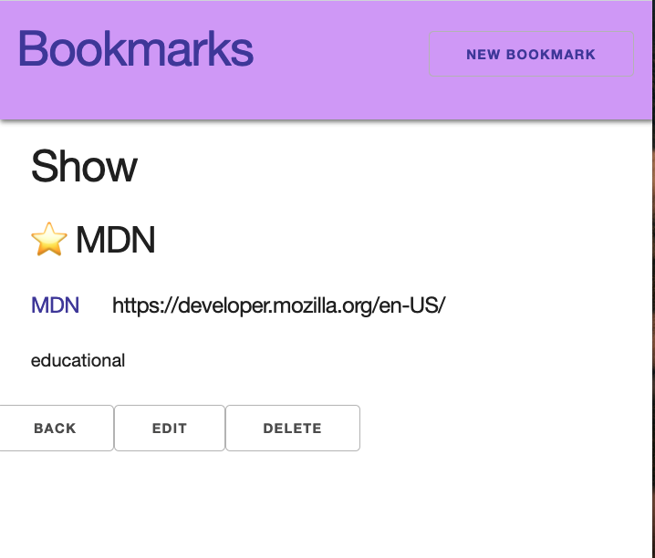
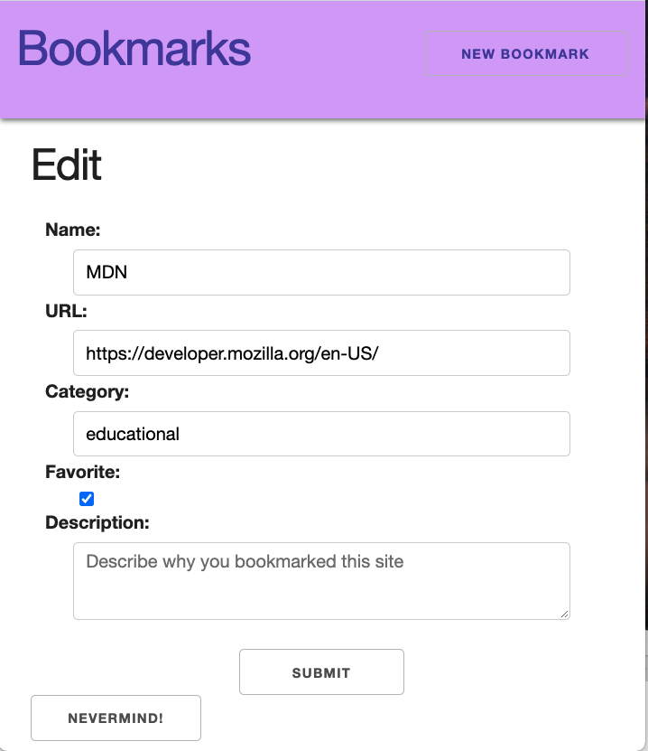

# Express Connect React

## Learning Outcomes

- Complete the remaining RESTful Routes
  - Show
  - New
  - Edit
  - Delete

## Continue

So far, we have added functionality to our React app to complete requests and get responses for Index.

Let's get the Show page, New, and Edit forms working

|  #  | Action |         URL         | HTTP Verb |   CRUD   |              Description               |
| :-: | :----: | :-----------------: | :-------: | :------: | :------------------------------------: |
|  1  | Index  |     /bookmarks      |    GET    | **R**ead | Get a list (or index) of all bookmarks |
|  2  |  Show  |   /bookmarks/:id    |    GET    | **R**ead | Get an individual view (show one log)  |
|  3  |  New   |   /bookmarks/new    |    GET    | **R**ead | Get a list (or index) of all bookmarks |
|  4  |  Edit  | /bookmarks/:id/edit |    GET    | **R**ead | Get an individual view (show one log)  |

### Loading a Bookmark on Page Load (Show Page)

If we click on the `pencil` it will take us to our show view in our React app.

<details><summary>Show Page Empty</summary>


</details>

Let's request one bookmark from our API from the show page.

**src/Components/BookmarkDetails.js**

At the top:

```js
import axios from "axios";
```

```js
const API = process.env.REACT_APP_API_URL;
```

We are also using `useParams` from react-router-dom. This will allow us to use the url parameters (in our app, this will be the index position of the array)

Our function for show will be very similar. However, we'll add an error message in case the particular bookmark cannot be found. We'll got to `/not-found` which is an invalid index position, which will trigger the 404 route. It still could use even better UI/UX, but this will do for our small build. As a challenge during lab you can work on making this an even nicer experience.

Remember, the structure of the `.then()` function takes a callback.

First, it starts with a promise. The axios library functions `get`, `post`, `put`, `delete` (etc) are all functions that return promises.

A promise is a function that allows you to _WAIT_ for a response and _THEN_ do something. The .`then()` function takes a callback, within that callback you can write code that should run AFTER the first function has been fulfilled (usually by returning a value).

If you pass an argument into `.then()`, it is the return value from the previous function.

Sometimes, things go wrong (for example, your server is not running), in that case, we add a `.catch()` function which will deal with errors that may occur.

```js
.catch(()=>{})
```

Additionally, if the function only has one line of code, the curly braces can be skipped and the code can be shortened to:

```js
.then(response => response.data)
```

However, this style is very limiting, we can't add any extra lines of code easily. Se we'll write out the request in a a longer format that is easier to maintain.

### Hooks vs React Stateful Class Components

If you've worked with array classes you would write

```js
// Declare state, where you can add more properties
// Set default value of this.state.bookmarks to be an empty array
this.state = {
  bookmarks: []
}

updateBookmarks () {
  // Do some stuff
  // ...
  // Update state:
  // use generic this.setState() function, inside the function set which property will be updated
  this.setState({bookmarks: ["This array is updated"]})
}
```

With hooks, it does the same thing, but in a cleaner, more readable way.

```js
// Declare state for bookmarks only. If you want to add more properties, you would create a new line and call useState() again.
// Set default value bookmarks to be an empty array
// Set the name of the funciton that will be in charge of updating bookmarks
const [bookmarks, setBookmarks] = useState([]);

updateBookmarks() {
  // Do some stuff
  // ...
  // Update state:
  // Use the function you created and named to update just bookmarks, if you have other properties to update, you would call their specific functions as well
  setBookmarks(["This array is updated"]);
}
```

### Add a Way to Update State

**src/Components/BookmarkDetails.js**

Inside the `BookmarkDetails` function, update the line of code to be:

```js
const [bookmark, setBookmark] = useState([]);
```

Add useNavigate so we can use the browser's [useNavigate api](https://reactrouter.com/docs/en/v6/api#navigation)

Let's fetch one bookmark based on the index position. If the index position is invalid or not found, it will trigger the error callback, in which case, we will send the users to the 404 page.

```js
useEffect(() => {
  axios.get(`${API}/bookmarks/${index}`).then((response) => {
    setBookmark(response.data);
  });
}, [index]);
```

```js
import { Link, useParams, withRouter, useNavigate } from "react-router-dom";
```

Inside the `BookmarkDetails` function

```js
let navigate = useNavigate();
```

```js
useEffect(() => {
  axios
    .get(`${API}/bookmarks/${index}`)
    .then((response) => {
      setBookmark(response.data);
    })
    .catch(() => {
      navigate("/not-found");
    });
}, [index, navigate]);
```

<details><summary>Show Page Loaded</summary>



</details>

<br />

## Using the Create Form to Create a new Bookmark

<br />

When we think of our users, they want to create a bookmark and then want to see some sort of success that their bookmark has been created. So the flow will be:

- A user fills out the create form
- Presses the submit button
- Submit sends a post request to the express API
- Upon successful request, we'll redirect the user back to the index view, where they will see their bookmark added as the last item
- If there is an error, there will be a message in the console (again, during lab time, you can build a component/use conditional rendering to provide a better user experience, we won't do this in the interest of time)

**src/BookmarkNewForm.js**

Add axios for fetch request

```js
import axios from "axios";
```

Add the URL for the API

```js
const API = process.env.REACT_APP_API_URL;
```

Add `useNavigate` so that when a new bookmark is created it navigates back to the index page

```js
import { useNavigate } from "react-router-dom";

const navigate = useNavigate();
```

There is a function `handleSubmit`. This is the function that gets called when the form is submitted. 

First, we must prevent the default. When the form does not have the attributes of `action` and `method`, it will default to refreshing the page. 

After that, we want to write some functionality that will make a POST request and send the form data to our backend. THEN, once the request is complete, we want to navigate the user back to the Index page so that they can see that their new bookmark has been added. 

Put it all together

```js
const addBookmark = (newBookmark) => {
  axios
    .post(`${API}/bookmarks`, newBookmark)
    .then(
      () => {
        navigate(`/bookmarks`);
      }
    .catch((c) => console.error("catch", c));
};
```

<br>

### Using the Edit Form to Update a Bookmark

The edit form is very similar to the create form. However, for better user experience, it should be pre-filled with the values, rather than requiring the user to type everything from scratch.

**src/Components/BookmarkEditForm.js**

At the top:

```js
import axios from "axios";
import { useParams, Link, useNavigate } from "react-router-dom";
const API = process.env.REACT_APP_API_URL;

// inside BookmarkEditForm function
const navigate = useNavigate();
```

```js
useEffect(() => {
  axios
    .get(`${API}/bookmarks/${index}`)
    .then((response) => {
      setBookmark(response.data);
    })
    .catch((e) => console.error(e));
}, [index]);
```

Now, your form should be pre-loaded with the bookmark data.

<details><summary>Edit Form Loaded</summary>



</details>

Let's add the functionality to set a PUT request and update our API. Then we'll have the user return to the show page of the item they updated.

```js
const updateBookmark = () => {
  axios
    .put(`${API}/bookmarks/${index}`, bookmark)
    .then((response) => {
      setBookmark(response.data);
      navigate(`/bookmarks/${index}`);
    })
    .catch((c) => console.warn("catch", c));
};
```

Call updateBookmark inside `handleSubmit`

```js
const handleSubmit = (event) => {
  event.preventDefault();
  updateBookmark();
};
```

## Adding Delete Functionality

For delete, we can just add the functionality on the show page. No separate page is needed.

**src/Components/BookmarkDetails.js**

```js
const handleDelete = () => {
  axios
    .delete(`${API}/bookmarks/${index}`)
    .then(() => {
      navigate(`/bookmarks`);
    })
    .catch((e) => console.error(e));
};
```

## Summary

We have now created a full CRUD full-stack application, using an express backend and a create-react-app front end. We utilized all 7 RESTful routes.
