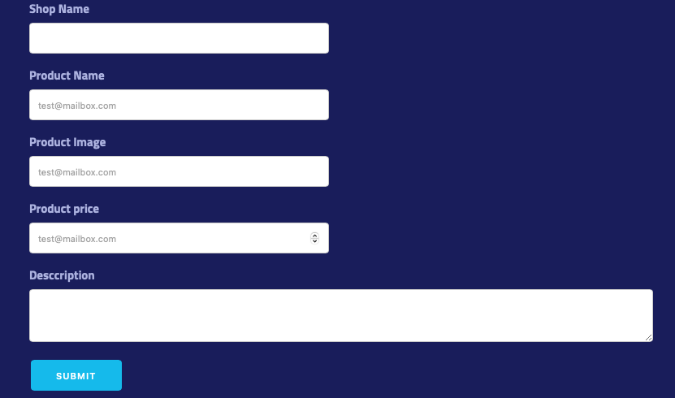
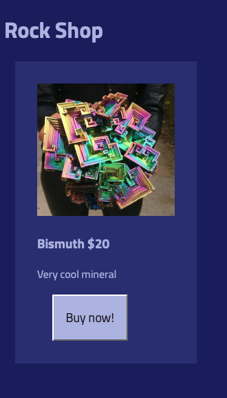

# Express CRUD/MVC

## Intro

Let's take a moment to think about a web site like Etsy. Etsy has thousands of shops and millions of products.

When a shop owner decides to sell a new product, they just enter the data about the new product: name, price, image(s), description etc. And almost immediately, a new web page appears!

How is this happening? Etsy doesn't have a bunch of devs sitting around at the ready to hand roll a new web page. Rather, the developers build an HTML template and then, based on data provided **embed** (insert) the data into the HTML

Let's look at an example - this is some data provided by an etsy shop owner through an online form:



When the owner presses the `submit` button. The browser will send a `request` to a server. The server will save the data in a database. We can imagine the data looks something like this:

**DEMO, do not code**

```js
{
    name: 'Bismuth',
    price: 20,
    image: 'bismuth.png',
    description: 'Very cool mineral',
    shopName: 'Rock Shop'
}

```

The server will `respond` with some sort of confirmation that the `request` went through successfully, or will provide an error message.

Then, when the owner wants to see the product. The owner will make a `request` to see the product in the browser. There will be a `response` that will involve some logic to **embed** the data inside HTML:

**DEMO, do not code**

```html
<h1>{rock.shopName}</h1>
<div class="card">
  
  <h3><span>{rock.name}</span> {rock.price}</h3>
  <p>{rock.description}</p>
</div>
```

And then it gets rendered in the browser:



There are four main things to do with data: **C**reate, **R**ead, **U**pdate, and **D**elete. In the above case, a user created some data, and then read the newly created data. We can imagine at some point the user may want to update the price or delete the item altogether.

We're going to be building a webpage bookmarks app. It's going to be a very simple app which will teach the fundamentals of building an API with express. Later, we'll add a react front-end to consume the API. Finally, we'll learn about databases and integrate a database into our simple app.

Once we have our fundamentals down, we can start building more complex apps with real world applications.

## Getting Started

We are going to be building this app over several sessions, so let's make sure we put it on github and commit often!

- navigate to your Desktop or other convenient folder
- `git status` to make sure you are not already in a `git` repository
- `mkdir bookmarks`
- `cd bookmarks`
- `touch server.js`
- `npm init -y` (this will automatically say yes to all the npm default settings - this is fine for tutorials, small test builds, etc.)
- `touch .gitignore` (tell git which files to ignore)
- `touch app.js`
- `touch .env`
- `npm install express dotenv`

**.gitignore**

```
node_modules
.env
.DS_Store
```

**.env**

```
PORT=3003
```

**app.js**

```js
// DEPENDENCIES
const express = require("express");

// CONFIGURATION
const app = express();

// ROUTES
app.get("/", (req, res) => {
  res.send("Welcome to Bookmarks App");
});

// EXPORT
module.exports = app;
```

**server.js**

```js
// DEPENDENCIES
const app = require("./app.js");

// CONFIGURATION
require("dotenv").config();
const PORT = process.env.PORT;

// LISTEN
app.listen(PORT, () => {
  console.log(`Listening on port ${PORT}`);
});
```

Test that your app works: http://localhost:3003

## Software Architecture: MVC

The apps we are building in class are very small. Even with our small apps it can be very easy to get lost in our code. Where did we create a certain function? What file is displaying what we see in the browser? Organizing and maintaining code is quite challenging!

Our problems are a microcosm of an app that is years old that have had tens or possibly hundreds of developers work on it. Therefore, developers who are far more experienced have worked on creating conventions, frameworks, styles and patterns that are easy to maintain, collaborate and reuse.

**Bonus:** [Read more on software architecture](https://en.wikipedia.org/wiki/Software_architecture)

We are going to be loosely following a very common software design pattern called [MVC](https://en.wikipedia.org/wiki/Model–view–controller): Model-View-Controller.

This allows developers to separate the concerns of the data, the view and the controller.

A common metaphor for this is a restaurant. Imagine that a customer coming in and sitting down interacts with the menu and dishes (views). There is a chef in the back that takes the orders and makes food (models). Finally, there is a server that goes between the two (controller).

Everyone in the restaurant has a clear idea of what they are responsible for, otherwise the restaurant likely would not succeed. Imagine if the customers could at any moment go in the back and start cooking or the servers stopped ringing up orders!

Even though there is a common pattern for a restaurant, there are many variations, like buffets, drive-through and more. A pattern is a recommendation, not a rule.

So let's get back to our application. We are going to have a place for our models (data), our views (what users will see in the browser) and the controllers (logic between the two).

In terms of code, we will have a folder called `models`, a folder called `controllers` and while it is possible to have a `views` folder (and there are many applications that use this folder), we are going to be serving our views not from inside our app, but with a separate react app.

**NOTE:** With ExpressJs, you are free to name your files and folders whatever you want. If you want to name your `controllers` folder `asdf` and your `models` folder `batman` - you can. However, no one will understand how your code is organized with names that don't make sense/are note semantic.

Because ExpressJS is unopinionated, you will likely see a variety of names for different files. For example, when it comes to controllers, you may see:

- birdController.js
- birdsController.js
- birds.js
- birds-controller.js
- birds-controllers.js
- birds.controller.js

When you join a company, they will have chosen a naming strategy and you should follow it. Within your own work, your naming should be consistent within each project.

As this curriculum is being built and improved, it can be obvious that it was initially built without concensus on naming conventions. The curriculum is slowly being updated to follow conventions. By building before planning and agreeing as a company, this curriculum generated something called `technical debt` (choosing to deliver work A.S.A.P and deciding to fix things later), where every individual contributing chose the style they liked. Any project will typically have some technical debt. However, over time, technical debt makes things harder to maintain and can generate a lot of additional work. Notice your own experience using the materials here and take a moment to think about how consistency would likely improve your experience, then try to carry this knowledge with you into your future proejcts. 

## Demonstrating the Working Application

[Demo on YouTube](https://youtu.be/-FrpZpGk82c) - We will be working with an app called Postman in order to be able to make all of our requests. By the end of this multi-day build, your app will allow you to:

- See a list (array) of all the bookmarks (**R**ead: `index`)
- See a single bookmark (**R**ead: `show`)
- **C**reate a new bookmark
- **U**pdate a bookmark
- **D**elete a bookmark

## Set Up Models

We're just going to have one model, with four values:

- name: string
- url: string
- isFavorite: boolean
- category: string

We can open a new tab in terminal, so we can keep nodemon running while we add these extra files: <kbd>command</kbd> <kbd>t</kbd>.

- `ls` - confirm you are in the same directory as `package.json`
- `mkdir models`
- `touch models/bookmark.js`

and then copy paste this into

**bookmark.js**

```js
module.exports = [
  {
    name: "MDN",
    url: "https://developer.mozilla.org/en-US/",
    isFavorite: true,
    category: "educational",
  },
  {
    name: "Apartment Therapy",
    url: "https://www.apartmenttherapy.com",
    isFavorite: true,
    category: "inspirational",
  },
  {
    name: "DMV",
    url: "https://dmv.ny.gov",
    isFavorite: false,
    category: "adulting",
  },
];
```

**Thought question:** What does `module.exports` do? What happens if we forget to add it? What kind of error will we get?

## Set up Controllers

With our simple app, making folders with single files seems a bit over-engineered. However, it will be worth it, because our goal is to build good organizational habits.

Our controllers are going to handle the routes. It's quite common to make a separate file and group similar controllers together. Express makes it easy to set it up.

All of our routes related to our bookmarks are going to be starting with `/bookmarks`. We are going to name our `express.Router()` variable `bookmarks` to help us remember that this is base of the route. Let's code to understand it better:

- `ls` - confirm you are in the same directory as `package.json`
- `mkdir controllers`
- `touch controllers/bookmarksController.js`

**controllers/bookmarksController.js**

```js
const express = require("express");
const bookmarks = express.Router();
const bookmarksArray = require("../models/bookmark.js");

bookmarks.get("/", (req, res) => {
  res.json(bookmarksArray);
});

module.exports = bookmarks;
```

We are using `res.json` instead of `res.send`, since we are sending `json` instead of a simple string.

In `app.js` we have to connect our controllers for `bookmarks`.

First, we'll require the file.

Then we'll use `/bookmarks` as the base of the routes, like so:

**app.js**

```js
const bookmarksController = require("./controllers/bookmarksController.js");
app.use("/bookmarks", bookmarksController);
```

Now, we should be able to go to http://localhost:3003/bookmarks and see our JSON

## Error Handling

Let's add a 404 route. It should be below all the other routes.

**app.js**

```js
// 404 PAGE
app.get("*", (req, res) => {
  res.json({ error: "Page not found" });
});
```

Test it http://localhost:3003/nothing_here

When we open up our Chrome Dev Tools and go to the `Network` tab, we can see that this file loads with an http status of [304](https://http.cat/304) or [200](https://http.cat/200)

But because this is a 404 [page not found](https://http.cat/404), we should make sure we are sending through the correct status code.

```js
// 404 PAGE
app.get("*", (req, res) => {
  res.status(404).json({ error: "Page not found" });
});
```

## Lab Time!

[Express Fitness](https://github.com/joinpursuit/express-fitness) - During lab, you'll be building an app that has similar functionality as the one we are building in class. This lab will span several sessions.

If you already have had experience with express or another back-end, you may find the first few activities going by quite quickly.

You are encouraged to work on
[Express UFO](https://github.com/joinpursuit/express-ufo) this is a far more challenging activity that will help you sharpen your express and JavaScript skills.
