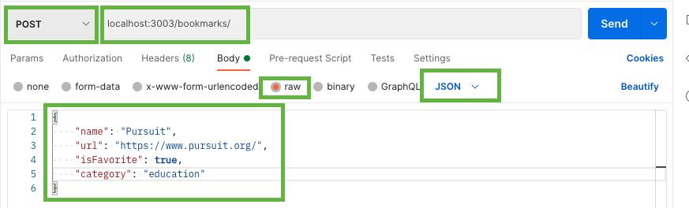

# Express RESTful Routes: Update & Delete

## POSTMAN

Even though the command line is powerful and you can do amazing things like this: `curl -s -L http://bit.ly/10hA8iC | bash` ( <kbd>control</kbd> <kbd>c</kbd> to cancel it), it can end up being a LOT of typing, especially when one wants to thoroughly test a back-end.

So, some developers got together and built a GUI (Graphical User Interface) to allow developers to test their back-ends.

If you haven't already, [download Postman](https://www.postman.com/downloads/)

Once you open the app, it will ask you to log in. However, if you look very carefully, you can find a `skip` option in tiny letters.

Postman is a very robust tool with a lot of functionality. We'll just be using it in a very simple way for now, and we'll learn a bit more useful things as we keep building out our app.

- Optional: Create a new collection - this will help you save a series of requests that you can name and add details, but it is not necessary.

## Test Current Routes

|  #  |   Action   |      URL       | HTTP Verb |    CRUD    |                Description                 |
| :-: | :--------: | :------------: | :-------: | :--------: | :----------------------------------------: |
|  1  | **Create** |   /bookmarks   |   POST    | **C**reate |           Create a new bookmark            |
|  2  | **Index**  |   /bookmarks   |    GET    |  **R**ead  |   Get a list (or index) of all bookmarks   |
|  3  |  **Show**  | /bookmarks/:id |    GET    |  **R**ead  | Get an individual view (show one bookmark) |

## Index


- Set the option to `GET`
- Enter the URL for your bookmarks URL for the index (eg http://localhost:3003/bookmarks)
- Press `SEND`

Below, you should see the response

## Show One

- Set the option to `GET`
- Enter the URL for your bookmarks URL for one bookmark (eg http://localhost:3003/bookmarks/1)
- Press `SEND`

## Create



- Update the option to `POST`
- Change the url back to http://localhost:3003/bookmarks
- Choose `body`
- Choose `raw`
- Select `JSON`
- In the text area create a proper JSON object (double quotes around all the key and value pairs, no trailing commas )

```js
{
    "name": "Pursuit",
    "url": "https://www.pursuit.org/",
    "isFavorite": true,
    "category": "education"
}
```

Press send. The way our API works is that it should return us back to the GET route and we should see all our bookmarks, including our newest one at the bottom. **Thought question:** how could we update our API to show the newest item as the first item in the array?

## Delete

| Action  |      URL       | HTTP Verb |    CRUD    |    Description    |
| :-----: | :------------: | :-------: | :--------: | :---------------: |
| Destroy | /bookmarks/:id |  DELETE   | **D**elete | Delete a bookmark |

Let's add delete functionality. Again, this functionality will only be available to us via form. So we'll use Postman to test it.

We are going to use the index position of the array item and we will splice out the deleted item, which will remove the item at that array position. Then, we will send the deleted bookmark back.

```js
// DELETE
bookmarks.delete("/:indexArray", (req, res) => {
  const deletedBookmark = bookmarkArray.splice(req.params.indexArray, 1);
  res.status(200).json(deletedBookmark);
});
```

### TEST WITH POSTMAN

- Update the option to `DELETE`
- Change the url back to http://localhost:3003/bookmarks/0
- send

You should see the updated bookmarks array without the item that was in array position 0

Let's add some error handling

```js
// DELETE
bookmarks.delete("/:indexArray", (req, res) => {
  if (bookmarkArray[req.params.arrayIndex]) {
    const deletedBookMark = bookmarkArray.splice(req.params.indexArray, 1);
    res.status(200).json(deletedBookMark);
  } else {
    res.status(404).json({ error: "Not found" });
  }
});
```

## Update

| Action |      URL       | HTTP Verb |    CRUD    |    Description    |
| :----: | :------------: | :-------: | :--------: | :---------------: |
| Update | /bookmarks/:id |    PUT    | **U**pdate | Update a bookmark |

We will take the array position of the item we want to update. We will set the value to be the incoming `req.body`

```js
// UPDATE
bookmarks.put("/:arrayIndex", (req, res) => {
  bookmarkArray[req.params.arrayIndex] = req.body;
  res.status(200).json(bookmarkArray[req.params.arrayIndex]);
});
```

Let's also make sure that the user enters a valid URL again. Let's reuse the function we built earlier and add some error handling.

```js
// UPDATE
bookmarks.put("/:arrayIndex", validateURL, async (req, res) => {
  if (bookmarkArray[req.params.arrayIndex]) {
    bookmarkArray[req.params.arrayIndex] = req.body;
    res.status(200).json(bookmarkArray[req.params.arrayIndex]);
  } else {
    res.status(404).json({ error: "Not found" });
  }
});
```

### TEST WITH POSTMAN

- Update the option to `PUT`
- http://localhost:3003/bookmarks/0
- Choose `body`
- Choose `raw`
- Select `JSON`
- In the text area create a proper JSON object (double quotes around all the key and value pairs, no trailing commas )

An easy thing to test, is just to add a lot of exclamation points the end of the `name`


## Summary

You did it!

You built your first API with express!
You have a very simple app that lets users keep track of favorite web sites. Users can create, read, update and delete bookmarks.

Unfortunately, asking users to make updates using Postman isn't going to give your app any wow factor.

For some wow factor, we'll need to build a front end.
