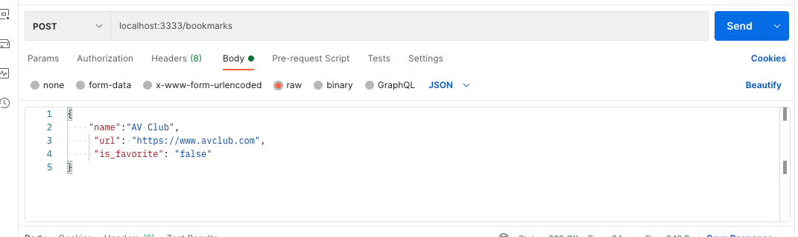

# Express & SQL w. PG Show & Create

## Adding a Database to our Express App

## Rebuild Bookmarks

## Getting Started

- Get your express server running
- Make sure postgres is running
- In the browse,r go to the index route and check that it works

## Show

**IMPORTANT:** One thing that will be different with your builds is that instead of using the array position, we will be using each item's unique `id` that is generated by Postgres.

For example, looking at the data we inserted `Apartment Therapy` should have an `id` of `2`


If we were to access it by array position it would be at array position `1`. We used array positions earlier for simplicity. However, there is never a guarantee that an item will be in a certain order/array position and it can change. So using the `id` now that we have a database is critical.

**queries/bookmarks.js**

Create an async arrow function and be sure to include it in `module.exports`

```js

// ONE Bookmark
const getBookmark = async () => {};

module.exports = {
  getAllBookmarks,
  getBookmark,
};
```

Add in the functionality, we are going to get the `id` from the `req.params` in the show route (in bookmarkController - see below).

We will use `db.one` because we expect one row to be returned.

We are passing two arguments, one is the SQL query, and the second is the value coming in from the request, in this case it is the `id` of the bookmark we want to show.

We represent that `id` in the SQL query by using `$1` rather than inserting the value, as we might if it were a JavaScript string interpolation.

The reason is safety.

[Bonus Video on SQL Injection](https://www.google.com/search?q=SQL+injection+computerphile&client=safari&rls=en&ei=os7UYNnYDfOv5NoPicmJwA4&oq=SQL+injection+computerphile&gs_lcp=Cgdnd3Mtd2l6EAMyAggAMgYIABAWEB46BwgAEEcQsAM6BAgAEEM6BwgAELEDEEM6BQgAELEDOgQIABANSgQIQRgAUIcyWLNEYO5FaAJwAngAgAFriAGfCJIBBDE1LjGYAQCgAQGqAQdnd3Mtd2l6yAEIwAEB&sclient=gws-wiz&ved=0ahUKEwjZsevv8rDxAhXzF1kFHYlkAugQ4dUDCA0&uact=5)

**BONUS Cartoon**


```js
const getBookmark = async (id) => {
  try {
    const oneBookmark = await db.one("SELECT * FROM bookmarks WHERE id=$1", id);
    return oneBookmark;
  } catch (error) {
    return error;
  }
};
```

**NOTE**: You may also pass in arguments to your SQL query using an object with named keys like so:

```js
await db.one("SELECT * FROM bookmarks WHERE id=$[id]", {
  id: id,
});
```

Being aware of this alternate syntax can be useful as you look at other coding examples. When you work on a project, stick with one type of syntax for readability and maintainability.

**controllers/bookmarkController.js**

Import the function

```js
const { getAllBookmarks, getBookmark } = require("../queries/bookmarks");
```

Create the show route and test it in the browser/Postman

```js
// SHOW
bookmarks.get("/:id", async (req, res) => {
  const { id } = req.params;
  res.json({ id });
});
```

Add in the query and add some logic for the 404

```js
// SHOW
bookmarks.get("/:id", async (req, res) => {
  const { id } = req.params;
  const bookmark = await getBookmark(id);
  if (bookmark) {
    res.json(bookmark);
  } else {
    res.status(404).json({ error: "not found" });
  }
});
```

## Create

**queries/bookmarks.js**

Create an async arrow function and be sure to include it in `module.exports`

```js
const createBookmark = async (bookmark) => {
  try {
  } catch (error) {
    return error;
  }
};

module.exports = {
  getAllBookmarks,
  createBookmark,
  getBookmark,
};
```

Inserting into the database requires two arguments.

We'll use `db.one()` because we are expecting one row to be returned. When we return `one`, we get an object, if we return `any` or `many` we get back an array. This will be important as to how we handle accessing our data in the front end.

We are passing two arguments to `db.one`, the first is the SQL query, where the values are represented as `$1`, `$2` etc. In the second, we are passing an array for each value.

| SQL Value | SQL Column  |      Array Value       | Array Index |
| :-------: | :---------: | :--------------------: | :---------: |
|    $1     |    name     |    `bookmark.name`     |      0      |
|    $2     |     url     |     `bookmark.url`     |      1      |
|    $3     | is_favorite | `bookmark.is_favorite` |      2      |

Set up our basic statement:

```js
// CREATE
const createBookmark = async (bookmark) => {
  try {
    const newBookmark = await db.one(
      "INSERT INTO bookmarks (name, url, category, is_favorite) VALUES($1, $2, $3, $4) RETURNING *",
      [bookmark.name, bookmark.url, bookmark.category, bookmark.is_favorite]
    );
    return newBookmark;
  } catch (error) {
    return error;
  }
};
```

**controllers/bookmarkController.js**
Import the function

```js
const {
  getAllBookmarks,
  getBookmark,
  createBookmark,
} = require("../queries/bookmarks");
```

Create the show route and test it with Postman

```js
// CREATE
bookmarks.post("/", async (req, res) => {
  try {
    const bookmark = await createBookmark(req.body);
    res.json(bookmark);
  } catch (error) {
    res.status(400).json({ error: error });
  }
});
```

Example Bookmark:

```js
{
    "name":"AV Club",
     "url": "https://www.avclub.com",
     "is_favorite": "false"
}
```

Remember to have:

- Route `POST` `/bookmarks`
- Select: `body`, `raw`, `JSON` from the options
- Valid JSON



## Error Handling/Validating input

Our user can make a bunch of mistakes

Forgetting a name:

```js
{
     "url": "https://www.avclub.com",
     "is_favorite": "false"
}
```

We get a hard to read error, what we would like to do is check if there is a name and then send back an appropriate status code and a more human readable error.

We can add this logic to our route, but then our route is doing some validation and sending a response. It would be better to write a separate function that validates it. It also would make sense to put it in its own file for better organization.

- `mkdir validations`
- `touch validations/checkBookmarks.js`

**validations/checkBookmarks.js**

```js
const checkName = (req, res, next) => {
  console.log("checking name...");
};

module.exports = { checkName };
```

**controller/bookmarksController.js**

```js
const { checkName } = require("../validations/checkBookmarks.js");
```

Add this function as middleware for the create route

```js
// CREATE
bookmarks.post("/", checkName, async (req, res) => {
```

This request will hang because we are not sending a response.

```js
const checkName = (req, res, next) => {
  if (req.body.name) {
    console.log("name is ok");
  } else {
    res.status(400).json({ error: "Name is required" });
  }
};
```

Ok, we get our error message. But if we enter a name now, how to we get back to our rote?

We use the `next` function

```js
const checkName = (req, res, next) => {
  if (req.body.name) {
    next();
  } else {
    res.status(400).json({ error: "Name is required" });
  }
};
```

Let's try again

```js
{
  "name": "Apple",
  "url": "https://www.apple.com",
  "is_favorite": "true"
}
```

#### Another User Error

We can end up where the user/front end app does not give a Boolean value

```js
{
  "name":"Ikea",
  "url": "https://www.ikea.com",
  "is_favorite": "Maybe"
}
```

PostgreSQL is strict. It will not accept `maybe`

Let's try to create this new bookmark. We get another Postgres error that we can read and understand, but we'd like to again, send back a status and error message.

**validations/checkBookmarks/js**

```js
const checkBoolean = (req, res, next) => {
  if (req.body.is_favorite) {
    next();
  } else {
    res.status(400).json({ error: "is_favorite must be a boolean value" });
  }
};

module.exports = { checkBoolean, checkName };
```

Don't forget to add this to the` bookmarkController.js`

```js
const { checkBoolean, checkName } = require("../validations/checkBookmarks.js");


// Further down....
bookmarks.post("/", checkBoolean, checkName, async (req, res) => {
```

Hmmm, not quite right. How can we check if the value of `req.body.is_favorite` is a boolean value?

If you don't know, go ahead and google it.

<details><summary>Possible Solution</summary>

```js
const checkBoolean = (req, res, next) => {
  const { is_favorite } = req.body;
  if (
    is_favorite == "true" ||
    is_favorite == "false" ||
    is_favorite == undefined
  ) {
    next();
  } else {
    res.status(400).json({ error: "is_favorite must be a boolean value" });
  }
};
```

</details>

## Save it

- `git add -A`
- `git commit -m 'show and create complete'`

## Lab time!

Continue with Tuner
