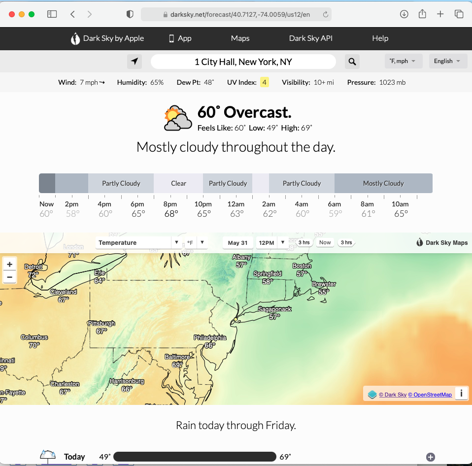

# Express Request

# Topics

- Environmental Variables
- Read URL parameters
- Common error: Two responses
- Common error: Place routes in correct order
- Multiple Parameters
- Request Object
- URL Queries

# Lesson

So far, we've been making simple `requests` and getting simple responses.

Let's look at weather site:

[Dark Sky](https://darksky.net/forecast/40.7127,-74.0059/us12/en)



What we notice is that the url is something like:

https://darksky.net/forecast/40.7127,-74.0059/us12/en

```
    http://darksky.net/forcast/40.7127,-74.0059/us1/en?units=metric&date=05312021

    \___/  \_________/  \___________________________/\_______________/
  protocol  host/domain          path                  query-string
```

How would we build this? Are there developers building a route for every single latitude and longitude? That would seem like a lot of developers would be working around the clock, and the code would not be very DRY.

Rather, we can use the URL to pass in values and design our web applications in a programmatic way.

To the users, the URL looks the same.

But for our server code, we would write the route as something like:

    http://darksky.net/forcast/:location/:timezone/:language?units=metric&date=05312021

In the request we would be able to get an object that looks like this that comes from the request parameters:

```js
{
  location: "0.7127,-74.0059",
  timezone: "us1",
  language: "en",
}
```

And we would also be able to get a second object that comes from the query-strings which would look like:

```js
{
  units: "metric",
  date: "05312021",
}
```

Which we could then use to find the data that we need in order to complete the response.

## Getting Started

### Quick Review

- Express is a code framework hosted on npm that is written in JavaScript. Express is a framework for building a web server
- We initialize our folder as an npm project by typing `npm init`
- Add npm packages by typing `npm install <package-name> `e.g. `npm install express`
- Use the `require()` function to bring in the express code, so we can use it
- Add `app.listen(PORT)` to turn on our server, by default, it will listen to http://localhost. When we work on our computers, we have to pick a port. Usually ports for servers that we'll be building are in the numeric range of 3000 - 9000. When we host our projects on the web, the port will be automatically configured for us

We are going to add a little bit more complexity to this set up so that we can start to bring in some more best practices into our app.

### Start coding

- navigate to your Desktop or other convenient folder
- `git status` to make sure you are not already in a `git` repository
- `mkdir express-minerals`
- `cd express-minerals`
- `touch server.js`
- `npm init -y` (this will automatically say yes to all the npm default settings - this is fine for tutorials, small test builds, etc.)
- `npm install express`
- `touch .gitignore` (tell git which files to ignore) and add the following to the file:

```
node_modules
.env
```

This is not JavaScript, so don't add semi-colons.

**Thought question**: Why and when do we start file/folder names with a `.`?

### JavaScript Environments

There are many places (environments) to run JavaScript, for example, in the browser, or in terminal. Each place is a different environment: Your computer is a different environment than your friend's computer. Therefore, being able to add a file that stores specific information about running the code the environment it is in is a useful feature.

Let's make our own environmetnal variable file. We'll call it `.env`. We've already chosen to not track the file in our `.gitignore`. This will allow each environment to keep its own file and if there is sensitive information like passwords or API keys, they will also not be shared on github.

- `touch .env`
- `npm install dotenv`

- Open `.env` add

```
PORT=3333
```

This file is also not JavaScript, so don't add semi-colons or quotes or extra white space.

### Set Up App

- `touch app.js`

**app.js**

```js
// DEPENDENCIES
const express = require("express");

// CONFIGURATION
const app = express();

// ROUTES
app.get("/", (req, res) => {
  res.send("Welcome to Express Minerals App");
});

// EXPORT
module.exports = app;
```

### Separating Concerns

We will be adding code testing for our next assignments and assessments. In order to set it up properly, we have to set up the server in one file, and then our routes and other logic in other files.

When we import an npm package, like express, we just require it by name.
We can also include code from other files we've created. When it is a file we've created we have to give the relative path.

When we set up our `server.js` file, we need to first import our code from our app.js.

Then, we need to configure our app to use our environment variables.

We're using a package called [dotenv](https://www.npmjs.com/package/dotenv)

We are going to follow the basic instructions/example code provided in the docs.

**server.js**

```js
// DEPENDENCIES
const app = require("./app.js");

// CONFIGURATION
require("dotenv").config();
const PORT = process.env.PORT;

// LISTEN
app.listen(PORT, () => {
  console.log(`🪨 Listening on port ${PORT} 💎 `);
});
```

Get the app running with `nodemon server.js` and go to http://localhost:3333

**Note:** Having the variable `PORT` in all caps is the default for when you deploy your backend on the cloud(make it live). In other languages, all caps denotes that the variable is a constant and cannot be changed. So even though it is not necessary for JavaScript, we will keep this variable in all caps so we are ready for deployment and won't have to go back and edit it.

### Building An App

Right now, we'll be focused on learning express, later we'll learn about databases and then learn how to integrate a database into our express app.

In the meantime, we're going to be mocking a database by just using arrays of objects, that will live in memory while the server is running.

Data modeling is technique for defining business requirements for a database. In our case, we are making a very simple version of a rock shop and our data will be an array of objects. We're going to store this data in a file called `rock.js` that will be inside of a folder called `models`.

- `mkdir models`
- `touch models/rock.js`

We need to assign it to `module.exports` so that we will be able to import it elsewhere in our app.

**models/rock.js**

```js
module.exports = [
  "Crocoite",
  "Wulfenite",
  "Amber",
  "Malachite",
  "Azurite",
  "Amethyst",
];
```

Copy and paste this array into `rock.js`

**IMPORTANT** if you forget to use `module.exports` or misspell it as `module.export` you will get an empty object. Be sure to check this carefully, as it is a common bug.

Let's make an index of all the rocks.

**app.js**

```js
// DEPENDENCIES
const express = require("express");
const rocks = require("./models/rock.js");

// CONFIGURATION
const app = express();

// ROUTES
app.get("/", (req, res) => {
  res.send("Welcome to Express Minerals App");
});

app.get("/rocks", (req, res) => {
  res.send(rocks);
});

// EXPORT
module.exports = app;
```

http://localhost:3333/rocks

### Showing each rock

We have 6 rocks for sale. We could create a route for each rock. Six is very doable. But what if this store is a huge success and we end up having hundreds or thousands of rocks?

Writing a route for each one would be

- tedious
- hard to maintain

Instead, we want user input for which rock the user would like to see. We'll just use the array position and have the user type in the url, for now. Eventually, we would create a full web page with links and id numbers for our rocks.

Let's try it out.

We create a request parameter by adding a `:` to distinguish it from a regular path.

Whatever value the user types will then be sent with the request and is accessible inside the `request.params` object.

Let's try it:

```js
// ROUTES
app.get("/rocks/:index", (req, res) => {
  res.send(req.params);
});
```

http://localhost:3333/rocks/1

We can now use this value to access the item in the array's position 1.

```js
// ROUTES
app.get("/rocks/:index", (req, res) => {
  res.send(rocks[req.params.index]);
});
```

We can make this code more easy to read by using object deconstruction. Let's try it

```js
// ROUTES
app.get("/rocks/:index", (req, res) => {
  const { index } = req.params;
  res.send(rocks[index]);
});
```

## A Common Error

You can only have one response for every request: This is the rule of the http protocol. If you try to send multiple responses you'll get an error in terminal. Let's try it!

```js
app.get("/rocks/oops/:index", (req, res) => {
  const { index } = req.params;
  res.send(rocks[index]);
  // error cannot send more than one response!
  res.send("this is the index: " + index);
});
```

We can, however, have multiple statements if we use our `if` statements or other program logic correctly:

```js
app.get("/rocks/:index", (req, res) => {
  const { index } = req.params;
  if (rocks[index]) {
    res.send(rocks[index]);
  } else {
    res.send("cannot find any rocks at this index: " + index);
  }
});
```

http://localhost:3333/rocks/98

or

http://localhost:3333/rocks/not_a_valid_index_position

## Place routes in correct order

- Express starts at the top of your `app.js` file and attempts to match the url being used by the browser with routes in the order in which they're defined
- URL params (e.g. `:foo`, `:example`, `like `) can be anything, a number or a string
  - Therefore if you have these routes in this order in your `server.js`:
    - `/:color`
    - `/rocks`
  - And you want to get to `/rocks` - you'll always hit the `/:color` route because the URL parameter will accept _any_ string, it doesn't know that `rocks` is something specific/special
  - To fix this, we put the more specific routes first
    - `/rocks`
    - `/:color`
      Now, from top to bottom, the more specific route `/rocks` will be triggered when the URL has `/rocks` and if it doesn't match `/rocks`, it will go to the next route.

Let's code an example of this together:

```javascript
app.get("/rocks/:index", (req, res) => {
  //:index can be anything, even awesome
  res.send(rocks[req.params.index]);
});

app.get("/rocks/awesome", (req, res) => {
  //this will never be reached
  res.send(`
    <h1>Rocks are awesome!</h1>
    
  `);
});
```

If this happens, reorder them so that more specific routes come before less specific routes (those with params in them)

```javascript
app.get("/rocks/awesome", (req, res) => {
  res.send(`
    <h1>rocks are awesome!</h1>
    
  `);
});

app.get("/rocks/:index", (req, res) => {
  const { index } = req.params;
  if (rocks[index]) {
    res.send(rocks[index]);
  } else {
    res.send("cannot find anything at this index: " + index);
  }
});
```

## Multiple Parameters

We can add more parameters to the `req.params` object:

```js
app.get("/hello/:firstName/:lastName", (req, res) => {
  console.log(req.params);
  const { firstName, lastName } = req.params;
  res.send(`hello ${firstName} ${req.params.lastName}`);
});
```

http://localhost:3333/hello/karolin/rafalski

Try other first names and last names!

## Query Strings

Another way to get values from the url is with query strings.

Query strings go at the end of a path, and they start with a `?`. They are key value pairs with the syntax of `value=100`

You can add as many as you like by separating them with an ampersand `&`

```js
app.get("/calculator/:operator", (req, res) => {
  console.log("this is req.params", req.params);
  console.log("this is req.query", req.query);
  const sum = req.query.num1 + req.query.num2;
  res.send("sum is " + sum);
});
```

http://localhost:3333/calculator/add?num1=5&num2=4

Uh oh! We got 54 instead of 9. Remember incoming requests always come in as strings. Let's clean up our code:

```js
app.get("/calculator/:operator", (req, res) => {
  const { num1, num2 } = req.query;
  const sum = Number(num1) + Number(num2);
  res.send("sum is " + sum);
});
```

Let's add a bit more logic

```js
app.get("/calculator/:operator", (req, res) => {
  const { num1, num2 } = req.query;
  let sum = 0;
  if ((req.params.operator = "add")) {
    sum = Number(num1) + Number(num2);
  }
  res.send("sum is " + sum);
});
```

**Bonus**

Can you figure out how to add the functionality of `subtract`, `multiple` and `divide` ?

## Lab Time

[99 Pokemon](https://github.com/joinpursuit/99-pokemon-express)

If you already have had experience with express or another back-end, you may find the first few activities going by quite quickly.

You are encouraged to work on
[Express UFO](https://github.com/joinpursuit/express-ufo) this is a far more challenging activity that will help you sharpen your express and JavaScript skills.
