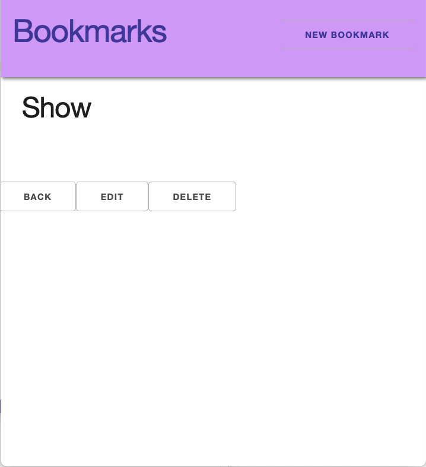

# Express Connect React

## Continue

So far, we have added functionality to our React app to complete requests and get responses for Index.

Let's get the Show page, New, and Edit forms working

|  #  | Action |         URL         | HTTP Verb |   CRUD   |              Description               |
| :-: | :----: | :-----------------: | :-------: | :------: | :------------------------------------: |
|  1  | Index  |     /bookmarks      |    GET    | **R**ead | Get a list (or index) of all bookmarks |
|  2  |  Show  |   /bookmarks/:id    |    GET    | **R**ead | Get an individual view (show one log)  |
|  3  |  New   |   /bookmarks/new    |    GET    | **R**ead | Get a list (or index) of all bookmarks |
|  4  |  Edit  | /bookmarks/:id/edit |    GET    | **R**ead | Get an individual view (show one log)  |

### Loading a Bookmark on Page Load (Show Page)

If we click on the `pencil` it will take us to our show view in our React app.

<details><summary>Show Page Empty</summary>



</details>

Let's request one bookmark from our API from the show page.

**src/Components/BookmarkDetails.js**

At the top:

```js
import axios from "axios";
```

```js
import { apiURL } from "../util/apiURL";

const API = apiURL();
```

Our function for show will be very similar. However, we'll add an error message in case the particular bookmark cannot be found:

Remember, the structure of the `.then()` function is that it takes two arguments, both callbacks. The first argument is what happens when the promise is successfully resolved (successful API call). The second is when the promise is rejected (unsuccessful API call) . The second callback is optional, but can be very helpful for debugging.

This code is split across several lines it can be hard to read.

```js
.then(()=>{}, ()=>{})
```

Additionally, the code can be shortened to

```js
.then(response => response.data, error => error )
```

```js
useEffect(() => {
  axios.get(`${API}/bookmarks/${index}`).then(
    (response) => {
      setBookmark(response.data);
    },
    (error) => {
      history.push(`/not-found`);
    }
  );
}, [index, history]);
```

<details><summary>Show Page Loaded</summary>


</details>

<br />

### Using the Create Form to Create a new Bookmark

<br />

**App.js**

Remember, we want to be able to update the list of bookmarks. That means we have to put state all the way up in the shared component of the bookmark form and the list of bookmarks, which is App.js

**src/App.js**

```js
const addBookmark = (newBookmark) => {
  axios
    .post(`${API}/bookmarks`, newBookmark)
    .then(
      (response) => {
        setBookmarks([...bookmarks, newBookmark]);
      },
      (error) => console.error(error)
    )
    .catch((c) => console.warn("catch", c));
};
```

### Using the Edit Form to Create a new Bookmark

The edit form is very similar to the create form. However, for better user experience, it should be pre-filled with the values, rather than requiring the user to type everything from scratch.

**src/Components/BookmarkEditForm.js**

At the top:

```js
import axios from "axios";
```

```js
import { apiURL } from "../util/apiURL";

const API = apiURL();
```

```js
useEffect(() => {
  axios.get(`${API}/bookmarks/${index}`).then(
    (response) => setBookmark(response.data),
    (error) => history.push(`/not-found`)
  );
}, [index, history]);
```

Now, your form should be pre-loaded with the bookmark data.

<details><summary>Edit Form Loaded</summary>


</details>

Let's add the edit functionality in App.js so our app can properly update

**src/App.js**

```js
const updateBookmark = (updatedBookmark, index) => {
  axios
    .put(`${API}/bookmarks/${index}`, updatedBookmark)
    .then(
      (response) => {
        const updateArray = [...bookmarks];
        updateArray.splice(index, 1, updatedBookmark);
        setBookmarks(updateArray);
        console.log("update?");

        return true;
      },
      (error) => console.error(error)
    )
    .catch((c) => console.warn("catch", c));
};
```

## Adding Delete Functionality

For delete, we can just add a form on the show page. No separate page is needed.

**src/App.js**

```js
const deleteBookmark = (index) => {
  axios
    .delete(`${API}/bookmarks/${index}`)
    .then(
      (response) => {
        const updateArray = [...bookmarks];
        updateArray.splice(index, 1);
        setBookmarks(updateArray);
        return true;
      },
      (error) => console.error(error)
    )
    .catch((c) => console.warn("catch", c));
};
```

We need to add the functionality so that the delete happens
**src/BookmarkDetails.js**

```js
const handleDelete = () => {
  deleteBookmark(index);
  history.push(`/bookmarks`);
};
```
