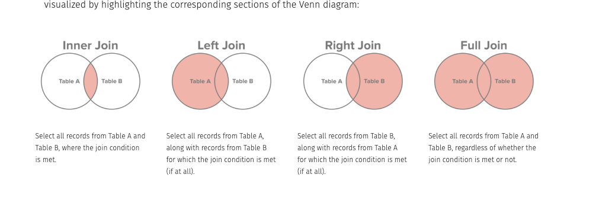
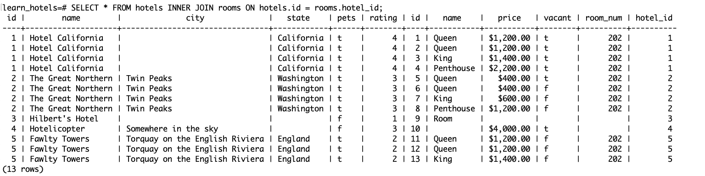
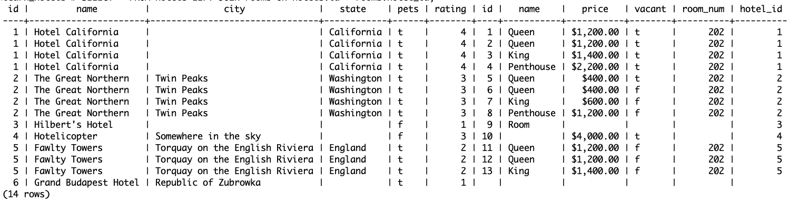
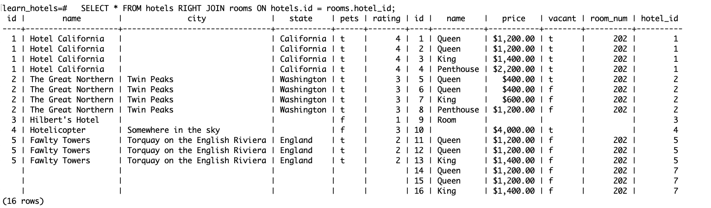

# SQL Part 2a

## Getting it Together Part 1: One to Many Joins

## Lesson Objectives

- Learn about table normalization
- Join two tables - one to many relationship
- Review a complex query

## Data Modeling

It's unusual to have just one table in a business application. Typically, there are many tables to represent data in a meaningful way.

Let's imagine we are designing an application for a new boutique travel travel boutique, where guests will get to work with an agent to be able to book experiences at unique hotels that are not part of any franchises. What kind of data would we need?

- Hotel
  - name - string
  - city - string
  - state - string
  - rating - integer
  - pets - boolean

We can image a table like so:

|       name       |    city    |   state    | rating | pets |
| :--------------: | :--------: | :--------: | :----: | :--: |
| Hotel California |  Unknown   | California |   4    | true |
|  Great Northern  | Twin Peaks | Washington |   3    | true |

But in order to book a room, we would need information on the rooms available in each hotel. **One** hotel **has many** hotel rooms.

Let's try to put the info in one table:

|      name      |    city    |   state    | rating | pets |        room 1         |           room 2            |       room 3        |
| :------------: | :--------: | :--------: | :----: | :--: | :-------------------: | :-------------------------: | :-----------------: |
| Great Northern | Twin Peaks | Washington |   3    | true | queen vacant 1200 202 | penthouse 10,000 303 vacant | not vacant twin 101 |

We have a lot of data jammed into one column for each room. It's hard to read, it's easy to make a typo.

It would be better if there were a separate table for each room

- Room
  - type - string
  - price - integer
  - number - integer
  - vacant - boolean

|   name    | price | room_num | vacant | hotel_id |
| :-------: | :---: | :------: | :----: | :------: |
|   Queen   | 1200  |   202    |  true  |    1     |
| Penthouse | 10000 |   303    |  true  |    1     |
|   Twin    |  600  |   101    | false  |    1     |

Organizing data into multiple tables in order to improve updating, inserting, deleting and reading data is called [database normalization](https://en.wikipedia.org/wiki/Database_normalization).

## One to Many Relationship in Postgres

### Getting Started

**Terminal**

- `psql` to open a postgres shell

```sql
CREATE DATABASE learn_hotels;
\c learn_hotels
```

Let's create a table for our hotels. We want to be sure our ratings are only between 0 and 5, so we'll add a constraint by checking the values.

__Serial__ will make a number that is unique, increments and cannot be null. [PRIMARY KEY](https://www.postgresql.org/docs/current/sql-createtable.html) adds additional constraints and rules to be sure we can safely create data with a unique id.

```sql
CREATE TABLE hotels (id SERIAL PRIMARY KEY, name TEXT, city TEXT, state TEXT, pets BOOLEAN, rating numeric DEFAULT 5, CHECK (rating >= 0 AND rating <= 5));
```

Let's insert some data

```sql
INSERT INTO hotels (name, city, state, rating, pets)
VALUES
('Hotel California', null, 'California', 4, true),
('The Great Northern', 'Twin Peaks', 'Washington', 3, true),
('Hilbert''s Hotel', null, null, 1, false),
('Hotelicopter', 'Somewhere in the sky', null, 3, false),
('Fawlty Towers', 'Torquay on the English Riviera','England', 2, true),
('Grand Budapest Hotel', 'Republic of Zubrowka', null, 1, true);
```

Let's check out our data

```sql
SELECT * FROM hotels;
```

Let's create a rooms table.
The way we will connect the rooms back to the hotel is that we will add a `foreign key` which will be the `id` of the hotel that the room belongs to.

For example, a room with a `foreign key` in the column `hotel_id` with 1 will belong to the hotel with an id of 1, which, based on our data, is Hotel California.

```sql
CREATE TABLE rooms (id SERIAL PRIMARY KEY, name TEXT, price numeric, vacant BOOLEAN, room_num INT, hotel_id INT);
```

Let's add some rooms

```sql
INSERT INTO rooms (hotel_id, name, price, room_num, vacant)
VALUES
(1, 'Queen', 1200, 202, true),
(1, 'Queen', 1200, 303, true),
(1, 'King', 1400, 404, true),
(1, 'Penthouse', 2200, 707, true),
(2, 'Queen', 400, 201, true),
(2, 'Queen', 400, 302, false),
(2, 'King', 600, 403, false),
(2, 'Penthouse', 1200, 605, false),
(3, 'Room', null, null, null),
(4, null, 4000, null, true),
(5, 'Queen', 1200, 111, false),
(5, 'Queen', 1200, 222, false),
(5, 'King', 1400, 333, false),
(7, 'Queen', 1200, 1111, false),
(7, 'Queen', 1200, 2222, false),
(7, 'King', 1400, 3333, false);
```

Let's check out our data

```sql
SELECT * FROM rooms;
```

- Tough to read? Try toggling the view with `\x`
- Don't want to manually scroll to the bottom? `q`

## Joins

We now have two tables, one for our hotels and one for our rooms. How do we join the data together to make it readable and usable?

We will use a JOIN. There are a few different types of joins. The four most common are inner joins, outer joins, right joins and left joins.



**Caveat:** Some people don't like using Venn Diagrams to describe joins as it is an oversimplified representation of what is actually happening. That's ok! Venn Diagrams are a great way to get started. When you are ready, you can read something more technical like [this](https://blog.jooq.org/2016/07/05/say-no-to-venn-diagrams-when-explaining-joins/)

#### Full Outer Join

Let's start with a full join. That's going to put both all of the data of our both tables together. We are going to join the two tables based on when the hotel `id` from the `hotels` table matches the `hotel_id` of the `rooms` table.

This will show us hotels that have no room data (Grand Budapest Hotel) and 3 rooms that have a hotel_id of 7, even though there is no hotel with an id of 7.

```sql
SELECT * FROM hotels FULL OUTER JOIN rooms ON hotels.id = rooms.hotel_id;
```

We can see that we get a new (temporary) table that shows all our hotels data on the left and our rooms data on the right. The rows are aligned based on the value of the hotel id from the hotels table and the `foreign key` from the rooms table.


Determining which table is on the left or right is based on the order we write our SQL statement.

```sql
SELECT * FROM rooms FULL OUTER JOIN hotels ON hotels.id = rooms.hotel_id;
```


**Note:** Total of 17 rows

Due to the simplicity of our work, there is no compelling reason to put our hotels or rooms on either side beside personal choice. As you learn to build more complex queries where you may be joining 3 or more tables, there would be need for more careful thought about the order of how the tables are joined.

#### Inner Join

A lot of times, we want to avoid looking at data with null values. If we want to ignore all the data with no matching values from both tables, we'd use an inner join.

Let's try it.

```sql
SELECT * FROM hotels INNER JOIN rooms ON hotels.id = rooms.hotel_id;
```



**Note:** Total of 13 rows

We can still have null values within our tables. What is excluded is `Grand Budapest Hotel` because there are no hotel rooms that go with it and there are no rooms that had a foreign key `hotel_id` of `7`, because there is no hotel in our database with an `id` of `7`.

#### Left Join

If we still want to see the Grand Budapest Hotel, even though there are no rooms associated with it. We can do a left join.

```sql
SELECT * FROM hotels LEFT JOIN rooms ON hotels.id = rooms.hotel_id;
```



**Note:** Total of 14 rows

Notice that in this table we have 14 rows (+ 1 for Grand Budapest Hotel), whereas in our previous inner join we had 13 rows.

#### Right Join

If we do a right join with hotels and rooms, can you hypothesize how many rows we should have?

```sql
SELECT * FROM hotels RIGHT JOIN rooms ON hotels.id = rooms.hotel_id;
```



**Note:** Total of 16 rows

Now we see that the Grand Budapest Hotel is excluded, but those mystery 3 rooms with no hotel are now showing up.

#### BONUS Complex Queries

We can now combine our queries to ask more interesting questions about our data.

What is the average price of a hotel room that can be booked at Boutique Travel Travel Boutique ?

```sql
SELECT
    AVG(price)
FROM
    rooms
INNER JOIN
    hotels
ON
    hotels.id = rooms.hotel_id;
```

Which hotels have vacancies?

```sql
SELECT DISTINCT
    hotels.name
FROM
    hotels
JOIN
    rooms
ON
    hotels.id = rooms.hotel_id
WHERE
    rooms.vacant IS TRUE;
```

**TRY IT:**

- Query for hotels that allow pets
- Query for hotels that allow pets AND have vacancies
- Query for the average room price for a hotel that allows pets
- Query for the most expensive room
- Query for the average price of a room that has a name that includes `queen` in it (case insensitive)
- Query for the most expensive room
- Update a room at Hotel California with a room number of 202 to go from vacant-true to vacant false.
- Update all the rooms with the hotel_id of 7 to now have a hotel_id that matches the Grand Budapest Hotel

### Onwards

Next up we can create tables with relationships of many to many. For example a guest can have (book) many hotel rooms and a hotel room can have (be booked by) many guests.

[README2.md](README2.md)
