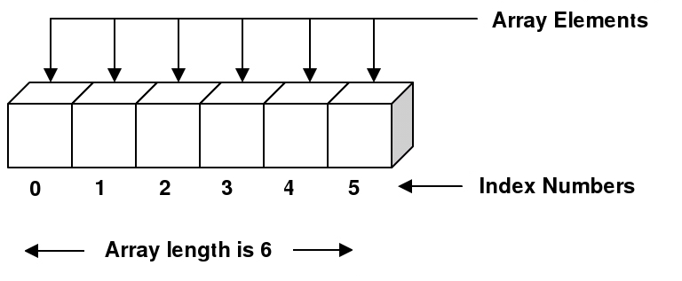

[](https://pursuit.org)

# Arrays Lesson

JavaScript arrays are used to store multiple values in a single variable.

## Learning Objectives
* Understand how to create an array, and why you'd want to.
* Know basic array property `length`.
* Know how to index / key into an array.
* Know how to change the value of an element in an array at a given  index.
* Know how to add and remove elements in an array.
  * `push`
  * `pop`
  * `unshift`
  * `shift`
* Know basic built-in array methods like `split`.
* Know what a multidimensional array is and how to index / key into it.

## Prerequisites 
 * Values and types 

 ___

# 1. Array Introduction

An array provides a convenient way to store a collection of __things / data__. Say we want to keep the numbers `2`, `3`, `5`, `7`, and `11` - all in one place.
Instead of creating five separate variables we can create an array to store all these values.
To create an array, we use the `[` and `]` square brackets, and in between put whatever values we need separated by commas.

We can also call new on the Array class and pass in the elements desired, but this is less common and not the preferred way. Use the brackets when you can. 

```js
let arr = [2, 3, 5, 7, 11]

// OR

let arr = new Array(2, 3, 5, 7, 11)
```


Arrays (like strings) like strings can be accessed with indexes and have a `length` property.

Each element in an array has its own index number which represents the elements location in the array - these start at 0 and increase by 1 for every subsequent element. We can access each single element in an array by using square brackets in which we write that elements's index number.



We can put any type of variables or data as elements of an array. We can even mix different types in a single array or put an array itself as one
of the elements.

```js
let animals = ['cat', 'dog', 'raccoon']
let mixedArray = [2, 5, 'zebra', ["Can", "you", "believe", "it"]]
```
However it is **BEST** practice to use the same data type across all elements in the array.

We access the first element of the array by using index `0`, and the last by using index `array.length - 1`

```js
let animals = ['cat', 'dog', 'raccoon', 'giraffe']

// this will print 'cat'
console.log(animals[0])

// this will print 'giraffe'
console.log(animals[animals.length -1])
```

# 2. Adding, Removing and Modifying Elements

Unlike with strings, we can modify individual array elements with the assignment operator:

```js
let animals = ['cat', 'dog', 'raccoon', 'giraffe']
// changing the second element to 'zebra'
animals[1] = 'zebra'
console.log(animals)
// => [ 'cat', 'zebra', 'raccoon', 'giraffe' ]
```

### Push

We can add elements to the end of an array by using the `push` method

```js
let numbers = [2, 4, 6]
// adding the number 8
numbers.push(8)
// now numbers will be: [2, 4, 6, 8]
// you can also add multiple elements by adding more arguments to push.
numbers.push(10, 12, 14)
// now numbers will be: [2, 4, 6, 8, 10, 12, 14]
```

### Pop
We can remove an element from the end of an array by using the `pop` method:

```js
let numbers = [2, 4, 6]
// removing the last element in the  array
let removedNum = numbers.pop();
// now array will be: [2, 4]
// and removedNum will be 6. 
```

### Unshift

To add an element to the beginning of the array use the method: `unshift`.
```js
let numbers = [3, 5];
numbers.unshift(1);
// numbers is now: [1, 3, 5]
```

### Shift

To remove an element from the beginning of the array use the method: `shift`.
```js
let numbers = [3, 5];
let removedNum = numbers.shift();
// numbers is now: [5]
// removedNum is 3
```
**Helpful trick**
Sometimes it can be hard to remember which methods do what. Here's a helpful trick. Push and pop are fairly easy. Pushing into the array, and popping off. Now with shift and unshift try and remember that unshift is like push but at the beginning. You can __tell__ they are similar because they both have the letter 'u' in them. The ones with the 'u' add to the array, the other two are for removing.

# 3. Built-In Methods

The following are useful methods that come with arrays that let us manipulate them.

### Join: Array --> String

Arrays can be converted to strings by using the [`join`](https://developer.mozilla.org/en-US/docs/Web/JavaScript/Reference/Global_Objects/Array/join) method. This method does not change the array,
instead it **returns** a string. The string will contain the array element separated by a comma. We can also pass a separator as argument to `join`.

```js
let animals = ['cat', 'dog', 'llama']

console.log(animals.join())
// will log: 'cat,dog,llama'

console.log(animals.join(''))
// will log: 'catdogllama'

console.log(animals.join(' '))
// will log: 'cat dog llama'

console.log(animals.join('$'))
// will log: 'cat$dog$llama'
```

### Split: String --> Array

Strings can be converted to arrays, by using the [`split`](https://developer.mozilla.org/en-US/docs/Web/JavaScript/Reference/Global_Objects/String/split) method. This method will separate the string based on the **separator** provided as an argument. For example, if our string is `'hello world'` and we provide a single space as an argument, we will get an array with two elements: `'hello'` and `'world'`:

```js
let str = 'hello world'
let arr = str.split(' ')
// arr will be ['hello', 'world']
```

If we provide an empty string as an argument to `split`, we will get an array with as many elements as there are characters in the string.

```js
let str = 'hello'
let arr = str.split('')
// arr will be: ['h','e','l','l','o']
```
You can also split on characters. 

```js
let str = 'hello world'
let arr = str.split('o')
// arr will be [ 'hell', ' w', 'rld' ]
```

### Slice
Arrays have a [`slice`](https://developer.mozilla.org/en-US/docs/Web/JavaScript/Reference/Global_Objects/Array/slice) method that works by taking a slice of the array. The method takes in two arguments. The first is the starting index (inclusive), the second argument is the ending index (exclusive).
```js
let arr = [4, 6, 8, 10, 12]
// getting [6, 8, 10]. arr will still be the same.
let sliceOfArr = arr.slice(1, 4)
```
If no second argument is provided, the array will be sliced from the first argument to the end of the array. 

### Splice
Let's talk about [`splice`](https://developer.mozilla.org/en-US/docs/Web/JavaScript/Reference/Global_Objects/Array/splice). This method takes a starting index as an argument and removes all array elements starting from that index.

```js
let arr = ['dog', 'cat', 'mouse']
let spliced = arr.splice(1)
// arr contains ['dog']
// spliced contains ['cat', 'mouse']
```

We can specify a *delete count* as  a second argument:

```js
let arr = ['dog', 'cat', 'mouse']
arr.splice(1, 1)
// arr contains ['dog', 'mouse']
```

Any additional arguments to `splice` (after the first two) will be inserted into the array in place of the deleted ones.

```js
let arr = ['dog', 'cat', 'mouse', 'giraffe']
// removing 'cat' and 'mouse' and inserting 'fish'
arr.splice(1, 2, 'fish')
// arr contains ['dog', 'fish', 'giraffe']
```

`splice` **returns** an array containing the elements that were removed. The modification happens on the array that the method was called from.

### Concat
Concat is a method that joins two arrays.
```js
let a = [1, 2, 3];
let b = [4, 5, 6];
console.log(a.concat(b)) // [1, 2, 3, 4, 5, 6]
console.log(a) // [1, 2, 3]
console.log(b) // [4, 5, 6]
```


# 4. Array Equality Test

When we were dealing with strings and numbers, we can compare them by simply using the `===` operator. With arrays this will not work as expected:

```js
let arr1 = [2, 3, 4]
let arr2 = [2, 3, 4]
console.log(arr1 === arr2)
// will log: false
```

### Array Variables as References

Each array is like a container. In JavaScript,  even if two containers hold the same values, they are still not considered equal to each other. These containers are located somewhere in the computer's memory. A variable defined as an array holds the address in which the array is located. This means that if we have a variable `firstArr` and set another variable `secondArr` to be equal to `firstArr`, they will both have the address for the same array. When we modify either `firstArr` or `secondArr`, the same array will be modified.

```js
let firstArr = ['cat', 'dog', 'mouse']
let secondArr = firstArr
secondArr[0] = 'giraffe'
// firstArr[0] will also be 'giraffe'
console.log(firstArr[0])
```

The only case in which an equality test returns `true` for two array variables, is if the two variables hold the address of the same array.

```js
let arr1 = [1,  2, 3]
let arr2 = arr1
// equality test for arr1 and arr2 will return true
console.log(arr1 === arr2)
```

For now, if you'd like to compare arrays convert them to strings and then compare them. **Note** this will not always be 100% effective.
For more information on the best way to compare [arrays](https://stackoverflow.com/questions/7837456/how-to-compare-arrays-in-javascript)

# 5. Multidimensional Arrays

Multidimensional arrays are arrays that contain arrays as their elements.
If an array is filled with arrays it is considered to be 2 dimensional (also often referred to as a matrix).
If those arrays are also filled with arrays it becomes a 3 dimensional array or multidimensional.
Typically it is **BAD** practice to go further than 2 dimensional arrays.

#### Indexing into Multidimensional Arrays
The indexing pattern of using brackets `[]` with the desired index remains the same. However, if you want to access elements in an array within an array, we must then index again into that.

```js
let matrix = [
  [1, 2, 3],
  [4, 5, 6],
  [7, 8, 9]
]

console.log(matrix[0]) // => [1, 2, 3]
console.log(matrix[0][0]) // => 1
console.log(matrix[0][1]) // => 2
console.log(matrix[2][2]) // => 9
```

# 6. New Array Functionality in ES6

[ES6](http://es6-features.org/#Constants) added some helpful features that we now have access to:

### Destructuring assignment

The destructuring assignment syntax is a JavaScript expression that makes it possible to unpack values from arrays into distinct variables.

```js
let a;
let b;

[a, b] = ['Hello', 'Dolly']

console.log(a) // => Hello
console.log(b) // => Dolly

```

This often comes in handy when swapping the position of values in an array.

```js
let a = 1;
let b = 3;

[a, b] = [b, a];
console.log(a); // 3
console.log(b); // 1

let arr = [1, 2, 3]
[arr[0], arr[2]] = [arr[2], arr[0]]
console.log(arr) // [3, 2, 1]
```

### The spread operator

The `...` operator can be used to combine arrays:

```js
let params = [ "hello", true, 7 ]
let other = [ 1, 2, ...params ] // [ 1, 2, "hello", true, 7 ]
```

```js
let arr1 = [0, 1, 2];
let arr2 = [3, 4, 5];
arr1 = [...arr2, ...arr1]; // arr1 is now [3, 4, 5, 0, 1, 2]
```

It can also be used to split up strings:

```js
let str = "foo"
let chars = [ ...str ] // [ "f", "o", "o" ]
```


### Resources
* [w3schools - Arrays](https://www.w3schools.com/jsref/jsref_obj_array.asp)
* [MDN - Arrays](https://developer.mozilla.org/en-US/docs/Web/JavaScript/Reference/Global_Objects/Array)
* [MDN - destructuring assignment](https://developer.mozilla.org/en-US/docs/Web/JavaScript/Reference/Operators/Destructuring_assignment)
* [MDN - Spread Operator](https://developer.mozilla.org/en-US/docs/Web/JavaScript/Reference/Operators/Spread_syntax)
