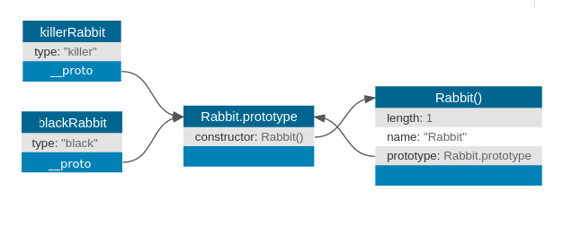
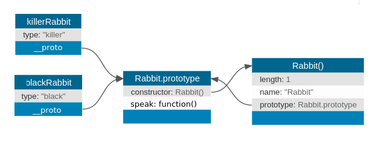

# Constructor Functions

## Standards
FSW.1

## Objectives
* Understand what constructor functions are and why they are useful
* Create your own constructor functions

## Keywords

* Constructor Functions
* [`prototype`](https://developer.mozilla.org/en-US/docs/Learn/JavaScript/Objects/Object_prototypes)
* [`new`](https://developer.mozilla.org/en-US/docs/Web/JavaScript/Reference/Operators/new)
* [`this`](https://www.w3schools.com/js/js_this.asp)
## Resources

* [A Dript Of Javascript - Constructors in JavaScript](http://adripofjavascript.com/blog/drips/constructors-in-javascript.html)
* [CSS-Tricks - Understanding JavaScript Constructors](https://css-tricks.com/understanding-javascript-constructors/)
* [Eloquent Javascript - The Secret Life of Objects](http://eloquentjavascript.net/06_object.html)
* Object Oriented Javascript, 2nd Edition - Stoyan Stefanov, Chapter 4
* Head First Javascript - Chapter 12

## Lesson

## 1. Objects can have functions as values

```js
var dog = {
    name: 'Pluto',
    talk: function () {
        console.log('Woof!');
    }
}

dog.talk() // logs 'Woof!'
```


### Object Methods

As we've seen, _objects_ are a pretty neat data structure. They can hold information in very organized ways and are useful in solving problems. One unique property of an object is that it can point to a function, because functions are just data. Properties that point to functions are also called **methods** and they can be invoked just like we invoke any other function. The only difference is we need to use dot notation to connect the method with its parent object. In the following example, `talk` is a method. We call this function by typing `dog.talk()` because `dog` is the object that _contains_ the `talk` function. If we try to call `talk` without `dog` we get an error because the only `talk` function that exists is the one within `dog`:

```js
let dog = {
    name: 'Pluto',
    talk: function () {
        console.log('Woof!');
    }
}
talk() // error => Uncaught ReferenceError: talk is not defined
dog.talk // logs function => ƒ () { console.log('Woof!'); }
dog.talk() // invokes function => 'Woof!'
```


## 2. The `this` keyword

When **inside** an object method, there is a way to refer to the object the method belongs to: by using the special value `this`.

```js
let dog = {
    firstName: 'Pluto',
    lastName: 'Pup',
    talk: function () {
        console.log('Woof!');
    },
    getFullName: function() {
        return `${this.firstName} ${this.lastName}`;
    }
}

dog.getFullName() // => 'Pluto Pup'
```

In the example above, we cannot just say `firstName` and `lastName` in the `getFullName` function because `firstName` and `lastName` **do not** exist on their own. They are _built into_ the `dog` object and since we are referring to them _inside_ the `dog` object, we use `this` to tell JavaScript, "Hey, we're talking about the `dog` property `firstName` and referring to it with `this` because WE IN **THIS** object!". In later units `this` and object methods will become _very important_ so get used to seeing them!

### Adding properties that have functions as their values

We can also _add_ information and functions to an object that already exists through dot notation. This is useful because you can easily add more information to objects that already exist without having to recreate the entire object new.

```js
// adding more info to an object that already exists
dog.breed // => undefined (breed was not defined)
dog.breed = "Cartoon" (now we have defined breed)
dog // => {firstName: "Pluto", lastName: "Pup", talk: ƒ, getFullName: ƒ, breed: "Cartoon"} (dog now has a breed property!)
dog.breed // => "Cartoon"

// adding a function to an object that already exists
dog.getBreed = function(){ return `I am a ${this.breed}!` }
dog // => {firstName: "Pluto", lastName: "Pup", talk: ƒ, getFullName: ƒ, breed: "Cartoon", getBreed: ƒ} (dog now has a getBreed function!)
dog.getBreed() // => "I am a Cartoon!"
```

## 3. Constructor Functions

Functions have a second role as **Constructor Functions**. These allow us to create multiple objects that share the same properties and methods. For example, we may want to create multiple *dog* objects and we know each `dog` will have a name, breed and weight. Rather than having to write out what the name, breed and weight of each dog every time, we can utilize constructor functions so that `Dog` accepts name, breed and weight as arguments, which are then set to `Dog.name`, `Dog.breed` and `Dog.weight`. This means to create a new `Dog`, we just need to pass the three arguments and our function will do the rest of the work! :100:

```js
function Dog(name, breed, weight) {
    this.name = name;
    this.breed = breed;
    this.weight = weight;
}
```


Let's break down what that did. `this.name = name;` tells the `Dog` object that `this.name` (this `Dog` object's name) is **equal** to the `name` argument passed. `this.breed = breed;` tells the `Dog` object that `this.breed` (this `Dog` object's breed) is **equal** to the `breed` argument passed. `this.weight = weight;` tells the `Dog` object that `this.weight` (this `Dog` object's weight) is **equal** to the `weight` argument passed.

While a constructor function looks like a regular function, note the following:

1. Each arguments is assigned to a property of the `this` object.
2. The function does not have a `return` keyword.
3. The function returns the `this` object.

Also, note the following conventions:

1. Constructor functions start with a **capital first letter**.
2. Parameter/argument names match the **keys** (property names) of the object we will create.


### Using Constructor Functions

Now if we wanted to create a _new_ `Dog` object, we would do it as follows:
```js
let mojo = new Dog("Mojo", "Brittany Spaniel", 45)

// now if we call mojo, we get the following:
mojo // => Dog {name: "Mojo", breed: "Brittany Spaniel", weight: 45}
mojo.breed // => "Brittany Spaniel"
```
This makes creating many `Dog` objects much easier! Now we just need to pass three arguments to each new `Dog` instance and our constructor function will assign our values appropriately. We also assign the new `Dog` object to a variable so we can reference it later. If you do not assign the new object to a variable, it will be created but you cannot access it or use it later.


```js
new Dog("Charlie", "Mixed", 38) // => Dog {name: "Charlie", breed: "Mixed", weight: 38}

Dog.breed // => undefined (JS does not know what Dog you're talking about, so it returns undefined)
```

We can create any number of objects using the same constructor function. We do this with the `new` keyword, followed by the function name and the arguments. We need to use the `new` keyword to create new instances of the object that utilizes the constructor function otherwise the constructor function will not be invoked.

The above will return a new Dog object, so we can assign it to a variable.

```js
let charlie = new Dog("Charlie", "Mixed", 38)
console.log(charlie)
// Dog { name: 'Charlie', breed 'Mixed', weight 38}
```

Following, the above pattern, we can create any number of Dog objects.

```js
let charlie = new Dog("Charlie", "Mixed", 38);
let sergeant = new Dog("Sergeant", "Newfoundland", 140);
let alice = new Dog("Alice", "Golden Retriever", 60);
```

As is the case with other variables, we can put the create objects into an array. Since we create all three objects using the same constructor, we know that all of them will have the `name`, `weight`, and `breed` properties.

```js
let dogs = [charlie, sergeant, alice];
for(let i = 0; i < dogs.length; i++) {
    console.log(dogs[i].name + " is a " + dogs[i].weight + " lb " + " " + dogs[i].breed);
}

// Charlie is a 38 lb Mixed
// Sergeant is a 140 lb  Newfoundland
// Alice is a 60 lb  Golden Retriever
```


## 4. The `prototype` property

Every function also has a property called `prototype`. By default, the value of the `prototype` property is an object.

```js
function add1(num){
    return num + 1;
}
console.log(add1.prototype)
// add1 {}
```

The result of logging `add1.prototype` looks a little different then if we logged a regular empty object.

```js
let obj = {};
console.log(obj)
// {}
```

Logging `add1.prototype` displays not only the (empty) object, but also the function that the object is linked to. In this case, that function is `add1`.

### The Constructor Prototype link

Each `prototype` object is initially empty, except for a hidden property called `constructor`. This `constructor` holds the function that the object is linked to. Let's look at a `Rabbit` constructor (similar to our `Dog` example):

```js
function Rabbit() {}

/* default prototype
Rabbit.prototype = { constructor: Rabbit };
*/
```

This may be easier to visualize with a diagram:


We can verify this:

```js
console.log(Rabbit.prototype.constructor === Rabbit)
// => true
```

### `this` in the constructor

Whenever we call a function with the `new` keyword, the `this` value inside the function is linked to the function's `prototype` property. So, every object created with the `Rabbit` constructor will be linked to `Rabbit.prototype`.

```js
function Rabbit(type) {
  this.type = type;
}

let killerRabbit = new Rabbit("killer");
let blackRabbit = new Rabbit("black");
```



### Adding methods to the prototype

The `Rabbit` constructor and the `Rabbit.prototype` Object prototypes lie behind killerRabbit as a kind of backdrop, where properties that are not found in the object itself can be looked up.

So to add a `speak` method to rabbits created with the Rabbit constructor, we can simply do this:

```js
Rabbit.prototype.speak = function(line) {
  console.log("The " + this.type + " rabbit says '" +
              line + "'");
};
blackRabbit.speak("Doom...");
// → The black rabbit says 'Doom...'
```

The diagram would now look like this:




### The instanceof operator

If we try to use the `typeof` operator with any of the above created objects, we will always get back the string `"object"`. As far as types are concerned, JavaScript considers all objects to be the same. We *can*, however, check if an object was created using a specific constructor function. This is done using the `instanceof` operator:

```js
console.log(killerRabbit instanceof Rabbit) // => true
```


# Appendix / Extra Reading:

### Function Properties

Like objects, functions have **properties**. For example, the `name` property returns a string with the name of the function:

```js
function add1(num) {
    return num + 1;
}

console.log(add1.name) // => "add1"
```

### The Three Main Ways to invoke a function
1. **Function-style**: fun(arg1)
    * While _unbound_, function-style will set `this` to the _global_ context (`global` or `window`).
2. **Method-style**: obj.method(arg1)
    * Will set `this` to the obj
3. **Constructor-style**: new ClassName(arg1)
    * The ClassName function is called with `this` set to the blank object.

Please note: callback functions are almost always called function style.
Consider this example:
```js
function times(num, callback) {
  for (let i = 0; i < num; i++) {
    callback(); // callback is invoked "function-style"
  }
}
const dog = {
  age: 5,
  ageOneYear: function () {
    this.age += 1;
  }
};
dog.ageOneYear(); // works
times(5, dog.ageOneYear); // ReferenceError; this.age is not defined.
```

The reason this ReferenceError is occurring is because times calls dog.ageOneYear _function-style_. This is then changing the `this` to a _global_ context.
There are two ways around this problem. The first is to introduce an **anonymous closure** to capture `dog`:
```js
// Function argument is different:
times(10, function () {
  dog.ageOneYear();
});
```
`times` will still call the passed function function-style, so `this` will still be set to `window`. But the closure doesn't care, **because inside, it explicitly calls `ageOneYear` method style on `dog`**.
The other way around this problem is to use `bind` like this:
```js
times(10, dog.ageOneYear.bind(dog));
```
`bind` works just like the closure we made, in which `dog#ageOneYear` is called method style on the `dog`
object. `dog.ageOneYear.bind(dog)` returns a closure that will still be called function-style, but which calls `dog.ageOneYear` method-style inside of it.


### Common Problem With `this`  
```js
function SumCalculator() {
  // scope 0
  this.sum = 0;
}
SumCalculator.prototype.addNumbers = function (numbers) {
  // scope 1
  numbers.forEach(function (number) {
    // scope 2
    this.sum += number; // noooo!
  });
  return this.sum;
};
```
The use of `this` in scope 2 will not work because the anonymous function will not be called method style. The anonymous function is not even a method of `SumCalculator`.
This problem can be hard to spot, because even though we are using
`this` in a method of `SumCalculator`, we're also inside an anonymous,
nested function which will be called function style. In particular, the correct use of `this` in scope 1 will mean something different than the incorrect use in scope 2.
This sort of runs counter to our basic understanding of closures: that they can access variables defined in the enclosing scope. However, `this` is special because **`this` doesn't get captured; it gets reset every time a function is called**.
If we do want to close over `this`, we need to store it in a normal, capturable local variable:
```javascript
function SumCalculator() {
  // scope 0
  this.sum = 0;
}
SumCalculator.prototype.addNumbers = function (numbers) {
  const sumCalculator = this;
  numbers.forEach(function (number) {
    sumCalculator.sum += number; // will work as intended
  });
  return this.sum;
};
```
Because `sumCalculator` is a normal local variable (as opposed to the
special `this` variable), it can be captured and used by the closure
in the usual way. Later, when the closure is called function style, it
won't matter, because instead of using `this` (which would have been
reset to `window`), we instead use `sumCalculator`, which holds the
old reference to the `SumCalculator` object that `addNumbers` was
called on.
Instead of `sumCalculator`, you may often see people name a variable
like this `that`. `that` is just a conventional name, there is no
magic to it. A somewhat less common name is `self`. I prefer a less
abstract name like `sumCalculator`, but it is a matter of personal
code style.
To repeat: the reason this solution works is because `sumCalculator`
is a normal variable captured according to typical rules, while `this`
is a special variable **which is never captured and is reset on every
function call**.
ES6 gives us a solution to this problem with Fat Arrow Functions.
Arrow functions, unlike normal functions, do not create a new scope. In other words, `this` means the same thing inside an arrow function that it does outside of it. Consider the following scenario with a normal function:
```javascript
function Cat(name) {
  this.name = name;
  this.toys = ['string', 'ball', 'balloon'];
};
Cat.prototype.play = function meow() {
  this.toys.forEach(function(toy) {
    console.log(`${this.name} plays with ${toy}`);
  });
};
const garfield = new Cat('garfield');
garfield.play();
// output
undefined plays with string
undefined plays with ball
undefined plays with balloon
```
`play` breaks because `this` in `this.name` refers to the scope of the `forEach` method. But if we rewrite `play` using a fat arrow function, it works:
```javascript
Cat.prototype.play = function meow() {
  this.toys.forEach(toy => console.log(`${this.name} plays with ${toy}`));
};
garfield.play();
//output
garfield plays with string
garfield plays with ball
garfield plays with balloon
```
**Bonus**
There are two more final ways of calling a function.They incude `apply` and `call`. `apply` takes two arguments: an object to bind `this` to, and an array of argumetns to be passed the method apply is being called on. `call` is very similar to `apply` but instead of taking in an array of parameters, it takes them individually. Please feel free to read more about them [here](https://www.undefinednull.com/2014/06/26/explaining-call-and-apply-in-javascript-through-mr-dot-dave/)


### Omitting the `new` keyword

When the `new` keyword is omitted, you may or may not see an error -  one way to ensure an error in this case is to include the keywords: `"use strict";` at the top of your javascript file. A constructor without `new` will be called like a regular function that does not return anything.

### logging a constructed object

As we've seen, the result of logging a prototype object looks different - the constructor function appears before the object itself. This is also true for any object created using the constructor:

```js
console.log(killerRabbit)
// Rabbit { type: 'killer' }
```


### Getting an object's prototype

The recommended way of getting and object's prototype is the `Object.getPrototypeOf()` method:

```js
Object.getPrototypeOf(killerRabbit)
//  Rabbit { speak: [Function] }
```


### Overriding Prototype properties

When a property is added to an object, whether it is present in the prototype or not, the property is added to the object itself. If there is a property by the same name in the prototype, this property will no longer affect the object. The prototype itself is not changed.

```js
Rabbit.prototype.teeth = "small";
console.log(killerRabbit.teeth);
// → small
killerRabbit.teeth = "long, sharp, and bloody";
console.log(killerRabbit.teeth);
// → long, sharp, and bloody
console.log(blackRabbit.teeth);
// → small
console.log(Rabbit.prototype.teeth);
// → small
```

### Adding To The Prototype Later

A prototype can be used at any time to add new properties and methods to all objects based on it. For example, it might become necessary for our rabbits to dance.

```js
Rabbit.prototype.dance = function() {
  console.log("The " + this.type + " rabbit dances a jig.");
};
killerRabbit.dance();
// → The killer rabbit dances a jig.
```
