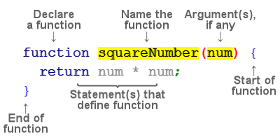

[](https://pursuit.org)

# Functions & Scope

Functions are a fundamental part of any programming language. This lesson will cover function syntax, usage, and some mechanics.

## Goals

- Know how to declare a function
- Have an understanding of scope and variables inside and outside of functions
- Understand function hoisting
- Understand the difference between returns and side-effects
- Know some of the key differences between ES5 and ES6 syntax
- Learn and explore some functions built-in to JS (like Math)

## Vocabulary

- Function Definition
- Function Call
- _Function Expression_ syntax
- _Function Declaration_ syntax
- Global variable scope
- Parameters & Arguments
- Local variable scope (function scope)

## Why Functions?

We use functions to contain code that we want to re-use, or to contain code that we want to call at a later time.

Let's say we have two different numbers:

```js
let smallNum = 6
let bigNum = 15389
```

Now let's say we want to do some math on these numbers. We could do it the manual way:

```js
let smallResult = (smallNum * 4 + 23 / 8 - 4) % 2
let bigResult = (bigNum * 4 + 23 / 8 - 4) % 2
```

Now that's not so bad, but what if we had ten numbers? or a hundred? Typing that out would be a huge pain, and we have way better options than to force ourselves to do something this repetitive.

We can instead write a single function to do this for us.

## Function syntax

Functions allow us to reuse code so that we don't have to repeat ourselves:

```js
let smallNum = 6
let bigNum = 15389

function doMath(num) {
  console.log((num * 4 + 23 / 8 - 4) % 2)
}
```

We've taken the code that does some several step math process and put it inside a function so that we can reuse it.

Specifically, this function takes in an input (called an argument, in this case the `type` is a `number`) and console logs a new number after performing all those operations.

So we have a way to declare a function, which creates it. But if we want to execute (or **call**) that function, we do this:

```js
doMath(smallNum) // => 0.875
doMath(bigNum) // => 0.875
```

Here we're calling the function twice and passing in a different value each time. The function prints out the result of the math equation.

Let's break down this new syntax with another example:



- The above syntax is called **function declaration**.
  The word `function` tells JS that we are **declaring** a function. Just like `const` lets JS know we are about to declare a variable.

- squareNumber is the **name** of the function. Not all functions need a name. Some functions are anonymous and don't have a name. But for now, we will be dealing with functions that do have a name. Ideally the name describes what the function does.

- Inside the parentheses are **parameters** which are used to define a function. When we call a function we replace parameters with **arguments**. Arguments are the real values that are passed into a function. Often the words parameters, and arguments are used interchangeably.

- The opening curly brace, `{` indicates the start of the function. The closing curly brace, `}` indicates the end of the function.

- Between the braces, is the code that makes up the function. This is called the `function body`. **return** is the result (what we get back) after we've called the function. If there is no **return** statement, the function will return `undefined`. Once something is **returned** from a function, the function has ended. This means, that even if there is code after the return statement, it will not be executed.

## Functions as Mini-Programs

A function is like a mini-program inside our main program. Whenever the code inside it is done running, we return to the line from which we called the function. A variable defined inside a function will be forgotten when the function is done running. Every time we call the function `logPets` below, the variables will be created anew.

```js
// This function will print 'cat' and then print 'dog'
function logPets() {
  let pet = "cat"
  console.log(pet)
  pet = "dog"
  console.log(pet)
}

console.log("start here") // => "start here"

// logPets will do the same thing every time we call it
logPets() 
// => 'cat'
// => 'dog'
logPets() 
// => 'cat'
// => 'dog'

console.log("okay we're done") // => "okay we're done"
```

## Scope

To understand scope, we have to start thinking about _where variables are accessible_ and where they're not.

So far we've only dealt with what's called `global scope`, where every variable is accessible from everywhere. Now that we're working with functions, we can start to think of scope as a sort of hierarchy.

```js
let parting = "gooodbye"

function hello() {
  let greeting = "hello"
  console.log(greeting) // => "hello"
  console.log(parting) // => "goodbye"
}

console.log(greeting) // ReferenceError: greeting is not defined
console.log(parting) // => "goodbye"
```

The key takeaway here is that variables declared in a function are only accessible inside that function. Variables declared outside a function are called `global` and they can be accessed and modified from any function.

A variable declared inside a function has _local scope_, and a variable not declared inside a function has _global scope_. So a variable with local scope is only available inside that function. A variable with global scope is available inside or outside the function.

If we create a variable inside a function with the same name as a global variable - the function will only be aware of the local one. This, however, will not change the value of the global variable.

```js
let greeting = "hello"

function hello() {
  let greeting = "what's up?"
  console.log(greeting) // => "what's up?"
}

console.log(greeting) // => "hello"
```

If we have a function inside of a function, the rules still apply, but now we have more than just two scopes.

```js
let global = "hello global"

function firstLevel() {
  let first = "hello first"
  console.log(first) // => "hello first"
  console.log(global) // => "hello global"

  function secondLevel() {
    let second = "hello second"
    console.log(first) // => "hello first"
    console.log(second) // => "hello second"
    console.log(global) // => "hello global"
  }

  console.log(second) // => ReferenceError: second is not defined
}

console.log(global) // => "hello global"
console.log(first) // => ReferenceError: first is not defined
console.log(second) // => ReferenceError: second is not defined
```

## Scope and parameters

When a function has parameters, it's helpful to think about them like temporary variables that only exist inside the function.

Let's say we have a function with two parameters. When we **call** the function, we have to provide that function with two values. Then we can access those values inside the function.

```js
// declare the function with two parameters
function iHaveParams(num, str) {
  console.log(num, str)
}

// call the function, pass in some values
iHaveParams(22, "why") // => 22, why

// num and str are not accessible outside the function
console.log(num, str) // ReferenceError
```

This is very valuable! We often use functions to contain our scope, so we don't accidentally affect variables outside of it.

## Default parameters

In ES6 we can declare functions with parameters that have a default value. This way we can call the function and provide our own value as usual, or call the function without passing in a value, in which case the default applies.

Example:

```js
function square(n = 5) {
  return n * n
}

console.log(square(3)) // => 9
console.log(square(10)) // => 100
console.log(square()) // => 25
```

## Return statements

Return statements are crucial to understanding how functions work. When you call a function that has a return statement in it, it _produces_ a new value that you can then use later.

A parameter can be considered an input, returns are considered outputs.

Let's review this with another function:

```js
function sayHello() {
  return "Hello"
}

let greet = sayHello()

console.log(greet) // => "Hello"
```

This is an oversimplified example - there's no input and we could just skip the function and let `greet` equal `"Hello"`. So lets make it a little more complex.

```js
let greet = "hello"

function addName(name) {
  return greet + " " + name
}

let namedGreet = addName("jimmy")

console.log(greet) // => "hello"
console.log(namedGreet) // => "hello jimmy"
```

Here, we've got an input (`"jimmy"`) and an output (`"hello jimmy"`).

The takeaway from this is that returns _produce_ a new value from the function. To use that value, we have to capture it in a variable, otherwise it disappears.

If we don't return anything from a function, the function automatically returns `undefined`.

### Logging is not returning

```js
function logSum(num1, num2) {
  console.log(num1 + num2)
}

function sum(num1, num2) {
  return num1 + num2
}
```

Though these two functions look similar, they are very different. Here's how:

```js
console.log("Twice the sum of 4 and 6 is " + logSum(4, 6) * 2) // => NaN
console.log("Twice the sum of 4 and 6 is " + sum(4, 6) * 2) // => 20
```

This is because logSum(4,6) **returns** undefined, even though it happens to print out the sum. Just because the value appears in the console doesn't mean it's been returned by the function, they do different things.

## Side-effects

We say that a function has _side effects_ when it affects something outside of its own scope. One example is changing the value of a variable that was defined outside the function.

```js
let myNumber = 2
console.log(myNumber) // => 2
const sideEffect = function () {
  myNumber += 1
}

sideEffect()
console.log(myNumber) // => 3
sideEffect()
console.log(myNumber) // => 4
```

Because we're referencing the variable `myNumber` directly by name, and because `myNumber` was declared outside the function, we can affect the value.

Sometimes you want to do this on purpose - but often times it's better to fix your code so that it doesn't do this.

> How could we modify this code so that it doesn't produce a side effect?

## Different ways of declaring functions

### ES5 syntax

We've seen one way to define a `function` like this:

```js
function printArray(arr) {
  console.log(arr)
}
```

In JavaScript, functions are values just like arrays and strings, and can be saved in variables.

```js
const printArray = function (arr) {
  console.log(arr)
}
```

The first way is called a **function declaration**

The second way is called a **function expression**.

### ES6 syntax

Recently, JavaScript introduced new syntax for a lot of different things, functions among them.

To write that same function in ES6 is just a little bit different. First we declare the function like a variable using the `const` declaration.

We then state the name of our function and provide it arguments, a fat-arrow, and then curly braces. Like this:

```js
const printArray = (arr) => {
  console.log(arr)
}
```

This is also called an **arrow function**.

There are some subtle differences between the three different ways. The biggest one is called `hoisting`.

## Function Hoisting

When a javascript file is executed, the JS interpreter reads through the whole file top to bottom, assigning values and figuring out what needs to be run when. Function declarations are then **hoisted** or lifted to the top of the file, essentially reordering them.

> Note: This is not actually what happens behind the scenes, but thinking about it this way is simpler.

This means that you can call a function before it is defined:

```js
console.log(sayHelloDec) // logs: [Function: sayHelloDec]
sayHelloDec() // logs "hello"

function sayHelloDec() {
  console.log("hello")
}
```

A function defined with expression syntax or ES6 arrow function will be assigned to a variable, and any variable used before it is defined will have the value `undefined`

```js
console.log(sayHelloExp) // logs: undefined
console.log(sayHelloExpTwo) // logs: undefined
sayHelloExp() // TypeError: sayHelloExp is not a function
sayHelloExpTwo() // TypeError: sayHelloExpTwo is not a function

const sayHelloExp = function () {
  console.log("hello")
}

const sayHelloExpTwo = () => {
  console.log("hello")
}
```

## Built in functions

Now that we know how to write our own functions, let's look at some that javascript has provided us, already built in to the language!

We're going to combine our functions with the JS `Math` module. Math gives us a lot of useful tools for working with numbers.

```js
// Gives us a random number between 0 and 1
Math.random()

// Usage:
function getRandom() {
  return Math.random()
}

let rand = getRandom() // 0.53727864
```

```js
// Rounds to the nearest whole number
// Usage:
Math.round(num)

console.log(Math.round(11.23)) // 11
console.log(Math.round(32.92373)) // 33
```

```js
// Rounds up or down to the nearest whole number
// Floor rounds down, ceil rounds up
// Usage:
Math.floor(num)
Math.ceil(num)

console.log(Math.floor(11.23)) // 11
console.log(Math.ceil(11.23)) // 12
console.log(Math.floor(32.92373)) // 32
console.log(Math.ceil(32.92373)) // 33
```

```js
// Finds the highest or lowest number out of all the numbers provided
// Pass in as many numbers as you want
// Usage:
Math.max(a, b, c, d)
Math.min(a, b, c, d)

console.log(Math.max(55, 22, 66, 12, 13, 29, 92)) // => 92
console.log(Math.min(55, 22, 66, 12, 13, 29, 92)) // => 12 
```

## Single Responsibility Principle

It is best practice to write your functions to only do ONE thing. If you find yourself needing your function to do multiple things, you should consider breaking it up into multiple functions. 

For now, you may not notice the importance because we're still writing very simple functions, but if we were making something more complex you would quickly see the benefit. 

Keeping your code small and modular makes it much easier to follow, especially when you are just starting to learn.

## Resources

- [mdn](https://developer.mozilla.org/en-US/docs/Web/JavaScript/Guide/Functions)
- [Eloquent Javascript - Functions](http://eloquentjavascript.net/03_functions.html)
- [mdn - hoisting](https://developer.mozilla.org/en-US/docs/Glossary/Hoisting)
