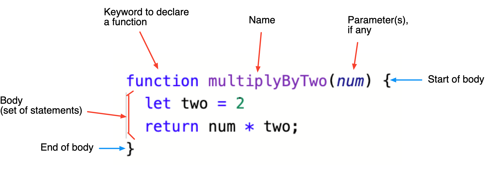
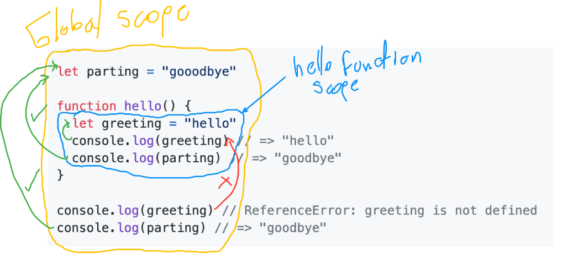

# Functions Review

A function is a reusable code snippet that can by called by other code or by itself.  A function is a set of statements that perform a task or calculates a value.

## Why Functions

Functions solve the problem of repetitiveness in our code. For example if we wanted to multiply two values by two we could just do:

```js
let a = 1000 * 2;
let b = 365 * 2;
```

But what if it's not just two times we need to perform this operation? What if its thousands or even millions of times. You will need to repeat yourself thousands of times. Let's define a function instead.

Functions help us keep code DRY (Do Not Repeat Yourself). We use functions to encapsulate and reuse functionality (a set of instructions).

## Function Anatomy



The above syntax is called **Function Declaration**.

- The keyword `function` tells JS that we are **declaring** a function. Just like `const` lets JS know we are about to declare a variable.

- `multiplyByTwo` is the **name** of the function. Not all functions need a name. Some functions are anonymous and don't have a name. Names of functions describe what the function does and as such should strive to use action verbs.

- The **parameters** are variable names that will hold the values we later pass into the function when we call it. You can have any number of parameters. In this case we have only one parameter named `num`. 

- Between the curly braces(`{}`), we have a set of statements that _perform a task or calculate a value_. This is called constitutes the function **body**. `return` instructs the function to give back the following value to the code that invoked the function. If there is no **return** statement, the function will return `undefined`.

## Function Invocation

To call a function you use its name and a set of parenthesis after it.

```js
multiplyByTwo(4)
```

We give a function some input to work with by passing values in the parenthesis when calling/invoking it. These values are called the **arguments**. Arguments are then accessible to the function via the **parameters**. Often the words parameters and arguments are used interchangeably.

If we don't hold onto the return value it will be lost and inaccessible. To store the return value of a function we can use a variable.

```js
let result =  multiplyByTwo(4)
```

## Returning a value

Functions can return a value or not. When a function doesn't have an explicit `return` statement with a value it returns `undefined` by default.

`multiplyByTwo` above returns a value of type `number`, which is the result of multiplying `num` by 2.

**A function that doesn't return**: 

If the function doesn't return, once all the statements of the function body have been evaluated the function returns `undefined`. We say this function has an implicit return of `undefined`. This function did its job but the result is lost/unsaved and not returned.

```js
function multiplyByTwo(num) {
  let two = 2
  num * two;
}

let result = multiplyByTwo(5)  // undefined
```

**Logging is not returning**:

```js
function multiplyByTwo(num) {
  let two = 2
  console.log(num * two);
}

let result = multiplyByTwo(5)  // undefined
```

## Scope



- Anything that is not within a function lives in the Global scope. The variable `parting` is part of the global scope.
- Functions create nested scopes. You can think of scopes as encasements or environments of code. The variable `greeting` exists within the hello function scope.
- Functions have access to their outer scopes. Anything inside can access anything outside.
- Nothing in the outside scope can access something in a nested scope.
- If there are two variables with the same name in different scopes the closest or inner-most is used (access or modified) i.g:

  ```js
  let greeting = "hello"

  function hello() {
    let greeting = "what's up?"
    console.log(greeting) // => "what's up?"
  }

  console.log(greeting) // => "hello"
  ```

- We can have multiple levels of scope nesting because functions can live within functions.

  What would the following console logs produce? Why?

  ```js
  let global = "hello global"

  function firstLevel() {
    let first = "hello first"
    console.log(first) // => ???
    console.log(global) // => ???

    function secondLevel() {
      let second = "hello second"
      console.log(first) // => ???
      console.log(second) // => ???
      console.log(global) // => ???
    }

    console.log(second) // => ???
  }

  console.log(global) // => ???
  console.log(first) // => ???
  console.log(second) // => ???

  firstLevel()
  ```

  <details>
  <summary> Answer </summary>

    ```js
    let global = "hello global"

    function firstLevel() {
      let first = "hello first"
      console.log(first) // => "hello first"
      console.log(global) // => "hello global"

      function secondLevel() {
        let second = "hello second"
        console.log(first) // => "hello first"
        console.log(second) // => "hello second"
        console.log(global) // => "hello global"
      }

      console.log(second) // => ReferenceError: second is not defined
    }

    console.log(global) // => "hello global"
    console.log(first) // => ReferenceError: first is not defined
    console.log(second) // => ReferenceError: second is not defined
    ```

  </details>

## Default Parameters

Functions can have default values for parameters. Analyze the example below

```js
function square(n = 5) {
  return n * n
}

console.log(square(3)) // => 9
console.log(square(10)) // => 100
console.log(square()) // => 25
```

## Hoisting

## Single Responsibility Principle.

Functions should strive to do one thing and one thing only. It is best practice to write your functions to only do ONE thing. If you find yourself needing your function to do multiple things, you should consider breaking it up into multiple separate functions.

A function called `multiplyByTwo` should never multiply a number by two and fetch users from an API with a network requests.

✅ Keeping your code small and modular makes it much easier to understand for you and other developers, easier to test and easier to debug.


## Side Effects

A functions that access or modifies something outside of its own scope it is said to have side effect. The functions bellow all have side effects.

### Modifying a global variable

```js
let myNumber = 2
console.log(myNumber) // => 2
const sideEffect = function () {
  myNumber += 1
}

sideEffect()
console.log(myNumber) // => 3
sideEffect()
console.log(myNumber) // => 4
```

### Accessing the DOM 

Just grabbing something from the DOM is considered a side effect

```js
const getElement = function (selector) {
  return document.querySelector(selector)
}

let myDiv = getElement('div')
```

### Making a network request

This function has two side effects. What is the second one?

```js
const getUsers = function () {
  fetch('https://jsonplaceholder.typicode.com/users')
    .then(data => data.json())
    .then(users => {
      for (let user of users) {
        let p = document.createElement('p')
        p.textContent = user.name 
        myDiv.append(p)
      }
    })
    .catch(error => {
      console.error('Error:', error);
    });
}

getUsers()
```

💡 Functions that do not have any side effects are called **Pure Functions**. The fist `multiplyByTwo` function we saw above is a pure function.

⚠️ Try to minimize side effects as much as possible but know that some times they are necessary.

## ES5 & ES6 Syntax

### Function Declaration

A.K.A: Function definition or function statement. 

```js
function square(number) {
  return number * number;
}
```

Distinctive by the anatomy of it and the `function` keyword. Only functions defined in this way are [hoisted](https://developer.mozilla.org/en-US/docs/Glossary/Hoisting).

### Function Expression

⚠️ It's important to know that functions are values like any other (no matter ES5 or ES6). This means we can assign a function to a variable and this part enables ES6 syntax later on.

A function in a **function expression** can have name or be anonymous. Often these functions are anonymous because we can use the name of the variable to refer to them or invoke them. The following function expression assigns an anonymous function that squares a number to the variable `square`. Note there is no name after the `function` keyword and that makes it anonymous.

```js
var square = function(number) { return number * number }
var x = square(4) // x gets the value 16
```

### Arrow Function (ES6+ only)

In ES6, which is the version of JavaScript that came out in 2015 a new syntax for defining functions was introduced. Now you can define functions using a function expression that uses an arrow `=>` like so:

```js
const square = (number) => { return number * number }
let x = square(4) // x gets the value 16
```

The main differences between theses multiple ways to define functions are [hoisting](https://developer.mozilla.org/en-US/docs/Glossary/Hoisting) and the value of `this` within the function. Learn more [here](https://developer.mozilla.org/en-US/docs/Web/JavaScript/Guide/Functions)

## Built-in Functions

Built-in functions exist within the global scope and are always available. Some such functions are:

- `parseInt()`
- `isNaN()`

The following functions are not global functions but the objects they belong to are, and therefore they are accessible from anywhere.

- `console.log()`
- `Math.pow()`
- `JSON.stringify()`

For a complete list see MDN - [Javascript Predefined Functions](https://developer.mozilla.org/en-US/docs/Web/JavaScript/Guide/Functions#predefined_functions)

## Exercises

* Complete the [Functions Lab](https://github.com/joinpursuit/variable_assignment) again
* Complete [this Function Vocabulary Crossword Puzzle](https://crosswordlabs.com/embed/js-functions)
