[](https://pursuit.org)

# Git and Github

Learn about git, a version control tool, which enables you to back up and merge your code in a productive way!

## Learning Objectives

- Understand what _Git_ and _GitHub_ are and why they are important to the development process
- Create a GitHub account
- Create a git repo, add to the repo and push it to GitHub

## Framing & Background

A **version control system** (or VCS) provides an automatic way to track changes in software projects, giving creators the power to view previous versions of files and directories, develop speculative features without disrupting the primary codebase, securely back up the project and its history, and collaborate easily and conveniently with others. Think of it like the "Save" feature on a local document, except every time you click "Save", you create a snapshot of your project that you can return to, or share with others, anytime.

In addition, using version control also makes deploying production websites and web applications much easier. The version control system that we (and most developers) use is called **Git**. Git is an open standard that lets individual developers and large organizations alike manage a project as it changes over time.

Let's say Corey and Matt are working on a project together and the code is on Matt's computer. If Matt is out, Corey can't work on the code because it's on Matt's computer. Git and GitHub solve this problem by allowing the code to be stored in the cloud on GitHub and available for download. With GitHub, Matt and Corey's code lives in the cloud so if Matt is out, Corey can easily download the latest code from GitHub and work on it. Corey would also be able to see all the previous versions of code, from when they first started the project to its current state.

## Getting started

The most common way to use Git is via a command-line program called `git`, which lets us transform an ordinary folder into a repository (or repo for short) that enables us to track changes to our project.

The easiest way to check for Git is to start a terminal window and use `which` at the command line to see if the git executable is already present:

```bash
$ which git
/usr/local/bin/git
```

If the result is empty or if it says the command is not found, it means you have to [install Git](../local_environment/README.md).

### Set Your Identity

First, a quick clarification. **Git** is the open-source software that manages the version control for our projects. **GitHub** is a company, one of many options to remotely store your Git projects in the cloud. It's one of the most popular websites to do this, but keep in mind - Git and GitHub are not the same.

GitHub uses the email you set in your Git configuration to associate commits to your GitHub account.

Test if you have your email set by running `git config --global user.email` in
your terminal. Hopefully you see the output what your email is set to. 

If it's blank, type `git config --global user.email "example@email.com"` (where "example" is your GitHub account's associated email) to set it. 

Do the same with your name! Run `git config --global user.name` and see if it's set. If not, set it.`

You will only ever need to run this once. Git will always use this information for anything you do on your computer.

## Initializing a Repo

We’ll begin by making a directory with the name `git-test`. To make a directory, or folder, we use the command `mkdir` which is short for _**m**a**k**e **dir**ectory_. Then you will run the command `cd git-test` which _**c**hanges **d**irectory_ (or folder) to the git-test folder we just created. Then we're going to create a readme file. In short:

```bash
$ mkdir git-test
$ cd git-test
$ touch README.md
```

Now that we're in the folder, we are going to create a [_repository_](https://www.sbf5.com/~cduan/technical/git/git-1.shtml). A Git repository, or "repo", represents a single project managed via Git. Practically, it's a series of files living in your project's folder. These files keep track of each change you make and save in a project.

The way to create a new repository with Git is with the `init` command (short for _initialize_), which creates a special hidden directory where Git stores the information it needs to track our project’s changes.

```bash
$ git init
# Initialized empty Git repository in  /Users/jabyess/git-test/.git/
```

We now have a boilerplate Git repo that we can store our files in and track their changes over time!

> You can see the `.git` folder by doing `ls -a` in your project directory. This is where all the git history lives. If you delete this folder you will delete all your git history.

## Initial Commit

We can check the status of our Git repo by typing `git status`. This will tell us which files, if any, have changed since we last updated our Git repo. Check out what happens when we type `git status`:

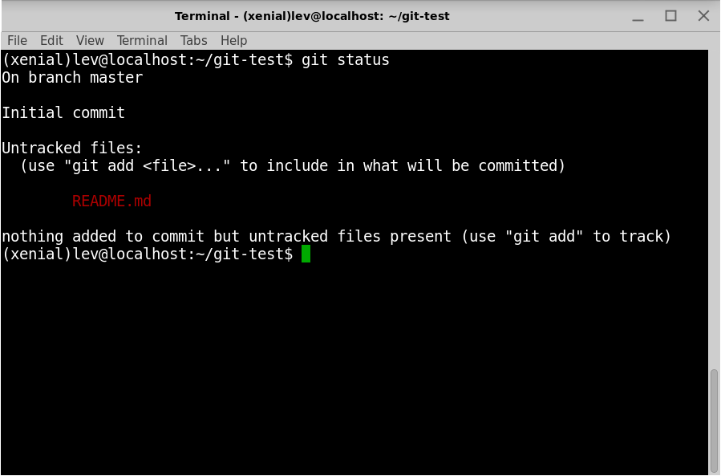

We see here that the README.md file is “untracked”, which means git isn't paying attention to the contents of it. We can add it using the `git add` command:

```bash
$ git add README.md
```

We can add individual files by specifying them by name/filepath, or we can add an entire folder by doing:

```bash
$ git add .
```

Here the `.` tells Git to add **all** untracked files from the current folder (even if, in this case, there’s only one) to the repo, thereby updating the status of each file in the repo. Now if we write `git status` again:

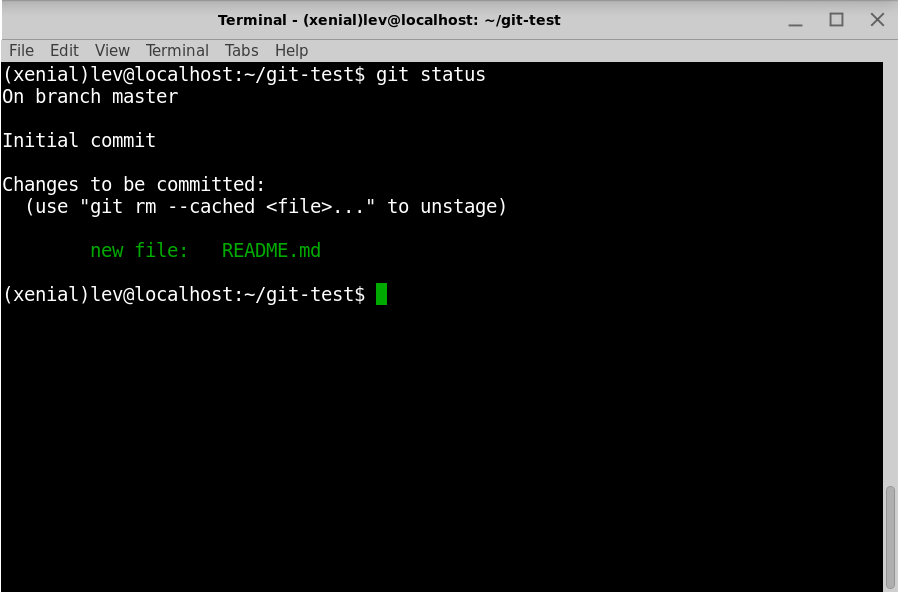

As implied by the word _unstage_, the status of the file has been promoted from untracked to _staged_, which means the file is ready to be _committed_ to the repository. Untracked / unstaged and staged are two of the four states commonly used by Git.

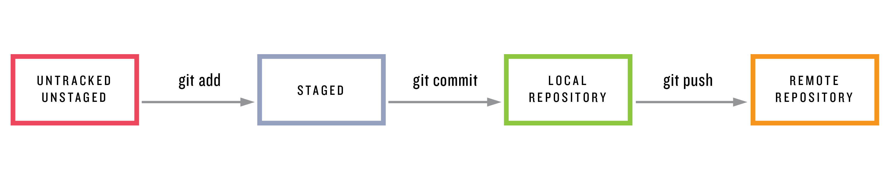

After adding changes in the staging area we can make them part of the local repository by _committing_ them using `git commit`. We also add the command-line option `-m` to include a message indicating the purpose of the commit. **Commit messages are very important because it tells your collaborators what you changed!** They should be short and clear. If your commit message is multiple sentences, you are probably committing _too much_ and should be committing more often. The preference for commit message is **present-tense**, imperative-style. Example of verbs to use: create, merge, update, delete, refactor, extract, fix

For our example, the purpose is to initialize the new repository, which we can indicate as follows:

```bash
$ git commit -m "initialize repo"
[master (root-commit) 38aeeb2] initialize repo
 1 file changed, 0 insertions(+), 0 deletions(-)
 create mode 100644 README.md
```

Now our changes are saved locally to our computer. All we've done is commit an empty file, but we're off to a good start!

At this point, we can use `git log` to see a record of our commit:

```bash
$ git log
commit 38aeeb24b51e4a01a61e1095e1f0efe38b137104
Author: lizraeli <leo2002b@yahoo.com>
Date:   Tue Oct 3 18:40:20 2017 -0400

    initialize repo
```

The commit is identified by a unique string of letters and numbers that Git uses to label the commit and which lets Git retrieve the commit’s changes.

### Viewing the diff

It’s often useful to be able to view the changes represented by a potential commit before making it. To see how this works, let’s open the folder in VSCode:

```bash
$ code .
```

Open `README.md` and write `hello, world` in it.

Then type `git diff` to see the changes.

Git shows the difference between the last commit and unstaged changes in the current project:

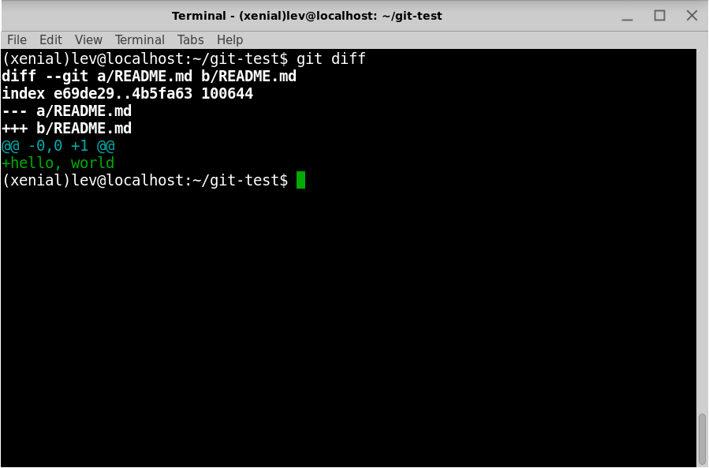

> The + indicates a line was added, and shows the contents of the line.

We can commit this change by again adding the file and then committing.

```bash
$ git add README.md
$ git commit -m "add content to readme"
[master 092beb2] add content to readme
 1 file changed, 1 insertion(+)
```

Having added and committed the changes, there’s now no diff:

```bash
$ git diff

```

In fact, simply adding the changes is sufficient; running `git add -a` would also lead to there being no diff. To see the difference between staged changes and the previous version of the repo, use `git diff --staged`.

We can confirm that the change went through by running `git log`:

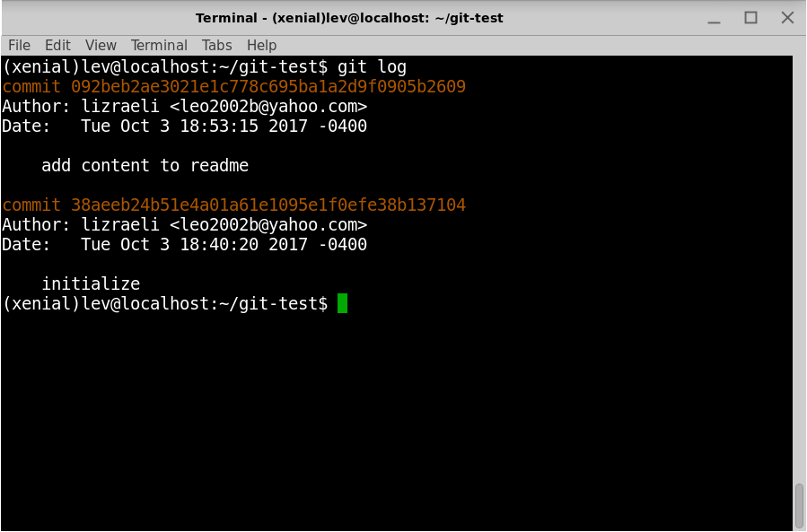

### Adding a Markdown tag

Adding a `#` before the text `hello world` will cause it to appear as a header:

```markdown
# hello, world
```

As before, we’ll run git status and git diff to learn more about what we’re going to commit to Git. The status simply indicates that `README.md` has been modified:


Meanwhile, the diff shows that one line has been deleted (indicated with -) and another added (indicated with +):

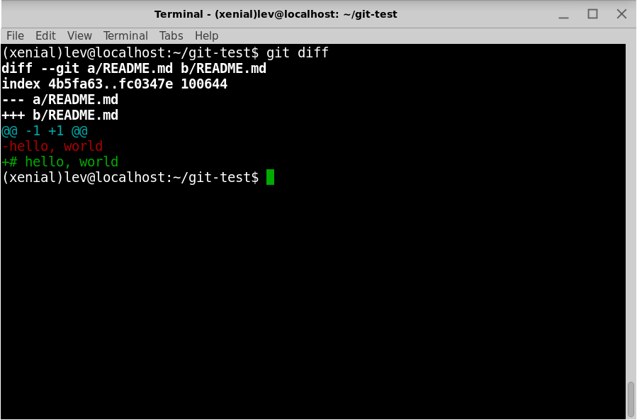

At this point, we’re ready to add and commit our changes. 

```bash
$ git add README.md
$ git commit -m "Add a # tag"
[master ea24eb6] Add a # tag
 1 file changed, 1 insertion(+), 1 deletion(-)
```

### Adding a line of text

Let's add a blank line followed by our name to `README.md`:

```markdown
# Hello, world

My name is Lev
```

As usual, we can see the changes represented by our addition using `git diff`:

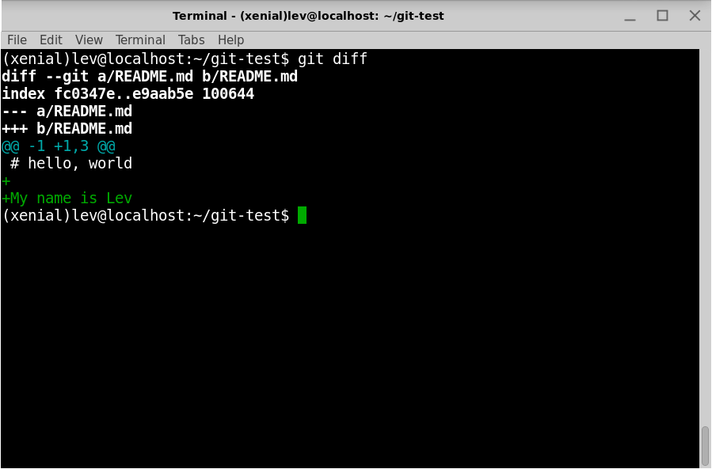

## GitHub (our remote repository)

Go to [GitHub](https://github.com) and sign up for an account if you have not already done so. GitHub is a great online resource for keeping your code and sharing it with others, and we will use it almost every day for class.

Many engineering teams use github, so getting familiar with it will help you in the long run.

### Push to github

* On the [GitHub home page](https://github.com), click on the green **New Repository** button. 
* Give a name to the repository (`git-test`) and click on the green **Create Repository** button. Do not check any boxes.  Leave as public.

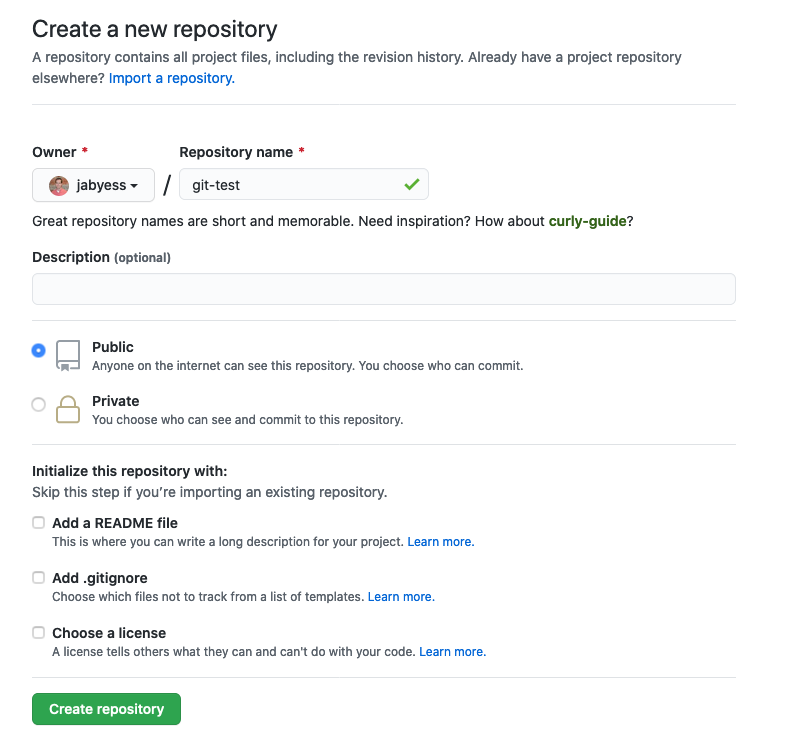

* Copy the commands under the second section, that says `...or push an existing repository from the command line`

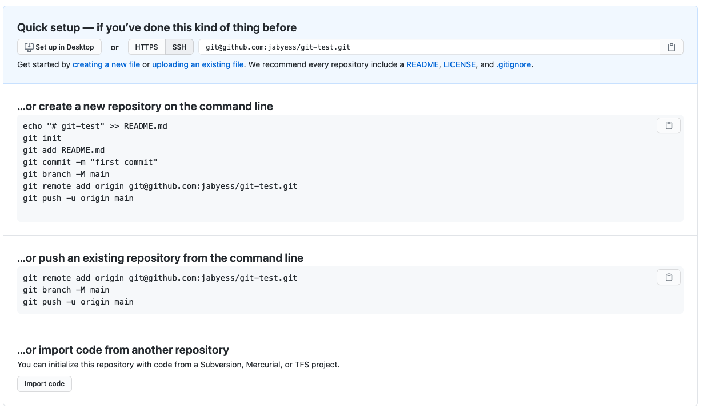

Paste the command into your terminal and hit enter. Your code will be uploaded to github!

### What are those commands?

`git remote add origin <url>` means we're adding a **remote repository** to this repository. This allows us to push and pull from that repo.

`origin` is the name of the remote repository. It can be whatever you want, but origin is the default name.

The URL is the GitHub url where your repository is located--this is where our _local_ repo will be pushed into. This is not the same as a website address, it's only for git to use. You can't open it in a browser like a regular website.

`git branch -M main` renames the default branch from `master` to `main`. Github is [changing the names of default branches](https://github.com/github/renaming)

`git push -u origin main` pushes the changes on the `main` branch from the local repo to the remote repo (origin). The `-u` flag is shorthand for --set-upstream which [sets the default remote branch](https://stackoverflow.com/questions/18031946/what-does-set-upstream-do). Once we set the default, we can just do `git push` to push changes, or `git pull` to pull them without having to specify a branch.

> We haven't covered branching yet, but we sure will!

After executing the first `git push` as shown above, something like the following should appear in your terminal:

```bash
Counting objects: 9, done.
Delta compression using up to 4 threads.
Compressing objects: 100% (3/3), done.
Writing objects: 100% (9/9), 654 bytes | 0 bytes/s, done.
Total 9 (delta 0), reused 0 (delta 0)
To https://github.com/lizraeli/git-test.git
 * [new branch]      master -> master
Branch master set up to track remote branch master from origin.
```

Now, reload the page on GitHub. It should now look like this:

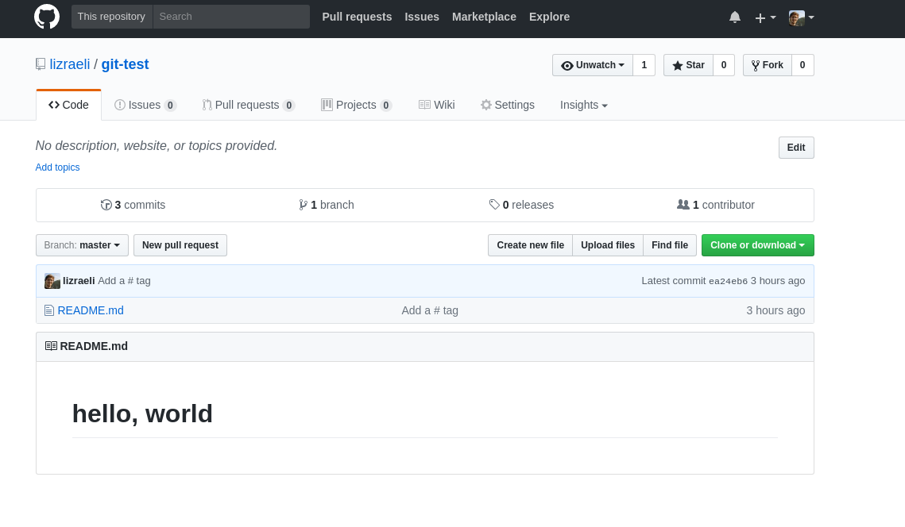

### The Readme File

By default, GitHub renders the markdown content of the Readme file in your repository's home folder. Let's create a new file titled `hello.js`, with the following content:

```js
function hello() {
  console.log("hello world")
}
```

The `git status` command should show the `hello.js` file as untracked. Now run the following commands:

```bash
$ git add .
$ git commit -m "add file hello.js"
[master 6254e59] added file hello.js
 1 file changed, 3 insertions(+)
 create mode 100644 hello.js
```

Now we can push the latest commit to our remote repo on the github website:

```bash
$ git push
Counting objects: 3, done.
Delta compression using up to 4 threads.
Compressing objects: 100% (3/3), done.
Writing objects: 100% (3/3), 323 bytes | 0 bytes/s, done.
Total 3 (delta 0), reused 0 (delta 0)
To https://github.com/lizraeli/git-test.git
   ea24eb6..6254e59  master -> master
```

Refreshing the page on GitHub should show the new file, and clicking on the file will lead to a new screen where the file's code is rendered.

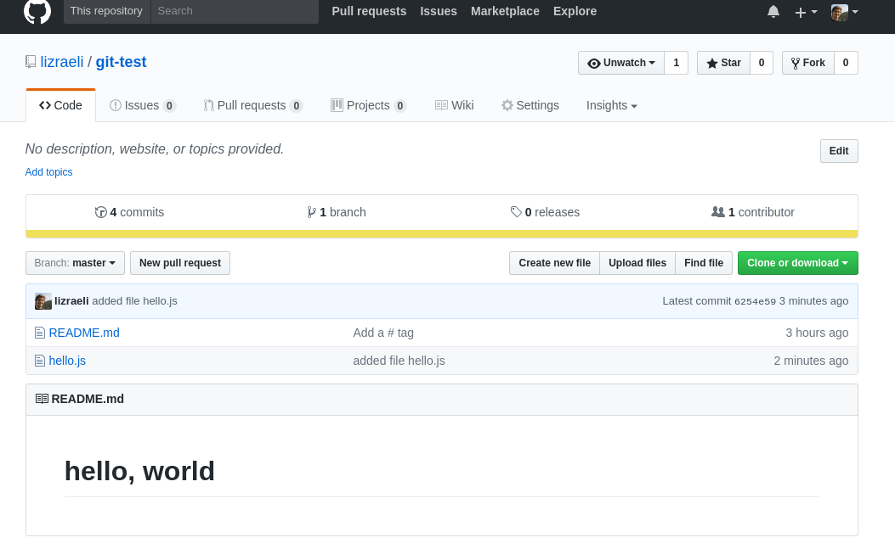

### Clone 

Once a repo is published to github and is listed as **public**, anyone can download the entire repo to their computer. This process is known as `cloning`.

As an example of a common collaboration workflow, we’ll simulate the case of two developers working on the same project, Peter and Lev. Lev will need to add Peter as a collaborator on the remote repository by going to the repo's page and clicking on Settings > Collaborators. Then, Lev will put Peter's GitHub username in the _Add collaborator_ box.

Once Peter gets the notification, he can accept the invitation to be a collaborator. Being a collaborator means Peter can also make commits on his local machine and push them up to the repo. Although anyone can clone a repo, only collaborators can push to it.

To clone the repo, click on the green `Code` dropdown. Make sure the `SSH` tab is selected, then copy the displayed URL.


Now, we can clone the repo!

If you don't have a folder called `sandbox` in your **home folder** (`~`) then go create one. If you do, `cd` into it.

Now we're ready to clone! 

```bash
$ git clone <put-your-clone-url-here>
Cloning into 'git-test'...
remote: Counting objects: 12, done.
remote: Compressing objects: 100% (6/6), done.
remote: Total 12 (delta 0), reused 12 (delta 0), pack-reused 0
Unpacking objects: 100% (12/12), done.
Checking connectivity... done.
```

> This creates a new folder with the same name as the project.

Now we have a copy of our repo in a different folder than the original!

Now, we will `cd` into the directory and modify the `README.md` file:

```markdown
# Test Repo

[our js file](hello.js)
```

The syntax above is a markdown link: the text between the square brackets is the text, and the square between the parentheses is the link itself. Since it does not include `http` or `www` it will be interpreted as a relative link in the current folder, to the file `hello.js`. Now, running `git-diff`:

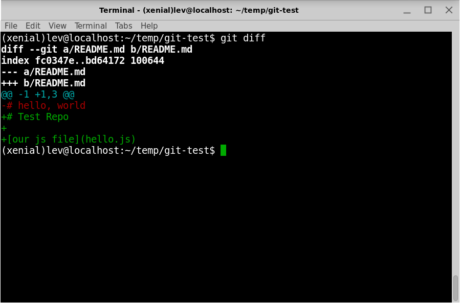

We see that the `hello, world` line has been removed, and three new lines have been added. Now we will run `git commit`:

```bash
$ git add .
$ git commit -m "added a link in readme to hello.js"
[master 9fbf058] added a link in readme to hello.js
 1 file changed, 3 insertions(+), 1 deletion(-)
```

And `git push`:

```bash
$ git push
Counting objects: 3, done.
Delta compression using up to 4 threads.
Compressing objects: 100% (2/2), done.
Writing objects: 100% (3/3), 325 bytes | 0 bytes/s, done.
Total 3 (delta 0), reused 0 (delta 0)
To https://github.com/lizraeli/git-test.git
   6254e59..9fbf058  main -> main 
```

### Pull

Going back to the original repo in `~/git-test`, we will run the command `git pull` to get the latest changes from our remote repo (github).

```bash
~/git-test$ git pull
remote: Counting objects: 3, done.
remote: Compressing objects: 100% (2/2), done.
remote: Total 3 (delta 0), reused 3 (delta 0), pack-reused 0
Unpacking objects: 100% (3/3), done.
From https://github.com/lizraeli/git-test
   6254e59..9fbf058  main     -> origin/main
Updating 6254e59..9fbf058
Fast-forward
 README.md | 4 +++-
 1 file changed, 3 insertions(+), 1 deletion(-)
```

Since there are no conflicts with local files, the local ones have been updated. We can see a list of the files changed (just one in this case) and a summary of the changes on the last line.

### Git log

The `git log` command can show the entire commit history of our repo. For each commit, it will show its id, the author, the date, and the commit message. To limit the number of commits we can add the flag `-[number]`: this will show the provided number of commits, from newest to oldest.

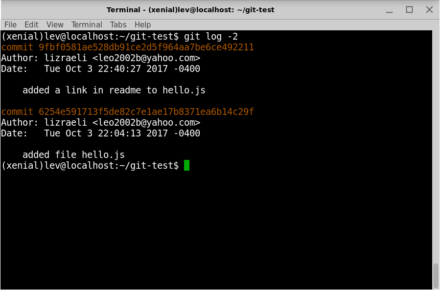

Github also shows us this in a different format on a nice webpage, but sometimes it's helpful just to quickly look in our terminal.

The important thing to notice here is the long string of characters after the word `commit`. This is called the **commit sha** which is a unique identifier for each commit.

```
commit aba9ad9ae8d8ff6a23a10a691f690f7934d47986
```

We'll use this in a later step!

## Forking

Forking is similar to cloning!

The main difference here is that forking makes a copy **on your github** instead of on your local computer.

Once you fork a repo, you can then clone that fork down to your local machine and push changes back up to **your github**. 

Pair up with another fellow and slack each other links to your `git-test` repositories. Then click the **Fork** button in the top right. If you get a prompt asking where to fork, click on your github account name. This will copy the repo to your github profile.

## Making a pull request

Once you have forked a project you can make commits to your copy of it, then using github, make a **pull request**. A pull request, or PR, is basically a way to ask the original contributor to merge your changes back into their project.

This is a very common workflow on github, and it's one of the reasons github and open-source software are so popular. We'll also use it for most assignments during this class!

The steps look like this:

* Fork the project you want to make a PR to
* `clone` the forked copy, **NOT the original**.
* Make the changes in the code that you want to make
* Commit those changes locally
* Push the changes to your forked copy
* Make a pull request on github
* The original author will see that a PR has been made and can choose to accept or close the PR. You cannot delete a PR once it has been made, because you cannot delete anything in git.

We'll walk through this together!

## Git reverts

One fundamental philosophy of git is that it's **append only**. This means you can't delete a commit, because that would be deleting some of the history of the project.

We do have an option in case you want to _undo_ something previously committed, and that's the `revert` function.

A `revert` is basically another commit that does the opposite of a commit. So if you added 4 lines and removed 2, a revert would remove those 4 lines and add 2.

When doing a revert, you have to tell git **which commit you want to revert**. This is where `git log` and the `commit sha` come in handy.

Steps to revert:
* Make sure you don't have any un-committed changes.
* `git log` to see the commits and associated `sha`s
* Copy the entire sha of the commit you want to revert
* `git revert <sha>`
* Enter a commit message. Close the window that you wrote the message in.
* Your revert should be done! Check the contents of the files to see if the changes are there.


## Resources

- [Git tutorials](https://www.atlassian.com/git/tutorials)
- [Git cheatsheet](http://ndpsoftware.com/git-cheatsheet.html)
- [Git flight rules](https://github.com/k88hudson/git-flight-rules)
- [Try Git](http://try.github.io)
- [Pro Git ebook](https://git-scm.com/book/en/v2)
- [Learn Enough Git To Be Dangerous](https://www.learnenough.com/git-tutorial)
- [Oh Shit, Git!](https://ohshitgit.com/)
