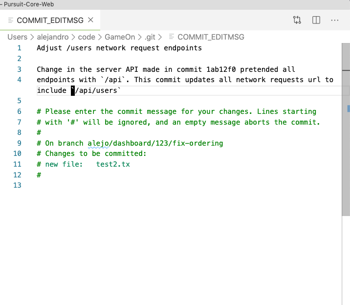

# Git & Github Best Practices

Great, you have already mastered the [basics of `git`](./README.md) now let's learn some best practices for how to do those basics and do it as the professionals do it.

## Common Git Subcommands Review
| command                                                             | description                                                                                                           |
| ------------------------------------------------------------------- | --------------------------------------------------------------------------------------------------------------------- |
| git pull                                                            | Pull all new commits from upstream                                                                                    |
| git add -A                                                          | Stage all changes                                                                                                     |
| git add /path/to/file                                               | Stage all changes at a given filepath                                                                                 |
| git commit -m 'commit message'                                      | Commit all staged changes with a given message                                                                        |
| git push -u origin master                                           | Use the first time pushing changes to a new remote repo/branch so that git remembers where pushes should go next time |
| git push                                                            | Pushing current branch changes to a remembered remote and branch                                                      |
| git checkout -b 'new-branch'                                        | Create a new branch                                                                                                   |
| git checkout 'existing-branch'                                      | Switch over to an existing branch                                                                                     |
| git checkout /path/to/file                                          | Permanently delete all unstaged changes a given file.                                                                 |
| git branch                                                          | View the current branch                                                                                               |
| git remote add origin 'https://github.com/username/projectName.git' | Link a local repo to a remote repo in github                                                                          |


## Recommended Github Settings

### Protect Master Branch
Protect master branch against non-reviewed merges
1. Go to **Branches** in your project's GitHub repo settings. Its URL would be something like `github.com/<user_name>/<project_name>/settings/branches`
2. Create a new protection rule by clicking the **Add rule** button.
3. In the **Branch name pattern** type `master`. Master is the branch we want to protect. 
4. Check the checkbox **Require pull request reviews before merging**.
5. Set the dropdown **Required approving reviews** to **1**
6. Check the checkbox **Dismiss stale pull request approvals when new commits are pushed**. If new commits are pushed to a branch that currently has a PR open then those commits need to be reviewed before it can be merged.
6. Check the checkbox **Include administrators**.
7. Lastly hit **Save changes**
* Docs: [Configuring protected branches on GitHub](https://help.github.com/en/github/administering-a-repository/configuring-protected-branches)

### Setup a PR template
Professional developers and specially open source developers utilize PR templates to standardize the process as well as ensuring that the PR owner has followed all the outlined steps for a streamlined merge.

1. Make sure you don't have uncommitted changes (a.k.a a dirty tree).
2. At the root of your project directory, create a new folder `/docs`.
3. Download the Pull Request template file [found here](./PULL_REQUEST_TEMPLATE.md)
4. Save it in `/docs`. Make sure it has the name `PULL_REQUEST_TEMPLATE.md`
5. Make sure to stage, commit and push your changes.
6. Next time you make a PR in GitHub you will see the PR template come up where you would make your write up for it. You will need to replace the placeholders/comments and fill out the template as necessary and appropriate for the code you want to get merged. Make sure to take the time to do this.
* Docs: [Creating a pull request template for your repository](https://help.github.com/en/github/building-a-strong-community/creating-a-pull-request-template-for-your-repository)

## Setup VScode or Atom as your editor for Git 
By default the editor git uses is `nano` or `vim` and those can be a bit tricky to deal with.
Setting your preferred editor will let you enter a message when committing without the `-m` option or when having merge commits. This is especially helpful when commit messages cannot be short and descriptive at the same time. When you execute `git commit` without `-m` your text editor will open up and you can enter a commit message that can include a title and a description. Once you save and close the file git will finalize the commit with your entered message.

* For VScode
```
git config --global core.editor "code --wait"
```

* For atom
```
git config --global core.editor "atom --wait"
```

### Example
A commit with title and description
```
Adjust /users network request endpoints

Change in the server API made in commit 1ab12f0 pretended all
endpoints with `/api`. This commit updates all network requests url to include `/api/users`
```


* Don't forget to save and close your file once done.
* Docs: [How to use Visual Studio Code as Default Editor for Git](https://stackoverflow.com/a/36644561/8662171)

## Workflow
Working in a group project contributing to a shared repo will undoubtedly lead to merge conflicts. If an organized work flow is followed you can keep your merge conflicts, and time spent in them to a minimum.

### Branching
* All work should be happening in **feature branches** never in `master` directly.
* The `master` branch should always be in a mint/working state. It is your **production** branch.
* When branching off to go work on a new feature of your project
  1. Always switch to `master` before branching and get the latest changes with `git pull origin master`. This ensures you branch off from an up-to-date `master` branch.
  2. Create **feature branch** with a name that follows this naming structure: `<author>/<feature>/<ticket_number/<short-description>`

    Example: 
    ```
    git checkout -b alejo/blogs/2510275387/logo-fix
    ```
    **Note**: Your `<ticket_number>` is your Basecamp todo id, which you can find in the url of a todo. If using trello it can be your trello card id and so on for other project management tools
* Feature branches should never run for too long. There's no right number of commits but it is helpful to think about an approximate for how many commits it will take to complete a feature.
* Delete your feature branch once it has been merged into master.
* Repeat

### PRs
* Always merge code only through Pull Requests from feature branches against `master`.
* Keep your PRs small in terms of lines of code. This goes hand in hand with short-lived feature branches.
* Right before creating a PR in GitHub, pull changes from the `master` branch into your feature branch to ensure no other code that has made it to `master` affects your code. Do this just `git pull origin master`.
* If merge conflicts arise from pulling from `master` make sure you code works around them or solve them in consultation with your team. VScode has excellent support for visually solving merge conflicts, [see here](https://code.visualstudio.com/docs/editor/versioncontrol#_merge-conflicts)
* Once you have completed your work in your feature branch and verified that upstream changes in `master` do not affect it. Make a PR in GitHub
* Fill out and replace the placeholders in the PR template that was setup earlier. Be as descriptive as possible and tag stakeholders if necessary.
* Because we protected the `master` branch earlier one of your team members will need to review and approve your PR before it can be merged into `master`. Make sure to let them know you are done and need someone to look at your code.
* A PR reviewer approves or leaves feedback for the PR owner to fix or adjust his/her approach or code as necessary. Once new changes/commits have been done the PR owner needs to notify the team and ask for review again.
* Once a PR is merged, celebrate!!

### Merge Conflicts

Some conflicts are unavoidable in the process of development. When you encounter a merge conflict, there are several tools you can use to resolve the conflict and move forwards.

At the simplest level, git reads the current text of a file line-by-line to look for changes from the previously-committed text. Thus, merge conflicts most often occur when git cannot figure out how lines of code (which are generally just text in a file) from one branch should interact with and be arranged relative to the lines of code in another branch.

Ultimately, a conflict arises because the code you are trying to merge in differs from the code that is already present. Typically this isn't a problem -- you're trying to add new things after all! This is only a problem if git can't find a single way to combine the different versions. 

#### Examples
###### No conflict example
In the code snippets below, there is no conflict when merging feature-branch `alejo/dog/18367gd7/add-bark` into `master`.

Branch: `master`
```js
const dog = {
  name: 'Pluto'  
}
```

Branch: `alejo/dog/18367gd7/add-bark`
```js
const dog = {
  name: 'Pluto'  
  bark: console.log('Woof!!')
}
```
###### Conflict example
In the code snippets below, there is a conflict when merging feature-branch `alejo/dog/18367gd8/update-bark` into `master`. This is because `bark`'s implementation was updated in master and in the feature-branch. Git doesn't know which of the `bark` it should pick. It then gives up and tells you to deal with the conflict and decide what the final version should like like.

Branch: `master`
```js
const dog = {
  name: 'Pluto'  
  bark: console.log('Rrrr Woof!!')
}
``` 

Branch: `alejo/dog/18367gd8/update-bark`
```js
const dog = {
  name: 'Pluto'  
  bark: console.log('Ruff-Ruff!!')
}
```


#### Anatomy of a merge conflict

When you do inevitably run into a merge conflict, git tells you where the issue occurred. In the files with conflicts, you will see **git conflict markers**.

Imagining the above conflict happened when you pulled from `master` after your implementation of the `bark` function and before you made a PR, the merge conflict will look like in the code below:

```
const dog = {
  name: 'Pluto',
<<<<<<< HEAD
  bark: console.log('Ruff-Ruff!!')
=======
  bark: console.log('Rrrr Woof!!')
>>>>>>> 77542cq35a11db4580b80ae27e8d65caf5211111
}
```

1. `<<<<<<<` is the conflict marker that notes that the code in your local branch begins to divert from and conflicts with the other branch at this point.
2. After the first line line, and before the line `=======`, is the code on your branch that cannot be merged given its difference from the second branch.
3. `=======` is the conflict marker that notes that the code from your conflicting local branch is complete, and that the conflicting code from the second branch will be listed below
4. Code from the second branches
5. `>>>>>>>` is the conflict marker that notes the end of the code in the second branch, and thus the end of that particular merge conflict.

#### Resolving
Resolving merge conflicts can be tricky; sometimes the code in your branch is meant to replace the code from the prior branch, but at other times some content from both branches will need to remain in the code base. Testing your code is important; you should make sure the code works before declaring the change resolved!

To resolve a particularly tricky merge conflict where you may not be sure of have the big picture to proceed, it is better to reach out to the team or the other branch owner and have a conversation about how to resolve the conflict.

1. If you had a merge conflict `git`'s output will let you know. Read the message carefully.
2. `git status` will show which files have merge conflicts by saying `both modified:` in its output, something like:
  ```
    both modified: server/models/dog.js
  ```
3. Once you have identified the files that have merge conflicts, open them in your text editor and having in mind the conflict's anatomy reviewed above proceed to resolve. Remember to start a conversation with the team/stakeholders if you are not sure.
> vscode has great support to resolve merge conflicts by coloring purple the filenames of files with conflicts in the file explorer as well as giving you easy-to-click options for accepting incoming, current or both changes. See [here](https://code.visualstudio.com/docs/editor/versioncontrol#_merge-conflicts)

4. To fully resolve a conflict, all lines with conflict markers must be removed, and then a new commit be made.


## Supporting Resources
* [A successful Git branching model](https://nvie.com/posts/a-successful-git-branching-model/)
* [How to use Visual Studio Code as Default Editor for Git](https://stackoverflow.com/a/36644561/8662171)
* [Writing good commit messages a practical guide](https://www.freecodecamp.org/news/writing-good-commit-messages-a-practical-guide/)
* [VS Code - Git Support](https://code.visualstudio.com/docs/editor/versioncontrol#_git-support)
