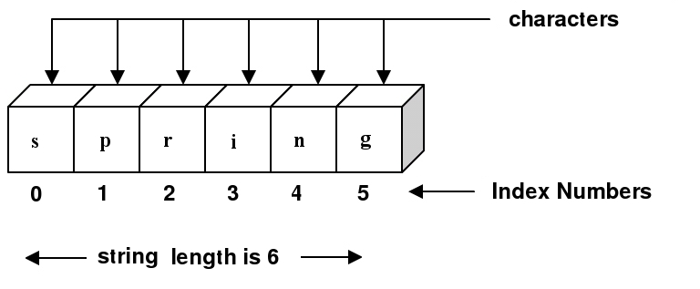

# Strings

## Objectives

* Understand what a string is
* Explore properties of strings
* Utilize built in methods and properties to manipulate strings

## Keywords

* string
* sequence
* character
* index number
* methods
  * toUpperCase, toLowerCase, slice, split
* immutability

## Sources

* Eloquent Javascript: [Chapter 1, Under **Strings**](http://eloquentjavascript.net/01_values.html)
* Speaking JS: [Chapter 12](http://speakingjs.com/es5/ch12.html)

# 1. Strings Introduction

In the previous lesson on loops, we dealt with a lot of numbers which can get quite boring sometimes. **Strings** can provide a refreshing change. We have seen string values already and you can think of them as any characters that are contained within single (') or double (") quotes. Strings can also sometimes be referred to as a _string literal_.

```js
let string = 'I am a string! '
let anotherString = "I am also a string!"

console.log(string + anotherString)
```

A string is essentially a list of characters. A character is either a letter, number, punctuation mark, or white space. There are also a some special characters, two of which are quotation marks and new lines. If we are using single quotation marks, and want these inside our string, we must use a backslash (`\`). Say we want a string with the value: `so he said to me, 'hello there'`. We will need quotation marks for the outside, and inside we will use backslash - followed by a quotation mark:

```js
let str = 'So he said to me, \' hello there \''

console.log(str)
```

To make part of a string begin on a new line, use \n.

**Try it yourself!** Make a string variable that includes _quotation marks_ and _a new line_.

# 2. String Properties

Strings have many properties _built into_ them that we can access to find out specific information about it. These properties are part of the JavaScript language, so every string we create in JavaScript will have the _same_ built-in properties. We access a property using a dot (`.`) followed by the property name. Properties that are functions are called `methods`. We can apply the same methods to any character in the string (using its index number). This is because each character is also of type string - a string with the length of `1`.

### String Index

Each characters in a string has its own **index number** which represents the characters location in the string - these start at **0** and increase by **1** for every subsequent character. We can access each single character in a string by using square brackets in which we write that character's index number.



```js
let word  = 'spring'

// let's print the `s`
console.log(word[0])
//

// let's print the `p`
console.log(word[1])

// how would we print the `g`?
console.log(word[_])
```

### String Length

Above our `word` had 6 characters so its length is equal to 6. If we wanted to see how many characters we have in a string, we can use the **string length property**. All string variables have a property called **length** that holds the number of characters in that string:

```js
let myString = 'spring'
console.log(myString.length)
// => 6
```

### Last Character

How do we access the last character of a string? That depends on the length of that string.

```js
let str = 'dog'
console.log(str[2])

let str2 = 'animal'
console.log(str2[5])
```

Once we know the length, we simply subtract `1` from it and get the last element. This is because strings start at index `0`. Since we have the string `length` property at hand, all we have to do is subtract `1` from it, and use the result as the index we wish to access.


```js
let str = 'dog'
// subtracting 1 from the length to get last character
console.log(str[str.length - 1])

let str2 = 'animal'
console.log(str2[str2.length - 1])
```


# 3. Modifying Strings

Just like numbers, we can **modify** string variables after declaring them. We can add characters to the end of a string by using the `+` operator. This is called _concatenation_ which means "to link things together." The shorthand `+` and `+=` work in the same way for strings as they do for numbers.

```js
let str = 'hello'
str += ' there'
console.log(str + " beautiful!")
// => hello there beautiful!
```

We can use concatenation inside a loop to keep adding characters to a string. For example, let's say we want to print all the numbers between 1 and 5, in the same line, separated by commas. We start by creating an empty string using `''` or `""` which tells JavaScript that our variable is an empty string. Remember, quotes tell JavaScript that we're working with a _string_--without quotes, JavaScript will look for a variable with that name.

```js
let str = ''
let num = 5
for (let i = 1; i <= num; i++) {
  str += i + ', '
}

console.log(str)
```

Let's write a table like we did in the last lesson:

|i   | str                |
|:--:|:-----:             |
| 1  | '1, '              |
| 2  | '1, 2, '           |
| 3  | '1, 2, 3'          |
| 4  | '1, 2, 3, 4'       |
| 5  | '1, 2, 3, 4, 5, '  |

> How can we rewrite the code above so that we would not have a comma after the `5`? What can we check about the variable `i` to know that we are going to print the `5`?

### Immutability

While we have the ability to manipulate strings, we cannot directly change the characters in a string _permanently_. This is because strings are **immutable** which means they are unable to be mutated or changed. Above we didn't need to create a new `str` variable because we were not changing any of the existing characters in the string but instead reassigning `str` to a new, longer string. In the following examples, you will see that each time we want to change a string's characters we must save the changes in a _new_ variable or _reassign_ the existing variable a new value.

### toUpperCase

In addition to the `length` property, strings also have some properties that are functions. To call them, we use the dot notation, and follow the function name with parentheses. One string method is `toUpperCase`: when called for for a particular string, it will return the string value, but with letters in uppercase. If you wanted to capitalize the first letter in a string, you might want to do something similar to the following:

```js
let name = 'jane'
name[0] = name[0].toUpperCase()

console.log(name)
```

**But what happens?** It did not work as expected. There will not be an error, but `name` will still hold the value `'jane'`. This is because strings in JavaScript _**cannot** be modified permanently_. Variable types that cannot be changed are called _immutable_ which means they can't directly be mutated or changed. In order to change a string permanently, we need to either destruct it or create a new variable holding the changed string. There are multiple methods we can use to manipulate a string and save it as a new variable.

```js
let name = 'jane'
name.toUpperCase()
console.log(name)
// => jane

let upperName = name.toUpperCase()
console.log(upperName)
// => JANE

console.log(name[0].toUpperCase())
// => J
```

There's another method called `toLowerCase()` that works in the exact same way except makes all characters lowercase:
```js
let name = 'JANE'
let lowerName = name.toLowerCase()
console.log(lowerName)
// => jane
```

### Slice

It is still possible to do what we were trying above, but we will need a different way. Here is one way that is **not** recommended:

```js
let name = 'cat'
name = name[0].toUpperCase() + name[1] + name[2]
console.log(name)
```

What we did above was capitalizing the first letter, and then concatenating the second and the third. But this required knowing that the string length is exactly `3`. Now imagine if the string were much longer--say it was "i am a cat!". This would be really annoying and time consuming to add each letter individually to a new string variable.

Another way is using the `slice` method: We provide a beginning index and (optional) ending index, and it will return a copy of the string between the two indices. **The end index will not be part of the copy.**

```js
let name = 'alice'
let copy = name.slice(1,3) // will return just the letters at index 1 and 2, **not index 3**.
console.log(name, copy)
// => alice li
```

If we do not provide an ending index, we will get a copy from the starting index to the end of the string.

```js
let name = 'alice'
let copy = name.slice(2) // will return everything _after_ index 2
console.log(name, copy)
// => alice ice
```

We need to take the character at the `0` index, capitalize it, and concatenate the rest of the string to it.

```js
let name = 'alice'
let capitalized = name[0].toUpperCase() + name.slice(1)
console.log(name, capitalized)
// => alice Alice
```

### Split

Another useful built in method for strings is `split` which turns a string into an array. As you saw in loops, it is nice to be able to iterate through arrays so sometimes we may want to convert a string into an array. You _can_ iterate through a string using a loop but that would go one character at a time, which may not be what you need. `split` accepts a character as an argument and will split the string into an array based on that character. Most often you split on `""`, which splits the string into individual characters, or `" "`, which splits the string into words.

```js
let str = "Hello there! How are you?"
let chars = str.split('') // this will split the string into _characters_ and will not remove any characters
let words = str.split(' ') // this will split the string into _words_ and remove the spaces
let noLetterO = str.split('o') // this will split the string based on the _letter o_ and remove the o's

console.log(chars)
// => ["H", "e", "l", "l", "o", " ", "t", "h", "e", "r", "e", "!", " ", "H", "o", "w", " ", "a", "r", "e", " ", "y", "o", "u", "?"]

console.log(words)
// => ["Hello", "there!", "How", "are", "you?"]

console.log(noLetterO)
// =>["Hell", " there! H", "w are y", "u?"]
```

### Number to String

When using the `+` operator between a number and a string, the number will automatically convert to a string.

```js
let str = 'My favorite number is: '
let num = 42
let sentence = str + num
console.log(sentence)
console.log(typeof(sentence))
```

We can also turn a number into a string by using the `.toString()` method.

```js
let numberToString = 5
typeof numberToString.toString() // => 'string'
```

*Bonus:* To turn a string into a number you can use `Number(string)` or `parseInt(string)`.
```js
let stringToNumber = '5'
typeof parseInt(stringToNumber) //=> 'number'

typeof Number(stringToNumber) //=> 'number'
```

# 4. String Interpolation

As you've seen, when we want to add a variable to a sentence, we have to add it in using the `+` sign like so:

```js
let name = "Matt"
let sentence = "Hello, my name is "
console.log(sentence + name + ".")
// => Hello, my name is Matt.
```

This can become a lot of work quickly. Luckily, JavaScript has some functionality built into it that allows us to use _interpolation_, or insertion, to add variables into a string. To do this, we use backticks, &#96; , (located beneath your escape key) instead of quotation marks. Then, wherever you'd like to insert your variable, you add a dollar sign (`$`) and enclose the variable name inside curly braces `{}` like so:

```js
let name = "Matt"
let sentence = `Hello, my name is ${name}.`
console.log(sentence)
// => Hello, my name is Matt.
```

This is much easier! Especially if you want to interpolate multiple values or change values:

```js
for(let i = 1; i <= 5; i++){
 console.log(`I'm number ${i}!`)
}
// => I'm number 1!
// => I'm number 2!
// => I'm number 3!
// => I'm number 4!
// => I'm number 5!
```
