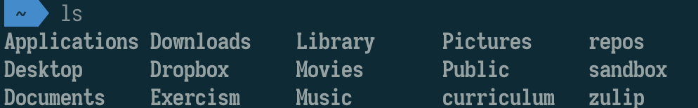
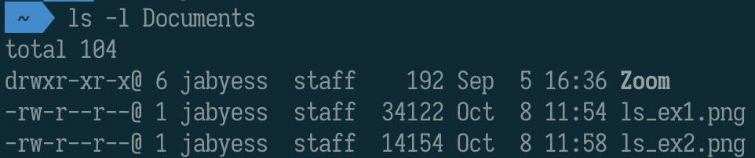

# The Command Line Cheat Sheet

## Objectives

- Learn about the command line interface
- Get comfortable using basic commands
- Build and navigate a folder structure

## Keywords

- Operating System (OS)
- Graphical User Interface (GUI)
- Command Line Interface (CLI)
- Terminal
- Shell
- Folder = directory
- `pwd` - print working directory
- `cd ..` - go to parent directory (aka up)
- `cd [folder]` - go into folder
- `~` - represents your home folder
- `ls` - list files and subfolders in current folder
- `touch [filename]` - create a new file
- `mkdir [directory name]` - make a new directory
- `rm [filename]` - remove (delete) a file
- `rm -r [directory name]` - remove (recursively) a folder, all files, subfolder, subfiles, etc. Will prompt if trying to remove special files.
- `mv [filename] [foldername]` - move a file to a different folder
- `mv [filename] [new filename]` - rename a file
- `code [filename]` - open the VSCode editor

## Resources

- Tree House: [Introduction to the Mac OS X Command Line](http://blog.teamtreehouse.com/introduction-to-the-mac-os-x-command-line)
- Git Tower: [Command Line 101](https://www.git-tower.com/learn/git/ebook/en/command-line/appendix/command-line-101)
- Command Line Cheat Sheet : [Cheat Sheet](https://www.makeuseof.com/tag/mac-terminal-commands-cheat-sheet/)
- Linux command line for beginners : [Beginner tutorial](https://tutorials.ubuntu.com/tutorial/command-line-for-beginners#0)

## What is the terminal?

One way people interact with their operating system (be it Mac OS, Windows, or Linux) is through the Graphical User Interface - or, in short, the GUI. GUIs use graphics, along with a keyboard and a mouse, to provide an easy-to-use interface. They provide windows, pull-down menus, buttons, scrollbars, and icons, enabling the user to interact with the operating system or application.

A command line interface (CLI) enables users to type commands in a terminal or console window to interact with an operating system. Users input commands and (usually) receive responses back from the system.

A note for folks who might ask: We utilize "terminal" and "command line" interchangeably here - though they aren't exactly the same thing.

## Getting Started

We recommend using `iTerm`, which you should have installed during the setup day.

If you don't have it you can just use `Terminal`.

Use Spotlight (`command + space`) to search for `iterm`, and open it.

Depending on your shell (bash is the default, but hopefully you installed zsh, you should see something like this:

```
➜ ~
```

The `~` symbol stands for your home directory. This is the default directory that you will start in whenever you open a new terminal window.

## Finding Where We Are

In the console, you are always in a directory (AKA folder). The terminal's currently selected directory is called the working directory. You can see where you are using `pwd` (AKA "print working directory").

```bash
$ pwd
# /Users/yourUserNameHere
```

Before we get into other commands, lets break down some syntax.

## Command syntax

All terminal commands follow the same general convention.

```
commandName -flags parameters
```

Let's break this down:

**commandName**

The name of a utility or program that runs. Examples are `ls`, `cd`, `pwd`, etc.

```bash
$ pwd
```

**parameters**

Often you want to tell the command WHAT to act on. So parameters are the names of files or directories that you want to do something with.

```bash
$ cd Documents
```

Some commands let you specify multiple parameters, which you do just by putting a space between each one.

Some commands don't accept a parameter at all (like `pwd`, since it only applies to the current directory). Others have a default value.

For example if we just type `cd` it will automatically take us to the home directory, also known as `~`.

If we just type `ls` it lists the contents of the current directory.

**flags**

Many commands take flags, which modify the way a command behaves.

```bash
$ ls -l Documents
```

In this case the `-l` flag means list the contents in **long** format. Or basically, put each entry on its own line.

To combine multiple flags, just put them next to each other.

```bash
$ ls -lhp Documents
```

This is the equivalent of writing `ls -l -h -p Documents`.

Try out various combinations and see what the results are!

## Flags Documentation

To see the possible flags for any command, just type `man` (for manual) and then the command you want to look up. This will open an interactive window that you can scroll up and down through using the arrow keys. Press `q` to quit.

```bash
$ man ls
```

## Listing Files

The `ls` command lists the contents of the current directory.

Output:



We can also list the contents of any directory by just providing the path.


And we can change how the output looks by providing a flag! The most useful one is probably `-l`, because it makes the output `long` which puts every result on its own line, making it easier to read when you have a lot of files.



## Navigation

You can change your directory with cd ("change directory"). If you follow this command with a name, it will move you to that directory. Without an argument, it will take you to your home directory (`~`).

```bash
$ pwd
# /Users/jabyess
$ cd Downloads
$ pwd
# /Users/jabyess/Downloads
$ cd
$ pwd
# /Users/jabyess
```

### Relative vs Absolute paths

A crucial concept in navigating directories is thinking about _how to specify where we go_.

There are two main differences here - relative and absolute.

Think of absolute paths as something like a street address, or GPS coordinates. They are always the same value, and they tell you exactly where a location is, regardless of where you currently are. All of the information you need to know is embedded in an absolute path.

Relative paths are different, you can think of them more like directions. To understand a relative path you need to know **where you are** AND **where you're going**. If you were at 42nd St and 7th Avenue (sorry tourists), how would you navigate to 59th and Lexington?

Understanding the difference between these two concepts will help you in navigating your own computer.

### Computer filesystem

Pretty much all computers are organized in a hierarchical filesystem. This means that there is a top-level directory, which contains subdirectories, and those contain directories, and so on.

```
/
├── Applications
├── Library
├── System
├── Users
    ├── Shared
    │   ├── SC Info
    │   └── adi
    └── jabyess *
        ├── Applications
        ├── Desktop
        ├── Documents
            ├── Zoom
            │   └── 2020-09-05 HTMLWorkshop #3
            ├── ls_ex1.png
            ├── ls_ex2.png
            └── ls_ex3.png
        ├── Downloads
        ├── Dropbox
        ├── Exercism
        ├── Library
        ├── Movies
        ├── Music
        ├── Pictures
        ├── Public
        ├── curriculum
        ├── repos
        ├── sandbox
        └── zulip
├── tmp
├── usr
└── var

* is your home directory
```

On a mac, `/` is the root directory. `cd` to it and then you can `ls` to see what's inside - you'll discover similar folder names as above.

If you want to navigate “up”, to the directory that contains your current directory, you can use the special name `..`. From the `Documents` directory, this command will take us back up to the home directory.

```bash
cd ..
```

...And we're back home!

### Creating Files and Folders

The `touch` command creates a new file with the provided name. For example:

```bash
touch foo.js
```

Will create a new JavaScript file with the name `foo.js` in the current directory.

The `mkdir` command creates a new folder with the provided name. For example:

```bash
mkdir js
```

Will create a folder named `js`.

## Editing Files and Folders

- The `cp` command creates a copy of a file. For example:

```bash
cp bar foo
```

Will make an exact copy of `bar` and name it `foo`.

- The `mv` command will move a file to a different location or will rename a file. For example:

```bash
mv bar foo
```

Will rename the file `bar` to `foo`. `mv foo ~/Downloads` will move the file `foo` to the `Downloads` directory, but it will not rename it.

- The `rm` command removes a file. For example:

```bash
rm foo
```

Will remove a file named foo in the current directory.

- The `rmdir` command will delete an empty directory. To delete a directory and all of its contents recursively, use `rm -r` instead. Note that **this is extremely dangerous** to do for larger files. Only do it whan you really mean it!

- The mkdir command creates a new directory. For example:

```bash
mkdir music
```

will create a new directory called `Music`.

## Opening Files

To open a file and view its contents, type the name of the app you would like to use to open it. For example, we will use a text editor called **Visual Studio Code** to open a text file:

```bash
code foo.js
```

To open all files in a folder enter the following.

```bash
code .
```

The keyword **open** will open a file/folder in the Finder (on Mac) or the GUI-based file manager (on Linux).

## Tips

- Use tab to autocomplete. for example, if the current folder has subfolders titled `games`, `photos` and `photography`, typing `pho` and pressing the tab key will result in displaying `photo` and `photography`. If we then type the letter `g` to get `photog`,and press the tab key - the command will be autocomplete to `photography`.

- You can also use the up and down keys to step through the commands typed before.
