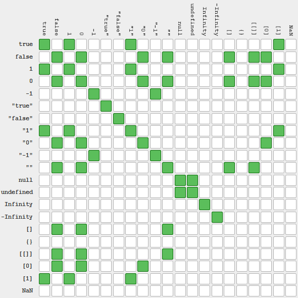

[](https://pursuit.org)

# Values, Types, and Operators in JavaScript

Learn some fundamentals in JavaScript!

## Objectives

* Understand what values are in JavaScript.
* Know some basic (primitive) types:
  * Number
  * String
  * Boolean
  * undefined
* How to check for types (`typeof`).
* Understand what operators are and how to use them:
  * Math
  * Modify "strings"
  * Compare boolean values
* Learn about expressions and order of evaluation.

## Background & Framing

In programming, much of what we do is manipulating pieces of data. Data comes in many forms, like numbers, text, and other arrangements. We call different pieces of data different `types`.

A type is a specific way of representing data - you can almost think of different types as different categories of words, like `nouns`, `verbs`, or `adjectives`. They serve different purposes, but they're still all words.

When we talk about data, we need to know two things - the `value` of the data, and the `type` of that value.

The basic types of values in JavaScript are: **number, string, boolean, and undefined**. We call these `primitive types`. There are a few other types that we'll get to in later lessons.

Along with `types`, we also have `operators`, which are things that we can use to compare or modify values. You've probably seen `+` or `<` or `===` before - these are all considered operators.

## Numbers

Open up your javascript `repl` by typing `node` in your terminal. You can follow along and try out some things!

To create a number, we just type the value of the number. Both positive and negative numbers work:

```js
> 42
42

> 23815
23815

> -545
-545
```

This is called a `literal` because the representation of the value is exactly as it is written. 42 is 42.

## Operators

An **operator** is one of a predefined group of words and symbols.
It takes one or two values, does some work behind the scenes, and returns the result of that work.

For example, the `+` operator takes two numbers, adds them, and returns the sum.

In JavaScript, some operators, such as `+`, `-`, `*`, `/`, will take one value from their left side and one value from their
right side.

Other operators, such as `typeof` (discussed below) take only a value on their right side.

## Operator Arithmetic

We can do arithmetic operations using the  `+`, `-`, `*`, and `/` operators. We may also use parentheses `()` to affect the order of operations.

Javascript will evaluate **expressions** and return a single number.

```js
> 2 + 2 * 4
10

> 23 * 2 - 4 / 4
45

> ((23 * 2) - 4) / 4
10.5
```

We can also use ** to do exponents!

```js
> 5**2
25

> 5**3
125
```

Another useful operator is `modulo`, the remainder operator.

```js
> 6 % 2
0

> 6 % 4
2

> 5 % 2
1
```

This gets the remainder of dividing the left number by the right. For instance, in the last example, two goes into five twice (4), leaving behind a remainder of 1.

### Special Numbers

Occasionally, we will come across special values that are of the number type, but do not look like numbers. Two of these are `Infinity` and `NaN` - _Not a Number_. For example, zero divided by zero has no defined value, and results in `NaN`:

```js
> 0 / 0
NaN
```

Division of a non-zero number by zero will result in `Infinity` (there is a mathematical basis for this but it's not crucial for our purpose)

```js
> 2 / 0
Infinity
```

### Strings

Strings are used to represent text. To create a string, write any text enclosed by either "double quotes" or 'single quotes'. Just don't mix single and double quotes together!


```js
> 'Hello there'
'Hello there'

> "What is up"
'What is up'

> "why not'
^^^^^^^^^

Uncaught SyntaxError: Invalid or unexpected token
```

The `+` Operator can be used to join two strings together.

```js
> 'My name is Jo' + 'hn'
'My Name is John'
```

The is called **string concatenation** (verb: concatenate).

### The `typeof` Operator

The `typeof` operator returns a string with the type of the value that follows it.

```js
> typeof 2
'number'
> typeof 'John'
'string'
```

The earlier operators required two values - one to the left and one to the right.

By contrast, `typeof` only takes one value. The `-` (minus) operator can also take a single value, when placed to the left of a mathematical expression:

```js
> - (2 * 4)
-8
```

> Note: the left hand and right hand sides of an operator are called **operands**. We can say that the `-` and `typeof` operator take a single operand.

## Booleans

Boolean is a type that can only have one of two possible values: `true` or `false`, usually indicating whether a statement is, in fact, true or false. Boolean values are returned when using certain operators.

```js
> true
true

> false
false
```

### Comparison Operators

Comparison operators include `===`, `>`, `<`. These do not modify values, but rather test the relationship between them. The test returns one of the two boolean values.

- `===` - Tests for Equality. Is "this" the same as "that"?
- `!==` - Tests for inequality. Is "this" different from that "that"?
- `>` - Greater than. 3 > 2 : Is 3 greater than 2 ?
- `<` - Less than. 3 < 2 : Is 3 less than 2 ?
- `>=` - Greater than or equal to.
- `<=` - Less than or equal to.

```js
> 2 === 2
true

> 2 === 3
false

> 2 > 1
true

> 3 >= 2
true

> 3 <= 3
 true
```

Strings can also be compared:

```js
> 'Tom' === 'Jerry'
false

> 'cat' !== 'dog'
true

> 'cat' === 'cat'
true

> "hello" < "y"
true
// why does this happen?
```

### Creating and Comparing Booleans

A boolean type can be created by simply typing one of the values:

```js
> true
true
> false
false
```

JavaScript knows what `true` and `false` mean, they are special keywords. `true` and `false` are not strings, they are **booleans**. If we attempt to evaluate other arbitrary words without quotations, it knows that they are not booleans, nor are they strings, and it throws an error:

```js
> broom
Uncaught ReferenceError: broom is not defined
```

We can also use `typeof` with boolean values:

```js
> typeof true
'boolean'
```

Boolean values can be compared, in the same way that we compare numbers and strings:

```js
> false === false
true
> true === false
false
> false !== true
true
```

## Logical Operators

The three logical operators are:

* AND, written as `&&` 
* OR, written as `||` 
* NOT, writen as `!`. 

### The AND (&&) Operator

We use the `&&` operator to test if statements made on both sides of the operator have a truthy value.
For example:

```js
> true && true
true

> true && false
false

> false && true
false

> false && false
false
```

This works for expressions as well:

```js
> 1 === 1 && 2 === 2
true
```

In the statement above, both the right and the left-hand sides of the `&&` operator evaluate to `true`.
So the above is equivalent to writing:

```js
> true && true
// (1 === 1 is true) && (2 === 2 is true)
true
```

The `&&` operator will evaluate to `truthy` only if both left-hand and right-hand sides are truthy. Otherwise it will return something `falsy`:

```js
> 1 === 1 && 2 === 3
// 1 === 1 is true
// 2 === 3 is false
// therefore the entire statement is false
false
```

A fun fact about the `&&` operator: if the left side evaluates to falsy, it stops evaluating and ignores the right side. This is called short circuiting. 

### The OR (||) Operator

We use the `||` operator to check if one of two statements is truthy.

This will be `falsy` only if both left-hand side and right-hand side are falsy:

```js
> false || true
true

> true || false
true

> true || true
true

> false || false
false

> 2 === 3 || 4 === 5
false
```

A fun fact about the `||` operator: if the left side evaluates to truthy, it stops evaluating and ignores the right side. This is called short circuiting. 

### The NOT (`!`) Operator

The `!` operator, like `typeof` takes a single value to its right. It returns the opposite value as a boolean.

- given `true`, it returns `false`; given `false`, it returns `true`

```js
> !true
false

> !false
true

> !(1 === 2)
true
```

### Combining everything

Let's try some more complex examples!

```js
> !(1 === 2) && (5 === 5)
true
// 1 is not equal to 2, so it becomes false
// ! inverts false to be true
// true === true
// therefore the whole statement is true

> 5 !== 5 || !(2 === 5)
true
// 5 !== 5 is false
// 2 === 5 is false
// !(false) becomes true
// false || true evaluates to true
```

We can write down all the possible combinations of operators in a table. We use `A` and `B` to represent two expressions that are either true or false. We write in each row a unique combination of the possible values of `A` and of `B`. Given those values, we write the result of providing `A` and `B` to the `&&` operator. This is called a **truth table**:


You don't have to memorize this, with practice you will be able to look at an expression and figure out the answer, so you won't even need it!

## Expressions

All the code we've written in this lesson has consisted of **expressions**. An expression is anything that returns a value. `1 + 2` is an expression - it returns the value `3`. And `1 + 2 + 3 + 4` is also an expression, as well as `1 === 1`, which returns the boolean value `true`. The process of producing a value from an expression is called **evaluation**.

This process can be simple, as in the case of `1 + 2`.
In some cases, however, the evaluation can take multiple steps. The computer can only perform one operation at a time.
In the case of `1 + 2 + 3 + 4`, one and two will be added first, then their result will be added to `3`, etc.
We will use the arrow `->` as a symbol for _evaluates to_.

- `1 + 2 + 3 + 4`
- -> `3 + 3 + 4`
- -> `6 + 4`
- -> `10`

In the case of concatenating strings, a similar process will happen:

- `'af' + 'ter' + 'wards'`
- -> `'after' + 'wards'`
- -> `'afterwards'`

In the case of `1 === 2 || 3 === 3` the same process will happen. The computer will read the expression from left to right and identify the OR operator. To evaluate this operator, we need to check if either the left hand or right hand side are the value `true`. We typically start by examining the left hand side.

In this case, it is an expression, so we evaluate it. Since it returns the value `false`, we continue to examine the right operand of the `||` operator. This is again an expression, which returns the value `true`.

The entire expression, `1 === 2 || 3 === 3` returns `true`.

- `1 === 2 || 3 === 3`
- -> `false || 3 === 3`
- -> `false || true`
- -> `true`

The process outlined above is typical for evaluating expressions, both for JavaScript and for many other programming languages. When evaluating expressions, logical operators come first, followed by the comparison operators, followed by the arithmetic operators.

## Type Conversion

Type conversions may occur in expressions that feature different types. A common situation is when the `+` operator is used with a string and a number. In this case, the number will be converted to a string:

```js
> 'The number is ' + 42
'The number is 42'
```

This automatic conversion can lead to unexpected results:

```js
> '2' + 4
'24'
```

Since the number is converted to a string, the above was the same as writing `'2' + '4'` - like concatenating any two strings.

```js
> "hello" - 5
NaN
```

This is a little more tricky - since the `+` operator is used to add numbers as well as concatenate strings, it does the conversion from number to string for us. But with the `-` operator, it doesn't know what to do, so the result is `Not A Number`. (_Because JS is a quirky language there are some exceptions like subtracting a number from a string number. "55" - 5 evaluates to 50._)

## Truthy and Falsy

Everything in JS has a truthy or falsy value attached to it. Most things have a truthy value. Note that `true` and `false` are booleans, they're not the same as truthy and falsy.

If something is truthy it means that value **evaluates** to become true, but it's not a boolean. Same goes with falsy.

The falsy values in JS are:

- false
- 0 and other forms of numeric zero like -0, 0.0 and 0x0
- "", '' and `` - strings of length 0
- NaN - Not a Number
- null
- undefined

This means we can use operators to evaluate things that don't just value to `true` and `false` but also things that just have a truthy or falsy value.

```js
> true === ""
false

> "" && "hello"
"" // because empty string was the last side evaluated and empty string is falsy.

> "hello" && "goodbye"
"goodbye" // because 'goodbye' was the last side evaluated. Both sides have a truthy value.  
```

When the `||` operator interacts with truthy and falsy values, it behaves in an unusual way: if the left-hand side is truthy, the left-hand value will be returned (instead of `true`). If the left-hand side is falsy, the right-hand value will be returned (regardless of whether it evaluates as truthy or falsy).

For both `||` and `&&` the last side evaluated is what the expression will evaluate to. Short circuiting occurs when the left side is what the expression evaluates to. 

```js

> NaN || "hi"
"hi"

> false || 1
1

> '' || 0
0

> 'cat' || false
'cat'

> 0 || true
true

> false || ''
''
```

If the left-hand expression evaluates to false, the value in the right-hand side is returned:

```js
> 0 || 2
2
> '' || 'cat'
'cat'
```

There are many possible combinations of truthy and falsy values. Here's an example. The green square means that particular combination of values evaluates to true.

For example, true and "1" versus true and 0

**Note** these are true for `==` only . We won't be going into depth on `==` today but please be aware of the difference. `==` compares the left side and right side but does type conversion under the hood to try and make things work. 

`===` triple equals checks for strict equality and is what you should use 99.9% of the time. 

```js
> true == "1"
true

> true == 0
false
```



This is insane to look at, but again, don't worry about memorizing it. Just be careful what assumptions you make about which values are equal!

## Resources

- Eloquent JavaScript: [Chapter 1](http://eloquentJavaScript.net/01_values.html)
- Microsoft: [JavaScript Fundamentals](https://docs.microsoft.com/en-us/scripting/JavaScript/JavaScript-fundamentals)
  - Data Types
  - Operators
  - Operator Precedence
- [list of falsy values](https://developer.mozilla.org/en-US/docs/Glossary/Falsy)
- [example of truthy values](https://developer.mozilla.org/en-US/docs/Glossary/Truthy)
- Primitive types. [mdn](https://developer.mozilla.org/en-US/docs/Glossary/Primitive)
- Literals: [Wikipedia](https://en.wikipedia.org/wiki/Literal_%28computer_programming%29)
- Expressions: [Wikipedia](https://en.wikipedia.org/wiki/Expression_(computer_science))
- Truth tables: [Medium](https://medium.com/i-math/intro-to-truth-tables-boolean-algebra-73b331dd9b94)
- Comparing strings lexicographically: [stackoverflow](https://stackoverflow.com/questions/1863028/string-compare-logic)
