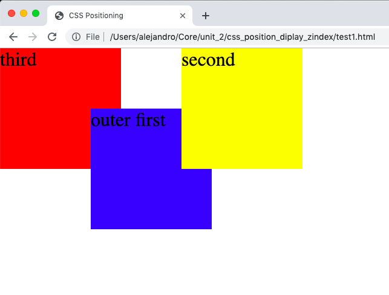
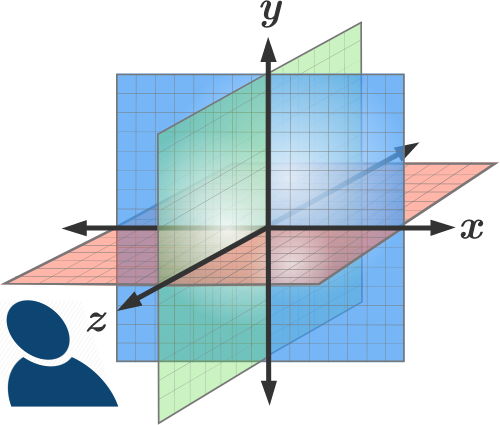

# Display, Position, and Z-Index 

## Goals 
* Know the following display properties:
  * block
  * inline
  * none
* Know the following position properties: 
  * static
  * absolute
  * relative
  * fixed 
* Understand how to use z-index

## Keywords
* display
* position
* z-index

# 1. Introduction

Elements have a variety of different display qualities that we can use to customize its appearance and position on the screen. Here, take a look at some of the more common ones that you might come across, as well as looking further into the `z-index`.

# 2. The display property

## display: block;

The element generates a block element box, generating line breaks both before and after the element when in the normal flow.
To see this, paste the following code into a display.html file and display.css file. You should see that each element stretches all the way across the screen. A block will always try to have a width of 100% inside its parent container.

``` html 
<!DOCTYPE html>
<html lang="en" dir="ltr">
  <head>
    <meta charset="utf-8">
    <title>GRID!</title>
    <meta name="viewport" content="width=device-width, initial-scale=1">
    <link rel="stylesheet" href="./display.css">
  </head>
  <body>
    <span class="first outer-container">
      outer first
      <span class="inner-container">
        inner
      </span>
   </span>
   <span class="second outer-container">
     second
   </span>
   <span class="third outer-container">
     third
   </span>
  </body>
</html>

```

Add the following in a separate file call display.css:

```css 
span {
  display: block;
}

.first {
  background: blue;
}

.inner-container {
  height:50px;
  background: green;
}

.second {
  background: yellow;
}

.third {
  background: red;
}


```

## display: inline;

Now change your display inside of span to `inline`. What happened?

Inline element boxes do not generate line breaks before or after themselves. In normal flow, the next element will be on the same line if there is space


## display: none;

Defines whether an element generates a display box at all.  
By adding the `display: none;` property the element will not appear on the page. Try adding `display: none;` to `.second` and examine the html of the page. Next, move your `display: none;` to `.first`. What changed? 

<details>
 <summary>
   Explanation
  </summary>
 The div with class `.first` was removed from the DOM as well as all of it's children elements. 
</details>

# 3. The position property

The position CSS property specifies how an element is positioned in a document. The top, right, bottom, and left properties determine the final location of positioned elements.

Before we begin, remove the inner text of the html from the last exercise and use the following css:

```css 

.outer-container {
  height: 100px;
  width: 100px;
}

span {
  display: block;
}

.first {
  background: blue;
}

.inner-container {
  height: 50px;
  width: 100px;
  background: green;
}

.second {
  background: yellow;
}

.third {
  background: red;
}


```
 You should be seeing four rectangles all colored differently. 
 
## position: static; 

The element is positioned according to the normal flow of the document. The top, right, bottom, left, and z-index properties have no effect. This is the default value.

Try adding `top: 20px;` inside of your `.inner-container`. You will see that there is no change to your screen. 

## position: relative;

The element is positioned according to the normal flow of the document, and then offset relative to itself based on the values of top, right, bottom, and left. The offset does not affect the position of any other elements.

Inside or your `.inner-container` add `top: 20px;` and `position: relative;`

What happens when you move those attributes into `.second`? Notice that the red square didn't change positions?

## position: absolute;

The element is positioned relative to its first positioned (not static) ancestor element. 

Let's see this in action. Inside of `.inner-container` give it a position of absolute and lets move it `left: 20px;`.
You'll see the element moves left. Now, lets give it's parent (`.first`) a `position: relative`. Although the movement is slight, you'll see that it's absolute position has changed. 

## position: fixed;

The element is positioned relative to the browser window. 
To see this, inside of `.inner-container` give it a position of fixed and lets move it `right: 20px;`. 
Now, as before, give it's parent element a `position: relative`. See how it no longer cares about it's parents? :-(


# 4. The Z-Index 

The z-index CSS property specifies the z-order of a positioned element and its descendants. The higher the z-index the closer the element is to _you_ the user. By default an elements z-index is 0. 

For a positioned box (that is, one with any position other than static), the z-index property specifies:
* The stack level of the box in the current stacking context.
* Whether the box establishes a local stacking context.

Let's see this in action by looking at an extreme example. Before we begin let's remove our `inner-container` from our HTML. You should see three blocks on your screen each a different color. 
Next add the following to your css:

```css
span {
  display: block;
  position: fixed;
  top: 0;
  left: 0;
}

```

Where did all our blocks go and why did that happen? 

<details>
  <summary>
   Explanation
 </summary>
 We gave each of our spans a fixed position, and placed them all on the same spot on our window. The reason we see the red square is because it's the last element. 
 </details>
 
 Now, add `z-index: 1;` to our `.first`. 
 
 By giving our first element a higher z-index than the default we have moved it higher on the stack and 'closer' to us the user. Try playing around with different z-index's. Do negatives work? 

<details>
<summary>
<b>Exercise</b>
</summary>

  Replicate this. You shouldn't have to modify you HTML at all. Edit you CSS.
  
</details>

# Summary

With the CSS properties `display`, `position`, `top`, `left` and `z-index` among others we can control how an HTML element is displayed and positioned inside a page or a container element. We can also think of a webpage (or any html container element like a `div`) as a [2 dimensional space](https://en.wikipedia.org/wiki/Two-dimensional_space). We can control how big that space is with properties like `height` and `width`, and we specify where the element and its children is positioned in this '2D plane' with the `position` property combined with the `top`, `bottom`, `left` and `right` properties. The `z-index` allow us to think of this space as somewhat of a 3D space, letting us place elements on top or behind one another as if the space had a depth quality to it. So we could think of `top` and `bottom` as properties that determine an element's position in the **Y** axis and `left` and `right` determine the elements position in the **X** axis in a [Cartesian Plane](https://www.statisticshowto.datasciencecentral.com/what-is-a-cartesian-plane/). The last piece, the `z-index` determines the position of the element in the **Z** axis. That is how close or far a given element is from a viewer (the user or you). Now why do we say that we can think of an html page or container element as 'somewhat' of a 3D space and not a 'full fledged' 3D space. That is because in the CSS and HTML we have seen so far there are `width` and `height` but **no** way to give an element a defined depth say `100px`. What `z-index` allow us to specify is the stacking order of the elements overlapping not their depth.



## Resources 
* [MDN - Display](https://developer.mozilla.org/en-US/docs/Web/CSS/display)
* [MDN - Position](https://developer.mozilla.org/en-US/docs/Web/CSS/position)
* [W3Schools - visual of position](https://www.w3schools.com/cssref/playit.asp?filename=playcss_position&preval=absolute)
* [W3Schools - Position](https://www.w3schools.com/cssref/pr_class_position.asp)
* [MDN - Z-Index](https://developer.mozilla.org/en-US/docs/Web/CSS/z-index)
* [stackoverflow - z-index](https://stackoverflow.com/questions/14391208/how-does-z-index-really-work)
