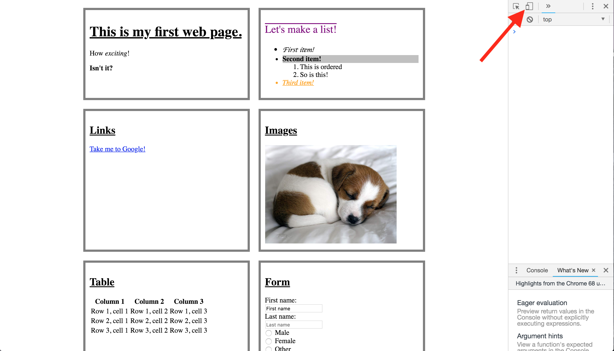

# CSS Flexbox

## Goals
* Understand what flexbox is and how it can be used for responsive styling
* Know that flexbox is direction and understand and know the main axis and cross axis
* Utilize flexbox and media queries to style a responsive page

## Keywords
* Responsive
* Flexbox
* Flex container
* main axis 
* cross axis
* Display
* `align-content`
* `justify-content`

## Resources

* [CSS Flexbox - MDN](https://developer.mozilla.org/en-US/docs/Learn/CSS/CSS_layout/Flexbox)
* [CSS Flexbox - W3Schools](https://www.w3schools.com/css/css3_flexbox.asp)
* [CSS Flexbox Guide - CSS Tricks (**BEST!!!!**)](https://css-tricks.com/snippets/css/a-guide-to-flexbox/)
* [Media Queries - MDN](https://developer.mozilla.org/en-US/docs/Web/CSS/Media_Queries/Using_media_queries)
* [css-tricks](https://css-tricks.com/snippets/css/a-guide-to-flexbox/)

# 1. Flexbox Introduction

When you use most websites, changing the size of your browser window will change the size of the elements on the page. Let's go to [The New York Times](https://www.nytimes.com) and resize the page. What happens to the content? It _adjusts_ to the size of our window! This is called a _responsive design_ and is important in making a positive user experience. 

CSS has several built-in tools for creating a responsive page but Flexbox is a personal favorite because it is powerful and simple. A great place to dip your toes in the responsive pond!

# 2. Wrap, flex-direction, align-items, and justify-content

Let's layout an image gallery using the HTML below:

```html
<html>
    <head>
        <link rel="stylesheet" href="style.css">
    </head>
    <body>
        <section class="images">
            
            
            
            
                 
                   
                        
        </section>
    </body>
</html>
```

Note that we've wrapped the `img` tags inside of a `section` tag.  This will help keep our different sections organized.


To best emphasize how we can change our elements with flexbox let's start by 
adding some css to our `img` tags. 

```css 
img {
    display: block;
}

```

All of our images are loaded, one after the other as a column. This is because we set our images to be display block and block by default will occupy the width of the page.  But what if we wanted to see them as a row that would be flexible to the change of the page? Let's add the following CSS to display this using Flexbox:

```css
.images {
    display: flex;
}
```


We see that the borders between the images go away, and that they are all on a single line.  Let's make it so that the images wrap to the next line using the `flex-wrap` property:

```css
.images {
    display: flex;
    flex-wrap: wrap;    
}
```


The `flex-wrap` properties are:
- nowrap (default): all flex items appear on the same line
- wrap: flex items wrap on multiple lines, from top to bottom.
- wrap-reverse: flex items wrap onto multiple lines from bottom to top.


Change the size of the browser window, and you can see the elements moving to fit the new size. An important concept to keep in mind while working with flexbox is that flexbox has a direction, the main axis and the cross axis. By default the main axis goes from left to right horizontally, and the cross axis goes from up to down vertically. This is because by default our flex-direction is a row. We can change the direction of our flex box by changing the `flex-direction` property. Now let's try to arrange it in a column instead of a row by changing the `flex-direction` property:

```css
.images {
    display: flex;
    flex-wrap: wrap;
    flex-direction: column;    
}
```

The `flex-direction` properties are:
- row (default): left to right
- row-reverse: right to left
- column: top to bottom
- column-reverse: bottom to top


That doesn't look right!  By default, the element will stretch to fill the cross axis. Because our flex-direction is currently column the main axis is now top to bottom, and the cross axis is now left to right. Because having stretched images mess up the aspect ratio, let's fix it by using the `align-items` property:


```css
.images {
    display: flex;
    flex-wrap: wrap;
    flex-direction: column;
    align-items: flex-start;
}
```


<br>
<br>

This diagram from css-tricks shows all of the align-items properties. It is showing with the main axis going from left to right and the cross axis going from top to bottom. This means the flex-direction is row (the most common use case):


We can also pin the pictures to the right of the page:

```css
.images {
    display: flex;
    flex-wrap: wrap;
    flex-direction: column;
    align-items: flex-end;
}
```


And to the center:

```css
.images {
    display: flex;
    flex-wrap: wrap;
    flex-direction: column;
    align-items: center;
}
```


Remember, this is happening because the cross axis is going from left to right because our flex-direction is set to column. 

We can also use the `justify-content` property to align the content along the main axis. The example below shows the main axis going from left to right with the flex-direction set to row. From css-tricks:


# 3. Flexbox Container with styled flex items

Flexbox works by having a **parent container** which holds **items**. The parent container is responsive to the size of the browser window and tells the items how to arrange themselves. The parent container is responsible for holding _all_ flexbox logic--so we don't have to tell the items inside the parent container (the child elements) what to do because the parent container does it for us.

Copy the html from below:

```html
<html>
    <head>
        <link rel="stylesheet" href="styles.css">
    </head>
    <body>
        <main class="flex-container">
            <section class="flex-item">
                <h1>This is my first web page.</h1>
                <p>How <em>exciting</em>!</p>
                <p><strong>Isn't it?</strong></p>
            </section>
            <section class="flex-item">
                <h2>Let's make a list!</h2>
                <ul>
                    <li>First item!</li>
                    <li>Second item!</li>
                    <li>Third item!</li>
                </ul>
            </section>
            <section class="flex-item">
                <h2>Links</h2>
                <a href="https://www.google.com">Take me to Google!</a>
            </section>
            <section class="flex-item">
                <h2>Images</h2>
                
            </section>
            <section class="flex-item">
                <h2>Table</h2>
                <table>
                        <tr>
                        <th>Column 1</th>
                        <th>Column 2</th>
                        <th>Column 3</th>
                    </tr>
                    <tr>
                        <td>Row 1, cell 1</td>
                        <td>Row 1, cell 2</td>
                        <td>Row 1, cell 3</td>
                    </tr>
                    <tr>
                        <td>Row 2, cell 1</td>
                        <td>Row 2, cell 2</td>
                        <td>Row 2, cell 3</td>
                    </tr>
                    <tr>
                        <td>Row 3, cell 1</td>
                        <td>Row 3, cell 2</td>
                        <td>Row 3, cell 3</td>
                    </tr>
                </table>
            </section>
            <section class="flex-item">
                <h2>Form</h2>
                <form>
                    First name:<br>
                    <input type="text" name="firstname" value="First name"><br>
                    Last name:<br>
                    <input type="text" name="lastname" placeholder="Last name"><br>
                    <input type="radio" name="gender" value="male"> Male<br>
                    <input type="radio" name="gender" value="female"> Female<br>
                    <input type="radio" name="gender" value="other"> Other<br>
                    <input type="checkbox" name="vehicle1" value="Bike"> I have a bike<br>
                    <input type="checkbox" name="vehicle2" value="Car"> I have a car<br>
                    <input type="submit" value="Submit">
                </form>
            </section>
        </main>            
    </body>            
</html>
```
Now we have a `main` that holds **all** of our html elements and we can now make this into a **flex container**.

Add the following css.  This time, we're styling both the flexbox container and the children it contains.

```css
/* change div to .flex-item */
.flex-item {
  width: 350px;
  padding: 10px;
  border: 5px solid gray;
  margin: 10px;
}

/* add .flex-container */
.flex-container {
  display: flex;
  flex-wrap: wrap;
  justify-content: center;
  align-items: center;
}
```

Try moving the page around and see how the UI updates.

#### Flexbox Items

You can modify how items act inside your flex container with several properties. This can be useful if you'd like to specify the order of items or width of one particular item. You can explore how to to modify specific elements in more detail on the incredible [CSS-Tricks page](https://css-tricks.com/snippets/css/a-guide-to-flexbox/) on flexbox.


# 4. Media Queries

Our site is looking pretty good! We can make our window very small and our `div`s stack on top of one another into a neat column. This is great--if it works well with my browser window being small, then it will look great on a mobile device! Let's have a look.

Open the dev tools (cmd + option + i) and click on the "Toggle Device Toolbar":



Then click on the "Responsive" dropdown menu and select a mobile device. What happened?! No more columns or responsiveness!

This is because we need to make _media queries_ to determine what the users viewport is. A media query is basically asking the user's device, "What are you?" and then responding accordingly. Right now, it doesn't know exactly what to do on a phone screen, so we need to let our HTML communicate better with the device. To do this, we're going to add some code into the `head` of our test.html file:

```html
<head>
    <title>My first web page</title>
    <link rel="stylesheet" href="test.css">
    <meta name="viewport" content="width=device-width, initial-scale=1">
</head>
```

The `meta` tag stores data for the browser, search engines or other web services to read but is not visible to users. Here we put a `"viewport"` `meta` tag, which allows the browser to determine what kind of device is using the browser. Save your HTML file and reload the page. Looks much better!

If we go to "responsive" and select "iPhone X", it looks okay but the font is _huge_ on that screen. Also our puppy image is larger than all the other boxes. This isn't ideal, so let's add some rules to make sure that our fonts and images match the size of the screen.

To specify these rules, we can add a media query into our CSS file. Media queries are added to the **bottom** of your CSS file and work like so:

```css
@media screen and (max-width: 800px) {
  /** DECLARATION BLOCKS **/
}
```

In the example above, `@media screen` is telling the CSS reader that the following declaration blocks **only** apply to screens (ie laptop, mobile, etc). `and` allows us to add additional parameters that the media query will check for, but those parameters must be inside parentheses. Here we've added the parameter `max-width`, so the media query will apply the declaration blocks for screens that are up to a certain width, here `800px`. If a user is looking at the page on a device with a screen size of less than 800px, the rules inside the declaration blocks here will be applied. If the device is 801px or larger, these rules will not apply.

Let's apply some rules that will make our fonts and images look better and act more responsively:

```css
@media screen and (max-width: 800px) {
  .flex-item {
    font-size: 75%;
  }

  img {
    width: 100%;
    min-width: 250px;
  }
 }
 ```

 Again, we are _only_ applying the rules above to devices with a screen that is **less than** 800px. `.flex-item` now has the font size set to `75%` of original. This way, the fonts are smaller on a smaller screen. Using percentages is useful because the percent is based on the width of the parent element, which means as the screen gets smaller, so does the parent element and thus the font. When creating a responsive style, it's best to use percentages rather than specific pixels. Specific pixels are good to use when you have a specific cut-off (like max- or min-width).

We've also set the `width` of our image to `100%`, so it will always be the entire width of the parent element. Then we set the `min-width` of the image to 250px so it won't get any smaller than that, no matter what size the screen is. This means, if the screen is 200px, the puppy image will remain 250px wide.

Add some other media rules to your CSS file to get a sense of how media queries work. You can even add in a _second_ media query for screens that are less than 350px in width if you'd like.

__NOTE:__ The best approach to responsive design is _Mobile First_. This means that it's best practice to design for small mobile screens and then to design for larger computer screens.

_Breakpoints_ are the points at which your sites content will respond to provide the user with the best possible layout to consume the information.

