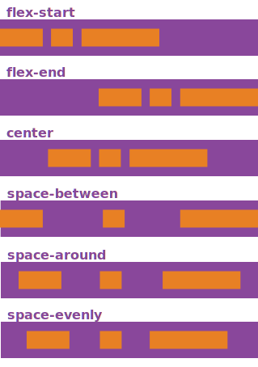

# CSS Flexbox

## Goals
* Understand what flexbox is and how it can be used for responsive styling
* Utilize flexbox and media queries to style a responsive page

## Keywords
* Responsive
* Flexbox
* Flex container
* Display
* `align-content`
* `justify-content`

## Resources

* [CSS Flexbox - MDN](https://developer.mozilla.org/en-US/docs/Learn/CSS/CSS_layout/Flexbox)
* [CSS Flexbox - W3Schools](https://www.w3schools.com/css/css3_flexbox.asp)
* [CSS Flexbox Guide - CSS Tricks (**BEST!!!!**)](https://css-tricks.com/snippets/css/a-guide-to-flexbox/)
* [Media Queries - MDN](https://developer.mozilla.org/en-US/docs/Web/CSS/Media_Queries/Using_media_queries)

## Lesson

## Flexbox

When you use most websites, changing the size of your browser window will change the size of the elements on the page. Let's go to [The New York Times](https://www.nytimes.com) and resize the page. What happens to the content? It _adjusts_ to the size of our window! This is called a _responsive design_ and is important in making a positive user experience. Right now, our test.html page is one narrow column of content. This works because we don't have too much going on but what happens when we start adding more and more content? The column grows longer and longer. We want a want to display our information so that it's more like the New York Times--it fills the entire window but if the window gets smaller, the content responds.

CSS has several built-in tools for creating a responsive page but Flexbox is a personal favorite because it is powerful and simple. A great place to dip your toes in the responsive pond!

### Flexbox Container

Flexbox works by having a **parent container** which holds **items**. The parent container is responsive to the size of the browser window and tells the items how to arrange themselves. The parent container is responsible for holding _all_ flexbox logic--so we don't have to tell the items inside the parent container (the child elements) what to do because the parent container does it for us.

In your test.html file, we are going to wrap **all** our `body` content in a `div` with classname `flex-container` by putting an opening `div` tag right under the opening `body` tag and the closing `div` tag right above the closing `div` tag. Then you are going to **add the class** `flex-item` to each child `div`, like so:

```html
<body>
<div class="flex-container"> <!-- ADD OPENING TAG -->

  <div class="flex-item"> <!-- ADD CLASS -->
    <h1 class="heading heading-title">This is my first web page.</h1>
    <p>How <em>exciting</em>!</p>
      <p><strong>Isn't it?</strong></p>
  </div>

  <div class="flex-item"> <!-- ADD CLASS -->
    <h2 class="heading heading-list" id="list">Let's make a list!</h2>

    .....
      .....   <!-- ADD CLASS TO EACH CHILD -->
    .....

      <input type="submit" value="Submit">
    </form>
  </div>

</div> <!-- ADD CLOSING TAG -->
</body>
```
Now we have a `div` that holds **all** of our html elements and we can now make this into a **flex container**.

#### Flexbox Display

To make this `div` a flex container, we need to add a `display` property in our CSS file with the value of `flex`. We have now turned our flex-container `div` into an actual flex container. You will also _change_ the `div` declaration block to `.flex-item`. In your test.css file, remove your current styling on div, and add the following code:

```css
/* change div to .flex-item */
.flex-item {
  width: 350px;
  padding: 10px;
  border: 5px solid gray;
  margin: 10px;
}

/* add .flex-container */
.flex-container {
  display: flex;
}
```

We had to change `div` to `flex-item` because otherwise our parent container would be affected by our `div` CSS rules and our page would **not** be responsive. You can see now that our items are in a nice row across the screen--great! But if you make your window smaller, the items each shrink and then disappear off screen. Not ideal :confused:

#### Flexbox Wrap

This is happening because we need to specify `flex-wrap` in our css file as well! Typically you will use `wrap` because this allows each child element of your flex container to be displayed horizontally in rows and wrapping to a _new_ row when the items fill the screen. Change your `.flex-container` CSS code to look like the following, save and reload:

```css
.flex-container {
  display: flex;
  flex-wrap: wrap;
}
```

Woo! Now _that_ looks better! Resize the page and watch the items align themselves to fit the page.

#### Flexbox Items Placement

Right now, we can see our content is automatically attached to the top and left side of the page if the content doesn't fill the screen. This is fine--but typically a user would expect to see content aligned with the _center_ of the page. Thankfully flexbox allows you to align the child items and also justify the content. There are **two** properties that define how the items appear on the page: `justify-content` and `align-items`.

Let's first explore `justify-content`. You can think of `justify-content` as how your items are aligned along the **main axis**, or the horizontal axis, of your page. The different ways you can justify your items horizontally are as follows:



For our page, `center`, `space-around` or `space-evenly` seem like they will do just fine! Let's start with `center` and then you can try the others to see how the page changes:

```css
.flex-container {
  display: flex;
  flex-wrap: wrap;
  justify-content: center;
}
```

Great! Now our page is centered and looking fresh :100:

Our page is looking great, let's see what happens when we mess with `align-items`. While `justify-content` moves items in relation to the horizontal axis, `align-items` works vertically. There are several options for aligning your items:


The default value for this is `stretch` but let's try `center` because that looks like it could be good. Add the following code, save and reload:

```css
.flex-container {
  display: flex;
  flex-wrap: wrap;
  justify-content: center;
  align-items: center;
}
```

Yikes! That doesn't look better! Now each section is not the same height, which does _not_ look better, so we probably want to leave it as the default `stretch`. Play around with the other options and see what happens.

#### Flexbox Items

You can modify how items act inside your flex container with several properties. This can be useful if you'd like to specify the order of items or width of one particular item. You can explore how to to modify specific elements in more detail on the incredible [CSS-Tricks page](https://css-tricks.com/snippets/css/a-guide-to-flexbox/) on flexbox.

### Media Queries

Our site is looking pretty good! We can make our window very small and our `div`s stack on top of one another into a neat column. This is great--if it works well with my browser window being small, then it will look great on a mobile device! Let's have a look.

Open the dev tools and click on the "Toggle Device Toolbar":


Then click on the "Responsive" dropdown menu and select a mobile device. What happened?! No more columns or responsiveness!

This is because we need to make _media queries_ to determine what the users viewport is. A media query is basically asking the user's device, "What are you?" and then responding accordingly. Right now, it doesn't know exactly what to do on a phone screen, so we need to let our HTML communicate better with the device. To do this, we're going to add some code into the `head` of our test.html file:

```html
<head>
    <title>My first web page</title>
    <link rel="stylesheet" href="test.css">
    <meta name="viewport" content="width=device-width, initial-scale=1">
</head>
```

The `meta` tag stores data for the browser, search engines or other web services to read but is not visible to users. Here we put a `"viewport"` `meta` tag, which allows the browser to determine what kind of device is using the browser. Save your HTML file and reload the page. Looks much better!

But if we go to responsive now and select "Mobile S - 320px" or "iPhone 5/SE", it looks okay but the font would be _huge_ on that screen. The first heading takes up 30% of the screen! Also our puppy image is larger than all the other boxes. This isn't ideal, so let's add some rules to make sure that our fonts and images match the size of the screen.

To specify these rules, we can add a media query into our CSS file. Media queries are added to the **bottom** of your CSS file and work like so:

```css
@media screen and (max-width: 800px) {
  /** DECLARATION BLOCKS **/
}
```

In the example above, `@media screen` is telling the CSS reader that the following declaration blocks **only** apply to screens (ie laptop, mobile, etc). `and` allows us to add additional parameters that the media query will check for, but those parameters must be inside parentheses. Here we've given the parameter `max-width`, so the media query will apply the declaration blocks for screens that are up to a certain width, here `800px`. If a user is looking at the page on a device with a screen size of less than 800px, the rules inside the declaration blocks here will be applied. If the device is 801px or larger, these rules will not apply.

Let's apply some rules that will make our fonts and images look better and act more responsively:

```css
@media screen and (max-width: 800px) {
  .flex-item {
    font-size: 75%;
  }

  img {
    width: 100%;
    min-width: 250px;
  }
 }
 ```

 Again, we are _only_ applying the rules above to devices with a screen that is **less than** 800px. `.flex-item` now has the font size set to `75%` of original. This way, the fonts are smaller on a smaller screen. Using percentages is useful because the percent is based on the width of the parent element, which means as the screen gets smaller, so does the parent element and thus the font. When creating a responsive style, it's best to use percentages rather than specific pixels. Specific pixels are good to use when you have a specific cut-off (like max- or min-width).

We've also set the `width` of our image to `100%`, so it will always be the entire width of the parent element. Then we set the `min-width` of the image to 250px so it won't get any smaller than that, no matter what size the screen is. This means, if the screen is 200px, the puppy image will remain 250px wide.

Add some other media rules to your CSS file to get a sense of how media queries work. You can even add in a _second_ media query for screens that are less than 350px in width if you'd like.

__NOTE:__ The best approach to responsive design is _Mobile First_. This means that it's best practice to design for small mobile screens and then to design for larger computer screens.

_Breakpoints_ are the points at which your sites content will respond to provide the user with the best possible layout to consume the information.
