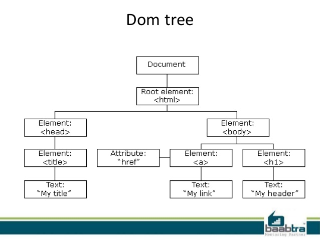

# Combining HTML and JavaScript + Introduction to the DOM

## Goals
Fellows will be able to:
- Explain what the DOM is and what it's used for.
- Create script tags to add JavaScript to a site.
- Use the alert and prompt functions for debugging and user interaction.
- Locate DOM elements using element IDs.
- Use buttons and text inputs to incorporate user input into a web application.
- Change the content of an html element.

## Terms

- Document Object Model (DOM)
- Tree
- Window
- window.alert()
- window.prompt()
- Document
- document.getElementById()
- Element
- Element.textContent
- Input.value

## Resources

- [MDN​ ​-​ ​Introduction​ ​to​ ​the​ ​DOM](https://developer.mozilla.org/en-US/docs/Web/API/Document_Object_Model/Introduction)
- [MDN​ ​-​ ​Window](https://developer.mozilla.org/en-US/docs/Web/API/Window)
- [MDN​ ​-​ ​Document](https://developer.mozilla.org/en-US/docs/Web/API/Document)
- [MDN​ ​-​ ​Element](https://developer.mozilla.org/en-US/docs/Web/API/Element)
- [MDN​ ​-​ ​Node](https://developer.mozilla.org/en-US/docs/Web/API/Node)

# 1. The Script Tag

We've been using HTML and CSS to layout and style the content of our web pages, but there's a key ingredient of web applications we've been mising: handling user interaction.

Users can type into text inputs and select checkboxes, but using pure HTML, we can't do anything with that information. In order for us to do something with the user's input, we'll need to combine HTML and JavaScript.

We can do this using the `<script>` tag:

```html
<!DOCTYPE html>
<html>
  <head>
    <title>Javascript + HTML</title>
    <script>
      console.log("Now we're using JavaScript!");
    </script>
  </head>
  <body>
    To see the secret JavaScript message, right click on this page, and click
    "Inspect". Then click on "Console".
  </body>
</html>
```

When the browser loads our website, it stops when it gets to the `<script>` tag, then executes any of the code that it sees there. After it's done, it reads the rest of the HTML and displays it on the screen. Putting the `script` tag in the `head` section means it will run before any of the body is loaded.

Now we can run JavaScript in our websites! But we probably want to do something more than logging messages to the console...

# 2. The Window Object

`window` is the top level object in browser-side JavaScript that represents a browser window. It is an `object` in the full JavaScript sense: it has properties and values such as `.innerWidth`, `.innerHeight`, and `.localStorage`. Today we'll use two window methods:
`window.alert()` and `window.prompt()`.

## Alerts

`window.alert("I'm an alert message")` will display a message in a popup window. In general, it should only be used as a quick and dirty debugging tool, or before you've learned alternative ways to create output. You've probably only seen these as really annoying pop ups on sketchy websites. Let's write our first alert together.

Create a new file named `index.html` that holds the following content:

```html
<!DOCTYPE html>
<html lang="en" dir="ltr">
  <head>
    <meta charset="utf-8" />
    <title>Javascript + HTML</title>
    <script>
      window.alert("Welcome to my website!");
    </script>
  </head>
  <body>
    This is my website.
  </body>
</html>
```

Now instead of logging a message to the console, we can display it to the user.

## Prompts

`window.prompt` allows us to display a popup message that also has a text input field inside it. `window.prompt()` will return the value in the input field (as a string) after the "OK" button is pressed. Try updating the contents of your script tag with the following:

```js
const userSubmittedName = window.prompt("Enter your name");
window.alert(`Hello ${userSubmittedName}!  Thank you for your response.`);
```

## Practice

### Exercise 1
Use `window.prompt()` to ask the user to "type a string". Then, use `window.alert()` to display a fully capitalized version of the string.

<details>
<summary>Hint</summary>
What is prompt's return value?     
</details>

<details>
<summary>Compare Your solution.</summary>

```js
const string = window.prompt("Please enter a string");
window.alert(string.toUpperCase());
```

</details>

### Exercise 2
Use `window.prompt()` to ask the user to "enter a number". Then, use
`window.alert()` to display that number times two.

If the input cannot be converted to a real number, use
`window.alert()` to display `"Please enter a number next time."`

<details>
<summary>Hint</summary>
`isNaN()` can be used to tell if something is not a number
</details>

<details>
<summary>Compare Your solution.</summary>

```js
const number = Number(window.prompt("Enter a number to be doubled!"));
let displayText = "";
if (isNaN(number)) {
  displayText = "Please enter a number next time";
} else {
  displayText = `Your doubled number is ${number * 2}`;
}
window.alert(displayText);
```

</details>

# 3. The DOM

The Document Object Model (DOM) is a programming interface for HTML and XML documents.
The DOM models each element in an HTML page as a javascript object.
Together, these objects form a [tree-like](https://en.wikipedia.org/wiki/Tree_(data_structure)) data structure:



Each box in the diagram above represents a [node in the DOM](https://developer.mozilla.org/en-US/docs/Web/API/Node).
Some of these nodes, called [elements](https://developer.mozilla.org/en-US/docs/Web/API/HTMLElement), correspond to tags in our HTML file.
Other nodes store information about attributes of our HTML tags, or store the text inside HTML tags that the browser will display.

DOM elements are _live_, which means that if we make changes to the data inside them, those changes will be reflected in the browser!
This means we can display information to the user on our webpage directly, instead of having to use an alert.

## The Document Object

The `document` object is the very root of the DOM tree, and is our gateway into accessing and editing the rest of the DOM.
Using `document` allows us to traverse the DOM and find, edit and delete elements.

`document` comes with many helpful methods that can find specific parts of the DOM that we want to use and edit.
Let's take a look at how we can use HTML tag IDs and the `document` object to locate DOM elements.

## getElementById

Recall that we can give any HTML element an `id` attribute. Add the following paragraphs to your html page, making sure to give them unique ID attributes:

```html
<!DOCTYPE html>
<html>
  <head>
    <title>Javascript + HTML</title>
  </head>
  <body>
    <h1>My Website</h1>
    <p id="welcome-para">Welcome to my website</p>
    <p id="last-para">Thank you for visiting</p>
  </body>
</html>
```
We can use the function `document.getElementById` to locate a single element in the DOM.
All we have to do is pass it a string, like so: `document.getElementById("welcome-para")`. This function will return the DOM element with the ID `"welcome-para"`.
Let's try to make an alert that displays the welcome paragraph in a popup box:

```html
<!DOCTYPE html>
<html>
  <head>
    <title>Javascript + HTML</title>
    <script>
      const welcomeElementPara = document.getElementById("welcome-para");
      window.alert(
        `The welcome paragraph element text is ${welcomeElementPara}`
      );
    </script>
  </head>
  <body>
    <h1>My Website</h1>
    <p id="welcome-para">Welcome to my website</p>
    <p id="last-para">Thank you for visiting</p>
  </body>
</html>
```

When we run this, we see that is says "The welcome paragraph element is null". This is because the browser hasn't created the body yet, so there is no element matching that id. We can fix that, by moving the script to the bottom of the body.

```html
<!DOCTYPE html>
<html>
  <head>
    <title>Javascript + HTML</title>
  </head>
  <body>
    <h1>My Website</h1>
    <p id="welcome-para">Welcome to my website</p>
    <p id="last-para">Thank you for visiting</p>
    <script>
      const welcomeElementPara = document.getElementById("welcome-para");
      window.alert(
        `The welcome paragraph element text is ${welcomeElementPara}`
      );
    </script>
  </body>
</html>
```

Now, when we open our website, it says "The welcome paragraph element is [object HTMLParagraphElement]". We've got the object that we want! Now we can look at its properties to find out more about it. Its `textContent` property will return its text. A full list of properties for elements can be found [here](https://www.w3schools.com/jsref/dom_obj_all.asp)

```html
<!DOCTYPE html>
<html>
  <head>
    <title>Javascript + HTML</title>
  </head>
  <body>
    <h1>My Website</h1>
    <p id="welcome-para">Welcome to my website</p>
    <p id="last-para">Thank you for visiting</p>
    <script>
      const welcomeElementPara = document.getElementById("welcome-para");
      window.alert(
        `The welcome paragraph element text is ${welcomeElementPara.textContent}`
      );
    </script>
  </body>
</html>
```

## Setting Elements in the DOM

Now that we can access elements, we can also edit their text. Let's build a simple page that gets the user's name, then displays it to them on the actual webpage rather than an alert:

```html
<!DOCTYPE html>
<html>
  <head>
    <title>Javascript + HTML</title>
  </head>
  <body>
    <h1>My Website</h1>
    <p id="welcome-para">Welcome to my website</p>
    <p id="last-para">Thank you for visiting</p>
    <script>
      const userSubmittedName = window.prompt("Enter your name");
      const welcomeElementPara = document.getElementById("welcome_para");
      welcomeElementPara.textContent += `, ${userSubmittedName}`;
    </script>
  </body>
</html>
```

Having to use a prompt is bit messy. Let's use a button and an input text area instead. Buttons have an attribute `onclick` that we can link to a function. We cannot use `.textContent` to grab the users input from an input tag. This is because they don't have a closing tag. Instead, we use their `.value` property.

```html
<!DOCTYPE html>
<html>
  <head>
    <title>Javascript + HTML</title>
  </head>
  <body>
    <h1 id="top-heading">My Website</h1>
    <p id="welcome-para">Welcome to my website</p>
    <p>
      Enter your name:
      <input type="text" id="name-input-text" placeholder="First Name" />
    </p>
    <button onclick="addNameToHeading()">Submit</button>
    <p id="last-para">Thank you for visiting</p>
    <script>
      const addNameToHeading = () => {
        const nameInputElement = document.getElementById("name-input-text");
        const userSubmittedName = nameInputElement.value;
        const topHeadingElement = document.getElementById("top-heading");
        topHeadingElement.textContent = `My Website: Made especially for ${userSubmittedName}`;
      };
    </script>
  </body>
</html>
```

## Exercise

Complete the function `increment` so that each time the button is hit, the number displayed inside `span#count` is incremented by 1.

```html
<!DOCTYPE html>
<html>
  <head>
    <title>Incrementer</title>
  </head>
  <body>
    <h1 id="top-heading">I can count!</h1>
    <p>The count is at: <span id="count">0</span></p>
    <button onclick="increment()">Increment</button>
    <script>
      const increment = () => {
        
      };
    </script>
  </body>
</html>
```

<details>
<summary>Compare your solution.</summary>

```js
const increment = () => {
  let span = document.getElementById('count');
  let count = parseInt(span.textContent) + 1;
  span.textContent = count;
}
```

</details>

## Further Reading

In this lesson, we used `.textContent` to access as well as to edit the text inside a paragraph. You will likely come across similar, yet distinct properties called `.innerText` and `.innerHTML`. You can read about their differences [here](https://medium.com/better-programming/whats-best-innertext-vs-innerhtml-vs-textcontent-903ebc43a3fc). The MDN article on [.textContent](https://developer.mozilla.org/en-US/docs/Web/API/Node/textContent) gives an explanation why, in some cases, `.textContent` can be a more efficient way to access the content of an HTML tag.