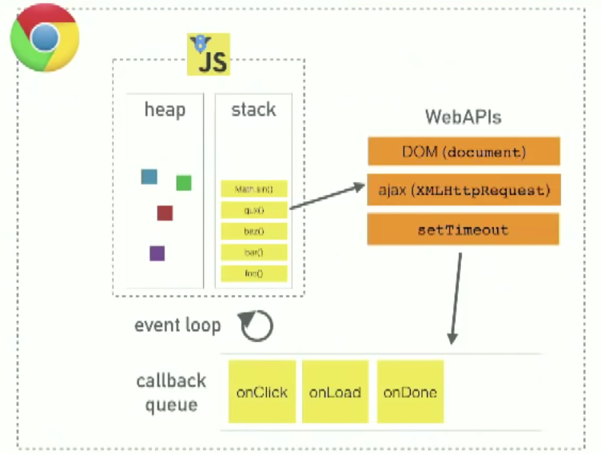

# Event Loop

## Goals
* Know and understand the event loop.
* Know the different phases of the event loop.
* Be able to accurately trace the stack and predict the behavior.
* Deepen understanding of asynchronous behavior.
* [MUST WATCH](http://latentflip.com/loupe/?code=JC5vbignYnV0dG9uJywgJ2NsaWNrJywgZnVuY3Rpb24gb25DbGljaygpIHsKICAgIHNldFRpbWVvdXQoZnVuY3Rpb24gdGltZXIoKSB7CiAgICAgICAgY29uc29sZS5sb2coJ1lvdSBjbGlja2VkIHRoZSBidXR0b24hJyk7ICAgIAogICAgfSwgMjAwMCk7Cn0pOwoKY29uc29sZS5sb2coIkhpISIpOwoKc2V0VGltZW91dChmdW5jdGlvbiB0aW1lb3V0KCkgewogICAgY29uc29sZS5sb2coIkNsaWNrIHRoZSBidXR0b24hIik7Cn0sIDUwMDApOwoKY29uc29sZS5sb2coIldlbGNvbWUgdG8gbG91cGUuIik7!!!PGJ1dHRvbj5DbGljayBtZSE8L2J1dHRvbj4%3D)

## Lesson
You've probably heard that JavaScript is single-threaded, but you've also heard that it's asynchronous. This is probably when you start to say, "that doesn't make sense, how could it be both?". Good question! Answer: JS is single-threaded, the asynchronous behavior is not part of the JS language itself, but is actually built on top of the core JS language in the browser (or other programming environment) and is accessed through the browser APIs.
Take a look at the following picture:



I know it looks pretty weird, but let's break down the different parts of the picture and see if we can get it to make more sense. For now, disregard the heap part.

The outer box is the Google Chrome that we know and love. For this example that is our programming environment.

The next box we see is the JS box. This is where our code runs. The call stack is where we are in the code. We can only push and pop things onto our stack. This represents the single thread provided.  

Our WebAPIs, is where the _magic_ happens. This is where our DOM lives, and our asynchronous calls such as SetTimeout, SetInterval, AJAX calls, and our event listeners. The WebAPIs are effectively threads in our JS.  

When we hit an asynchronous call in our stack, the call get's moved over to the WebAPI's area until it resolves.

This means that if our code has a setTimeout with a time of 5 seconds. That call will move over to the WebAPI and wait for 5 seconds.

Once a WebAPI has resolved, it then moves into the callback queue. A queue means first in, first out. Think about it like waiting in line. It's like only being able to use `shift` and `push` with an array.

The items in the queue get resolved only once the call stack is clear. Once the stack is clear it will take the first item from the queue and put it into the stack. Once the stack is clear again, the process will be repeated.

This circular motion of stack, to WebAPI, to Callback queue, to stack is the _Event Loop_.

Using this information let's see if we can predict the order that things will occur:

```js
console.log("Hello,");
setTimeout(() => console.log("I am"), 1000);
console.log("Yoda");

```

What is expected output?

<details>
  <summary>
    Solution
  </summary>


    Hello,
    Yoda
    I am
</details>

Let's take a look at why? The first thing that will be moved onto our stack is `console.log("Hello,");`. This immediately resolve and be popped off our stack.

Next thing pushed onto the stack is the setTimeout. Because this is an asynchronous call it will get moved over from our stack to the WebAPI and begin to count down for 1 second.

Our code continues to run and pushes the final console log onto our empty stack. It immediately resolves and is then popped off.

The current state of our loop is: Empty Stack, SetTimeout in WebAPI, and empty callback queue.

After 1 second, our setTimeout resolves and moves the callback (our final console log) to the callback queue.

Because our call stack is empty, the first item of our callback queue is moved onto the stack. The console log is
immediately resolved and popped off the stack.

Our code finishes running.

Let's try another example:

```js

console.log("Hello,");
setTimeout(() => console.log("I am"), 0);
console.log("Yoda");
```

What do we think the output to screen will be now?
<details>
  <summary>
    Solution
  </summary>
   The output will be identical to the previous example. The reason: Our setTimeout is moved into the WebAPI regardless of
  how quickly it is set to resolve.
</details>


## Resources

* [MDN - Concurrency model and Event Loop](https://developer.mozilla.org/en-US/docs/Web/JavaScript/EventLoop)
* [Hackernoon](https://hackernoon.com/understanding-js-the-event-loop-959beae3ac40)
* [medium](https://medium.com/front-end-hacking/javascript-event-loop-explained-4cd26af121d4)
