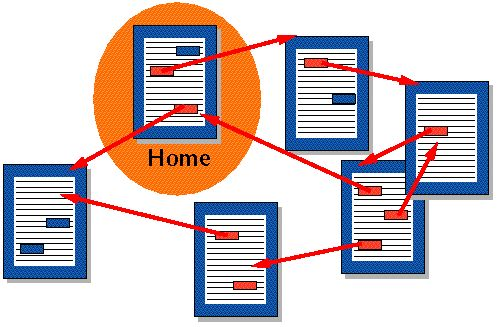

# Introduction to HTML

## Goals
* Understand what HTML is and what it is used for

## Keywords
* Hypertext Markup Language (HTML)
* Require
* Threads

## Resources

* [What is HTML? (video)](https://www.youtube.com/watch?v=CKlh1lwe2rY)
* [HTML Intro - W3Schools](https://www.w3schools.com/html/html_intro.asp)
* [HTML - MDN](https://developer.mozilla.org/en-US/docs/Web/HTML)

## Lesson

## Hypertext Markup Language (HTML)

Often described as the building-blocks of the web, _HTML_ describes and defines the content of a page. When HTML was first developed, it included cues for the appearance of the website. Now, we use Cascading Style Sheets (or _CSS_) to style a webpage and also use JavaScript to make the page dynamic and responsive. These three languages are what make up the modern web as we know it. We will be learning more about _CSS_ in later lessons, so don't worry about it too much for now.

_HyperText_ refers to links that connect web pages to one another, either within a single website or between websites. HyperText is important to the internet because it is what allows information from different pages on the Web to be connected to one another. In the image below, the _red_ represents a hyperlink that is connecting to a different page:




HTML is not a standard programming language like JavaScript. Instead, HTML uses _markup_ to annotate text, images, and other content for display in a browser. HTML markup includes special "elements" such as <head>, <title>, <body> and many others. Tags in HTML are case insensitive. That is, they can be written in uppercase, lowercase, or a mixture. Example <title> tag can be written as <Title>,<TITLE> or in any other way. These tags can be applied to pieces of text to give them different meaning in a document (Is it a paragraph? Is it a bulleted list? Is it part of a table?). It is these elements that make up the basis of every single webpage you've ever looked at and will be the basis of all the applications you build here!

HTML is a very simple language that is easy to understand and essential to being a web developer, so make sure you get a solid understanding of how HTML functions.

### Sample HTML Document

```html
<!DOCTYPE html>
<html>

  <head>
    <title>Page Title</title>
  </head>

  <body>
    <h1>My First Heading</h1>
    <p>My first paragraph.</p>
  </body>
</html>
```

### Playing With HTML

We're going to mess around with HTML that currently exists on the web. Go to the [New York Times](https://www.nytimes.com) and right-click on a headline. Then click "Inspect Element" and you should see the Inspector open up with a bunch of HTML, Styles and other information.

Find the text that matches your headline and click on it. Then change the text to "Breaking: [YOUR NAME] is an awesome web developer!" and press enter. What happens??

You just edited The New York Times!!! How??

The browser is fed information from an HTML document that is provided by a server and displays what it is fed. Browsers, however, allow you to see _and_ edit the HTML and CSS documents for any given page! While you are unable to permanently change the actual HTML or CSS document (hitting refresh will erase all your changes), you can see what would happen if you changed some of the HTML on the page. You'll see how useful this can be later on when you're building your own HTML pages!
