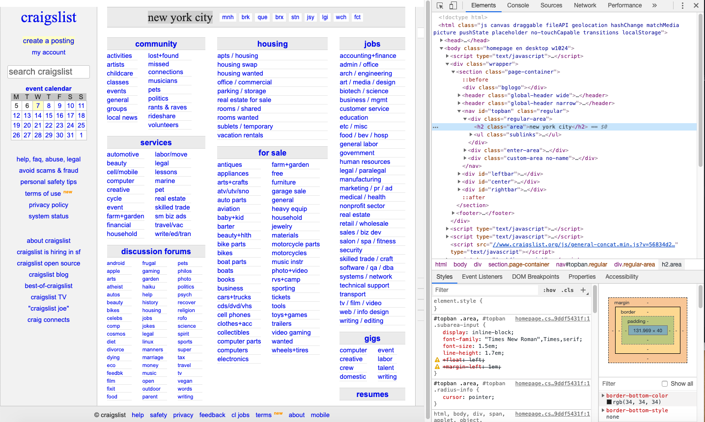
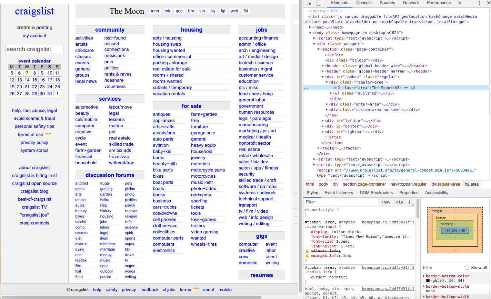
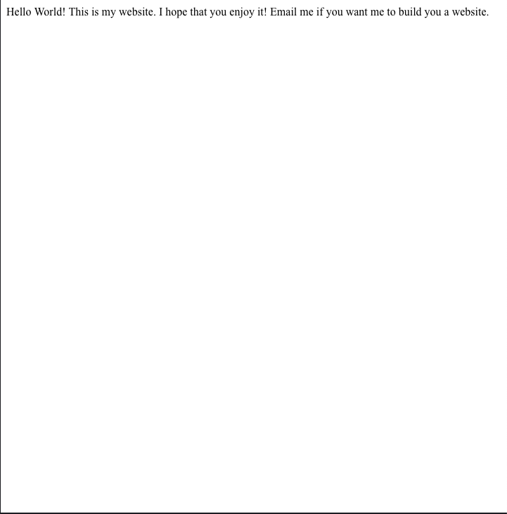
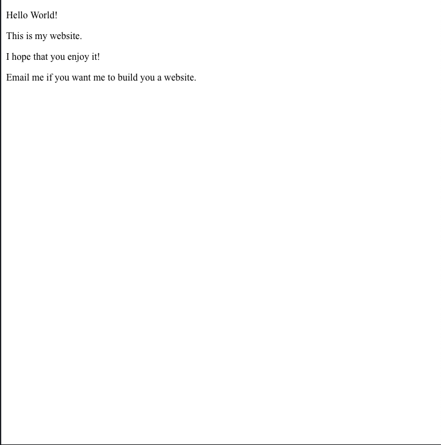
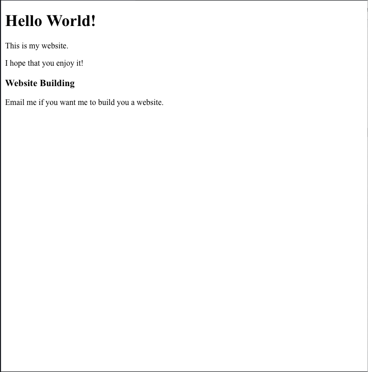

# HTML Introduction

## Goals
* Understand what HTML is and what it is used for
* Create an HTML document
* Use paragraph, heading, strong and emphasis tags appropriately in an HTML document
* Understand how list tags work in HTML
* Use ordered and unordered list tags appropriately in an HTML document
* Use link tags appropriately in an HTML document
* Use image tags in an HTML document
* Create an appropriate form using the HTML form tag

## Keywords
* Hypertext Markup Language (HTML)
* Tags
  * Paragraph (`<p>`)
  * Headings (`<h1>`, `<h2>`, etc)
  * Strong (aka **bold**, `<strong>`)
  * Emphasis (aka _italics_, `<em>`)
  * Ordered List (`<ol>`)
  * Unordered List (`<ul>`)
  * List Items (`<li>`)
  * Link (`<a>`)
  * Image (``)
  * Form (`<form>`)
  * Form Input (`<input>`)
  * Line break ()`<br>`)

## Resources

* [What is HTML? (video)](https://www.youtube.com/watch?v=CKlh1lwe2rY)
* [HTML Intro - W3Schools](https://www.w3schools.com/html/html_intro.asp)
* [HTML - MDN](https://developer.mozilla.org/en-US/docs/Web/HTML)
* [HTML Paragraphs - HTML Dog](http://htmldog.com/guides/html/beginner/paragraphs/)
* [HTML Headings - HTML Dog](http://htmldog.com/guides/html/beginner/headings/)
* [HTML Lists - HTML Dog](http://htmldog.com/guides/html/beginner/lists/)
* [HTML Lists - W3Schools](https://www.w3schools.com/html/html_lists.asp)
* [HTML Links - HTML Dog](http://htmldog.com/guides/html/beginner/links/)
* [HTML Links - W3Schools](https://www.w3schools.com/html/html_links.asp)
* [HTML Images - HTML Dog](http://htmldog.com/guides/html/beginner/images/)
* [HTML Images - W3Schools](https://www.w3schools.com/html/html_images.asp)
* [HTML Forms - HTML Dog](http://htmldog.com/guides/html/beginner/forms/)
* [HTML Forms - W3Schools](https://www.w3schools.com/html/html_forms.asp)


# 1. HTML Introduction

When a web browser displays a web page to a user, the browser needs to know three things:

1. What *content* (text, images, video, etc.) is on the web page? What is the *structure* of this content?
1. How should the content *appear*?
1. How should the page *behave* in response to a user?

HTML stands for "Hyper Text Markup Language".  It's a special way of writing that tells web browsers what text, images, and other content you want people to see on your website.
HTML is responsible for (1), but HTML can also tell a browser a little bit about how the content should appear (2).
It **cannot** tell a browser how a website should behave (3).  That's what JavaScript is for!

HTML uses *tags* inside angle brackets to tell the browser what type of information is inside (e.g `<h1>Heading</h1>` is a heading).

HTML is not a programming language.  You can't write code in HTML, only give instructions about what information to display.  You can, however, combine HTML and JavaScript to build websites that both show text, and allow for user interaction.

In this unit, we'll learn how to build static (unchanging) websites with HTML and how to integrate JavaScript to make our websites interactive.

# 2. Edit HTML in the wild

HTML is all around us.  Let's explore an example from a real website online.

While many websites use more complicated tools, [Craigslist](https://newyork.craigslist.org/) is a major website that primarily uses HTML to format and display text.

To look at the HTML that's powering this website, right click on "new york city" and click "inspect".



On the right side, you can see the HTML.  Now that you can see the inner workings, you can edit it.  Delete the text that says "new york city" and replace it with some other text.  Then click enter.



Neat!  Now try a few more on your own.  

- Change the text that says "about"
- Change the text that says "community"
- Change the text that says "S" in the calendar
- Change the text that reads "search craigslist"
- Change the text that says "create a posting" (BONUS, make that link go somewhere else)

# 3. HTML Introduction

Now that we see what HTML is used for, let's go over how to write our own websites.  

* Create a folder in your sandbox called `html_intro`
* Create a file inside that folder called `helloWorld.html`
* Open the directory in vscode with `code .`

The basic setup of HTML looks like this:

```HTML
<!DOCTYPE html>
<html>
  <head>
    <title>My Title</title>
  </head>
  <body>
    <!-- Your website text goes here -->
  </body>
</html>
```

- `<!DOCTYPE html>` is a special declaration that we put at the top to say which version of HTML we're using.  By default, not we are using HTML 5.  If we wanted to write using an older version, we'd change this declaration here.
- The rest of our website is enclosed in these `<html> </html>` tags.  <html> means that everything below is html, up until we hit the `</html>` tag.  
- `<head>` means that everything up until the `</head>` tag is part of the website's metadata.  Metadata means information about the website, but not something that we show to users. This includes stuff like the language the page is in, and the image/text that shows up when you post a link in slack.
- `<body>` means that everything up until the `</body>` tag is part of the main content.  Users will see all of the text and tags here.
- We write comments in HTML using the `<!--  -->` syntax.  Users won't be able to see anything in between the `<!--` and `-->`

Let's add some text to our website and take a look!

```HTML
<!DOCTYPE html>
<html>
  <head>
    <title>My Title</title>
  </head>
  <body>
    Hello World!
  </body>
</html>
```

You can now open this file with your web browser:

```
$ open helloWorld.html
```

# 4. HTML: Paragraphs

We just made our first website!  Not a lot of content there yet though, so let's add some.

```HTML
<!DOCTYPE html>
<html>
  <head>
    <title>My Title</title>
  </head>
  <body>
    Hello World!

    This is my website.
    I hope that you enjoy it!

    Email me if you want me to build you a website.
  </body>
</html>
```



When we view our website in a browser, all the text is there, but it's only on one line.  HTML doesn't respect new lines that you add manually in the `<body>`.  In fact, HTML ignores all "whitespace", similar to how javascript doesn't care whether you write stuff on one line or multiple.

In order to tell the browser how to display your website, you'll need to use more HTML tags.  

The `<p>` tag stands for paragraph and is used for telling the browser that everything between the `<p>` and `</p>` tags should be its own block.

```HTML
<!DOCTYPE html>
<html>
  <head>
    <title>My Title</title>
  </head>
  <body>
    <p>Hello World!</p>
    <p>This is my website.</p>
    <p>I hope that you enjoy it!</p>    
    <p>Email me if you want me to build you a website.</p>
  </body>
</html>
```



# 5. HTML: Headings

Our website above has the text separated out, but doesn't have a way to differentiate sections.  Using the `<h1>` tag, we can create a *heading* that has larger text.

```HTML
<!DOCTYPE html>
<html>
  <head>
    <title>My Title</title>
  </head>
  <body>
    <h1>Hello World!</h1>    
    <p>This is my website.</p>
    <p>I hope that you enjoy it!</p>
    <h2>Website Building</h2>
    <p>Email me if you want me to build you a website.</p>
  </body>
</html>
```

> Take 2 minutes and add an `<h3>` and a few sentences about whatever you like! Write about donuts, video games, or how much you miss sports.



In HTML there are six different types of headings, h1 to h6, with h1 having the largest default font size/line spacing and h6 having the smallest default font size/line spacing. Typically heading tags are used for titles and subtitles on a page, with large bold fonts.

# 6. Styling Tags

Other tags that can be useful for style and emphasis are the `<strong>` and `<em>` (for emphasis) tags. `<strong>` tags, by default, make a text **bold**; `<em>` tags, by default, make text _italic_. If we wanted text to be bold or italic, we would just wrap that text in a `strong` or `em` tag _inside_ our `p` or `h` tags. Let's add some to our HTML and see what happens:

```html
<h1>This is my first web page.</h1>
<p>How <em>exciting</em>!</p>
<p><strong>Isn't it?</strong></p>
```

> You do: Take 2 minutes and add emphasis and bolding to several words of your choice. Experiment putting the tags inside and outside the existing `<p>` tags.

# 7. HTML tags: Lists

## List Tags

It is not uncommon to see bulleted lists of information or numbered lists on the web, but how do we create those? Using what we've seen, we could try the following:

```html
<h1>This is my first web page.</h1>
<p>How <em>exciting</em>!</p>
<p><strong>Isn't it?</strong></p>

<h2>Let's make a list!</h2>
<p>1. First item!</p>
<p>2. Second item!</p>
<p>3. Third item!</p>
```

It looks pretty much like a list but now imagine we want add ten more items but then want to delete this first item. Now we have to manually change _every_ number because the second bullet would now become the first. List tags resolve this issue.

### Ordered List Tags

To solve the problem we've created above we are going to implement an _ordered list_ which is a numbered list. Ordered lists are great because we don't need to keep track of what number each bullet is--they are automatically incremented. To create an ordered list we first use the `<ol>` tag and then put our list items `<li>` inside that.

Let's change our list to be an actual ordered list:

```html
<ol>
  <li>First item!</li>
  <li>Second item!</li>
  <li>Third item!</li>
</ol>
```

If we save and reload, we can see that the list looks much nicer! The content is indented and the large space between each line is removed. Now if we add a fourth item and remove the first, the list updates accordingly and we don't have to worry about changing any numbers.

### Unordered List Tags

An _unordered list_ works in the same way that an ordered list does except now it uses standard bullets in place of numbers. To make our list unordered, we change our `<ol>` tags to `<ul>` tags.

```html
<ul>
  <li>First item!</li>
  <li>Second item!</li>
  <li>Third item!</li>
</ul>
```

Now our list's numbers have been replaced by bullet points creating an unordered list.


> Take 3 minutes and add two kinds of lists: One unordered and one ordered. For your unordered list, put any 3 colors you can think of. For the ordered list, put your favorite 3 people, alive or dead.

In both cases, the _entire_ list of items is wrapped in either an ordered or unordered list tag. This means that you **cannot** mix bullets and numbers in one list. 
You can, however, make a sub-list that is different from the main list. In the example below, the ordered sub-list will be indented further than the unordered main list.


```html
<ul>
  <li>First item!</li>
  <li>Second item!</li>
  <ol>
    <li>This is ordered</li>
    <li>So is this!</li>
  </ol>
  <li>Third item!</li>
</ul>
```

# 8. HTML tags: Links

Remember how we said _HyperText_ means that disparate web pages on the internet can connect to one another? That's one of the most important parts of the web as we know it, so **links** are pretty important HTML tags! Without them, it just wouldn't be HTML.

A link tag is very similar to the tags we've been working with except this tag accepts an _attribute_ that points to the link's destination. Every `a` tag includes an `href` attribute that accepts a URL where the link goes to. To add an attribute to an HTML tag, you put it **inside** the opening tag like so:

```html
<h2>Links</h2>
<a href="https://www.google.com">Link text</a>
```

This link would direct the user to Google when they click it.

Note that if we made our link `www.google.com` or `google.com` it _WOULD NOT_ work! It would try to go to a location on your computer. You need to include the `https://` because that tells the browser you are looking for an **outside** page on the Web--not on your computer.

We normally don't have to type all that into the browser because the browser has been designed to assume you meant to include the `https://`.

> Take 3 minutes and add various links. See what happens if you leave `https://` off. Also try starting your links with `/` instead of `https://`

# 9. HTML tags: Images

Image tags are used for embedding an image into our HTML page. Any page that has an image on it is using an **image tag**. An image tag is represented by `` and similar to our `a` tags above, image tags accept attributes.

With image tags, they need to be given a URL that points to the location of the image. This can be a URL from the internet or a location on your computer. 

> Note: it's best practice to not link to files on your computer, because when we start publishing our websites onto the internet, the images won't load. Links should generally always point to a website URL.

The `src` (like _source_) attribute is what points to the image URL and the `alt` (like _alternate_) attribute is text that appears if the link is broken or the image cannot load. 
You should include _both_ for every `img` tag you use just to be safe (and also accessible). 

The `img` tag is also unique because the opening tag can close itself like so: ``. While you can use the standard format (`</img>`), you'll find it is much easier to just type ``.

```html
<h2>Images</h2>

```

Aw cute! But wow that picture is _huge_! Luckily the `img` tag also accepts `width` and `height` attributes. In later lessons, we'll learn how to use CSS to format our images in a much better way, but for now using the `width` and `height` attributes will do the job! By setting our `width` and `height` to `300`, we are actually setting them both equal to 300 pixels in height and width. Writing style attributes directly into the HTML is called inline markup. This is generally bad practice; later we will learn cleaner ways to style our HTML.

```html
<h2>Images</h2>

```

Yay! But it looks a little... _off_. This is because we specified a height and width **without** respect to the ratio of the photo. To solve this problem, just modify either the height _or_ the width--not both. If we just set the width to 300, its height will fill automatically.

```html
<h2>Images</h2>

```

Much better!

> Take a few minutes and add some more images using our favorite placeholder site: [fillmurray](https://www.fillmurray.com)

# 10. HTML tags: Forms

One of the most important parts of the internet is being able to contribute material online. Whether it's buying something on Amazon, signing up for Netflix or commenting on a Facebook post you are using **forms**.  

In order to collect data on any website, you'll need to use forms in some way. The forms we create today won't actually send data anywhere but don't worry, we'll get there soon! For now just focus on understanding how forms function.

HTML forms are enclosed in a `form` tag. Everything _inside_ this tag represents the elements that make up the form. Form elements are different types of **input elements**, like text fields, checkboxes, radio buttons, submit buttons, and more. Input elements are made of `input` tags that accept attributes which dictate the type of input it will be.

### Text Input

Every time you are typing text into a form, you are writing in a `text` input element. The way the browser knows to display a text box is because inside the `input` tag, we pass the `text` attribute like this:

```html
<input type="text">
```

This would render a blank text box on the page, which isn't terribly helpful. Thankfully there are a few ways you can let the user know what goes in the text box:

```html
<form>
  First name:<br>
  <input type="text" name="firstname" value="First name"><br>
  Last name:<br>
  <input type="text" name="lastname" placeholder="Last name"><br>
</form>
```

In the example above, the Form would have "First name" placed above the first text box with "First name" typed into the first text box. This is because "`First name:<br>`" above the text input field writes the words "First name:" on the page and then adds a line break with `<br>` so the text and text field are not on the same line. "First name" would be _typed_ into the text field because the `value` attribute represents what is typed into the text box. As a user types into the text box, the _value_ is updated.

The second text box would also have "`Last name:`" written above it for the same reasons that "First name" appears above the first text box. The second text box, however, is utilizing the `placeholder` attribute. This will put greyed-out text inside the text box that disappears when the user clicks on the text box. This is different from `value` because the user has to delete `value` but not `placeholder`. It is generally good practice to _not_ have a default value in any text box, unless it is information that user has previously provided (like when a form auto-fills your billing address based on the mailing address you already gave). This is because forcing the user to delete information typed into a form is annoying.

### Input Selections: Radio Buttons

In addition to typing into forms, you've probably also had to select one or more items from a list. This is useful when you only want to give the user _certain_ options for a form. The first type are **radio buttons** which allow the user to select ONE choice from the list. The other type are **checkboxes** which allow the user to select AS MANY choices from the list as they'd like.

To create radio buttons, you would do the following:
```html
<form>
  <input type="radio" name="topping" value="cheese" checked> Cheese<br>
  <input type="radio" name="topping" value="mushroom"> Mushroom<br>
  <input type="radio" name="topping" value="sausage"> Sausage
</form>
```

Here we can see the `type` is `radio`. A radio group is defined by giving each of radio buttons in the group the same `name`. Once a radio group is established, selecting any radio button in that group automatically deselects any currently-selected radio button in the same group. Since all three of these radio buttons relate to the choice of pizza topping, they are all named `topping`. A `value` must also be filled in because this is what is sent on the form submit, just like in a text form. If `value` is left blank nothing will be sent for that selection when a user clicks submit and the radio button will also be blank.

You need to include text before or after the radio button to let the user know what the button represents. The last attribute called `checked` represents the value that the user has selected--this is an _optional_ attribute as radio buttons default to not being selected however you can make one of your selections be the default selection.

### Input Selections: Checkboxes

Checkboxes work in a very similar way to radio buttons except their `type` is `checkbox`. Just like radio buttons, the `value` of the checkbox represents the information that will be sent with the form when a user submits the form. Again, like radio buttons, you need to include text that tells the user what the checkbox represents because `value` is not displayed.

```html
<form>
  <input type="checkbox" name="vehicle1" value="Bike"> I have a bike<br>
  <input type="checkbox" name="vehicle2" value="Car"> I have a car<br>
</form>
```

### Input Submission

The most important part of a form is being able to _submit_ the information. This information is usually sent to a server where it is saved, compiled or used for some other purpose. For today, we won't actually send our user information anywhere. The input type for submitting a form is, appropriately, `submit`. With `submit` input, it will appear as a button and the text that appears on the button is equal to the `value` attribute: 

```html
<input type="submit" value="Submit">
``` 

This would appear as a button with the word "Submit" on it.

You can also use a button element instead of an input element. There's no real difference between these two, just a syntax thing.

```html
<button type="submit">Click me to submit</button>
```

Submit buttons can also have an `onClick` attribute which can be used to process the information. Forms can have an `onSubmit` attribute that can also be used for processing the information in a form. Again, don't worry about those for now--you'll have plenty of time to practice that soon!
