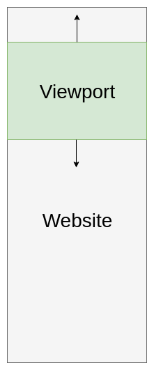
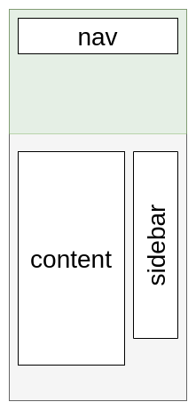
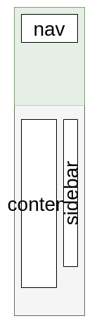
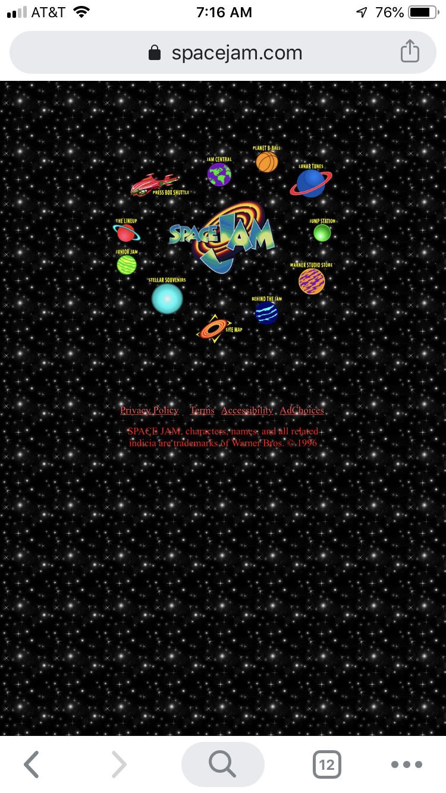
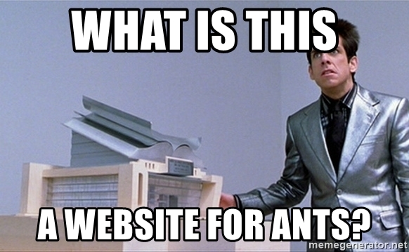
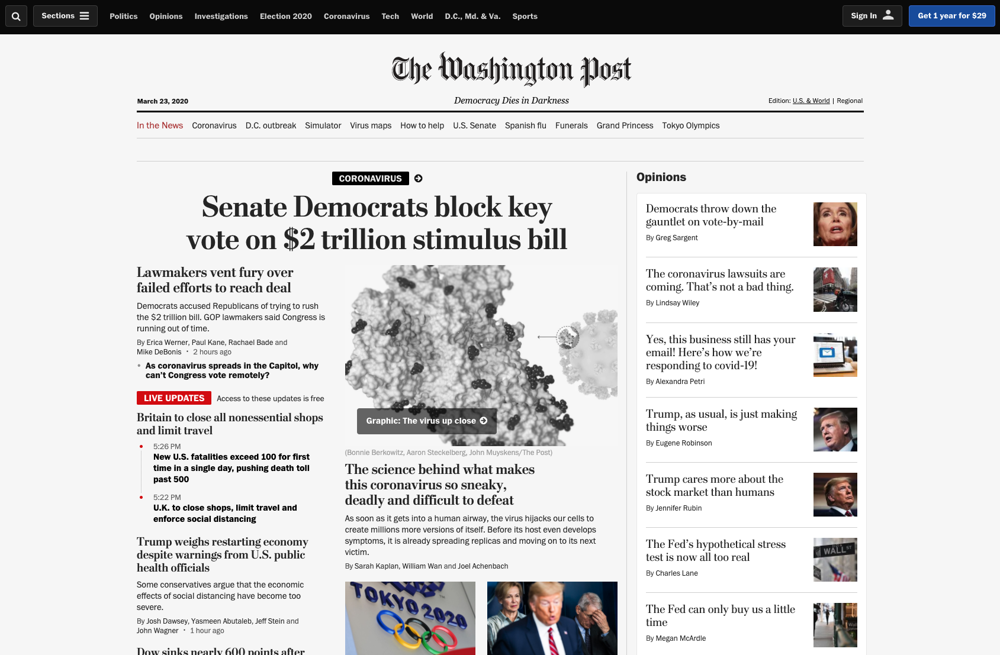
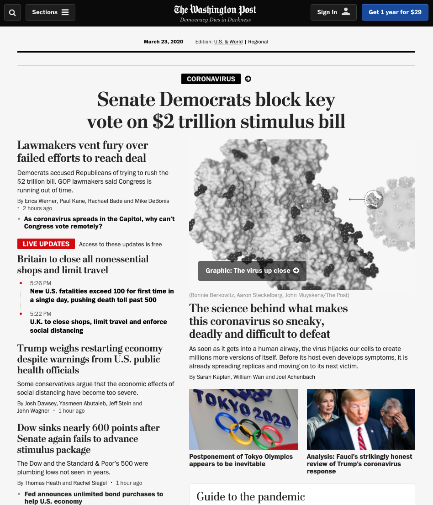
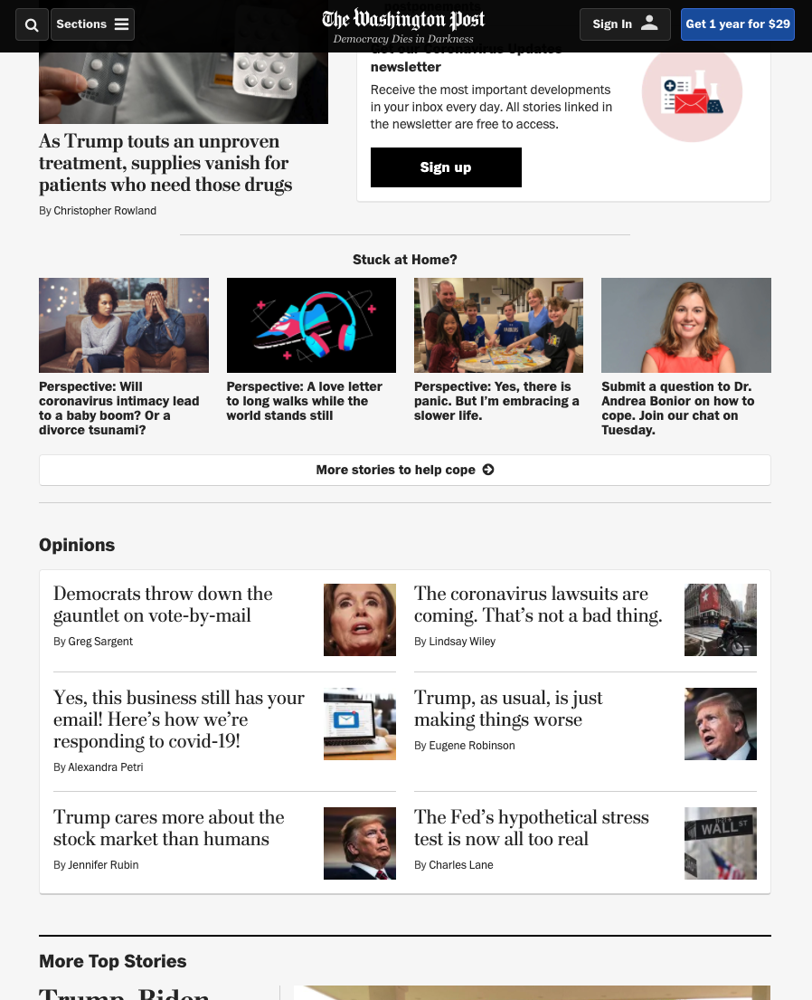
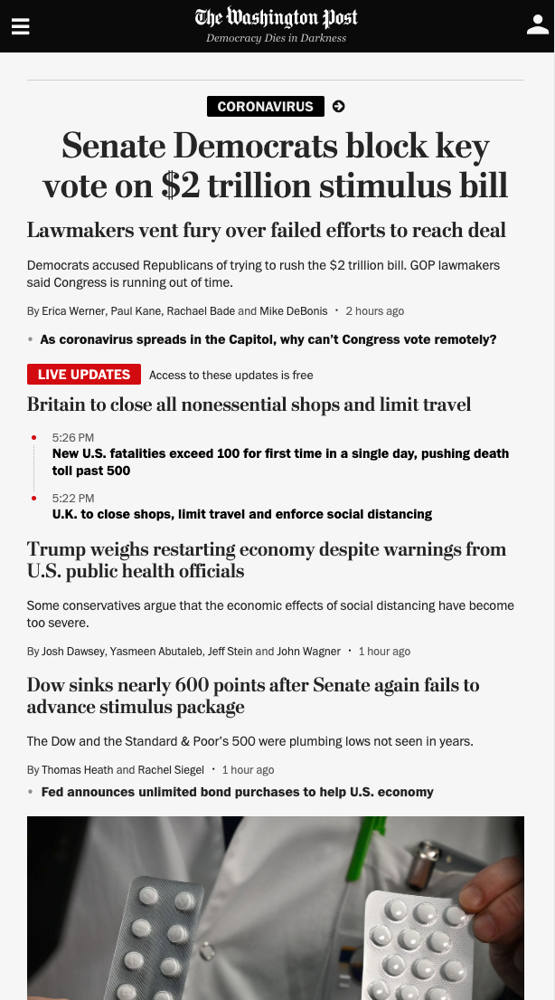

[](https://pursuit.org)

# Responsive Web Design

Or, how to make a website look good on all devices.

### Learning Objectives

- How to think about building websites responsively
- Specific technologies and actions used for responsive design

### Prerequisites

- HTML
- CSS Grid & Flexbox
- CSS Media Queries

---

## Framing & Background

The goal of this lesson is to start thinking in a new way about how websites should be structured.

We'll talk about the problems with building fixed width websites and the ways to avoid them.

On many websites, over 40% of the traffic comes from mobile devices or tablets. Many people's only connection to the internet is through their smartphone.

Addressing this problem is not just a matter of aesthetics, but functionality and even more so, accessibility. Catering to everyone who visits your site is absolutely in your best interest.

It's 2020 - all websites should be responsive and work well on phones, tablets, and computers.

## Lesson Outline

- The problem
- Media Queries
- Breakpoints

# The problem

Websites are often built with a desktop environment in mind, that's because initially only desktop computers could access the web. 

Many aspects of websites were built with this idea of print in mind - fixed sizes on a piece of paper. Think about a long sheet of paper that has all the content - it's got a specific width, and height and you as the user scroll up and down the page through this sort of frame called the **viewport**.

The part of the site that you can see at any given time is what's inside the **viewport**. It's just like it sounds. You can think of the viewport as the window to the site - the whole site is there, but you can only look at a little bit at a time.



Building websites for a desktop environment means, generally, you're operating with a minimum width around 1366 pixels. It also means the content inside that 1366px is either:

- A percentage of the width (e.g. 50%)
- A fixed width (e.g. 683px)

Here's a basic example of a site with a sidebar:



Let's think about what might happen when we look at this page on a smaller screen, like a phone or tablet. Or for something comparable, imagine what it would happen if you took your web browser and dragged/resized it to make it skinnier.



### Best case scenario

The phone will render the page with all of its features at normal proportions, just super zoomed out. If you've ever used a website like this you understand the frustrations - horizontal scrolling, tiny text, everything looks like it's made for ants.

Here's a screenshot of the Space Jam website, which is obviously a website that you would visit on a regular basis.





This site is pretty hard to deal with on a mobile device. Pull out your phones, open up spacejam.com, and go take a look around. In order to read the text you wind up doing a lot of pinching-and-zooming-and-scrolling-back-and-forth.

This is not ideal for users. But at least nothing appears broken or hidden.

### Worst Case Scenario

The worst case scenario is like the squished image above. All of the content formatting is basically unreadable because it's still 1/3 of the screen, but the screen is only 375px wide now.


In fact you can see it for yourself at [pursuit-core-6-2.github.io/website-responsiveness](https://pursuit-core-6-2.github.io/website-responsiveness/)

## Old Unmaintainable Solution

In the olden days, some websites had two versions: desktop and mobile.

You may even still see sites that do this. Visiting `https://www.reddit.com` from your desktop works great, but visit it from your phone and you'll probably be redirected to `https://m.reddit.com` (but they don't do that anymore which is good).

These are totally different sites! Different html, css, and javascript being served to the same users, just because they logged in from their phone. 

THIS IS TERRIBLE! Now you (the developer) have to maintain two completely different websites. Both versions, and you, are all probably both going to suffer as a result.

## Introducing Media Queries

Media queries are a CSS feature that lets you define properties and values at different browser widths.

Here's what a media query looks like in its simplest form:

```css
@media screen and (max-width: 500px) {
  .container {
    width: 100%;
  }
}
```

Let's break it down:

- `@media` is the start of the declaration. required.
- `screen` tells the browser to only use this on the screen. Another option is
  `print` for pdfs or printing out html pages. optional.
- `(max-width: 500px)` is one of the parameters you can specify. There are lots. This tells the browser to only apply this query when the screen width is **BELOW** 500px. required.

You'll most often use `min-width` and `max-width` but there are many more properties you can query on. Take a look at [MDN - Using Media Queries](https://developer.mozilla.org/en-US/docs/Web/CSS/Media_Queries/Using_media_queries) for those.

Mnemonics:

| Attribute   | if CSS was JS | Description              | Example              |
| ----------- | ------------- | ------------------------ | -------------------- |
| `max-width` | `<=`          | Less than or equal to    | `(max-width: 375px)` |
| `min-width` | `>=`          | Greater than or equal to | `(min-width: 576px)` |
| `width`     | `===`         | Is exactly equal to      | `(width: 300px)`     |


## Responsive website examples

Open up https://washingtonpost.com. Take a look at the layout you see when your browser is at full width (above 900px).

Notice that we have one section that takes up about 2/3 of the screen, and a sidebar that takes up 1/3.



What happens to those sections when we shrink the browser down a bit?





The section that previously took up 2/3 of the page now takes up all of the page. Otherwise it looks the same.

BUT ALSO! The side bar goes away. Where does it go?

Depending on the content, you can either completely hide (`display: none`) an item, or "stack" it. In this case, if you scroll down a bit you'll see that the sidebar stacked.



Because there wasn't enough space for all the Opinions content, the WaPo devs decided to push it down vertically instead of hiding it. 

They did this by making both the original section and the opinions section 100% width. When two items add up to more than 100% width, one is forced to "wrap" and gets pushed down below. The order that content appears on the page is (generally) based on the order that it appears in the HTML itself.

<details>
  <summary>
    What else changed about the Opinions section?
  </summary>

  There are now two columns instead of just one! This was done to better fill the width.

</details>

Now let's look at the same website but on a mobile device. Almost all mobile devices will be between 320-400px.



What's different now? Lots of stuff went missing, mostly images. And there is only one main column of content now. 

### Other responsive sites

Take a couple minutes and look at how other sites react to changing the viewport width. Open up each one and resize your browser.

* https://www.theverge.com/
* https://www.apple.com/
* https://www.yahoo.com/
* https://news.ycombinator.com/

There are varying levels of complexity in each of these sites. Apple has a much simpler layout than The Verge. Yahoo doesn't even really understand how to make a responsive site. Hacker News is just a text site that more or less works on mobile by default.

One way to make your site responsive is to make it simpler - but that doesn't always mean your site will be attractive.

When planning your design, think first about what content you want to have. Then you can make decisions about where it should go.

## Introducing Breakpoints

Now open one of those responsive sites again (either the verge or washingtonpost) on a full width browser. Slowly make the browser narrower and pay attention to when the content "jumps".

Most sites have 3 or 4 ranges of widths that they are supporting. This is so that they can cover computers (desktops and laptops), tablets, and smartphones. You will probably notice at least 3 times when the content "jumps". This jump is called a breakpoint.

Breakpoints are just pre-defined pixel widths that you use in conjunction with media queries. Ideally, you use these breakpoints consistently in every area of your site, so your page responds predictably.

When looking at a responsive website like one of the previous examples, open your inspector tools. While resizing (slowly!), look at the top right corner - it will tell you the viewport dimensions. Now pay attention to when the content jumps and you'll have discovered that website's breakpoints.

Here's what [Bootstrap 4](https://getbootstrap.com/docs/4.1/layout/overview/), the most popular CSS framework uses for its breakpoint sizes. Since Bootstrap is developed to be mobile first note how they always use `min-width` and we can speculate that their styling is incremental starting from smallest/mobile:

```css
/* Small devices (landscape phones, 576px and up) */
@media screen and (min-width: 576px) {
  ...;
}

/* Medium devices (tablets, 768px and up) */
@media screen and (min-width: 768px) {
  ...;
}

/* Large devices (desktops, 992px and up) */
@media screen and (min-width: 992px) {
  ...;
}

/* Extra large devices (large desktops, 1200px and up) */
@media screen and (min-width: 1200px) {
  ...;
}
```

## A live example

We'll use media queries and breakpoints together to make sure that our website looks nice on all sized devices!

### Setup

* Clone the [starter code for this lesson](https://github.com/joinpursuit/FSW-Responsive-Design-Starter)
* Open up the directory in your code editor and open the HTML in your browser.
* Resize your browser width and see what happens to different parts of the page.

### Making it responsive

Let's make some changes to the starter code to make our site responsive.

The first thing we should do is get a sense of all the different components that we want to change at different resolutions.

In this case, we'll start with the `.content` and `.sidebar` classes, because as we saw before, they have fixed widths and are full of content that gets squished on small screen sizes.

Now, what should we make our breakpoint? Generally, when a piece of content starts looking squished, that's a good place to start. In our case, let's go with a nice, round 700px.

What we want to do is make the `.content` and `.sidebar` classes take up the whole screen when the browser width gets below 700 pixels. This will cause them to stack. So our code should look like this:

```css
@media (max-width: 700px) {
  .content {
    width: 100%;
  }
  .sidebar {
    width: 100%;
  }
}
```

Awesome, this should keep our content from looking too smushed, but there's still a lot of empty space where the sidebar now is. It doesn't look super great. 

Let's make the sidebar cards flow from left to right, instead of each one being on its own row.

Add this to the above media query:

```css
.sidebar-card {
  display: inline-block;
}
```

That looks very bad! Maybe we should add a margin? And center everything?

```css
.sidebar-card {
  display: inline-block;
  margin: 5px 10px;
}

.sidebar {
  width: 100%;
  text-align: center;
}
```

Well that's better. But as you can see, there are only 4 cards, and at some widths one is left hanging on its own row. Sometimes that is the case - when dealing with an unknown amount of content, this can happen. Pretend these are loaded dynamically, and there can be anywhere between 4 and 10 of them. Designing with this in mind is important.

### Other responsive methods

Playing with widths is fairly straightforward, but it can get tricky when the site grows in complexity. 

What if we used CSS layout tools, like grid and flexbox, and adjusted them with media queries?

If you're ready, undo the changes you just made `git reset HEAD --hard` (they're available in the `width-solution` branch) and let's start by making our `<main>` tag grid.

```css
main {
  display: grid;
  grid-template-columns: 75% 25%;
}
```

This gives us a grid area with 2 columns. Since we didn't define `grid-template-rows`, it will gives us 1 row by default. The left column is 75% of the available width, the right is 25%. Since `<main>` has two child elements, they slot in to the 75/25 grid template in the order they're written on the page.

If we just make this change, our page will look a little funny. Remove the widths from `.content` and `.sidebar` so that they aren't fighting with the new grid.

```diff
.sidebar {
  border: 1px solid #ccc;
  padding: 20px;
- width: 30%;
  vertical-align: top;
  display: inline-block;
  background-color: white;
}

.content {
  padding: 15px;
- width: 70%;
  display: inline-block;
  font-size: 16px;
}
```

Now instead of changing the widths of the individual elements, we can change the whole grid layout for different screen sizes.

Make another media query at the bottom of the css file, and this time we'll rearrange the grid layout.

```css
@media(max-width: 700px) {
  main {
    grid-template-columns: none;
  }
}
```

Now we're saying: Don't set any columns. Let the content flow as normal. Since our `.content` and `.sidebar` are `block` elements they will be put on separate lines creating 2 rows (implicitly) for the grid.

This `grid` solution might be harder to understand at first, but it's more powerful. Instead of targeting individual elements by class names and messing with their widths, we're changing the whole structure of the grid.

> Grid isn't the only way to make your site responsive. Flexbox also has a lot of power! Experiment with both and see which one makes sense for each use case.

### Hiding stuff with media queries

What about the navbar up top? Maybe the number of items isn't dynamic, but there isn't enough room for all of them to display horizontally on mobile devices.

Sometimes the best course of action is just to hide things.

Instead of making a whole media query and awkwardly trying to target specific items, we can make a new class that we can apply to the HTML of any items to hide them.

```css
@media(max-width: 500px) {
  .hidden-mobile {
    display: none;
  }
}
```

Now add this class to a few items that we don't want to see.

```html
<nav class="navbar">
  <ul class="navbar-items">
    <li class="navbar-item">Logo</li>
    <li class="navbar-item">Home</li>
    <li class="navbar-item hidden-mobile">Item 1</li>
    <li class="navbar-item hidden-mobile">Item 2</li>
    <li class="navbar-item hidden-mobile">About</li>
    <li class="navbar-item">Profile</li>
  </ul>
</nav>
```

Go check out the site and voila! Hidden.

## Bonus: EM and REMs

One thing we can also do is set our font sizes to be **relative** based on the screen width. We do this with `em` and `rem` instead of using `px`.

Both `em` and `rem` are relative measurements. `em` means "the font size of the parent element". `rem` means "the font size of the HTML root element". Yes, the one at the very top of the document, that wraps `<body>` and `<head>`.

For most browsers, the default font size is `16px` so `1em` is equal to `16px`. In our stylesheet we have it set to `14px`.

Let's make the `<p>` tags `rem` and the `<h1>` an `em`.

```css
.content h1 {
  font-size: 2em;
}

.content p {
  font-size: 1.25rem;
}
```

Now in our media query, change the font size of the html element and of `.content`!

```css
@media(max-width: 700px) {
  .content {
    font-size: 20px;
  }
  html {
    font-size: 12px;
  }
}
```

You'll probably want to experiment with the sizing, but this is an easy way to scale all the fonts on your entire site up and down really easily.

## Summary

Today we talked about:

* How to think about websites as fluid, instead of fixed pieces of paper
* Good and bad solutions to mobile layouts
* Real Websites in the Real World and how they function on different screen sizes
* Media queries
* Breakpoints
* Using widths to change layouts
* Using CSS Grid to change layouts
* Hiding elements when there's not enough space
* Scaling font sizes using `em` and `rem`

## Resources

- A list of device viewport sizes: http://viewportsizes.com/


