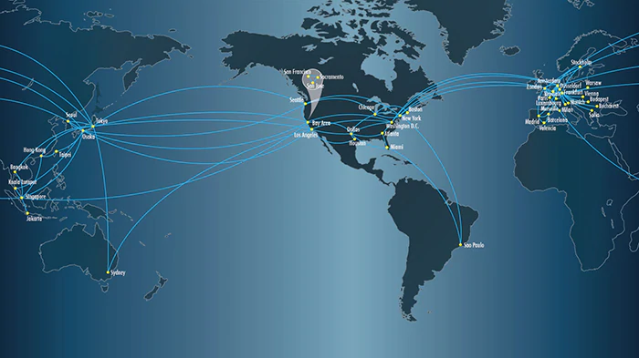
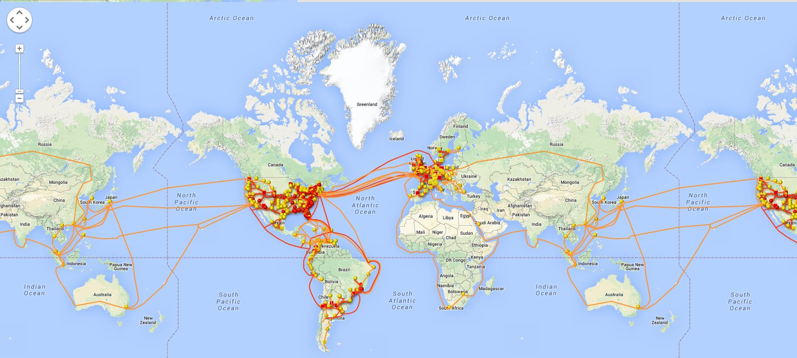
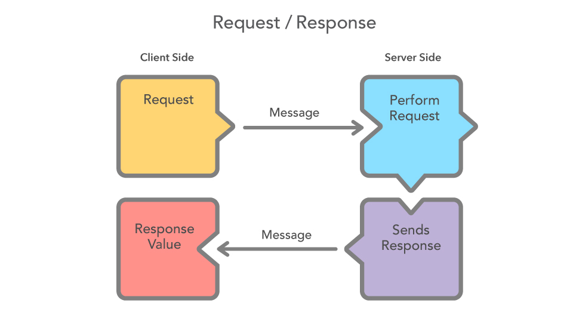
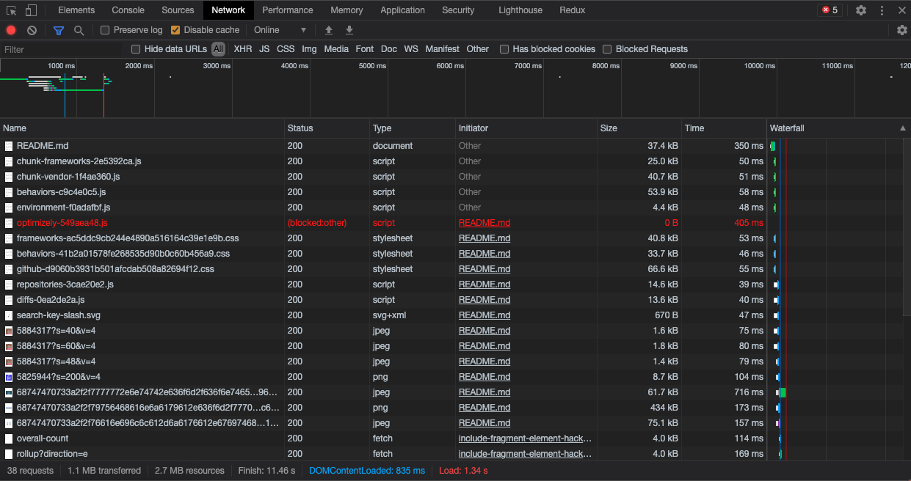
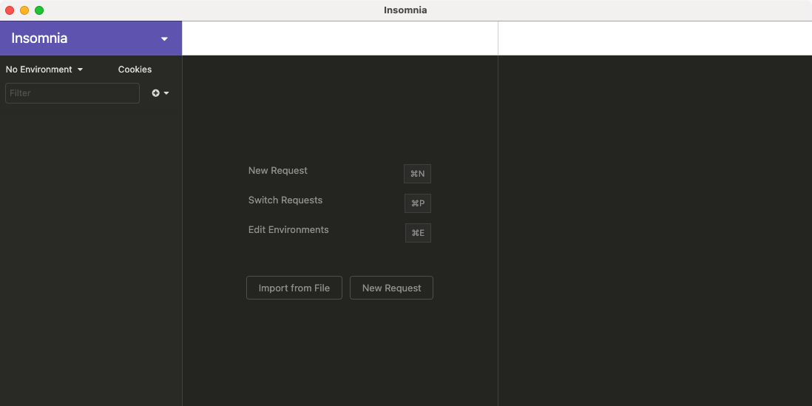

[](https://pursuit.org)

# The Internet

It's a series of tubes.

## Learning Objectives

- Talk about what the internet is
- Discuss client/server architecture
- What happens when you type in a url?
- Request/response lifecycle
- Javascript requests

## Prerequisites

- Some familiarity with javascript

---

## Framing & Background

What is the internet? What is it actually made of? How does it work? How do computers talk to each other? All of this is relevant to our jobs as programmers.

So far, all the code we have written has only existed and run on our local computers. Starting today, we're going to be learning about many things, but most importantly we'll talk about **requests** and how they work. They will be an essential part of our skillset as software engineers building web applications.

## What is the internet?

Short answer: it's a [series of tubes](https://www.youtube.com/watch?v=R8XSo0etBC4)

Long answer:

The internet is made up of many different types and layers of computers. These computers are connected by fiber optic cables that run around the world. Some even run [across the bottom of the ocean](https://en.wikipedia.org/wiki/Transatlantic_communications_cable).

There is no one place that the internet lives - it's distributed across many different cities, though in many places it's especially concentrated. For example, in Ashburn, VA there are dozens of warehouses holding rows and rows of computers. Some estimates say that 70% of all US internet traffic flows through there, but there's no way to reliably measure that.

Since the internet doesn't live only in one place, there are many challenges with routing internet traffic. There are special computers called DNS servers that just tell other computers where a website's traffic should be routed. Other computers (switches) do the actual routing - literally moving electrons from one fiber optic cable to another.

Just like the internet doesn't exist in one place, there is no single company that runs the internet. There are only a handful of companies that manage networks though, and the networks they manage are called [Tier 1 networks](https://en.wikipedia.org/wiki/Tier_1_network). Sometimes they're called `backbone` networks, and they are extremely large and critical to the continued operation of the internet. If one of these backbones went down, everything connected to it would be unable to communicate - though the rest of the networks would be able to.





## Clients and servers

You've probably heard the words `client` and `server` before. In a general sense, both of these words just refer to computers. A computer can be either a client, or a server, or sometimes (like your laptop) both!

A `server` is a computer, listening for requests, and sending back responses. This response information can be many things, but is usually something like:

- files: photos, js, css, html, or videos
- data from a database

A `client` is a computer that asks the server for information. A client can be one of many things - a laptop, a phone, a web browser, a program on your computer, a `node` script.

You can run a `node` server on your computer and make requests to it from your same computer. We will do this a lot when we start learning back-end javascript. Where the server is and where the request comes from doesn't make any difference.

## Request-Response lifecycle

When we talk about requests in this context, we're specifically talking about [HTTP Messages](https://developer.mozilla.org/en-US/docs/Web/HTTP/Messages). A message is either a request or a response.



- The client sends a request for data to the server.
- The server processes that request and then sends a response back.
- The client handles that response and then does something with the data, like displaying it on the screen - usually updating some HTML to make it appear.

Note that the client is always the one that initiates the request. By definition, that's what makes it a client. The server is the one that responds to that request.

**HTTP Status Codes**

HTTP messages have special [Status Codes](https://en.wikipedia.org/wiki/List_of_HTTP_status_codes) that indicate whether the response was successful or not. 

Status codes range from 100-500ish and are broken down into categories:

- 100 - Information
- 200 - Success
- 300 - Redirection
- 400 - Client errors
- 500 - Server errors

The most common status codes you'll see are:

- `200` which means "OK", or that the request was successful and the response was sent back without issue.
- `301` which means "this was moved elsewhere". If you type `google.com` and your browser takes you to `www.google.com` its because of a `301` response.
- `404` which means "this page was not found"
- `500` which means "the server encountered an error". Sometimes you get a nice message back about why, but often you do not.

**HTTP Request Methods**

There are multiple types of requests that clients can make. 

These are known sometimes as HTTP "verbs". You can think of each one as an action.

* GET - give me some data
* POST - take this data and create / save something on the server (example: a new user account)
* PUT - update this data (example: change your shipping address on your Amazon account)
* DELETE - delete this data


## Making your own requests

You may not realize that you have already been making requests!

Every time you load a web page, some requests are made. We can look at all of the requests using the browser's devtools network tab.

* Open any website, like the [main curriculum page](https://github.com/joinpursuit/Pursuit-Core-Web)
* Open the devtools (Cmd-Option-i in Chrome)
* Click the `Network` tab
* Refresh the page



You'll see a whole bunch of stuff happening as the page loads!

### Anatomy of a request

Each line here is a request that the browser makes. At the bottom is a summary - this page took 38 requests and 11.46 seconds to load everything!

The first request is to get the actual HTML for the page. From there, the browser parses the HTML and then makes a request for each resource that the HTML contains - one for each image, script, css file, font, and anything else the HTML has. There might also be other requests - these are triggered by the javascript that runs on the page.

If you look at the columns, you can see useful information about each request. The `Status` and `Type` are probably the most helpful here.

Status is the `HTTP status code` like we talked about above. `Type` tells you what the response contains. 

> What do you think all the different `Type` values mean?

If you click on a row, you'll see more detailed information about that request and response. The main thing to look at here is the `Headers` tab. Each request contains descriptive information telling the server what to expect. You can see the request `Method` like we talked about above, and lots of other information that probably doesn't make a ton of sense right now. We'll get into what some of the headers mean in later lessons.

### You do: Different website requests

Pick 3 different websites that you know. Type them into the URL bar and see how many network requests each one takes to load.

Scroll through the requests and see if anything comes out at you that surprises you. Write it down! We'll talk about it together.

## Okay let's actually make requests

Hopefully you have [Insomnia](https://insomnia.rest/download/) installed already. If not, take a minute to download and install Insomnia Core.

We're going to be working with an API today called `PokeAPI`. We haven't exactly talked about what an API is yet, but just think of it as a server that responds to our requests for data. `PokeAPI` specifically contains all kinds of information about pokemon, and we can access it in various ways just by making requests.

Open `Insomnia` and you'll see a screen like this:



* Click `New Request`
* Give it any name (`pokemon` if you can't think of one)
* In the top bar next to the GET dropdown, put this url: `https://pokeapi.co/api/v2/pokemon/ditto`
* Click **Send**

> What do you see happen?

What we get back is a response, which comes in the form of **JSON**. JSON stands for JavaScript Object Notation, and it's a structured format for sending and receiving data. Luckily, because we work exclusively in JSON, we can treat it just like one big giant object.

Hooray! You've made your first request!

### Curl

Insomnia is a really nice user interface that makes requests for us, but we can also use the command line. Specifically, there's a program called `curl` that comes in built-in to MacOS.

Type this in your terminal:

```bash
$ curl https://pokeapi.co/api/v2/pokemon/ditto
```

You'll get back a whole bunch of text! It's actually JSON, just unformatted in your terminal. 

### Experiment!

Try making requests to various URLs and see what happens! Make a request in Insomnia and then using `curl`. See how they differ. 

* `https://google.com`
* `https://swapi.dev/api`
* `https://icanhazdadjoke.com`
* `https://pokeapi.co/api/v2/item/23`

Explore the PokeAPI and SWapi documentation and you can see what kinds of requests you can make. 

* On PokeAPI, find 3 different ways to search for pokemon
* On SWAPI, find the `species` response that contains `Humans` as the name

Every request should be a GET, you'll just change the URL that you make the request to.

### Resources

- [HTTP Messages](https://developer.mozilla.org/en-US/docs/Web/HTTP/Messages)
- [HTTP Status Codes](https://en.wikipedia.org/wiki/List_of_HTTP_status_codes)
