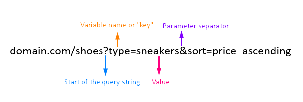
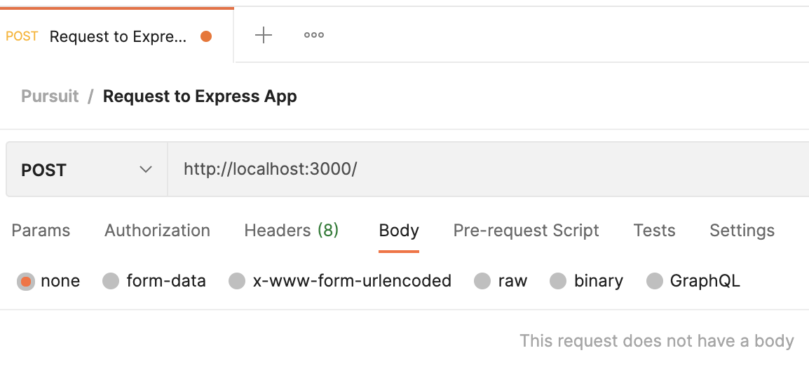
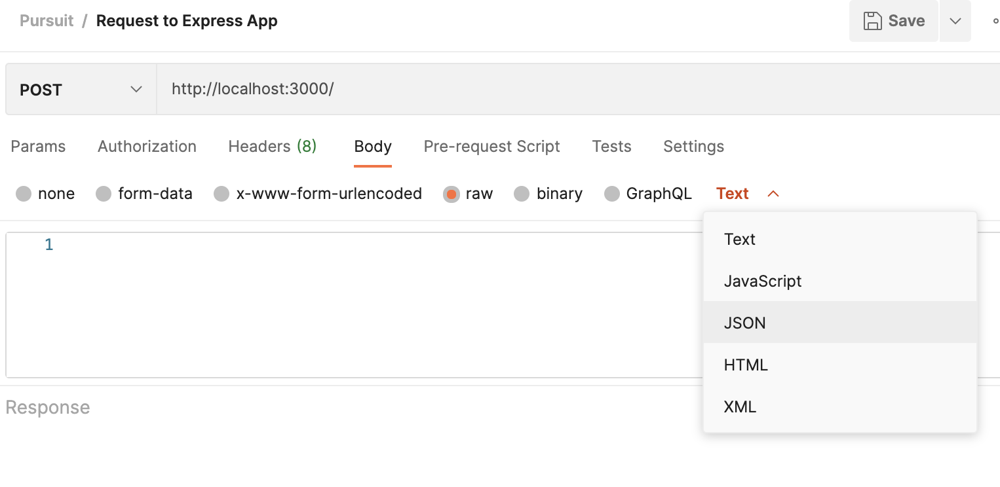

# Express.js - Passing Data

# Objectives
- `Demonstrate passing data to a Server using URL Parameters`
- `Demonstrate passing data to a Server using Query Strings`
- `Demonstrate passing data to a Server using POST Request Body`


## Key Vocabulary
- URL Parameters
- URL Query Strings
- POST Request Body


## Why do we want to pass data to a Server?

We know that `clients` request resources from `servers`, and `servers` hold lots of useful information for us. Often, to get the right `resource` back, we want to pass some data to the `server`. For example, maybe I want information about a specific user - I might pass the user's email with my `request`, and the `server` could use that email to give me back `resources` associated with that email.

Some other reasons we might want to pass data to a server are:

- You want to login with an username and password
- You want to recieve back information about a certain city
- You want to indicate what page of a book you're reading
- You want the server to know it's really you and that you should be authenticated

## Different ways of passing data to the Server

There are several ways you can pass data to a server. Some ways are best suited for particular cases than others. For example, some ways are more `secure`. Other ways give the client some control over your server-side logic. The three ways we will discuss in this lesson are through:

1. `URL Paramaters`: Websites use this all the time, to show user specific information
2. `URL Query Strings`: Shopping websites may use this to indicate what page you're on
3. `Request Body`: These are considered safer and are used for more sensitive and larger amounts of data.

## Objective 1: URL Parameters

This is one of the most useful ways of passing data to the server. It allows your endpoints to be more dynamic.

URL Parameters are defined like the following:
```javascript
app.get('/:parameter_name')
```
Basically, anywhere in the URL you want to add a <kbd>parameter</kbd> you start defining it with a `:` colon and then indicate the name of the <kbd>parameter</kbd> so you can reference it in your backend code.

**Let's test out the following example.** 
Either follow the next steps to set up a new Express app, or use your existing `my-express-app` !

1. Create a directory for your new application and navigate into it:

    ```bash
    mkdir express-passing-data
    cd express-passing-data
    ```

2. Install Express and Nodemon

    ```bash
    npm install express
    npm install -g nodemon
    ```

3. Create a file named **index.js** in the root of the *express-passing-data* application directory. In this file we import `express` and add the following code:


    ```javascript
    const express = require('express');
    const app = express();
    const port = 3000;

    app.get('/dog/:type', (req, res) => {

      const typeOfDog = req.params.type; // We are accessing the request object's parameter object
      
      res.send(`Hello I'm a ${typeOfDog} doggo!`);
    });

    app.listen(port, () => {
      console.log(`Listening on port ${port}!`)
    });
    ```
4. Run your server with:

    ```js
      nodemon index.js
    ```

4. Go to your Browser or Postman and enter: http://localhost:3000/dog/corgi

    `What response do you see?`

    <details><summary>Solution</summary>

    ```
    Hello I'm a corgi doggo!
    ```
    </details>
    <br>

5. Now, add `console.log(req.params);` right before the response. This will log all of the request's <kbd>URL parameters</kbd>.

    `What result is in our console?`

    <details><summary>Solution</summary>

    ```
    Listening on port 3000!
    { type: 'corgi' }
    ```
    </details>
    <br>

Let's add a second <kbd>parameter</kbd>, now, and see how the result in our console changes.

6. Change your route to be "/dog/:type/coat/:color"

```js
  app.get('/dog/:type/coat/:color', (req, res) => {
    const typeOfDog = req.params.type;
    console.log(req.params)
    res.send(`Hello I'm a ${typeOfDog} doggo!`);
  });
```
7. Go to your Browser or Postman and enter: http://localhost:3000/dog/corgi/coat/brown

    `What does the console result look like now?`

    <details><summary>Solution</summary>

    ```
    Listening on port 3000!
    { type: 'corgi', color: 'brown' }
    ```
    </details>
    <br>


You can see how the `req.params` object holds all of our <kbd>URL Parameters</kbd>. <kbd>URL Parameters</kbd> allow us to customize our Routes a bit and add in custom functionality depending on what parameter is passed in.

<br>

## Objective 2: URL Query Strings

<kbd>Query Strings</kbd> allow the client to pass various amounts of data without strictly specifying them on the server. 

```
http://localhost:3000/?foo=bar
```

<kbd>Query strings</kbd> always start at the *end* of an endpoint, then begin with the `?` character followed by the name of the query variable and value after the assignment operator.



*URL Query String Example - via [link](https://www.kameronjenkins.com/seo/url-parameters-query-strings)*

Let's test a few <kbd>query strings</kbd> using the following code.

1. Edit your `index.js` file to look like this:

    ```javascript
    const express = require('express');
    const app = express();
    const port = 3000;

    app.get('/', (req, res) => {

      const query = req.query; // We are accessing the request object's query object
      
      res.send(query); // Let's respond back with the entire query object
    });

    app.listen(port, () => {
      console.log(`Listening on port ${port}!`)
    });
    ```

2. Enter the following in your Browser or Postman, http://localhost:3000/, we get the following result:

    ```
    {}
    ```

    An empty query object.
    
3. So why don't we define a query? http://localhost:3000/?name=Rex

    This should give us the result:

    ```
    {
        "name": "Rex"
    }
    ```

    Pretty cool!

4. Now let's *chain* more queries together.

    http://localhost:3000/?name=Rex&age=2&type=Husky 

    `What does this give us?`


    <details><summary>Solution</summary>

      ```js
      {
          "name": "Rex",
          "age": "2",
          "type": "Husky"
      }
      ```
      
      </details>
      <br>

We can do a lot of cool and powerful things with <kbd>query strings</kbd>. It is solely up to the server to decide what values it wants to accept and use, no matter what gets passed to it.
<br>

## Objective 3: POST Request Body

`POST` requests are used to send data to a server to in order to create/update a resource.

1. POST requests are never cached
2. POST requests do not remain in the browser history
3. POST requests cannot be bookmarked
4. POST requests have no restrictions on data length

The data sent to the server with POST is stored in the <kbd>request body</kbd> of the HTTP request:

```
POST / HTTP/1.1
Host: localhost
name1=value1&name2=value2
```

You can use Postman to create your `Post` requests, which we will be doing for this portion of the lesson.

We will also be using a newer feature of Express which will give our `req` object the ability to access <kbd>body</kbd> values.

1. Edit your `index.js` file to look like this:

  ```javascript
  const express = require('express');
  const app = express();
  const port = 3000;

  app.use(express.urlencoded());  // parse application/x-www-form-urlencoded
  app.use(express.json());  // parse application/json


  app.post('/', (req, res) => {
    const body = req.body;
    res.send(body); // Send the entire request body
  });

  app.listen(port, () => {
    console.log(`Listening on port ${port}!`)
  });
  ```


2. Open up Postman and create a new request, but this time it should be a `POST` request!

    

3. Let's add a `body` to our request! Click on `Body`, then `raw`, and select `JSON` from the `Text` dropdown:

    

4. Paste this into the `JSON` area:
```js
  {
	  "dog": "pomeranian"
  }
```

5. Hit send! You should see what you passed as the <kbd>body</kbd> be returned in the response.

`Check for Understanding:` Change your `POST` endpoint so that the response now say "I love my pomeranian so much!" using the "pomeranian" value from the `req.body`.

<br>

***

## Extra Resources
- [HTTP POST Method - MDN](https://developer.mozilla.org/en-US/docs/Web/HTTP/Methods/POST)