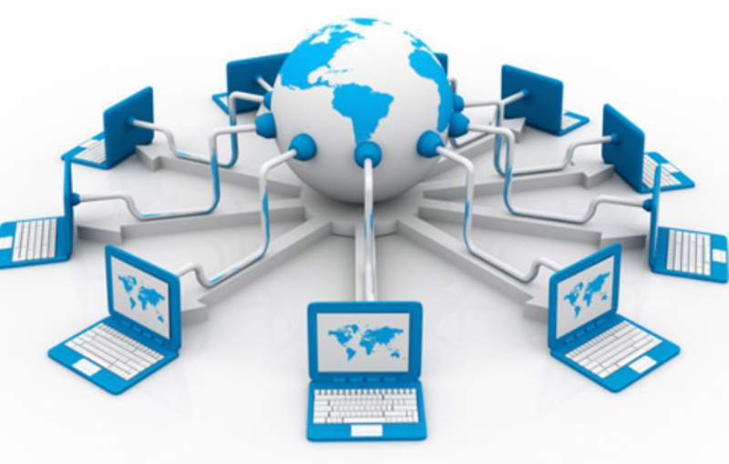

# How the Internet works

# Topics
- What is the Internet?
- What is a Server?
- What is a Client?
- IP Addresses and DNS 

# Lesson

## What is the Internet?

The Internet is the backbone of the Web, the infrastructure that makes the Web possible. In essence, the Internet is a large network of computers which all communicate together.

What started in the 1960s as a US military research project, soon evolved into a public infrastructure. The various technologies that support the Internet have evolved over time, but the way it works hasn't changed that much: Internet is a way to connect computers all together.

### Client vs. Server

Computers connected to the web are called **clients** and **servers**. A simplified diagram of how they interact might look like this:

- Clients are the web user's internet-connected devices (phone, computer, etc.) and the web-accessing software available on those devices (chrome, firefox, etc.).
- Servers are computers that store webpages, sites, or apps. When a client device wants to access a webpage, a copy of the webpage is downloaded from the server onto the client machine to be displayed in the user's web browser.

### So what happens, exactly?

When you type a web address into your browser:

1. The browser goes to the DNS server, and finds the real address of the server that the website lives on.
2. The browser sends an HTTP request message to the server, asking it to send a copy of the website to the client.
3. Provided the server approves the client's request, the server sends the client a "200 OK" message, and then starts sending the website's files to the browser as a series of small chunks called data packets.
4. The browser assembles the small chunks into a complete website and displays it.

## What's a Server?

A server is basically just a computer designed to take requests and send back responses. The word "server" is understood by most to mean a web server where webpages can be accessed over the internet through a client like a web browser.

### Types of Servers
1. **Web server**: Web servers show pages and run apps through web browsers. The server your browser is connected to right now is a web server that's delivering this page and any images you see on it. 
2. **Email server**: Email servers facilitate the sending and receiving of email messages.
3. **FTP server**: FTP servers support the moving of files through File Transfer Protocol tools

## What's a Client?

A client is any computer program or machine that makes a request to a server. 

### Types of Clients

1. **Web Browser:** Your Web browser is a special program that is built to send requests to the internet and retrieve responses. The browser then portrays the data to you.
2. **Mobile App:** Any app that is connecting to the internet to retrieve data is a client.

## IP Addresses & DNS

### Finding computers

* Source: [*How does the Internet work?* by mozilla contributors](https://developer.mozilla.org/en-US/docs/Learn/Common_questions/How_does_the_Internet_work)

If you want to send a message to a computer, you have to specify which one. Thus any computer linked to a network has a unique address to identify it, called an **IP address**. It's an address made of a series of four numbers separated by dots, for example: `192.168.2.10`.

To make things easier for humans, IP addresses usually have a human readable alias called a **domain name**. For example, `google.com` is the domain name used on top of the IP address `173.194.121.32`. Using the domain name is the easiest way for us to reach a computer over the Internet.

The client and server we've described above don't tell the whole story. There are many other parts involved, and we'll describe some of them below.

* **DNS**: Domain Name Servers are like an address book for websites. When you type a web address in your browser, the DNS needs to be reached first to translate the address to an ip address.
* **HTTP** (Hypertext Transfer Protocol): a protocol that defines  how clients and servers speak to each other.
* **Component files**: A website is made up of many different files, which are like the different parts of the goods you buy from the shop. These files come in two main types:
  * **Code files**: Websites are built primarily built from HTML, CSS, and JavaScript.
  * **Assets**: All the other stuff that makes up a website, such as images, music, video, Word documents, and PDFs.

