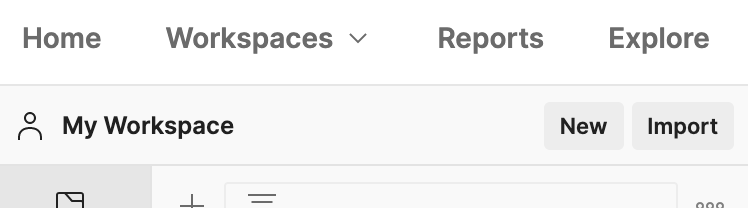
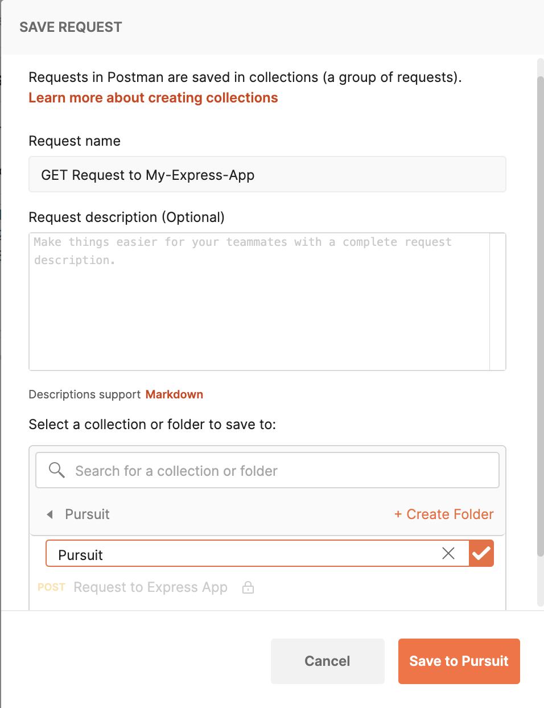
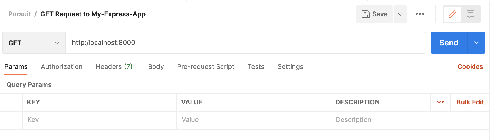

# Intro to Express.js and Routing

# Objectives
- `Use Express.js to set up a simple server-side web application.`
- `Understand and utilize all four HTTP request methods.`
- `Name routes using best practices.`

## Key Vocabulary
- Routing
- HTTP methods (GET, POST, PUT, DELETE)
- Endpoint

# Objective 1: Using Express.js

### Server-Side Web Frameworks

`Express.js` is a `server-side web framework` for Node.js.

Server-side web frameworks are software that make it easier to write, maintain and scale web applications. They provide tools and libraries that simplify common web development tasks, including:

- Routing URLs to appropriate handlers (e.g. showing you cats when you're on examplesite.com/cats and dogs when you're on examplesite.com/dogs).
- Interacting with databases to save and sort data on the server side.
- Supporting sessions and user authorization  (e.g. logging you in, keeping you logged in, and keeping your password and identity safe).
- Formatting output (e.g. HTML, JSON, XML).
- Improving security against web attacks.

# Getting Started with Express.js

### Adding dependencies

We will use npm to install and set up an express app.

1. Create a directory for our new application and navigate into it:

```bash
mkdir my-express-app
cd my-express-app
```

2. We use the npm "`init`" command to create a **package.json** file for our application. This command prompts us for a number of things, including the name and version of the application and the name of the initial entry point file (by default this is **index.js**). For now, we will just accept the defaults by clicking enter after each prompt and typing `yes` when asked:

```bash
npm init
```

When we open the **package.json** file, we will see the defaults that we accepted, ending with the license.

```json
{
  "name": "my-express-app",
  "version": "1.0.0",
  "description": "",
  "main": "index.js",
  "scripts": {
    "test": "echo \"Error: no test specified\" && exit 1"
  },
  "author": "",
  "license": "ISC"
}
```

3. Now we  install the _Express.js_ library in the **my-express-app** directory. The package will automatically be saved to the dependencies list in our **package.json** file.

```bash
npm install express
```

The dependencies section of our **package.json** will now appear at the end of the **package.json** file and will include _Express.js_.

```json
{
  "name": "my-express-app",
  "version": "1.0.0",
  "description": "",
  "main": "index.js",
  "scripts": {
    "test": "echo \"Error: no test specified\" && exit 1"
  },
  "author": "",
  "license": "ISC",
  "dependencies": {
    "express": "^4.17.1"
  }
}
```

4. We create a file named **index.js** in the root of the *my-express-app* application directory. In this file we import `express` and start a minimal web server:

```js
const express = require('express') // import express
const app = express() // create an express server
const port = 8000; // we will use this later

app.get('/', (req, res) => {
  res.send('Hello World!')
}) // routes the '/' URL path to produce a response of 'Hello World!'

app.listen(port, () => {
  console.log(`Example app listening on port ${port}`)
}) // asks our server to listen for requests on port 8000, logging to the console to confirm that things are working
```

The code above is a minimal "HelloWorld" Express.js web application. This imports the "express" module and uses it to create a server (`app`) that listens for HTTP requests on port 8000 and prints a message to the console explaining what browser URL you can use to test the server. The `app.get()` function only responds to HTTP `GET` requests with the specified URL path ('/'), in this case by calling a function to send our _Hello World!_ message.

5. You can start the server by calling node with the script in your command prompt:

```bash
node index.js
Example app listening on port 8000
```

6. We can now navigate to the URL [http://localhost:8000/](http://localhost:8000). If everything is working, the browser should display the string `"Hello World!"`.

`Check for Understanding:` Can you edit your `app.get()` function to console.log the response status code?

<details><summary>Solution</summary>

```js
app.get('/', (req, res) => {
    res.send('Hello World!')
    console.log(res.statusCode)
})
```
If you restart your server (by running (`<ctrl> + c`) in the terminal and then ```node index.js``` again, once you refresh `localhost:8000` you should see `200` in your terminal console!)

</details>
<br>

# Nodemon - Automatic Server Restarts

We will use [nodemon](https://nodemon.io/) while we develop our node/express apps. Nodemon will monitor the files in our app directory and automatically restart the server on any file change. If we didn't do this, we'd have to manually close the server process (`<ctrl> + c`) and restart the server every time we wanted our changes to be reflected in the browser.

To install nodemon in your `my-express-app` project:

```bash
npm install -g nodemon
```

We use `-g` because we want to save nodemon *globally*. So that in the future we can use it for any other project if necessary.

Now, if we navigate to the root folder of the app, we can start the server with the following command:

```js
nodemon index.js
```
`Test that it's working by making a change in your index.js file (maybe add a console.log) and watch the server restart after you hit save!`

# Routing

### Endpoints

Routing is one of the most fundamental concepts in server side development. A server can do a bunch of different things, but it doesn't want to do *every* possible thing anytime a client reaches out to it. How does the server know which task it should run at anytime? That's through `endpoints`.

`Endpoints` tell the  server which part of the server or website we are attempting to request.

```bash
https://example.com/this-is-an-endpoint
https://example.com/another/endpoint
https://example.com/some/other/endpoint
https://example.com/login
https://example.com/user
https://example.com/cart/items
```

Endpoints come in all shapes and sizes. They are made to be `human readable` and intuitive.

For example let's say we want to access a certain Instagram user:

```
https://www.instagram.com/:username
```

We would pass in the username:

```
https://www.instagram.com/wnba // Returns WNBA Instagram profile
```

`Check for Understanding:` If I had a personal website (www.mypersonalsite.com) and added an area for my personal blog, what would a good endpoint be?

<details><summary>Solution</summary>

www.mypersonalsite.com/blog
</details>
<br>


# Objective 2: HTTP Request Methods Review

HTTP defines a set of request methods to indicate the desired action to be performed for a given resource. Although they can also be nouns, these request methods are sometimes referred as `HTTP verbs`. Each of them implements a different semantic.

### Types of Request Methods:

1. `GET`: The GET method requests a specific resource. Requests using GET should only retrieve data, not change it.
2. `POST`: The POST method is used to submit a new thing to the specified resource, often causing a change in state or side effects on the server.
3. `PUT`: The PUT method modifies a specific resource. This will not make a new thing, but it will edit an existing thing.
4. `DELETE`: The DELETE method deletes the specified resource.

Whenever we submit a URL into our browser that is a `GET` request. So, when you are browsing the internet, you are sending lots of `GET` request!

### Testing Requests using Postman

There is a very helpful tool we use as server side developers to test endpoints. It is known as [Postman](https://www.postman.com/downloads/). Please download it and install it on your systems if you don't already have it.


# Routing with Express.js

One of `Express.js's` strengths is the ability to seamlessly create routes as you need it.

Route definition takes the following structure:

```app.METHOD(PATH, HANDLER)```

1. `app` is an instance of express.
2. `METHOD` is an HTTP request method, in lowercase.
3. `PATH` is a path on the server.
4. `HANDLER` is the function executed when the route is matched.

The following examples illustrate defining simple routes. Add them to your `my-express-app` project in the `index.js` file:

```js
app.get('/', (req, res) => {
  res.send('Hello World!')
});

app.post('/', (req, res) => {
  res.send('Got a POST request')
});

app.put('/user', (req, res) => {
  res.send('Got a PUT request at /user')
});

app.delete('/user', (req, res) => {
  res.send('Got a DELETE request at /user')
});

```

`Check for Understanding:` Make a `/blog` route that just sends back "I see you want to read my blog!"

<details><summary>Solution</summary>

```js
app.get('/blog', (req, res) => {
  res.send('I see you want to read my blog!')
});

This should be a `GET` method since it is requesting the blog resource.
```

</details>
<br>

## Test Endpoints with Postman

Test these out using [Postman](https://www.postman.com/downloads/)!

1. Open up Postman and make a new Request (on the top left click `New` and then `Request`).

  

2. Name your Request something descriptive, and create a `Pursuit` folder to save this request in.

  

3. Hit `http://localhost:8000/`

  

4. Try it with `http://localhost:8000/blog` too!

### Returning JSON

Express.js can also return json! Instead of using `res.send` we can use `res.json` to send a reponse in JSON format.

Add these new `GET` endpoints to your `my-express-app` project:


```js
app.get('/users', (req, res) => {
  res.json({"users": ["Amy", "Bob", "Cat"]});
})


app.get('/smallPrimes', (req, res) => {
  res.json({"smallPrimes": [2, 3, 5, 7]});
})
```

`Check for Understanding:` Hit the `/users` GET endpoint with Postman and see what the response looks like in the preview area.

<details><summary>Solution</summary>
  It should look like this:

  ```js
    {
      "users": [
        "Amy",
        "Bob",
        "Cat"
      ]
    }
  ```
</details>
<br>

# Objective 3: Parameters and Route Naming

When defining an endpoint, you can also specify what parameters you are expecting. Notice the addition of `:userID` in the URL path. This parameter then gets used with `req.params.userID`.

```js
app.get("/users/:userID", (req, res) => {
  console.log(req.params)  
  // Fetch a real user using the userID
  let user = {name: 'Sample User', id: req.params.userID}
  res.json({'user': user})
})
```

`Add this endpoint to your project and test it out with Postman!`


## Route Naming Conventions

Having consistent route naming conventions is key to a well-organized web app! The `Consistency is the key` area of [this site](https://restfulapi.net/resource-naming/) gives some best practices:

1. Use forward slash (/) to indicate hierarchical relationships:
```js
  "/"
  "/user"
  "/users/:userID"
  "/users/:userID/settings"
```
2. Do not use trailing forward slash (/) in URIs

```js
  "/users/:userID"  # YEP
  "/users/:userID/" # NOPE
```
3. Use hyphens (-) to improve the readability of URIs

```js
  "/users/:userID/account-management" # YEP
  "/users/:userID/accountManagement"  # NOPE
```
4. Do not use underscores ( _ )

```js
  "/users/:userID/account-management" # YEP
  "/users/:userID/account_management"  # NOPE
```
5. Use lowercase letters in URIs

```js
  "/users/:userID/account_management"  # YEP
  "/Users/:userID/Account-Management" # NOPE
```
6. Do not use file extentions
```js
  "/users/:userID/account_management"  # YEP
  "/users/:userID/account_management.xml" # NOPE
```

`Check for Understanding:` Fix this route name to follow best practices: "/Dogs/:dogID/Adoption_info"

<details><summary>Solution</summary>

  ```js
   "/dogs/:dogID/adoption-info"
  ```
</details>
<br>

# CORS

If you want to make asyncronous requests to your server, you need to make sure that Cross Origin Resource Sharing is enabled.  To do so, you can use the `cors` npm package.

```bash
npm install cors
```

Then in your server:

```js
const express = require('express')
const cors = require('cors')

const app = express()
app.use(cors())
```

After adding all of these endpoints, your `index.js` file should look something like [this](https://gist.github.com/MaggieWalker/918bad9bf389ff344a00194a9d22eadc).

## Extra Resources
- [Express Routing](https://expressjs.com/en/guide/routing.html)
- [RESTful API Resource Naming](https://restfulapi.net/resource-naming/)
- [CORS - MDN](https://developer.mozilla.org/en-US/docs/Web/HTTP/CORS)