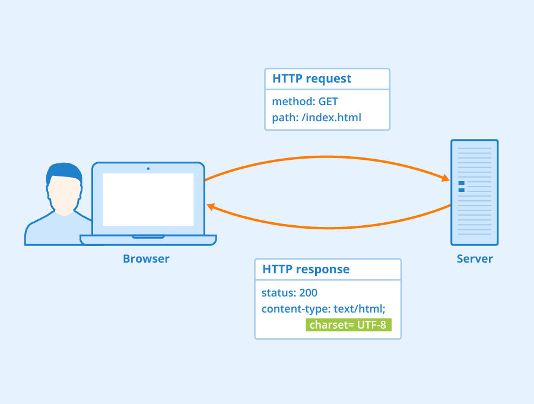
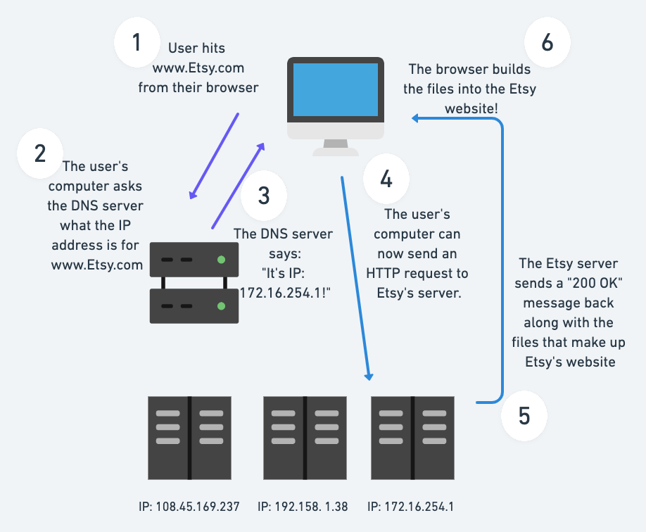
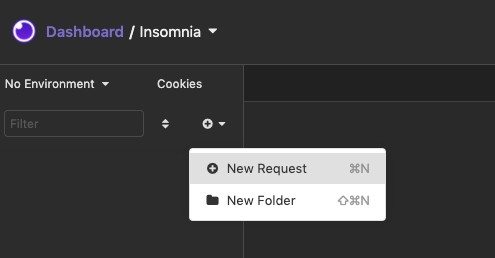
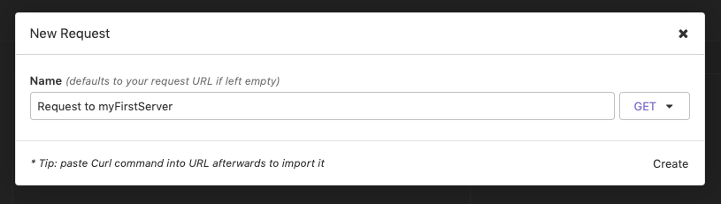
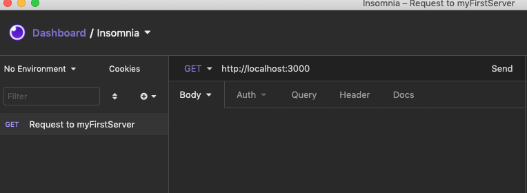

# Introduction to Servers

# Objectives
- `Illustrate the relationship between the internet, clients, and servers.`
- `Explain how a message gets sent to a specific computer.`
- `Create a simple server and validate that it works.`

## Key Vocabulary
- Internet
- Server
- Client
- IP Address
- DNS Server
- Port
- Request/Response (Req/Res)

# Objective 1: The Internet, Clients, and Servers
## The Internet
The Internet is the backbone of the Web, the infrastructure that makes the Web possible. In essence, the Internet is a large network of computers which all communicate together.
The origins of the Internet go back to around the 1960s, when researchers started to work on a way to create a network of connected computers. The various technologies that support the Internet have evolved over time, but the way it works hasn't changed that much: the Internet is simply a way to allow computers to talk to each other.


## Clients and Servers

When computers are connected in a network, like the internet, they become <kbd>clients</kbd> and <kbd>servers</kbd>. A computer that has a resource and wants to share it will be a <kbd>server</kbd>, and a computer or program that wants to access or consume such resource we call a <kbd>client</kbd>. Just like a restaurant worker *serves* up a hamburger to a *client* who requests one, a computer <kbd>server</kbd> serves up some information that another computer <kbd>client</kbd> asks for! A simplified diagram of how they interact might look like this:


- <kbd>Clients</kbd>, more specifically, are user's internet-connected devices (phone, computer, etc.) and the web-accessing software available on those devices (chrome, firefox, etc.).
- <kbd>Servers</kbd> are computers that store webpages, sites, or apps. When a <kbd>client</kbd> device wants to access a webpage, a copy of the webpage is downloaded from the <kbd>server</kbd> onto the <kbd>client</kbd> machine to be displayed in the user's web browser.

## What's a Server?

A server is basically just a computer designed to take requests and send back responses. The word "server" is understood by most to mean a web server where webpages can be accessed over the internet through a client (like a web browser).

### Types of Servers
1. **Web server**: Web servers show pages and run apps through web browsers. The server your browser is connected to right now is a web server that's delivering this page and any images you see on it.
2. **Email server**: Email servers facilitate the sending and receiving of email messages.
3. **FTP server**: FTP servers support the moving of files through File Transfer Protocol tools

## What's a Client?

A client is any computer program or machine that makes a request to a server.

### Types of Clients

1. **Web Browser:** Your Web browser is a special program that is built to send requests to the internet and retrieve responses. The browser then portrays the data to you.
2. **Mobile App:** Any app that is connecting to the internet to retrieve data is a client.

`Check For Understanding:` Talk with a partner or the class and come up with 2 ways that <kbd>clients</kbd> and <kbd>servers</kbd> are similar, and two ways in which they are different.

<details><summary>Solution</summary>

 **Similarities**: Both clients and servers are computers. They both interact through the Internet.
 **Differences**: A client requests information, while a server provides information. Clients are things such as web browsers or phones, while servers are generally not user-facing.
</details>
<br>

# Objective 2: Sending Messages to Computers

### Finding computers

* Source: [*How does the Internet work?* by mozilla contributors](https://developer.mozilla.org/en-US/docs/Learn/Common_questions/How_does_the_Internet_work)

If you want to send a message to a computer, you have to specify which one. Thus any computer linked to a network has a unique address to identify it, called an <kbd>IP address</kbd>. It's an address made of a series of numbers separated by dots, for example: `192.168.2.10`.

<details><summary>Want to know your IP address?</summary>

Google the words ```what's my ip``` to find out!
</details>
<br>

To make things easier for humans, IP addresses usually have a human readable alias called a **domain name**. For example, `google.com` is the domain name used on top of the IP address `173.194.121.32`. Using the domain name is the easiest way for us to reach a computer over the Internet.


The last few pieces of key vocabulary to know are the following:

* <kbd>DNS</kbd>: Domain Name Servers are like an address book for websites. When you type a web address in your browser, the DNS server gets hit first, which then translates the address to an ip address.

*Figure: DNS-Server - Author: [Seobility](https://www.seobility.net/en/wiki/images/d/d0/DNS-Server.png)*

* <kbd>HTTP</kbd> (Hypertext Transfer Protocol): a protocol that defines  how clients and servers speak to each other.

*Figure: HTTP Header - Author: [Seobility](https://www.seobility.net/en/wiki/HTTP_headers)*

* <kbd>Component files</kbd>: A website is made up of many different files. These files come in two main types:
  * **Code files**: Websites are built primarily built from HTML, CSS, and JavaScript.
  * **Assets**: All the other stuff that makes up a website, such as images, music, video, Word documents, and PDFs.

### `So, I go to www.Etsy.com and the homepage shows up, what happened, exactly?`



1. You type a domain name (like www.Etsy.com) into your browser.
2. The browser goes to the <kbd>DNS server</kbd>, and asks for the real address of the server that the website lives on.
3. The DNS server sends the correct IP address back.
4. The browser sends an HTTP request message to the correct <kbd>server</kbd>, asking it to send a copy of the website to the <kbd>client</kbd>.
5. Provided the <kbd>server</kbd> approves the <kbd>client's</kbd> request, the <kbd>server</kbd> sends the <kbd>client</kbd> a "200 OK" message, and then starts sending the website's files to the browser as a series of small chunks called data packets.
6. The browser assembles the small chunks into a complete website and displays it.


## What does a Server need to be able to do?


A basic server must be able to do the following things:

1. Always be running on a certain IP Address
2. Recognize Requests through the URL
3. Handle some sort of logic and computation based on the URL
4. Send back a Response to the client

`Check for Understanding:` Imagine I am trying to load Twitter on my browser, but for some reason the DNS server messes up and tells my browser the wrong IP addres. What would happen? What might I see in my browser?

<details><summary>Solution</summary>
    If the DNS server sends back the incorrect IP address, your browser won't know the difference, so it will still send a request to that IP address. Assuming the IP address is in use, you'll get back whatever website is associated with that IP address - so you'll probably see a random website show up!
</details>
<br>

# Objective 3: Spinning up a server!

The built-in node `http` module allows you to interact with the web. Using the `http` module, you can do things like:

- make requests to websites and get code and/or data in return.
- create a simple web server to host your own web apps.

*Let's use it to create our own server!*

**Step 1**: Create a new file `myFirstServer.js` and add the following to it:

```js
const http = require('http');

// 1 - Declaring a port
const port = 3000;

// 2 - Declaring a server
const server = http.createServer();

// 3 - Running your declared server and attaching it to the port
server.listen(port, () => {
  console.log(`Server running at on http://localhost:${port}`);
});
```

In this snippet, the built in `http` module is doing the following 3 things:

1. **Declaring a port:** A server is just a computer program running on a computer. The entire computer has an IP Address, that other computers can use to communicate with it. What makes setting a port so special is that you're indicating that this specific computer program and it's functionalities can be accessed through this specific address: `http://localhost:3000`

2. **Declaring a server:** This function creates an instance of a built-in basic server that NodeJS provides by default. With this we can take requests and send back responses.

3. **Running your server:** By attaching our `server instance` to the `port` we basically now have a live server running at all times. Waiting to handle requests/responses!


### Request & Responses

A server has to have the ability to take **Requests** and return back **Responses**. So far, we've declared a server and attached it to a port. But we aren't really doing anything else. We need to be able to handle requests and send back a response. So let's do that:

Update your `myFirstServer.js` so it now looks like this:

```js
const http = require('http');

const port = 3000

const server = http.createServer((req, res) => {
    // 1. Response - Status Code

    res.statusCode = 200

    // 2. Response - Headers

    res.setHeader('Content-Type', 'application/json')

    // 3. Response - Content with completion

    const json = {
                    'message': 'I got your request!'
                 }                    

    res.end(JSON.stringify(json))    
})

server.listen(port, () => {
    console.log("I am listening on port 3000")
})
```

Notice we are adding to our `http.createServer()` function. This function takes in a callback function. Within the callback you are given two very important variables: `req` and `res`.

- The `req` (or `request`) object passes in all the information from the client and says what kind of request it is (a GET, POST, PUT, etc).
- The `res` (or `response`) object is handled by the server (you, in this case) and it's up to you to provide back some sort of response back.

In this example, our server `res` will send back three things:

1. `Status Code:` HTTP response status codes indicate whether a specific HTTP request has been successfully completed. Responses are grouped in five classes: informational responses, successful responses, redirects, client errors, and servers errors. Ours is a `200` success code! `400` and `500` are error status codes.
2. `Header Content Type:` In responses, a Content-Type header tells the client what the content type of the returned content actually is. It can be plain-text, JSON, HTML, media. Depending on this the browser or client will use its own logic. Ours is sent as `application/json`.
3. `Response Body/Content:` This is the actual data you want to send back to the client. This can be entire web pages, images, json data. You name it. Our sends the following response:

    ```
    {
        'message': 'I got your request!'
    }
    ```

# Seeing our server in action

Now go ahead and run your server by running this command in your terminal:
```
$ node myFirstServer.js
```
To test that it works correctly, we will use `Insomnia` to send a request to our server!

1. Open `Insomnia` and create a New Request

    

2. Name your new request whatever you'd like! Make sure it is a `GET` request.

    

3. Type ```http://localhost:3000``` and hit send!

    

If your server is working, you should get a `200 OK` response with the following message in the `Preview` area:

    {
        'message': 'I got your request!'
    }
<br>

***

## Extension: Spinning up a frontend to hit your server

With your server up and running, you could also build a simple frontend that hits your server and gets a response back. If you'd like to try it, expand the details below!

<details>

index.html
```html
<!DOCTYPE html>
<html lang="en">
<head>
    <meta charset="UTF-8">
    <meta name="viewport" content="width=device-width, initial-scale=1.0">
    <meta http-equiv="X-UA-Compatible" content="ie=edge">
    <script src="https://unpkg.com/axios/dist/axios.min.js"></script>
    <script src="index.js"></script>
    <title>Hitting my First Server</title>
</head>
<body>
    <h1>Hitting my First Server</h1>
    <button id="serverButton">Hit the server</button>    
</body>
</html>
```

index.js
```js
document.addEventListener('DOMContentLoaded', () =>{
    getServerButton().addEventListener('click', loadDataFromServer)
})

function getServerButton() {
    return document.querySelector("#serverButton")
}

async function loadDataFromServer() {
    const myURL = "http://localhost:3000/"
    const resp = await axios.get(myURL)    
    displayResponseFromServer(resp.data)
}

function displayResponseFromServer(resp) {
    console.log(resp)
    let message = resp.message
    addMessageToUI(message)
}

function addMessageToUI(message) {
    let newElement = document.createElement('p')
    newElement.innerText = "Server Says: " + message
    document.body.appendChild(newElement)
}
```

No open your `index.html`, click on the button, and you'll see the response from the server!

</details>