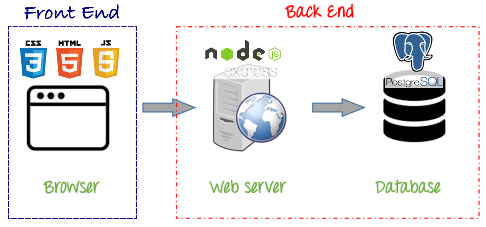

# Databases 2: Creating Databases and manipulating data in Postgres

# Goals

- Know what Postgres is.
- Learn to create a Postgres Database.
- Learn to create tables in a Postgres Database.
- Define columns in a Postgres table.
- Understand basic Postgres data types.
- Build a small Postgres database.
- Learn about table constraints.
- Understand Primary Key and Foreign Key constraints and how to create them.

# Lesson

## Postgres

Okay, so we've been learning how to make SQL queries and get information from databases using SQLZoo. That's nice, but it's not the full picture. If we're developing production apps, we don't just want to be able to ask for and get data. We want to create, update, and delete information from our own databases.

In order to do this, we need something called a **Database Server**, which is handled by an **RDBMS** or a Relational Database Management System. In this case, we're going to use a service called **PostgreSQL** (AKA Postgres).

You should be familiar with the **Client-Server model** from our work with HTTP. It turns out that when we are interacting with our database we are still operating in this model. When you are writing a SQL query you will be using a client, in our case the client will be `psql`, `pgAdmin` or `Postico`. The client will send the SQL query we want to execute to the **Database Server**, the database server receives our query, executes it and returns back a result. We can send queries to the the database server to get, update, or delete information. 

### Fullstack request flow 

* With an 3rd Party API:

  **User** -> _HTTP Request_ -> **Outside API Server** -> _Database SQL Query_ -> **Outside API Database**

* With our Server/API & Database:

  **User** -> _HTTP Request_ -> **Our Node Server** -> _Database SQL Query_ -> **Our Database**

### Where Postgres fits in our stack


### The problem Databases solve

Previously, if we wanted to store data to be displayed we needed to keep it in 'state' in the form of variables (sometimes global) that will be put in our computer's memory RAM. If you refreshed the page or restarted the Express.js server the 'state' was reset and the data was lost. Also, the saved information in 'state' could only be viewed on one computer. With a database, we can save our information forever, somewhere else and it can be viewed by anyone. What's different now is that our information will be saved not in our App's 'state' as variables but on a persisting storage, a **Database**. Our Front-end apps will _request_ the data from the database by sending a request to our back-end/server and display such information. Similar to how we would get data from a 3rd Party API except the data is coming from a database _we_ create and manage.

## Hands-On 

### Setup

You probably already have Postgres installed and running on your computer. Do you remember our first day of class [when we installed a bunch of stuff?](https://github.com/joinpursuit/Pursuit-Core-Web/blob/master/fundamentals/local_environment/README.md). One of the things you installed is [Postgres](https://github.com/joinpursuit/Pursuit-Core-Web/blob/master/fundamentals/local_environment/README.md#postgresql).

Verify that Postgres is running. 

Open a terminal window and type:

```
psql
```

The result should be something like this:

```
psql (11.5)
Type "help" for help.

fellow_name=# 
```

If you see anything else make sure your Postgres is running. Search for it on your applications and start it. If you don't find it you might not have Postgres installed. [Instructions for installing Postgres are here](https://github.com/joinpursuit/Pursuit-Core-Web/blob/master/fundamentals/local_environment/README.md#postgresql). If you need help reach out to one of your instructors.

### `psql` and SQL code
Just like we wrote some SQL code to retrieve information from a Database in the past, we will be writing some SQL code to create a Postgres Database.
All this code we will be writing in `psql`, the [PostgreSQL interactive terminal](https://www.postgresql.org/docs/9.3/app-psql.html). Later we will learn to put our SQL code on a `.sql` file and execute it with `psql`.

Execute the Postgres interactive terminal with:

```
psql
```

### Creating a Database
While being in `psql`, to create a database called `pursuit_fellows_db` type and execute:

```sql
CREATE DATABASE pursuit_fellows_db;
```

`psql` should have replied with:

```
CREATE DATABASE
```

Let's double check that the database was created by listing all the databases that exist on our Postgres Database Server:
```
\l
```
The database we just created should be in the list of databases that appeared. To exit the list of databases just type the `q` key.

**Questions**:
* What happens if you try to create another database with the same name? Try it!
* What if we want to delete the database we just created? Google "how to delete database postgres".
* What happens if you forget the semicolon on the `CREATE DATABASE` statement?

### Creating Tables
We said that a Database is a collection of Tables where the information is actually kept. Lets create our first table. 

* Connect to our recently created database with:
  ```sql
  \c pursuit_fellows_db
  ```
* List the tables on the `pursuit_fellows_db` (none at first)
  ```sql
  \dt
  ```

  `psql` should have said:
  ```
  Did not find any relations.
  ```
  That is because our database doesn't have any tables, yet. **Relations** here is another name for **Tables**.

* Create a `fellows` table by typing the following lines one by one. Hit the `Enter`/`Return` key at the end of each line. You could also copy and past it from here:
  ```sql
  CREATE TABLE fellows(
  id SERIAL,
  firstname VARCHAR,
  lastname VARCHAR
  );
  ```
  This created a table `fellows` with three columns `id`, `firstname` and `lastname`. List your tables with `\dt` again and see your table.

* To remove a.k.a "drop" a table:
  ```sql
  DROP TABLE fellows
  ```

**Exercises:**
* Delete the `fellows` tables, list all the tables and create the `fellows` table again.
* Crate any table of your liking with as many columns as you want, then drop it.
* Create a table `classes` with three columns `id`, `class_num`, `class_stack`, `instructor_name`
  * This table will have store information like
    | class_num | class_stack | instructor_name  |
    | --------- | ----------- | ---------------- |
    | 6.2       | Web         | Alejandro Franco |
    | 6.1       | iOS         | David Rifkin     |

#### Column Data Types
* `SERIAL`
* `VARCHAR`
* `INT`
* `DECIMAL`
* `timestamptz`

#### Table Constraints
* `PRIMARY KEY`
* `UNIQUE`
* `NOT NULL`

##### Exercises
* Complete the creating tables tutorial on [SQLBolt](https://sqlbolt.com/lesson/creating_tables)

### Adding data to the Database
* `INSERT`
* `UPDATE`
* `DELETE`

##### Exercises
* Complete the [inserting, updating and deleting data tutorial on SQLBolt](https://sqlbolt.com/lesson/inserting_rows)


#### Resources

- [Postgres Data Types](https://www.postgresql.org/docs/11/datatype.html)
- [Installing Postgres on Linux](https://www.digitalocean.com/community/tutorials/how-to-install-and-use-postgresql-on-ubuntu-16-04)
- [Postgres Mac App](https://postgresapp.com/)
