# Postman: Tips & Tricks for Backend/API development and testing


Postman is an API client you can use to debug, document and test REST APIs or Backends you build yourself as well as
3rd-Party APIs. It works by easily letting you edit and control the whole HTTP request, that includes the HTTP method to
use, headers, request body and parameters etc.

You can [download Postman from here](https://www.postman.com/product/rest-client/)

Once downloaded I recommend you sign-up or log-in because this will let you sync your collections with your requests to the cloud which will back them up and let you share collections with teammates or collaborators.

## Goal
Take advantage of 4 Postman features by doing exercises

### Index
* [Things you can do with Postman](#things-you-can-do-with-postman)
* [Tips & Tricks](#tips--tricks)
  * [Inspecting the HTTP request raw](#inspecting-the-raw-http-request)
  * [Collections](#collections)
    * Creating a collection and adding requests 
    * Variables
  * [Testing](#testing)
  * [Dynamic Variables for sample or random data](#dynamic-variables-for-sample-or-random-data)
* Resources

## Things you can do with Postman
* Modify any part of and inspect the HTTP request to send
* Write tests for your request so that of a given request you can expect a predetermined response
* You can group and save requests to a collection which then can be shared with teammates
* You explore 3rd-Party APIs by trying out requests before committing to using them in your code.
* You can generate API documentation from a collection of requests


## Tips & Tricks

For this demonstrations and exercises we will be interacting with the [httpbin API](http://httpbin.org) hosted @
`http://httpbin.org`. This API is used for learning HTTP requests, responses and methods, it does not actually store or
do anything with the information we give it

We will be using the endpoint `/anything` which simply returns anything we send back to us.

### Inspecting the raw HTTP request

If you ever wondered what an HTTP looked like raw Postman can let you inspect it.
This is helpful when you are sending a request and the response you get back is not what you expect
most likely you are not formatting your request in a way the server likes it. By inspecting we can check for anything
weird, like duplicate headers etc.

Let's [create a request](https://learning.postman.com/docs/sending-requests/requests/) to inspect,
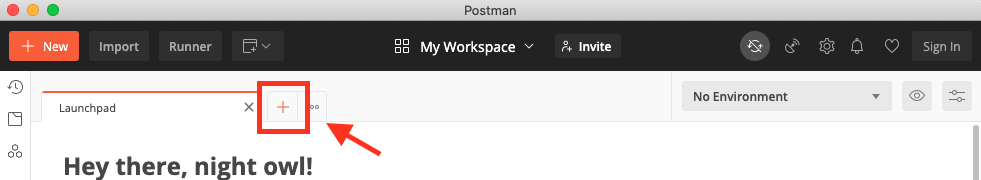

I'll make my request with the following criteria:

* METHOD: `POST`
* URL: `http://httpbin.org/anything/auth/login`
* PARAMS: `role=admin`
* BODY TYPE: `raw` and then select `JSON` from dropdown. Lastly paste the json bellow
* BODY DATA:
```json
{
  "password": "hello123",
  "username": "someUser123"
}
```

<details>
  <summary> Here's a screenshot of my request 📸 </summary>

  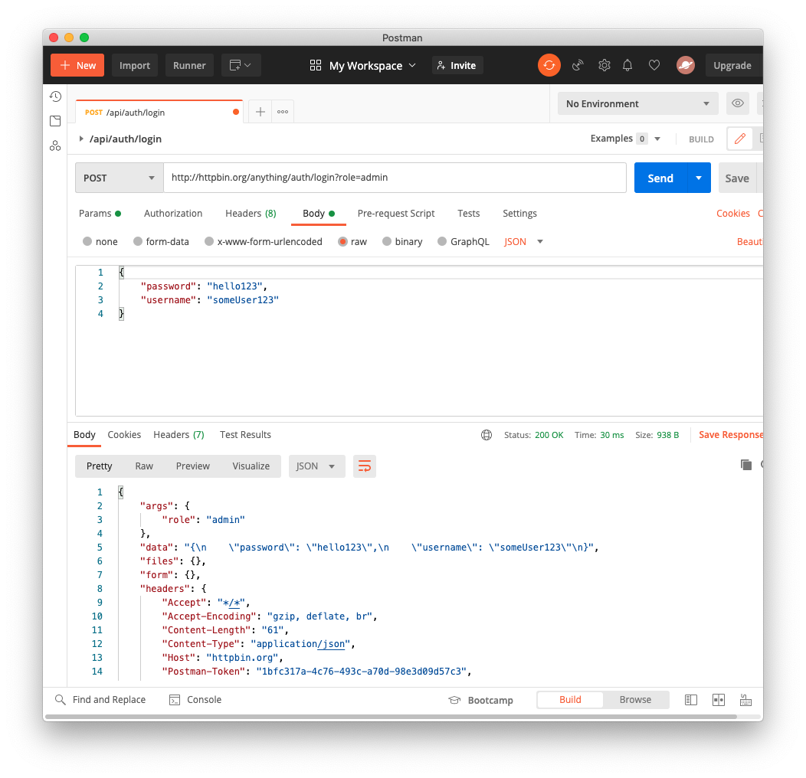
</details>


To inspect this request raw click the button `code` on the right side of the request:
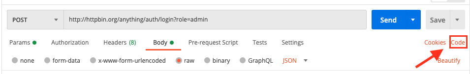

Then make sure you have selected `HTTP` from the list on the left of the pop up window.
My raw request looks like this:
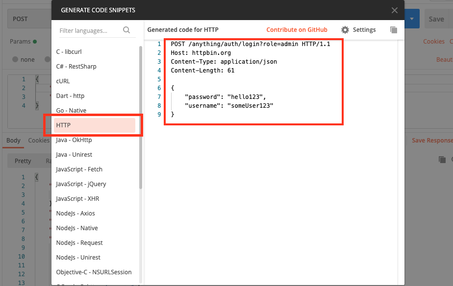

So the raw HTTP request is just this raw text:
```
POST /anything/auth/login?role=admin HTTP/1.1
Host: httpbin.org
Content-Type: application/json
Content-Length: 61

{
  "password": "hello123",
  "username": "someUser123"
}
```
We can see where the request is going in the first line with the method, the endpoint and the params we specified. We see
the `Host` where the endpoint is found, other headers and the data we are sending in JSON format.

When we hit the `Send` button this text is what is being sent and what the server will receive and parse to process our
request.

#### Your turn.

Create a request with the following criteria and inspect it

* METHOD: `PATCH`
* URL: `http://httpbin.org/anything/user/someUser123/update`
* PARAMS: [Any params you want]
* BODY TYPE: `x-www-form-urlencoded`
* BODY DATA: Fill out the body with

  | key             | value                           |
  | --------------- | ------------------------------- |
  | email           | user@email.com                  |
  | profile_picture | https://images.com/someUser.png |


<details>
  <summary> You should have gotten something like this: </summary>

```
PATCH /anything/user/someUser123/update HTTP/1.1
Host: httpbin.org
Content-Type: application/x-www-form-urlencoded
Content-Length: 65

email=user@email.com&profile_picture=https://images.com/user1.png
```

💡 `email=user@email.com&profile_picture=https://images.com/user1.png` is information in the `x-www-form-urlencoded` format

</details>

##### Takeaway
✅  Inspect your requests to learn and to make sure you are sending the correct information, in the right format or with the correct additional headers

### Collections

When you have multiple requests that are related, it is helpful to group them into a collection. Having your requests in a collection will not only help you with organization but it will also let you run all requests in it sequentially which can be helpful for testing. Collections also enable you to share requests with teammates so that they can try the same request you are trying, specially useful if you are collaborating on an API.

#### Make a Collection
To make a collection hit the `New` orange button on the top left corner
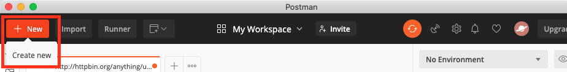

Then `Collection` button
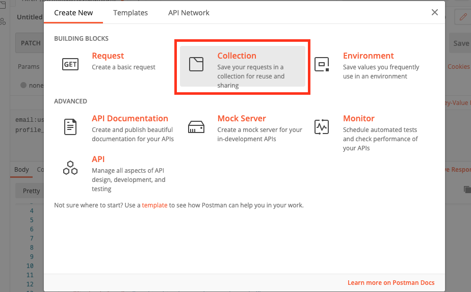

In the pop up window that appeared, give the collection the name of the API we are dealing with: `httpbin`. Then in the bottom right of the same pop up hit the `Create` button.

Our Collection was created, open the Sidebar by clicking the Collections Icon 🗂
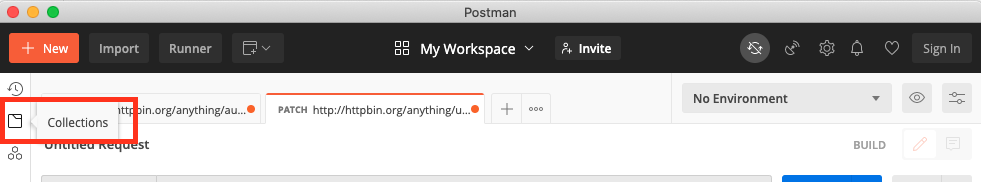

Once open the sidebar shows our empty collection
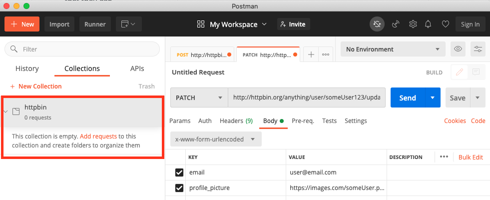

#### Save request to collection
To add a request to the collection hit the `Save` button on the right side of the request
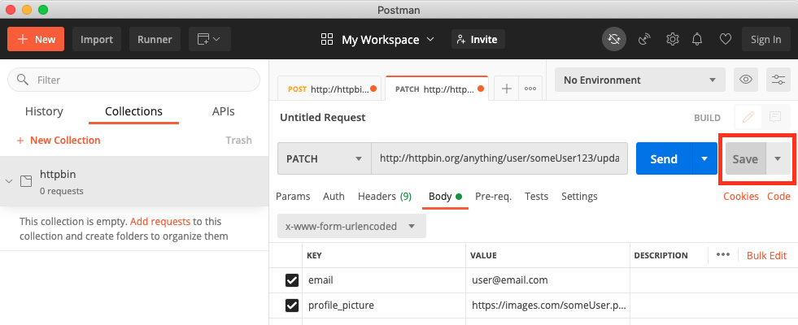

Then in the popup select the collection we just created `httpbin` and hit `Save`
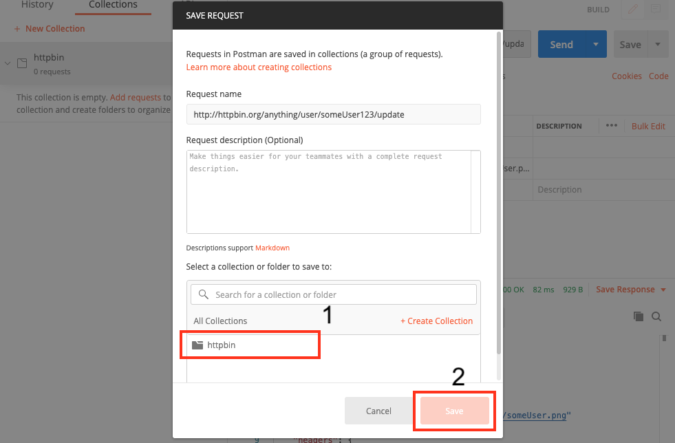

Make sure you save the two request we have so far so they are under the collection:
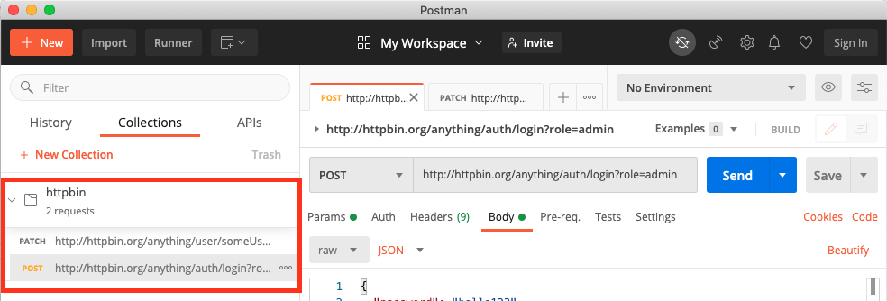

#### Collection Variables
Having a Collection let you create variables, this is useful to share information, chunks of the url, parameters or body data across your requests. For example both of our requests are going to the server's base url `https://httpbin.org` so so lets save that into a variable `base_url` so that instead of having to type the `https://httpbin.org` every time we just refer to `base_url`. If the url ever changes we would only need to update it in one place and not in every single requests we have.

##### Setting a Variable
To set Collection Variable:
1. Highlight any text/data of our request 
2. A little tooltip should appear with the text `Set as Variable`. You might need to try a few times highlighting the text
3. Once you hit the `Set As Variable` tooltip, select the option `⨁ Set as a new variable`
4. Give your variable a name. `base_url` in this case
5. Select `Collection` as the scope of the variable
6. Hit `Save Variable`
7. You will see your request change to have `{{base_url}}`. This variable will refer to `https://httpbin.org` anywhere we use it


##### Reading a Variable
To read a variable you can just use the bracketed expression with the name of the variable anywhere, it can be in the params, the body, headers or the in the url field like so.
```
{{base_url}}/anything/auth/login?role=admin
```

✏️ Task: Update the `POST` request to use `{{base_url}}` instead of `https://httpbin.org`

##### Your turn

1. Locate where username `someUser123` is used
2. Turn it into a variable called `username` as highlighted above
3. Replace the instances of `someUser123` with `{{username}}`
   * In the PATCH url 
   * In the POST JSON Body data 

### Takeaway
✅  Variables let you share information/data across requests to avoid repetition and hardcoding of shared values. If the shared information ever changes you only need to update your variable and all requests that use it will read the new value.

[Learn more about variables here](https://learning.postman.com/docs/sending-requests/variables/)

### Testing 

Postman is a tool you can use to test you API by using scripts written in JavaScript. 

Testing your API can give you the confidence that your API is working as expected and help you verify that new developments have not broken any existing functionality.

The framework of thinking is simple, you send some data to the server in a request, wait for the server to do some work with the data you sent and assert that the server responded with what you expected. Test execute after a response has been obtained.

#### Writing tests
To write a test for any of our requests we can go to the Test tab of the request.

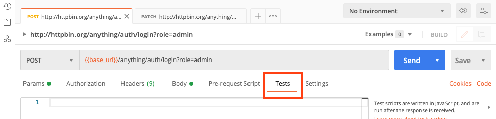

This will display a code text editor where you can write JavaScript. The text editor has a handy autocomplete feature that will be super helpful

##### Test that the request went well

Let's write our first test. Let's check that the response was a `200 OK` for our `POST` request to login.
```js
pm.test('Log-in returns 200 Ok', () => {
    pm.expect(pm.response.code).to.equal(200)
    pm.expect(pm.response.status).to.equal('OK')
})
```

##### Test that the response was a json response
```js
pm.test('Login request returns json data type', () => {
    // Get Content-Type header from response
    let contentType = pm.response.headers.get('Content-Type')
    
    pm.expect(contentType).to.equal('application/json')
})
```

##### Test that response contains the same username that was sent
```js
pm.test('Logging a user in returns the username', () => {
    let data = pm.response.json() // Parse the response data

    // Get username variable from collection which was sent in the request
    let username = pm.collectionVariables.get('username') 
    
    // Assert that they match
    pm.expect(data.json.username).equal(username)
})
```

Send the request and check if the test passed in the Test Results tab at the bottom
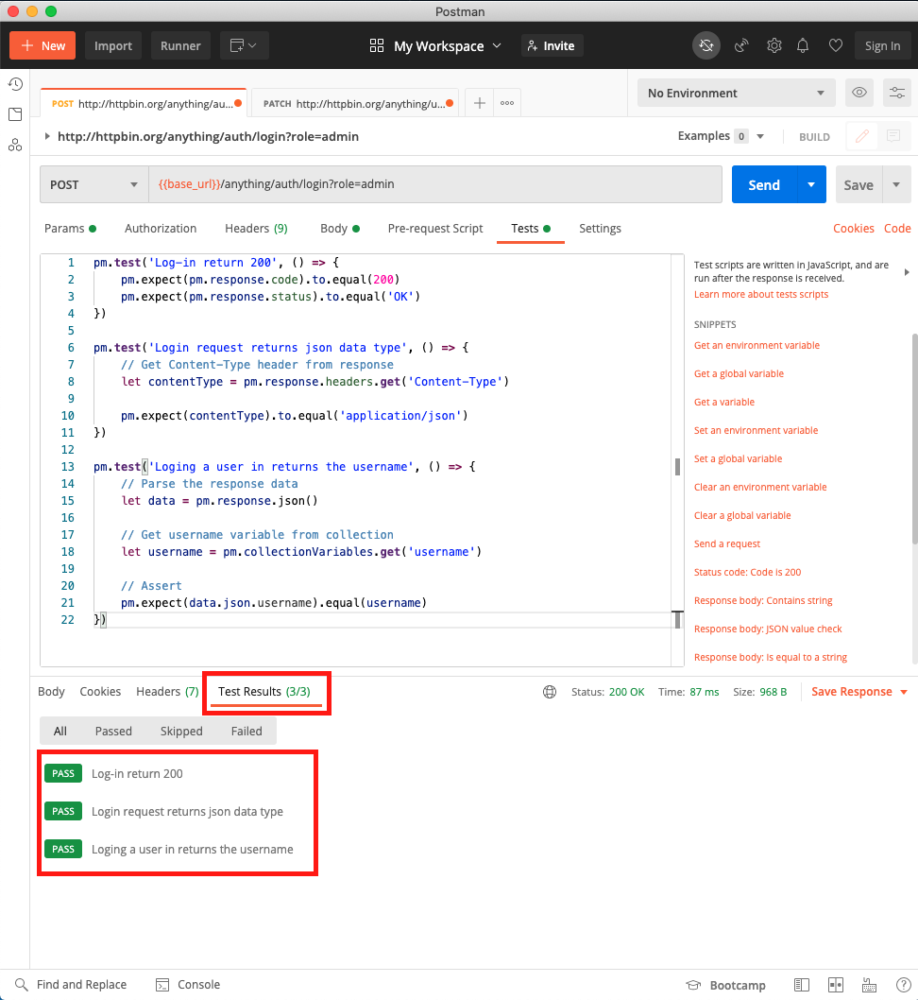

#### Quick Reference
| Postman JS                 | Description                      |
| -------------------------- | -------------------------------- |
| `pm.test(description, fn)` | Defines a test                   |
| `pm.expect(receivedValue)` | Makes an assertion               |
| `pm.response`              | Access the response object       |
| `pm.response.json()`       | Parse the response object        |
| `pm.request`               | Access the request object        |
| `pm.collectionVariables`   | Set and get collection variables |

📃 [Full Reference](https://learning.postman.com/docs/writing-scripts/script-references/postman-sandbox-api-reference/)

#### Your Turn
Write 3 test for the the PATCH request:
* Test that the response was a success `200 OK` 
* Test that the `method` property of response object is equal to `PATCH`
* Test that the `data` property of the response object is empty

<details>
  <summary>Solution</summary>

```js
pm.test('Log-in return 200', () => {
    pm.expect(pm.response.code).to.equal(200)
    pm.expect(pm.response.status).to.equal('OK')
})

pm.test('method property of response is PATCH', () => {
    let parseData = pm.response.json()
    pm.expect(parseData.method).to.equal("PATCH")
})

pm.test('data property of response is empty', () => {
    let parseData = pm.response.json()
    pm.expect(parseData.data).to.equal("")
}) 

```
</details>

##### Takeaway
✅ You can write tests in JavaScript using Postman to ensure your API is working as you expect it. Postman provides utilities functions through `pm.*` to read the request, response and to perform assertions on them.

* [Learn more about testing with Postman](https://learning.postman.com/docs/writing-scripts/test-scripts/)
* [Test Script Examples](https://learning.postman.com/docs/writing-scripts/script-references/test-examples/)

### Dynamic Variables for sample or random data:

Postman provides dynamic variables that you can use in your requests as you would if they were any other variables. One important difference is that Dynamic variables names start with the `$` symbol.

Examples of dynamic variables are as follows:

* `{{$guid}}`: A v4 style guid
* `{{$timestamp}}`: The current timestamp (Unix timestamp in seconds)
* `{{$randomInt}}`: A random integer between 0 and 1000

See the [Dynamic Variables](https://learning.postman.com/docs/writing-scripts/script-references/variables-list/) section for a full list.


## Learn More
* [Running an entire collection](https://learning.postman.com/docs/running-collections/intro-to-collection-runs/)
* [Sharing Collections](https://learning.postman.com/docs/collaborating-in-postman/sharing/)
* [Generate API documentation from a Postman
Collection](https://learning.postman.com/docs/publishing-your-api/documenting-your-api/)
* [Postman Pre request scripts](https://learning.postman.com/docs/writing-scripts/pre-request-scripts/)

## Resources
* [Postman Tutorial - Guru99](https://www.guru99.com/postman-tutorial.html)
