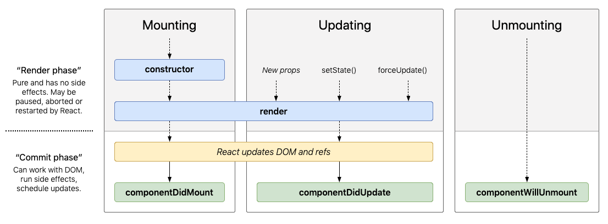
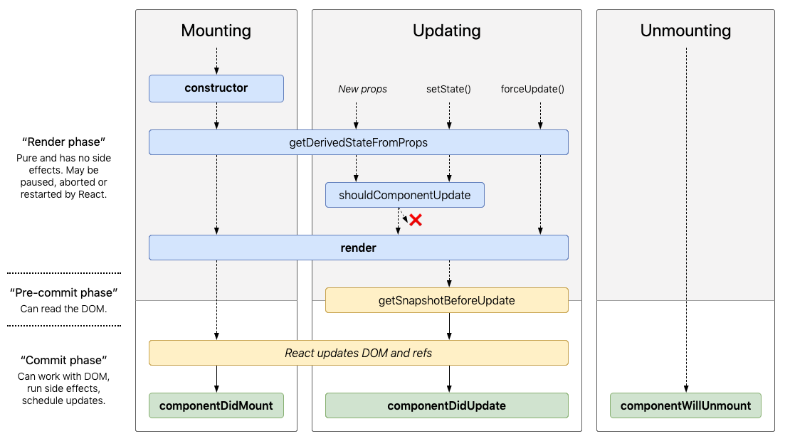

# The Component Lifecycle

## Resources
* [New Lifecycle Methods](https://blog.logrocket.com/the-new-react-lifecycle-methods-in-plain-approachable-language-61a2105859f3/)
* [React Documentation](https://reactjs.org/docs/react-component.html)
* [Interactive lifecycle diagram](http://projects.wojtekmaj.pl/react-lifecycle-methods-diagram/)

## Terms
* Component Lifecycle
* Lifecycle Methods

## Objectives
* Explain the lifecycle methods that a React component goes through
* Explain why you have access to those methods
* Build an app that showcases key React component lifecycle methods

## Sample App

- [https://codesandbox.io/s/clever-curie-8t9l1](https://codesandbox.io/s/clever-curie-8t9l1)

# 1. Introduction

The component lifecycle is a term that refers to a React component's life in your browser.  Components are created, render content to be visible, are updating and are destroyed.  At each of these stages, you may want to influence or change the behavior of you component.  By default, React has its own behavior for what it will do at each of these stages.  You can choose to implement your own methods that change how your component will behave.




There are two *phases* during a component's lifecycle: the `Render phase` and the `Commit phase`.

## Render Phase

The render phase has no side effects and is solely responsible for establishing the changes that you want to make to the DOM.  This is called `pure`.  It means that React may call the `constructor()` of `render()` methods multiple times, and it should be the same as it calling it once.  This means that you should make sure that these methods won't have unexpected behavior if called multiple times.  After the render phase is completed, React has established the changes that it wants to make.

## Commit Phase

During the commit phase, React takes the the changes identified during the render phase, and actually manipulates the DOM to make the UI reflect the created, removed or updated component.  Very rarely, it is useful to step in at this point with the `getSnapshotBeforeUpdate()` method, but for the most part, React will handle the updating completely.

## Lifecycle

Lifecycle methods cut across both phases.  They are divided into 3 main categories:

1. Mounting
1. Updating
1. Unmounting

We will look at the lifecycle methods in each category.

# 2. Mounting

Mounting refers to a component being created and inserted into the DOM.  There are 3 main lifecycle methods that get called during the mounting stage:

1. constructor()
1. render()
1. componentDidMount()

## [constructor()](https://reactjs.org/docs/react-component.html#constructor)

The constructor is called for a component before it is mounted.  Most commonly, you set the initial state inside the constructor as in the example below:

```js
constructor(props) {
  super(props);
  this.state = { displayValue: 0 }  
}
```

The constructor can also be used to bind methods:

```js
constructor(props) {
  super(props);
  this.state = { display: "" }
  this.handleClick = this.handleClick.bind(this)
}
handleClick() {
  console.log('click!')
}
```

Without the line:

```js
this.handleClick = this.handleClick.bind(this)
```

`handleClick` will be undefined when you try to use it later.

The constructor thus has two purposes (1) setting initial state and (2) binding methods.  From the React documentation:

> If you don’t initialize state and you don’t bind methods, you don’t need to implement a constructor for your React component.

## [render()](https://reactjs.org/docs/react-component.html#render)

`render()` is the The only *required* lifecycle method.  As we've seen in previous lessons, `render()` typically will return a React element created with JSX (such as `<div />`).  The following are also valid to return in the `render()` method:

- Arrays and [fragments](https://reactjs.org/docs/fragments.html)
- [portals](https://reactjs.org/docs/portals.html)
- String and numbers (render as text nodes)
- Booleans and null (render nothing)

Render is called automatically during the mounting phase after `constructor()`

## [componentDidMount()](https://reactjs.org/docs/react-component.html#componentdidmount)

After render has been called, the DOM is updated and `componentDidMount` is called.  This is the best time to do things like set up subscriptions, and kick off network requests.  One reason to not start network requests in the `constructor()` is that it is would make your `constructor()` have a side effect.  It is best practice to ensure that lifecycle methods in the "Render phase" don't generate side effects, because they may be restarted by React.

# 3. Updating

Once your component has already been mounted, you may want to change how it looks to user.  For example: clicking a button to increment a counter, guessing a letter in Hangman, or clicking a button on a calculator app.  For each of these, you would want to display to update after the component has been mounted.

## [render()](https://reactjs.org/docs/react-component.html#render)

After the component has been mounted, there are three ways that render can be called:

1. The props change
2. `setState()` is called
3. `forceUpdate()` is called (try to avoid using this)

Any of these will automatically call the `render()` method.

## [componentDidUpdate()](https://reactjs.org/docs/react-component.html#componentdidupdate)

After rendering, `componentDidUpdate` will be called.  This is not called after the first render, when `componentDidMount` is called instead.  This is an opportunity to do things like make additional network calls.  From the React documentation:

```js
componentDidUpdate(prevProps) {
  // Typical usage (don't forget to compare props):
  if (this.props.userID !== prevProps.userID) {
    this.fetchData(this.props.userID);
  }
}
```

>You may call setState() immediately in componentDidUpdate() but note that it must be wrapped in a condition like in the example above, or you’ll cause an infinite loop. It would also cause an extra re-rendering which, while not visible to the user, can affect the component performance.

# 4. Unmounting

Components are unmounted when they removed from the DOM during [reconciliation](https://reactjs.org/docs/reconciliation.html).  Right before a component is removed, you can implement a lifecycle method to do any required cleanup.

## [componentWillUnmount()](https://reactjs.org/docs/react-component.html#componentwillunmount)

Inside this method, you should remove subscriptions, cancel network requests, and invalidate timers.  If those don't apply to your component, then you don't need to implement this method.

Note that you shouldn't call `setState()` here.  The component is about to unmount, so it will never be re-rendered.

# 5. Less Common Lifecycle Methods

The lifecycle methods covered above should cover the vast majority of use cases.  React does make several more available to you if your application is a bit more complicated.  The full picture of lifecycle methods is show here:



### [getDerivedStateFromProps()](https://reactjs.org/docs/react-component.html#static-getderivedstatefromprops)

Implement this method if you want to change how the state is generated, and make it dependent on changes in props.  It is rare that you would want to do this, because props and state should be unrelated.

### [shouldComponentUpdate()](https://reactjs.org/docs/react-component.html#shouldcomponentupdate)

This method is to be used only for performance optimization, and let's you skip updates if you know there is nothing to re-render.  Using the built-in [PureComponent](https://reactjs.org/docs/react-api.html#reactpurecomponent) solves most of the problems that this lifestyle method attempts to address.

### [getSnapshotBeforeUpdate()](https://reactjs.org/docs/react-component.html#getsnapshotbeforeupdate)

This method is invoked right before the changes to the DOM are made.  The most common reason to want to use this would be to handle scrolling down in a chat app if the new chat bubble will be off the screen.

# 6. Legacy lifecycle Methods

You may see references to the following lifecycle methods in older code:

- componentWillMount()
- componentWillUpdate()
- componentWillReceiveProps()

These have all been renamed:

- UNSAFE_componentWillMount()
- UNSAFE_componentWillUpdate()
- UNSAFE_componentWillReceiveProps()

Do not use these.  They have been renamed with the `UNSAFE` prefix because using them leads to bugs and bad code.  Consult the documentation if you need to maintain an application that uses them, and try to avoid following tutorials, blogs or resources that implement these methods.
