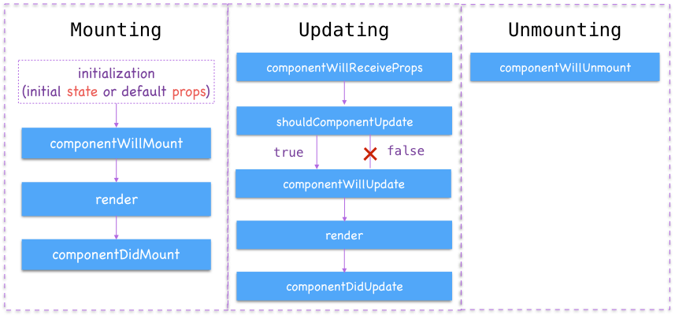

# The Component Lifecycle

## Resources

* [React Lifecycle Methods](https://engineering.musefind.com/react-lifecycle-methods-how-and-when-to-use-them-2111a1b692b1)
* [Component Lifecycle](https://www.tutorialspoint.com/reactjs/reactjs_component_life_cycle.htm)
* Advanced reading: [You Probably Don't Need Derived State](https://reactjs.org/blog/2018/06/07/you-probably-dont-need-derived-state.html)

## Terms

* Component Lifecycle
* Lifecycle Methods
  - `componentWillMount`
  - `componentDidMount`
  - `componentWillReceiveProps`
  - `shouldComponentUpdate`
  - `componentWillUpdate`
  - `componentDidUpdate`
  - `componentWillUnmount`

## Introduction

The component lifecycle is a term that refers to a React component's life in your browser. As your needs as a web developer get more complex, you may find yourself unable to rely on the methods you've learned so far to make stuff happen.

For example, you'll notice we haven't yet fired off an AJAX request in React. Where would we do it, and how would we stop a page that relies on data from an AJAX request from rendering before it receives the data? In the DOM, you had `DOMContentLoaded`. In React, you have lifecycle methods.

React makes lifecycle methods available to you in any component. Each method fires at a different time in the component's lifecycle. We're going to review each of them, but please note: **if you have too many lifecycle methods in a component, it's a good sign that you aren't using React properly.** Most of these methods are still supported, but many are only really used in legacy code, and many of them are actively discouraged.

That being said, it's still important to understand what these are, when they fire, and what they do. Let's get started.

## `componentWillMount`

This method runs **before the component first renders**.

`componentWillMount` is a perfect example of a method that you shouldn't really ever need. The problem with `componentWillMount` is that the component hasn't yet mounted, so you can't really change anything that it's doing - it hasn't done anything yet!

The `constructor` function is where you should be setting up/configuring your component before it mounts, anyways.

NEXT!

## `componentDidMount`

Perfect. Our component has rendered for the first time, and is available for us to do stuff with. `componentDidMount` is, hands-down, the most useful lifecycle method. Most of your AJAX requests are going to go here.

You might ask: Why put AJAX requests here and not in `componentWillMount`? Wouldn't `componentWillMount` finish the request sooner?

Well, yes, it will - and that's the problem. If the AJAX request in `componentWillMount` finishes before the component mounts for the first time, and you try to, say, `setState` with information from your completed request (a very common pattern), then the component will break - there'll be no state to set!

`componentDidMount` makes sure everything is ready for action before it fires, which makes it just the right place to put synchronous setup functionalities.

Awesome. NEXT!

## `componentWillReceiveProps`

This method is, potentially, useful. If a parent component does an AJAX request and passes the result down as props, you might want your child component to do something with those props. You can use `componentWillReceiveProps`, compare `this.props` (your old props) with `nextProps` (which this method makes available to you), and do something based on that comparison.

**Warning**: A common mistake that new React developers make is copying props to the state in every component. Instead of using props directly, they want the added comfort of state. This is a bad idea: It leads to several sources of truth instead of a [single source](https://en.wikipedia.org/wiki/Single_source_of_truth), so if your component ever fails to update its state with new props, you could be displaying inaccurate information to the user.

In other words, if you're going to use this to change your component's state, make sure you have a good reason to.

**Other warning**: `componentWillReceiveProps` has no way of determining whether `this.props` and `nextProps` are different. Therefore, by default, it'll run **every time** the component updates, *even if the old props and the new props are the same*. This is not performant and can lead to issues down the road.

Main takeaway: Make sure you *really* need this one if you're going to use it.

Alright. NEXT!

## `shouldComponentUpdate`

This is an interesting one. As we hinted at in the last section, React doesn't deeply compare the previous state/props with the new state or props - it re-renders no matter what, even if the previous state/props are the same.

`shouldComponentUpdate` allows you to make your component slightly more efficient by returning a boolean based on whether or not, by your reckoning, the component should actually update and re-render. By default, this is set to `true`, so most folks use this to return `false` under specific circumstances.

It's important to note that this kind of optimization is **pretty granular** - it's a nice-to-have rather than a must-have. You won't see it in a lot of codebases in the wild, and you shouldn't have to implement it unless you're really putting the finishing touches on your app.

Okay. NEXT!

##
